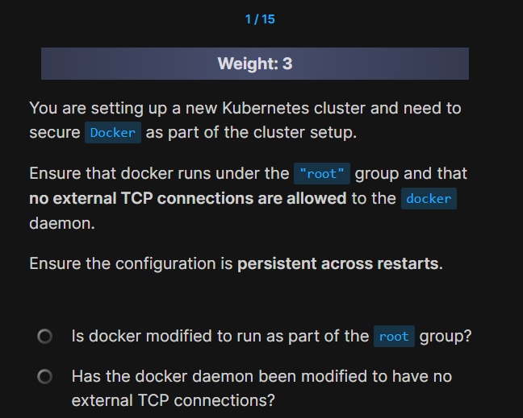
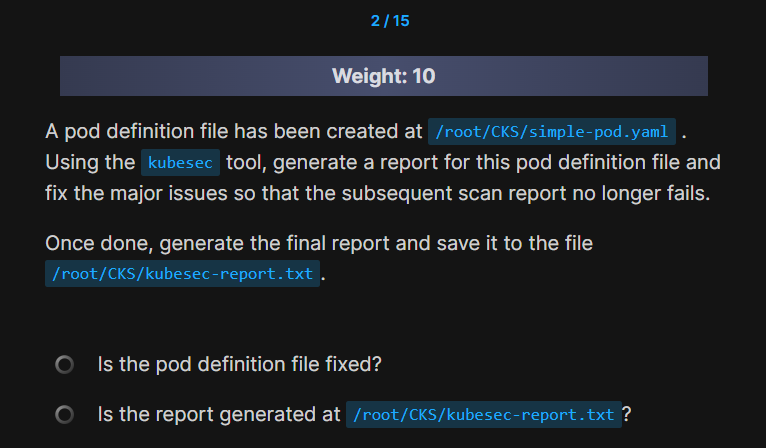
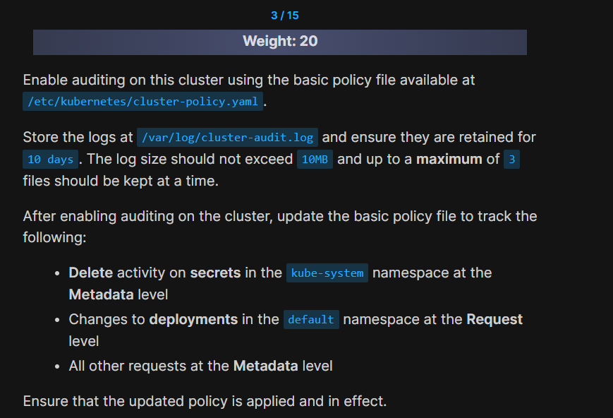
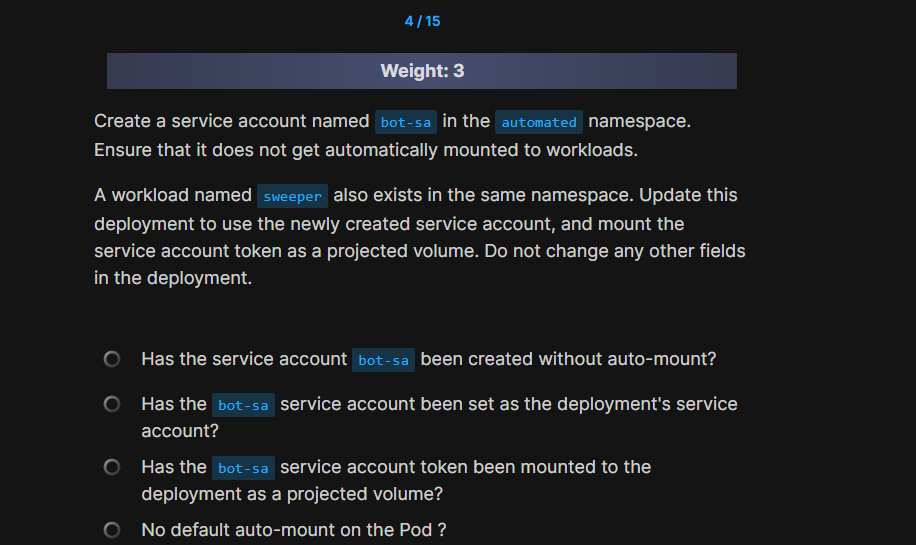
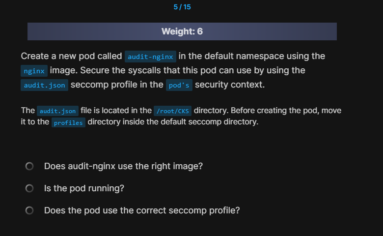
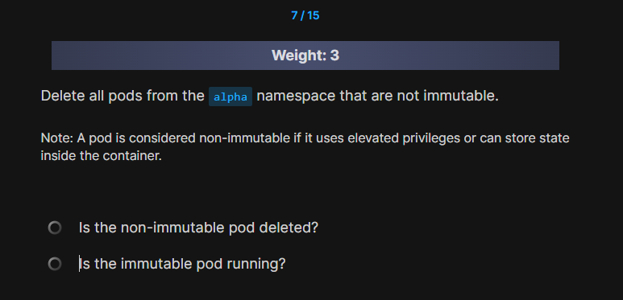
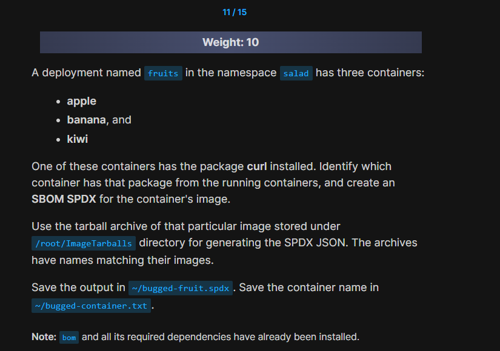
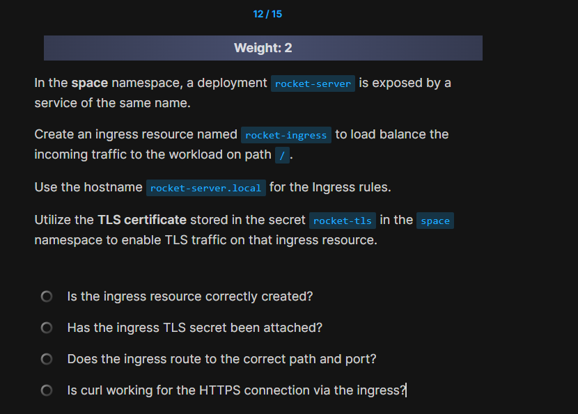

# 📰 **Mock Exam 3**

## 🟡 Q1

<div align="center" style="background-color:#141414; border-radius: 10px; border: 2px solid">
  
</div>

---

## 🟢 Q2



```bash
kubesec scan ~/CKS/simple-pod.yaml | jq ".[].scoring.critical"
```

---

## 🟢 Q3



```ini
DON'T MOUNT FILES, MOUNT DIRECTORIES ONLY
```

---

## 🟢 Q4



```yaml
apiVersion: v1
kind: ServiceAccount
metadata:
  name: bot-sa
  namespace: automated
automountServiceAccountToken: false
```

```yaml
apiVersion: apps/v1
kind: Deployment
metadata:
  name: sweeper
  namespace: automated
spec:
  replicas: 1
  selector:
    matchLabels:
      app: sweeper
  template:
    metadata:
      labels:
        app: sweeper
    spec:
      serviceAccountName: bot-sa # Added
      automountServiceAccountToken: false # Prevent auto-mount
      containers:
        - name: sweeper
          image: busybox:1.36
          command: ["sleep", "3600"]
          volumeMounts: # Section added
            - name: sa-token
              mountPath: /var/run/secrets/tokens
              readOnly: true
      volumes: # Section added
        - name: sa-token
          projected:
            sources:
              - serviceAccountToken:
                  path: bot-token
                  expirationSeconds: 3600
                  audience: default
```

1. search for `auto mount`
2. search for `projected volume`

---

## 🟢 Q5



```bash
controlplane$ mv /root/CKS/audit.json /var/lib/kubelet/seccomp/profiles
```

## 🟢 Q6


```ini
apiVersion: apiserver.config.k8s.io/v1
kind: AdmissionConfiguration
plugins:
- name: ImagePolicyWebhook
  configuration:
    imagePolicy:
      kubeConfigFile: /etc/kubernetes/pki/admission_kube_config.yaml
      allowTTL: 50e
      denyTTL: 50
      retryBackoff: 500
      defaultAllow: false # make this false
```

---

## 🟢 Q7



```ini
Pod solaris is immutable as it have readOnlyRootFilesystem: true so it should not be deleted.

Pod sonata is running with privileged: true and triton doesn't define readOnlyRootFilesystem: true so both break the concept of immutability and should be deleted.
```

---

## 🟢 Q10

```ini
/var/lib/kubelet/config.yaml
```

```ini
authentication:
  anonymous:
    enabled: false
authorization:
  mode: Webhook
```

```bash
sudo systemctl restart kubelet
```

## 🟢 Q11



```bash
bom generate --image-archive /root/ImageTarballs/<image_name>.tar --format json --output ~/bugged-fruit.spdx
```

what diff

```bash
bom generate --image-archive /root/ImageTarballs/<image_name>.tar --format json > ~/bugged-fruit.spdx
```

## 🟢 Q12



```ini
  annotations:
    nginx.ingress.kubernetes.io/ssl-redirect: "true"
```
