# Mock Exam 1

## 🟢 Q1

<div align="center" style="background-color:#141414; border-radius: 10px; border: 2px solid">
  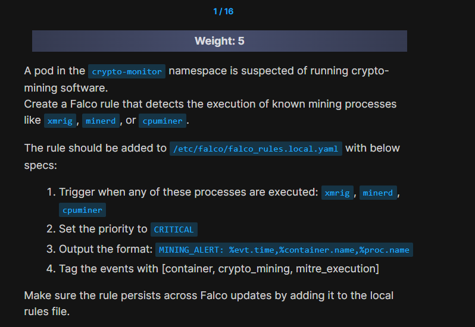
</div>

---

### Answer:

```yaml
- rules: detects_mining_processes
  desc: detect mining processes
  condition: (evt.type = execve) and (proc.name in (xmrig,minerd,cpuminer))
  output: "MINING_ALERT: %evt.time,%container.name,%proc.name"
  priority: CRITICAL
  tags: [container, crypto_mining, mitre_execution]
```

---

## 🟢 Q2

<div align="center" style="background-color:#141414; border-radius: 10px; border: 2px solid">
  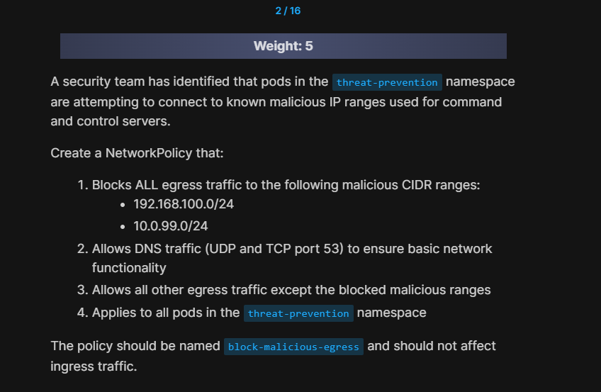
</div>

---

### Answer:

```yaml
apiVersion: networking.k8s.io/v1
kind: NetworkPolicy
metadata:
  name: block-malicious-egress
  namespace: threat-prevention
spec:
  podSelector: {}
  policyTypes:
    - Egress
  egress:
    - to:
        - ipBlock:
            cidr: 0.0.0.0/0
            except:
              - 10.0.99.0/24
              - 192.168.100.0/24
    - ports:
        - protocol: TCP
          port: 53
        - protocol: UDP
          port: 53
```

To test allowed traffic, use the command:

```bash
kubectl exec -n threat-prevention test-pod -- curl --connect-timeout 3 www.google.com
```

To test blocked traffic (this should timeout), execute:

```bash
kubectl exec -n threat-prevention test-pod -- curl --connect-timeo
```

---

## 🟢 Q3

<div align="center" style="background-color:#141414; border-radius: 10px; border: 2px solid">
  
</div>

---

### Answer:

```yaml
apiVersion: v1
kind: Pod
metadata:
  name: secure-app
  namespace: security-context
  labels:
    app: secure-app
spec:
  securityContext:
    runAsNonRoot: true
    runAsUser: 101 # nginx user UID in unprivileged image
    runAsGroup: 101 # nginx group GID in unprivileged image
  containers:
    - name: app-container
      image: nginxinc/nginx-unprivileged:alpine
      securityContext:
        allowPrivilegeEscalation: false
        runAsUser: 101
        runAsGroup: 101
      ports:
        - containerPort: 8080 # Non-privileged port
```

```ini
What different when put securityContext in pod level and security level, and how to know in the cks exam?
```

---

## 🟢 Q4

<div align="center" style="background-color:#141414; border-radius: 10px; border: 2px solid">
  
</div>

---

### Answer:

```yaml
- namespaceSelector:
    matchLabels:
      kubernetes.io/metadata.name: monitoring
```

```yaml
apiVersion: networking.k8s.io/v1
kind: NetworkPolicy
metadata:
  name: frontend-access
  namespace: web-apps
spec:
  podSelector:
    matchLabels:
      app: frontend
  policyTypes:
    - Ingress
  ingress:
    - from:
        - podSelector:
            matchLabels:
              app: backend
        - namespaceSelector:
            matchLabels:
              kubernetes.io/metadata.name: monitoring
```

## 🔴 Q5

<div align="center" style="background-color:#141414; border-radius: 10px; border: 2px solid">
  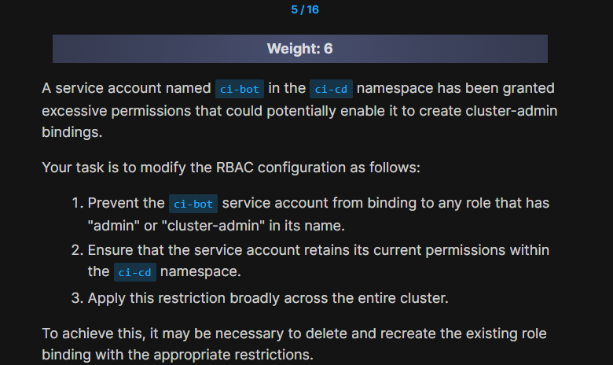
</div>

---

### Answer:

Service Account Restriction Solution
The current ClusterRole ci-bot-role permits the service account to create and modify role bindings, which poses a risk of privilege escalation.

Solution:

Remove the overly permissive ClusterRole:

```bash
kubectl delete clusterrole ci-bot-role
```

Create a restricted ClusterRole that omits binding creation permissions:

```yaml
apiVersion: rbac.authorization.k8s.io/v1
kind: ClusterRole
metadata:
name: ci-bot-role
rules:
  - apiGroups: [""]
    resources: ["pods", "services", "configmaps"]
    verbs: ["get", "list", "watch", "create", "update", "delete"]
  - apiGroups: ["apps"]
    resources: ["deployments", "replicasets"]
    verbs: ["get", "list", "watch", "create", "update", "delete"]
  - apiGroups: ["rbac.authorization.k8s.io"]
    resources: ["clusterrolebindings", "rolebindings"]
    verbs: ["get", "list", "watch"]
    # Note: This role does not include create, update, or patch permissions for bindings
```

Apply the restricted role:

```bash
kubectl apply -f - <<EOF
[above yaml content]
EOF
```

Verify standard operations (expected result: "yes"):

```bash
kubectl auth can-i get pods --as=system:serviceaccount:ci-cd:ci-bot
kubectl auth can-i create deployments --as=system:serviceaccount:ci-cd:ci-bot
```

Verify binding restrictions (expected result: "no"):

```bash
kubectl auth can-i create clusterrolebindings --as=system:serviceaccount:ci-cd:ci-bot
kubectl auth can-i create rolebindings --as=system:serviceaccount:ci-cd:ci-bot
```

---

## 🟢 Q6

<div align="center" style="background-color:#141414; border-radius: 10px; border: 2px solid">
  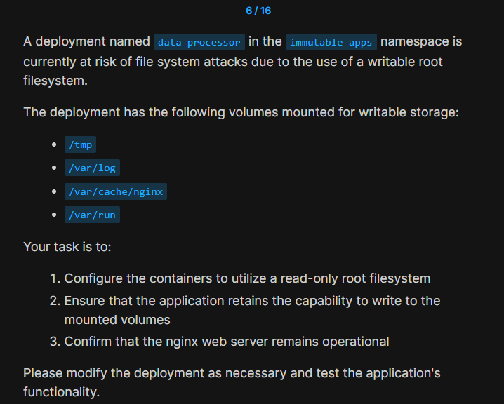
</div>

---

## 🟢 Q7

<div align="center" style="background-color:#141414; border-radius: 10px; border: 2px solid">
  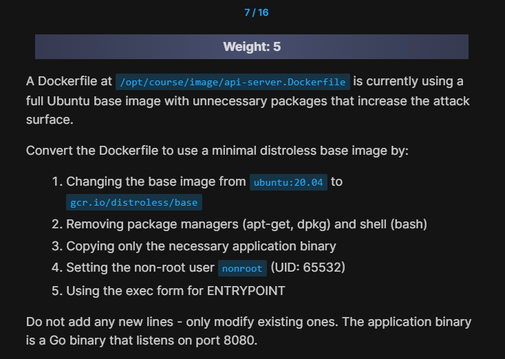
</div>

### Answer:

```ini
# old
FROM ubuntu:20.04
RUN apt-get update && apt-get install -y curl wget python3 python3-pip
RUN useradd -m appuser
COPY ./app-server /app/server
RUN chmod +x /app/server
USER root
ENTRYPOINT /app/server
```

Here’s how the Dockerfile should look after modification:

```dockerfile
FROM gcr.io/distroless/base
# RUN apt-get update && apt-get install -y curl wget python3 python3-pip
# RUN useradd -m appuser
COPY ./app-server /app/server
# RUN chmod +x /app/server
USER nonroot
ENTRYPOINT ["/app/server"]
```

What changed:

1. **Base image** → `FROM gcr.io/distroless/base`
2. **Removed package manager / shell usage** → all `RUN` lines commented out (no `apt-get`, no shell).
3. **Kept only the Go binary** → still just copying `./app-server` to `/app/server`.
4. **Non-root user** → `USER nonroot` (UID 65532 in distroless).
5. **Exec form ENTRYPOINT** → `ENTRYPOINT ["/app/server"]` so it runs properly in distroless.

---

## 🟢 Q8

<div align="center" style="background-color:#141414; border-radius: 10px; border: 2px solid">
  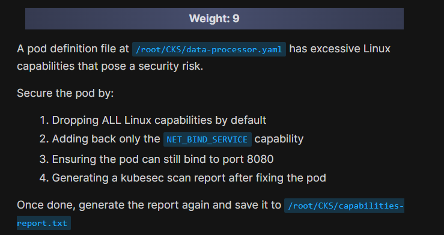
</div>

---

## ⭐ Q9

<div align="center" style="background-color:#141414; border-radius: 10px; border: 2px solid">
  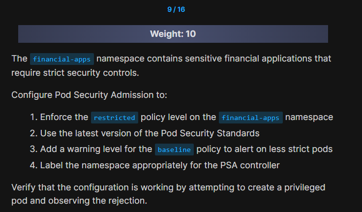
</div>

---

### Answer:

```bash
kubectl label namespace financial-apps \
  pod-security.kubernetes.io/enforce=restricted \
  pod-security.kubernetes.io/warn=baseline \
  --overwrite
```

```bash
kubectl label namespace financial-apps \
  pod-security.kubernetes.io/enforce-version=latest \
  pod-security.kubernetes.io/warn-version=latest \
  --overwrite
```

---

## 🟢 Q10

<div align="center" style="background-color:#141414; border-radius: 10px; border: 2px solid">
  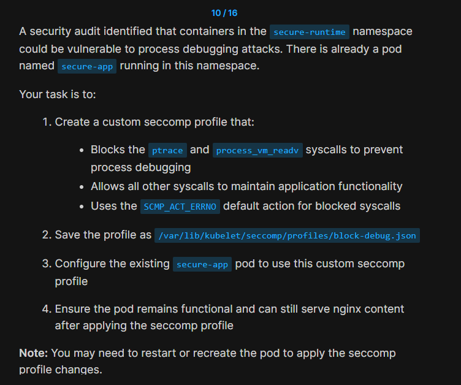
</div>

---

### Answer:

```bash
cat > /var/lib/kubelet/seccomp/profiles/block-debug.json <<'EOF'
{
    "defaultAction": "SCMP_ACT_ALLOW",
    "syscalls": [
        {
            "names": [
                "ptrace",
                "process_vm_readv"
            ],
            "action": "SCMP_ACT_ERRNO"
        }
    ]
}
EOF
```

---

## 🟢 Q11

<div align="center" style="background-color:#141414; border-radius: 10px; border: 2px solid">
  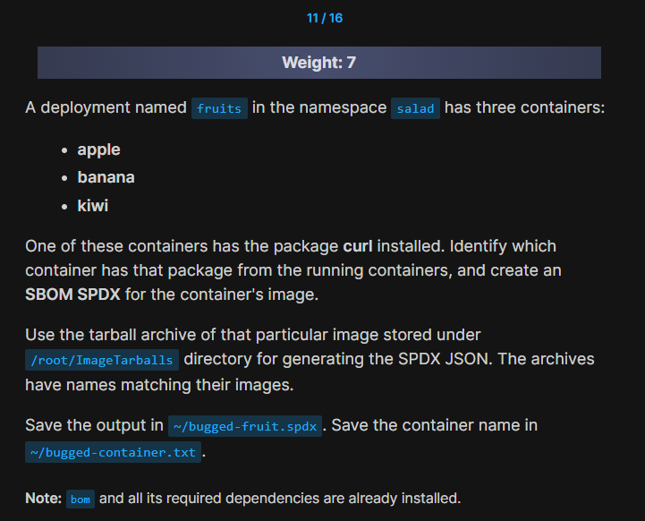
</div>

---

### Answer:

```bash
kubectl exec -n salad fruits-<string> -c apple -- apk info | grep curl && echo apple > ~/bugged-container.txt
```

```bash
bom generate --image-archive /root/ImageTarballs/<image_name>.tar --format json --output ~/bugged-fruit.spdx
```

---

## 🟢 Q12

<div align="center" style="background-color:#141414; border-radius: 10px; border: 2px solid">
  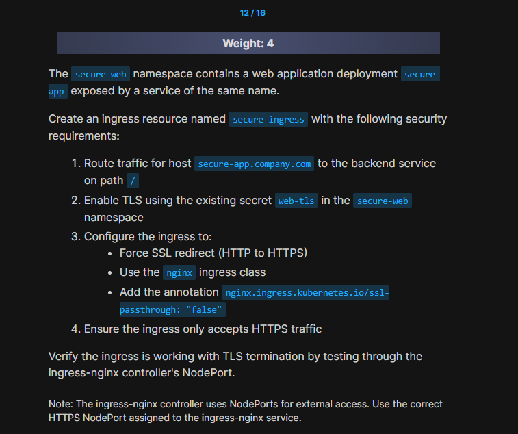
</div>

---

### Answer:

```bash
kubectl create ingress secure-ingress -n secure-web \
--class=nginx \
--rule="secure-app.company.com/*=secure-app:80,tls=web-tls" \
--annotation nginx.ingress.kubernetes.io/ssl-redirect=true \
--annotation nginx.ingress.kubernetes.io/ssl-passthrough=false
```

---

## 🔴 Q13

<div align="center" style="background-color:#141414; border-radius: 10px; border: 2px solid">
  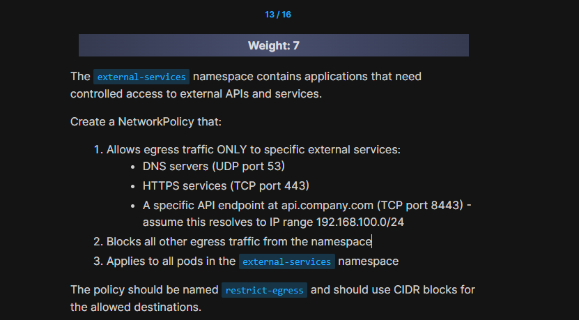
</div>

---

### Answer:

```yaml
apiVersion: networking.k8s.io/v1
kind: NetworkPolicy
metadata:
  name: restrict-egress
  namespace: external-services
spec:
  podSelector: {}
  policyTypes:
    - Egress
  egress:
    # Allow DNS to any destination
    - ports:
        - port: 53
          protocol: UDP
        - port: 53
          protocol: TCP
    # Allow HTTPS to any destination
    - ports:
        - port: 443
          protocol: TCP
    # Allow specific API endpoint (api.company.com -> 192.168.100.0/24)
    - ports:
        - port: 8443
          protocol: TCP
      to:
        - ipBlock:
            cidr: 192.168.100.0/24
```

## 🟢 Q14

<div align="center" style="background-color:#141414; border-radius: 10px; border: 2px solid">
  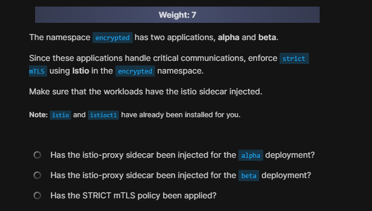
</div>

---

### Answer:

```bash
# step 1:
kubectl label namespace encrypted istio-injection=enabled --overwrite
```

```bash
# step 2:
kubectl rollout restart deployment alpha -n encrypted
kubectl rollout restart deployment beta -n encrypted
```

```bash
# step 3:
cat <<EOF | kubectl apply -f -
apiVersion: security.istio.io/v1beta1
kind: PeerAuthentication
metadata:
  name: default
  namespace: encrypted
spec:
  mtls:
    mode: STRICT
EOF
```

---

## 🟢 Q15

<div align="center" style="background-color:#141414; border-radius: 10px; border: 2px solid">
  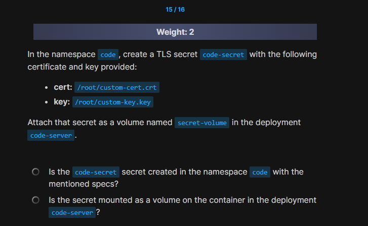
</div>

### Answer:

---

## 🟢 Q16

<div align="center" style="background-color:#141414; border-radius: 10px; border: 2px solid">
  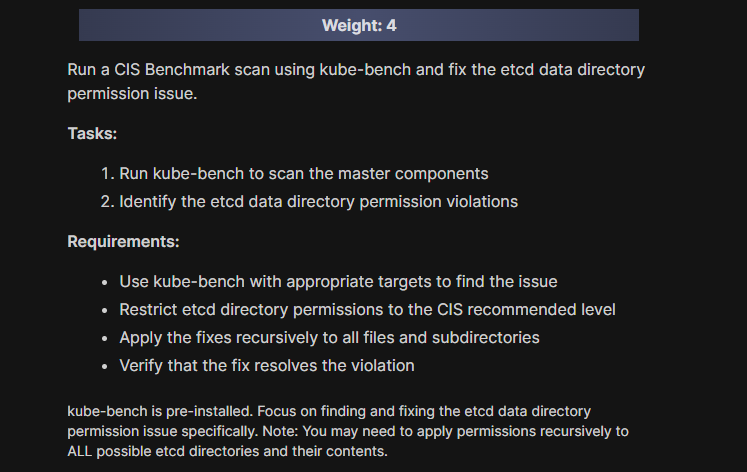
</div>

---

### Answer:

```bash
kube-bench run --targets etcd
```

```bash
useradd etcd -M -U -s /sbin/nologin
sudo chown etcd:etcd /var/lib/etcd
```
