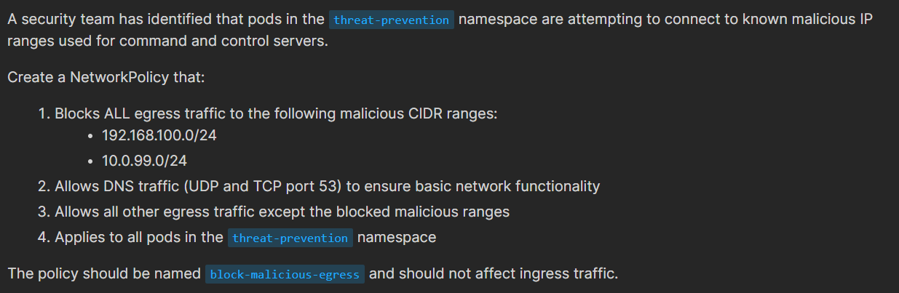
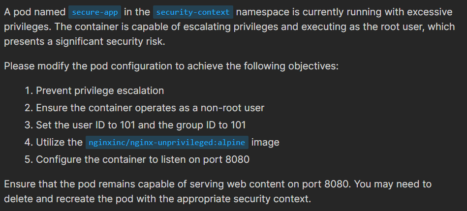
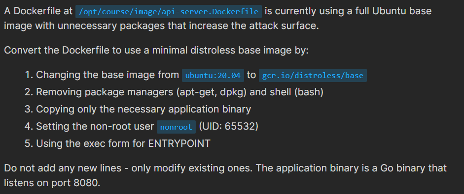

# Mock Exam 1

## 🟡 Q1

---

## 🟢 Q2

<div align="center" style="background-color:#141414; border-radius: 10px; border: 2px solid">
  
</div>

---

```yaml
apiVersion: networking.k8s.io/v1
kind: NetworkPolicy
metadata:
  name: block-malicious-egress
  namespace: threat-prevention
spec:
  podSelector: {}
  policyTypes:
    - Egress
  egress:
    - to:
        - ipBlock:
            cidr: 0.0.0.0/0
            except:
              - 10.0.99.0/24
              - 192.168.100.0/24
    - ports:
        - protocol: TCP
          port: 53
        - protocol: UDP
          port: 53
```

### Testing the Policy:

To test allowed traffic, use the command:

```bash
kubectl exec -n threat-prevention test-pod -- curl --connect-timeout 3 www.google.com
```

To test blocked traffic (this should timeout), execute:

```bash
kubectl exec -n threat-prevention test-pod -- curl --connect-timeo
```

---

## 😡 Q3



```yaml
apiVersion: v1
kind: Pod
metadata:
  name: secure-app
  namespace: security-context
  labels:
    app: secure-app
spec:
  securityContext:
    runAsNonRoot: true
    runAsUser: 101 # nginx user UID in unprivileged image
    runAsGroup: 101 # nginx group GID in unprivileged image
  containers:
    - name: app-container
      image: nginxinc/nginx-unprivileged:alpine
      securityContext:
        allowPrivilegeEscalation: false
        runAsUser: 101
        runAsGroup: 101
      ports:
        - containerPort: 8080 # Non-privileged port
```

```ini
What different when put securityContext in pod level and security level, and how to know in the cks exam?
```

---

## 🟢 Q4


---

```yaml
- namespaceSelector:
    matchLabels:
      kubernetes.io/metadata.name: monitoring
```

```yaml
apiVersion: networking.k8s.io/v1
kind: NetworkPolicy
metadata:
  name: frontend-access
  namespace: web-apps
spec:
  podSelector:
    matchLabels:
      app: frontend
  policyTypes:
    - Ingress
  ingress:
    - from:
        - podSelector:
            matchLabels:
              app: backend
          namespaceSelector:
            matchLabels:
              kubernetes.io/metadata.name: monitoring
      ports:
        - protocol: TCP
          port: 6379
```

## 🔄️ Q5

## 🟢 Q6

---

## 🟢 Q7



```ini
# old
FROM ubuntu:20.04
RUN apt-get update && apt-get install -y curl wget python3 python3-pip
RUN useradd -m appuser
COPY ./app-server /app/server
RUN chmod +x /app/server
USER root
ENTRYPOINT /app/server
```

```ini
# new
FROM gcr.io/distroless/base
COPY ./app-server /app/server
USER nonroot:nonroot
ENTRYPOINT ["/app/server"]
```

Does ENTRYPOINT use exec form?

```ini
ENTRYPOINT ["/app/server"]
```

---

## 🟢 Q8

---

## Q9

Pod Security Admission
