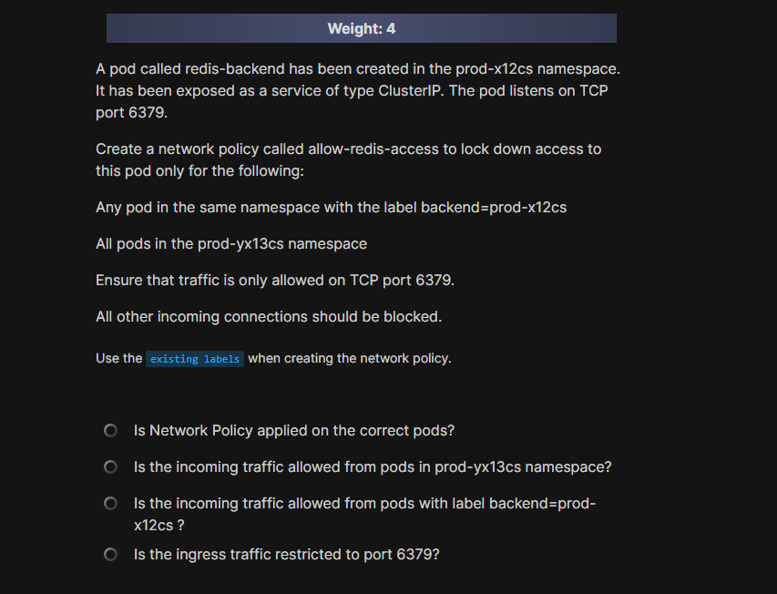
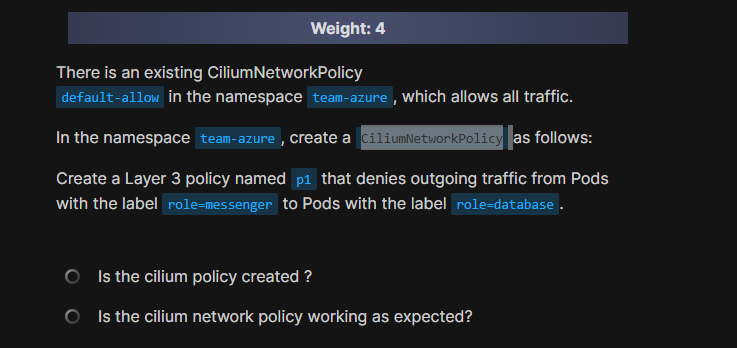
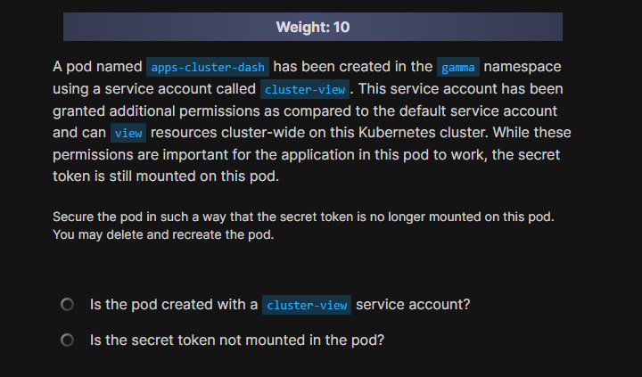
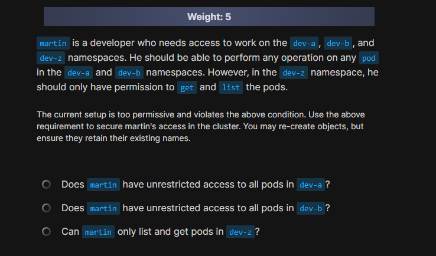
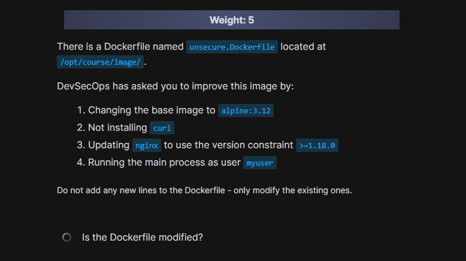
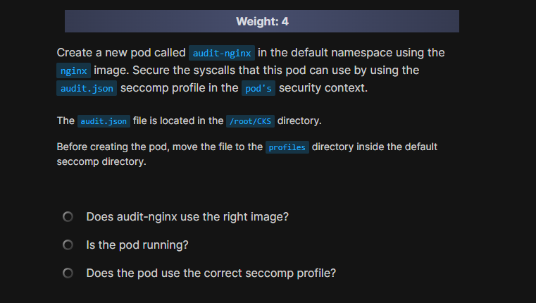
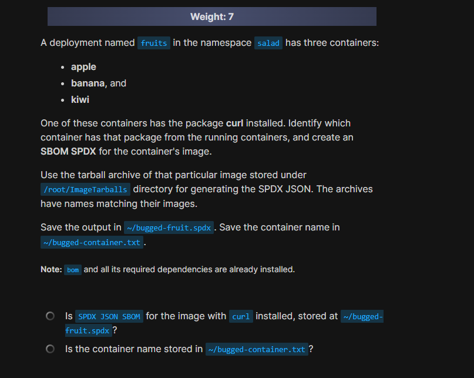
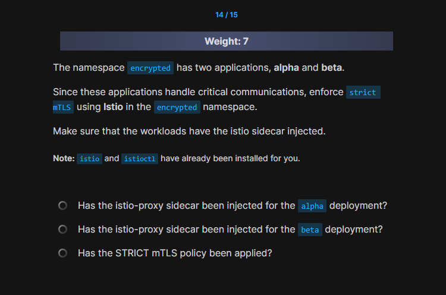
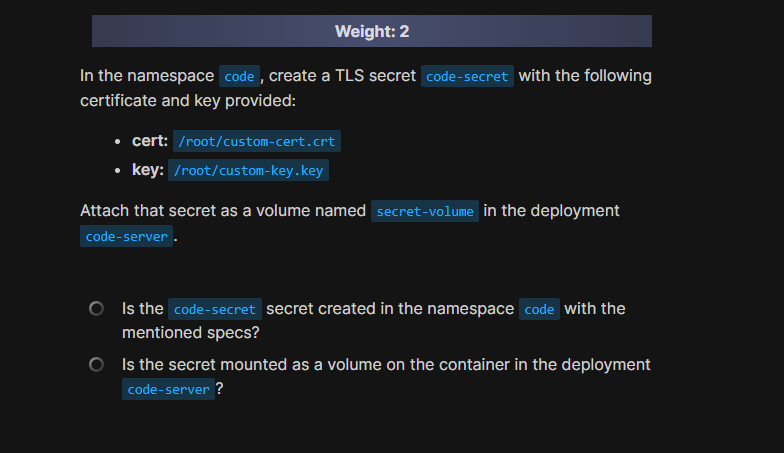

# 📰 **Mock Exam 2**

## 🟡 Q1

<div align="center" style="background-color:#141414; border-radius: 10px; border: 2px solid">
  
</div>

---

### 😭 Reason

> i put different network policy name:
>
> - `name: test-network-policy`

---

### ✍🏻 Answer

Create a network policy using the YAML below:

```yaml
---
apiVersion: networking.k8s.io/v1
kind: NetworkPolicy
metadata:
  name: allow-redis-access
  namespace: prod-x12cs
spec:
  podSelector:
    matchLabels:
      run: redis-backend
  policyTypes:
    - Ingress
  ingress:
    - from:
        - namespaceSelector:
            matchLabels:
              kubernetes.io/metadata.name: prod-yx13cs
        - podSelector:
            matchLabels:
              backend: prod-x12cs
      ports:
        - protocol: TCP
          port: 6379
```

> Instead of `kubernetes.io/metadata.name: prod-yx13c`s in the above yaml, you can also use `access: redis`.

---

## 🔴 `Q2`

<div align="center" style="background-color:#141414; border-radius: 10px; border: 2px solid">
  
</div>

---

```bash
k get ciliumnetworkpolicies -n team-azure
```

---

### ✍🏻 Answer

We create a deny policy:

```yaml
apiVersion: "cilium.io/v2"
kind: CiliumNetworkPolicy
metadata:
  name: p1
  namespace: team-azure
spec:
  endpointSelector:
    matchLabels:
      role: messenger
  egressDeny:
    - toEndpoints:
        - matchLabels:
            role: database
```

Use the below command to check the network connection. Change IP address of database pod below and check.

Get IP address

```bash
kubectl get pod -n team-azure database-pod -o jsonpath='{.status.podIP}'
```

Use the ipaddress below and check connectvity

```bash
kubectl exec -n team-azure messenger-pod -- curl -m 3 <IP Address>:80
```

---

## 🟢 `Q3`

<div align="center" style="background-color:#141414; border-radius: 10px; border: 2px solid">
  
</div>

---

```md
A pod named apps-cluster-dash has been created in the gamma namespace using a service account called cluster-view. This service account has been granted additional permissions as compared to the default service account and can view resources cluster-wide on this Kubernetes cluster. While these permissions are important for the application in this pod to work, the secret token is still mounted on this pod.

Secure the pod in such a way that the secret token is no longer mounted on this pod. You may delete and recreate the pod.
```

---

## 🟡 `Q4`

<div align="center" style="background-color:#141414; border-radius: 10px; border: 2px solid">
  
</div>

---

### 😭 Reason

> i forgot to include `,`

---

### ✍🏻 Answer

Add the below rule to `/etc/falco/falco_rules.local.yaml` and restart the falco service to override the current rule.

```yaml
- rule: Terminal shell in container
  desc: A shell was used as the entrypoint/exec point into a container with an attached terminal.
  condition: >
    spawned_process and container
    and shell_procs and proc.tty != 0
    and container_entrypoint
    and not user_expected_terminal_shell_in_container_conditions
  output: >
    %evt.time.s,%user.uid,%container.id,%container.image.repository
  priority: ALERT
  tags: [container, shell, mitre_execution]
```

Use the falco documentation to use the correct sysdig filters in the output.

For example, the evt.time.s filter prints the timestamp for the event without nano seconds. This is clearly described in the falco documentation here - <https://falco.org/docs/rules/supported-fields/#evt-field-class>

---

## 🟢 Q5

<div align="center" style="background-color:#141414; border-radius: 10px; border: 2px solid">
  
</div>

---

## 🟡 Q6

<div align="center" style="background-color:#141414; border-radius: 10px; border: 2px solid">
  
</div>

---

```bash
k label ns team-red pod-security.kubernetes.io/enforce=baseline
```

### 😭 Reason

> Are the replicaset events written to /opt/course/logs.txt?
>
> - just clog last events, not the entire history

---

## 🟢 Q7

<div align="center" style="background-color:#141414; border-radius: 10px; border: 2px solid">
  
</div>

---

## 🟢 Q8

<div align="center" style="background-color:#141414; border-radius: 10px; border: 2px solid">
  
</div>

---

## 🟡 `Q9`

<div align="center" style="background-color:#141414; border-radius: 10px; border: 2px solid">
  
</div>

---

### 😭 Reason

> Is curl working for the HTTPS connection via the ingress?

---

### ✍🏻 Answer

Run the command:

```bash
k describe deployment rocket-server -n space
```

and check the Port field under **Pod Template -> Containers**.

Then create and apply the following ingress yaml file:

```yaml
apiVersion: networking.k8s.io/v1
kind: Ingress
metadata:
  name: rocket-ingress
  namespace: space
  annotations:
    nginx.ingress.kubernetes.io/ssl-redirect: "true"
spec:
  ingressClassName: nginx
  tls:
    - hosts:
        - rocket-server.local
      secretName: rocket-tls
  rules:
    - host: rocket-server.local
      http:
        paths:
          - path: /
            pathType: Prefix
            backend:
              service:
                name: rocket-server
                port:
                  number: 80
```

Once that is done, check the IP address of the **ingress-nginx-controller**:

```bash
kubectl get svc -n ingress-nginx
```

Then add this IP to the `/etc/hosts` file:

```bash
echo "<INGRESS-IP> rocket-server.local" | sudo tee -a /etc/hosts
```

Finally you can check the working:

```bash
curl -k https://rocket-server.local
```

You should the nginx welcome page.

---

## 🟢 Q10

 <div align="center" style="background-color:#141414; border-radius: 10px; border: 2px solid">
  
</div>

---

```ini
# this contains the default seccomp profiles
/var/lib/kubelet/seccomp/profiles/
```

---

## 🔴 Q11

<div align="center" style="background-color:#141414; border-radius: 10px; border: 2px solid">
  
</div>

---

### 😭 Reason

> i solved it using
>
> - `trivy image --input <file.tar>`>
> - `trivy image --input <file.tar> -f spdx > ~/bugged-fruit.spdx`

---

### ✍🏻 Answer

First check the deployment running in the salad namespace:

```bash
kubectl get deployments -n salad
```

Then, run the following commands in succession to fetch the container name in the text file:

```bash
kubectl exec -n salad fruits-<string> -c apple -- apk info | grep curl && echo apple > ~/bugged-container.txt
```

Do the same for kiwi and banana as well.

Determine the image name used in that container by describing the pod and checking the Containers section in the output:

```bash
k describe pod fruits-54665c68db-mcwg9 -n salad
```

Your pod name could be different.

Once you have determined the image name, navigate to the `/root/ImageTarballs/` directory and identify the tarball of that image by its name.

Then run the following command to generate the SPDX JSON:

```bash
bom generate --image-archive /root/ImageTarballs/<image_name>.tar --format json --output ~/bugged-fruit.spdx
```

Replace the <image_name> with the actual name of the tar file.

---

## 🟡 Q12

 <div align="center" style="background-color:#141414; border-radius: 10px; border: 2px solid">
  
</div>

---

### 😭 Reason

> i forgot to mount the policy file to apiserver pod

---

### ✍🏻 Answer

First complete the /etc/kubernetes/cluster-policy.yaml:

```yaml
apiVersion: audit.k8s.io/v1
kind: Policy
omitStages:
  - "RequestReceived"
rules:
  - level: Metadata
    verbs: ["delete"]
    resources:
      - group: ""
        resources: ["secrets"]
    namespaces: ["kube-system"]
  - level: Request
    verbs: ["create", "update", "patch", "delete"]
    resources:
      - group: "apps"
        resources: ["deployments"]
    namespaces: ["default"]
  - level: Metadata
```

Then add/modify the properties in the vi `/etc/kubernetes/manifests/kube-apiserver.yaml` file. First add these flags:

```ini
- --audit-policy-file=/etc/kubernetes/cluster-policy.yaml
- --audit-log-path=/var/log/cluster-audit.log
- --audit-log-maxage=10
- --audit-log-maxbackup=3
- --audit-log-maxsize=10
```

Under volumes section in the same file, add the following:

```ini
- hostPath:
    path: /etc/kubernetes/cluster-policy.yaml
    type: File
  name: audit-policy
- hostPath:
    path: /var/log
    type: Directory
  name: varlog
```

Under volumeMounts section in the same file, add the following as well:

```ini
- mountPath: /etc/kubernetes/cluster-policy.yaml
  name: audit-policy
  readOnly: true
- mountPath: /var/log
  name: varlog
```

Save and exit the file. Then run the following command to check the status of the api server and other components:

```bash
kubectl get pods -n kube-system
```

Wait till all components come up in a running state.

Finally, check the status of the log file:

```bash
ls -l /var/log/cluster-audit.log
```

The file should be automatically created and should now start storing logs.

---

## 🔴 `Q13`

<div align="center" style="background-color:#141414; border-radius: 10px; border: 2px solid">
  
</div>

---

### ✍🏻 Answer

References:

- AppArmor official documentation

On the controlplane node, load the AppArmor profile:

```bash
root@controlplane:~# apparmor_parser -q /etc/apparmor.d/frontend
```

The profile name used by this file is restricted-frontend (open the /etc/apparmor.d/frontend file to check).

To verify that the profile was successfully loaded, use the aa-status command:

```bash
root@controlplane:~# aa-status | grep restricted-frontend
restricted-frontend
```

The pod should only use the service account called frontend-default as it has the least privileges of all the service accounts in the omni namespace (excluding default)
The other service accounts, fe and frontend have additional permissions (check the roles and rolebindings associated with these accounts)

Use the below YAML File to re-create the frontend-site pod:

```yaml
apiVersion: v1
kind: Pod
metadata:
  labels:
    run: nginx
  name: frontend-site
  namespace: omni
spec:
  securityContext:
    appArmorProfile: #added
      type: Localhost #added
      localhostProfile: restricted-frontend #added
  serviceAccountName: frontend-default #Use the service account with least privileges
  containers:
    - image: nginx:alpine
      name: nginx
      volumeMounts:
        - mountPath: /usr/share/nginx/html
          name: test-volume
  volumes:
    - name: test-volume
      hostPath:
        path: /data/pages
        type: Directory
```

You can observe that we also added the apparmor profile specifications under spec.securityContext.

Next, Delete the unused service accounts in the 'omni' namespace.

```bash
controlplane$ kubectl -n omni delete sa frontend
controlplane$ kubectl -n omni delete sa fe
```

---

## 🔴 Q14

<div align="center" style="background-color:#141414; border-radius: 10px; border: 2px solid">
  
</div>

---

### ✍🏻 Answer

First enable istio sidecar injection in the namespace:

```bash
kubectl label namespace encrypted istio-injection=enabled --overwrite
```

Then, restart the deployments:

```bash
kubectl rollout restart deployment alpha -n encrypted
kubectl rollout restart deployment beta -n encrypted
```

Apply PeerAuthentication policy for STRICT mTLS:

```yaml
apiVersion: security.istio.io/v1beta1
kind: PeerAuthentication
metadata:
  name: default
  namespace: encrypted
spec:
  mtls:
    mode: STRICT
```

Then, check for sidecar injection:

```bash
k describe pod -n encrypted alpha-6dc74c94df-8qwfj
```

You should see two containers running as part of the deployment alpha and beta pods now.

Verify peer authentication:

```bash
kubectl get peerauthentication -n encrypted
```

You should see a resource named default.

---

## 🟡 Q15

<div align="center" style="background-color:#141414; border-radius: 10px; border: 2px solid">
  
</div>
