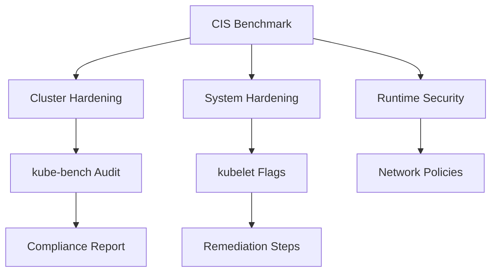

# 🧩 CIS Benchmarks for Kubernetes

**CIS (Center for Internet Security)** Benchmarks are a **globally recognized set of best practices** for securing systems — including Kubernetes clusters.

These benchmarks are your **security baseline** for cluster hardening and are directly tested in **CKS** (e.g., via `kube-bench` labs).

---

<div align="center" style="background-color: #EBEBEB; border-radius: 10px; border: 2px solid">
  
</div>

---

[https://www.cisecurity.org/cis-benchmarks](https://www.cisecurity.org/cis-benchmarks)

---

## 🧠 1. What Are CIS Benchmarks?

The **CIS Kubernetes Benchmark** defines _recommended configuration checks_ for all components in a Kubernetes cluster.

Each check follows a standard format:

<div align="center" style="background:#343739ff; border-radius:20px">

| Field             | Description                                    |
| ----------------- | ---------------------------------------------- |
| **ID**            | Unique identifier (e.g., 1.1.1)                |
| **Title**         | What is being tested                           |
| **Description**   | Why this is important                          |
| **Remediation**   | How to fix it                                  |
| **Audit Command** | How to verify it                               |
| **Scoring**       | Whether it affects your overall security score |

</div>

---

📘 Example:

```ini
1.1.1 Ensure that the API server pod specification file permissions are set to 600 or more restrictive
```

**Why:** prevents unauthorized modification.  
**Remediation:** `chmod 600 /etc/kubernetes/manifests/kube-apiserver.yaml`

---

## 🧩 2. CIS Benchmark Structure (Control IDs)

The CIS Kubernetes Benchmark is divided into major sections:

<div align="center" style="background:#343739ff; border-radius:20px">

| Section | Component                   | Description                                                   |
| ------- | --------------------------- | ------------------------------------------------------------- |
| **1**   | Master Node (Control Plane) | Security checks for API Server, Controller Manager, Scheduler |
| **2**   | Worker Node                 | Node-level hardening (kubelet, kube-proxy)                    |
| **3**   | Policies                    | Network policies, Pod Security Standards                      |
| **4**   | Etcd                        | Data encryption, certs, and file permissions                  |
| **5**   | Control Plane Configuration | Auditing, certificates, admission plugins                     |
| **6**   | Managed Components          | CoreDNS, kube-proxy, etc.                                     |
| **7**   | Runtime & OS                | Docker/containerd, kernel security, AppArmor/SELinux          |
| **8**   | General Policies            | Logging, RBAC, API access                                     |

</div>

---

## ⚙️ 3. How to Run CIS Benchmark on a Cluster

The industry tool to automate these checks is **`kube-bench`**.

### 🔧 Installation

```bash
curl -L https://github.com/aquasecurity/kube-bench/releases/latest/download/kube-bench_$(uname -s)_$(uname -m).tar.gz -o kube-bench.tar.gz
tar -xzf kube-bench.tar.gz
sudo mv kube-bench /usr/local/bin/
```

### 🚀 Run it

```bash
sudo kube-bench run
```

### 🧾 Output Example

```ini
== Summary ==
9 checks PASS
3 checks FAIL
2 checks WARN
```

Example failed check:

```ini
[FAIL] 1.2.7 Ensure that the --authorization-mode argument is not set to AlwaysAllow
```

✅ **Remediation:**  
Edit `/etc/kubernetes/manifests/kube-apiserver.yaml`:

```yaml
- --authorization-mode=Node,RBAC
```

Then restart the API server.

---

## 🧩 4. Key Hardening Checks for CKS

Here are the **most exam-relevant** CIS controls you must memorize and practice fixing:

<div align="center" style="background:#343739ff; border-radius:20px">

| Area       | Control                          | Example Fix                                |
| ---------- | -------------------------------- | ------------------------------------------ |
| API Server | `--anonymous-auth=false`         | Disable anonymous access                   |
| API Server | `--authorization-mode=RBAC`      | Avoid `AlwaysAllow`                        |
| etcd       | File permissions 600             | `chmod 600 /etc/kubernetes/pki/etcd/*`     |
| Kubelet    | `--read-only-port=0`             | Disable unauthenticated access             |
| Kubelet    | `--anonymous-auth=false`         | Require cert auth                          |
| Audit Logs | Audit policy enabled             | Create `/etc/kubernetes/audit-policy.yaml` |
| Pods       | Use `PodSecurity` Admission      | Enforce `restricted` policy                |
| Nodes      | `AppArmor` or `Seccomp` profiles | Attach profiles to pods                    |
| RBAC       | Minimal Role/Binding             | Avoid cluster-admin abuse                  |

</div>

---

## 🧩 5. Typical Fix Flow (Exam Scenario)

You may get a question like:

> "kube-bench reports that your kubelet is configured with anonymous auth enabled. Fix this issue."

🧭 Steps:

1. Check kubelet service or config:

   ```bash
   ps -ef | grep kubelet
   cat /var/lib/kubelet/config.yaml
   ```

2. Add or change:

   ```yaml
   authentication:
     anonymous:
       enabled: false
   ```

3. Restart kubelet:

   ```bash
   systemctl restart kubelet
   ```

4. Verify:

   ```bash
   curl -k https://localhost:10250/metrics
   # should return Unauthorized or require cert
   ```

---

## 🧩 6. `kube-bench` Profile Matching

`kube-bench` runs different benchmark versions based on Kubernetes version:

| K8s Version | CIS Profile                    |
| ----------- | ------------------------------ |
| 1.24+       | CIS Kubernetes v1.24 Benchmark |
| 1.23        | v1.23 Benchmark                |
| 1.20–1.21   | v1.20 Benchmark                |

🧠 _Exam Tip:_ If you see errors about missing configs, use:

```bash
kube-bench --version <benchmark_version>
```

---

## 🧩 7. Integration with CI/CD (Real-World Use)

In production, you can integrate CIS compliance checks in pipelines:

```bash
# Example in Jenkins or GitHub Actions
steps:
  - name: Run kube-bench
    run: |
      kube-bench --json > report.json
      cat report.json | jq '.Totals'
```

Or use **Aqua Trivy CIS mode**:

```bash
trivy k8s --compliance k8s-cis
```

---

## 🧩 8. Visual Overview

<div align="center" style="background:#343739ff; border-radius:20px">



</div>

---

## 🧠 9. CKS Exam Tips

- You **don’t need to memorize all CIS controls**, only the most common ones around:

  - API server flags
  - Kubelet security
  - RBAC and PSS
  - Audit logging

- `kube-bench` might be pre-installed or you can `kubectl run` it as a pod.
- Be quick: apply the fix, not the whole remediation process.

---

## ✅ Summary

<div align="center" style="background:#343739ff; border-radius:20px">

| Focus Area    | Key Tool      | Goal                    |
| ------------- | ------------- | ----------------------- |
| Control Plane | kube-bench    | Secure API server, etcd |
| Node Level    | OS Hardening  | Lock down kubelet       |
| Policy        | Kyverno / OPA | Enforce constraints     |
| Runtime       | Falco         | Detect anomalies        |
| Verification  | CIS Report    | Compliance Score        |

</div>

---

Would you like me to follow up with a **hands-on lab** that walks you through running `kube-bench` inside a real cluster (with output interpretation and fix examples for each failed control)?
