# ☸️ **kube-bench**

## 📖 **Understanding How kube-bench Works**

`kube-bench` performs **CIS Benchmark tests** defined in YAML files under its `cfg/` directory.
Each test:

- checks for a specific Kubernetes configuration (like a flag, permission, or file mode);
- reports a result: ✅ PASS, ⚠️ WARN, or ❌ FAIL;
- gives **“Remediation”** text explaining what to fix.

```bash
sudo kube-bench run --benchmark cis-1.24
```

That command triggers:

1. Auto-detection of node role (master/control-plane or worker).
2. Execution of relevant tests.
3. Report printed to terminal or exported in JSON.

---

## ⚙️ **Running kube-bench (Full & Partial Scans)**

### 🧪 Full Scan

Run all CIS checks (control plane + node):

```bash
sudo kube-bench run
```

- Detects node type automatically.
- Takes 1–2 minutes.
- Outputs summarized results.

---

### 🎯 Run a Specific Section Only

You can focus on one benchmark section instead of everything.
For example:

- `1` → Control Plane Components
- `4` → Worker Node Configuration

Run only section 1:

```bash
sudo kube-bench run --section 1
```

Or section 4 (nodes):

```bash
sudo kube-bench run --section 4
```

This is great when you’ve just fixed something in that area (e.g., kubelet config).

---

### 🧩 Run a Specific Test ID

Each CIS rule has an ID like `1.2.7`.
You can target it directly:

```bash
sudo kube-bench run --check 1.2.7
```

This runs **only** the single rule — perfect for verifying fixes quickly.

---

## 🧾 **Viewing and Saving Reports**

### 🖥️ Default (Console Output)

When you run `kube-bench`, results print in color-coded text:

```ini
== Summary ==
14 checks PASS
3 checks FAIL
2 checks WARN
```

### 🧩 Export as JSON

For programmatic analysis or saving logs:

```bash
sudo kube-bench run --json > /var/log/kube-bench-report.json
```

View with `jq`:

```bash
cat /var/log/kube-bench-report.json | jq .
```

Example:

```json
{
  "section": "1.2 API Server",
  "test_number": "1.2.7",
  "desc": "Ensure --authorization-mode is not set to AlwaysAllow",
  "state": "FAIL",
  "remediation": "Edit /etc/kubernetes/manifests/kube-apiserver.yaml"
}
```

---

## 🤹🏻 **Understanding Result Types**

<div align="center" style="background:#343739ff; border-radius:20px">

| Result      | Meaning                                | Example                            |
| ----------- | -------------------------------------- | ---------------------------------- |
| ✅ **PASS** | The node complies with the control     | `--anonymous-auth=false`           |
| ❌ **FAIL** | Misconfiguration detected              | `--authorization-mode=AlwaysAllow` |
| ⚠️ **WARN** | Cannot determine (manual check needed) | Check audit log policy manually    |
| ❓ **INFO** | Informational or skipped test          | Optional for environment           |

</div>

---

## 📃 **Reading the Report (CLI Output Example)**

```ini
[INFO] 1 Control Plane Configuration
[PASS] 1.1.1 Ensure API server pod spec file permissions are set to 644 or more restrictive
[FAIL] 1.2.7 Ensure that the --authorization-mode argument is not set to AlwaysAllow
    Remediation: Edit /etc/kubernetes/manifests/kube-apiserver.yaml
    Reason: Found '--authorization-mode=AlwaysAllow'
[WARN] 1.3.2 Ensure controller-manager certs are owned by root
```

Each FAIL includes:

- The **control ID** (`1.2.7`)
- **Current finding** (reason)
- **Remediation instruction**

---

## 🔧 **How to Remediate Failures**

Let’s fix the most common ones you’ll see 👇

### 🩹 Example 1: Disable AlwaysAllow Authorization (1.2.7)

**File:** `/etc/kubernetes/manifests/kube-apiserver.yaml`

```yaml
- --authorization-mode=Node,RBAC
```

Remove or replace `AlwaysAllow`.

Then reload:

```bash
sudo systemctl restart kubelet
```

Check fix:

```bash
sudo kube-bench run --check 1.2.7
```

✅ Should now PASS.

---

### 🩹 Example 2: Disable Anonymous Auth for Kubelet (4.2.6)

**File:** `/var/lib/kubelet/config.yaml`

```yaml
authentication:
  anonymous:
    enabled: false
```

Apply:

```bash
sudo systemctl restart kubelet
```

Recheck:

```bash
sudo kube-bench run --check 4.2.6
```

---

### 🩹 Example 3: Secure etcd Data Permissions (2.2.1)

**File:** `/etc/kubernetes/pki/etcd/server.key`

```bash
sudo chmod 600 /etc/kubernetes/pki/etcd/server.key
sudo chown etcd:etcd /etc/kubernetes/pki/etcd/server.key
```

Verify:

```bash
sudo kube-bench run --check 2.2.1
```

---

## 🎯 **Checking Only Fixed Controls**

Once you’ve remediated a few items, you don’t need to rerun all 200+ checks.

### ✅ Run a Single Control

```bash
sudo kube-bench run --check 4.2.6
```

### ✅ Run a Section (e.g. Kubelet)

```bash
sudo kube-bench run --section 4
```

### ✅ Run Multiple Controls

```bash
sudo kube-bench run --check 1.2.7,4.2.6
```

Perfect for quick re-validation.

---

## 🧾 **Advanced Report Options**

<div align="center" style="background:#343739ff; border-radius:20px">

| Option                             | Description                    |
| ---------------------------------- | ------------------------------ |
| `--json`                           | Machine-readable report        |
| `--benchmark cis-1.24`             | Use specific CIS version       |
| `--targets=master,node`            | Manually specify role          |
| `--config-dir=/etc/kube-bench/cfg` | Use custom config folder       |
| `--check <id>`                     | Run single test                |
| `--section <num>`                  | Run only one benchmark section |

</div>

---

## ✍🏻 **Example Workflow (Fix → Verify)**

<div align="center" style="background:#343739ff; border-radius:20px">

| Step | Action                     | Command                                   |
| ---- | -------------------------- | ----------------------------------------- |
| 1️⃣   | Run full scan              | `sudo kube-bench run`                     |
| 2️⃣   | Note failures              | Identify control IDs (e.g., 1.2.7, 4.2.6) |
| 3️⃣   | Apply fix                  | Edit manifest/config                      |
| 4️⃣   | Restart service            | `sudo systemctl restart kubelet`          |
| 5️⃣   | Re-test only fixed control | `sudo kube-bench run --check 4.2.6`       |
| 6️⃣   | Confirm PASS               | ✅ PASS output                            |
| 7️⃣   | Document changes           | Save report or audit log                  |

</div>

---

## ✍🏻 **Realistic Example**

### Run:

```bash
sudo kube-bench run --section 1
```

### Output:

```ini
[FAIL] 1.2.7 Ensure that --authorization-mode is not set to AlwaysAllow
Remediation: Edit /etc/kubernetes/manifests/kube-apiserver.yaml
Reason: Found 'AlwaysAllow'
```

### Fix:

```bash
sudo sed -i 's/AlwaysAllow/Node,RBAC/' /etc/kubernetes/manifests/kube-apiserver.yaml
sudo systemctl restart kubelet
```

### Verify Fix:

```bash
sudo kube-bench run --check 1.2.7
```

✅ Output:

```ini
[PASS] 1.2.7 Ensure that the --authorization-mode argument is not set to AlwaysAllow
```

---

## 🖼️ **Visual Flow of the Workflow**

```mermaid
flowchart TD
    A[Run kube-bench] --> B[Identify FAIL checks]
    B --> C[Read remediation instructions]
    C --> D[Edit config files / manifests]
    D --> E[Restart affected components]
    E --> F[Re-run kube-bench --check <id>]
    F --> G[PASS ✅ → Document compliance]
```

<div align="center" style="background:#343739ff; border-radius:20px">



</div>

---

## ✅ **Best Practices (CKS & Real World)**

- ✅ Always run as `sudo` (it needs system access).
- ✅ Don’t edit kubelet or API server flags directly — use manifests or config files.
- ✅ Document every fix in your GitOps or change management system.
- ✅ Automate regular CIS scans via cron or CI/CD pipeline.
- ✅ For managed clusters (EKS/GKE/AKS), use:

```bash
kubectl run kube-bench --rm -it --image=aquasec/kube-bench:latest --restart=Never
```

---

## 📚 **Quick Command Reference**

<div align="center" style="background:#343739ff; border-radius:20px">

| Task                 | Command                                    |
| -------------------- | ------------------------------------------ |
| Run full scan        | `sudo kube-bench run`                      |
| Run specific section | `sudo kube-bench run --section 1`          |
| Run specific control | `sudo kube-bench run --check 1.2.7`        |
| Run multiple checks  | `sudo kube-bench run --check 1.2.7,4.2.6`  |
| Save as JSON         | `sudo kube-bench run --json > report.json` |
| Re-run after fix     | `sudo kube-bench run --check <id>`         |
| View last 10 fails   | `sudo kube-bench run \| grep FAIL`         |

</div>

---

## 💎 **Summary Table**

<div align="center" style="background:#343739ff; border-radius:20px">

| Phase     | Command Example                            | Output      | Purpose                |
| --------- | ------------------------------------------ | ----------- | ---------------------- |
| 🧪 Scan   | `sudo kube-bench run`                      | Full report | Initial audit          |
| 📊 Filter | `sudo kube-bench run --check 4.2.6`        | PASS/FAIL   | Targeted recheck       |
| 🔧 Fix    | Edit kubelet config                        | —           | Apply remediation      |
| ✅ Verify | `sudo kube-bench run --check 4.2.6`        | PASS        | Confirm compliance     |
| 📄 Export | `sudo kube-bench run --json > report.json` | JSON        | Reporting & automation |

</div>
