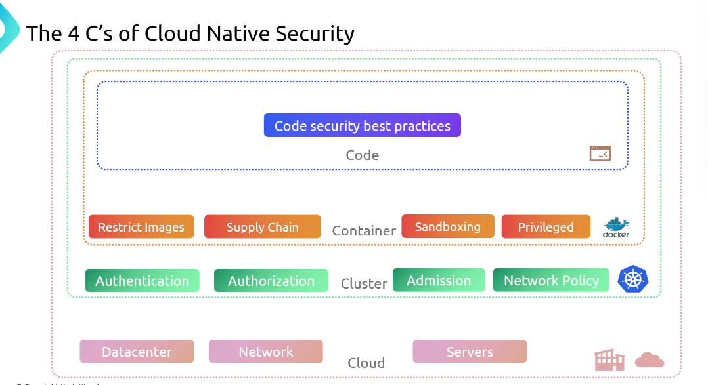

# 🗝️ **The 4C's of Cloud Native Security**

Protecting a Kubernetes-based voting application requires a multi-layered approach. In this guide, we’ll unpack the “`4 C’s`”— **Cloud**, **Cluster**, **Container**, and **Code** — to demonstrate how attackers exploit each layer and how you can shore up defenses across your entire stack.

## 🔐 Overview of Vulnerabilities and Mitigations

| Layer          | Focus Area            | Common Attack Vectors                                                           | Key Best Practices                                               |
| -------------- | --------------------- | ------------------------------------------------------------------------------- | ---------------------------------------------------------------- |
| 1️⃣ `Cloud`     | Infrastructure        | **Exposed management ports**, **overly permissive IAM roles**                   | **Firewalls**, **VPN/bastion hosts**, **IAM role audits**                    |
| 2️⃣ `Cluster`   | Control Plane & APIs  | **Public Docker API**, **unsecured Kubernetes API/Dashboard**                   | **Secure APIs**, **RBAC**, **OIDC/TLS**, regular patching                    |
| 3️⃣ `Container` | Workload Isolation    | **Untrusted images**, **privileged containers**, **lax runtime configurations** | **Image signing/scanning**, **PSP/PSA**, seccomp, resource limits        |
| 4️⃣ `Code`      | Application & Secrets | Hard-coded credentials, plaintext env vars, lack of mutual TLS                  | **Vault/K8s Secrets (encrypted)**, **mutual TLS**, **secure coding reviews** |

---

  

