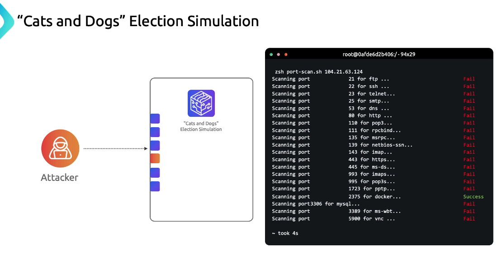
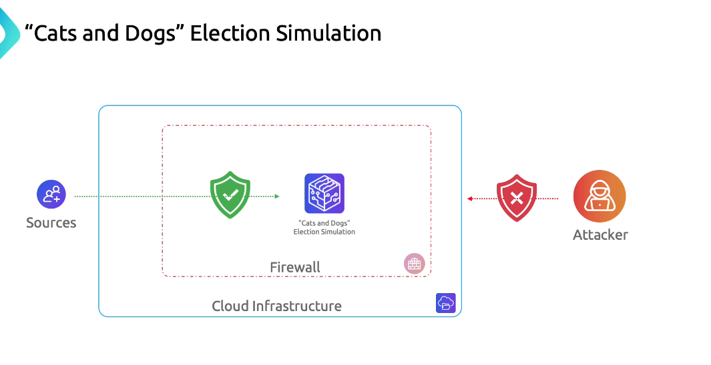
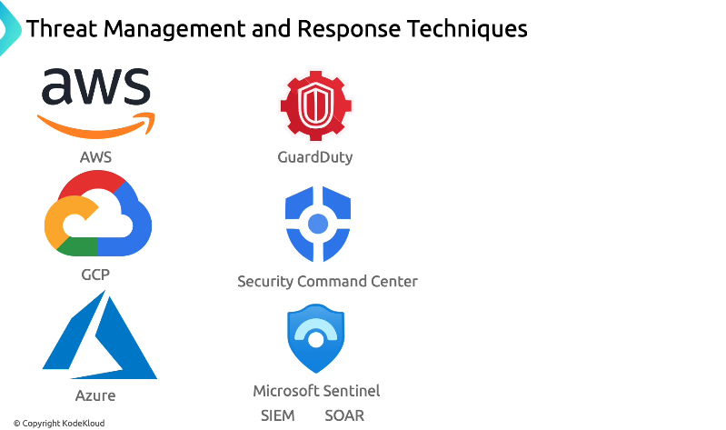
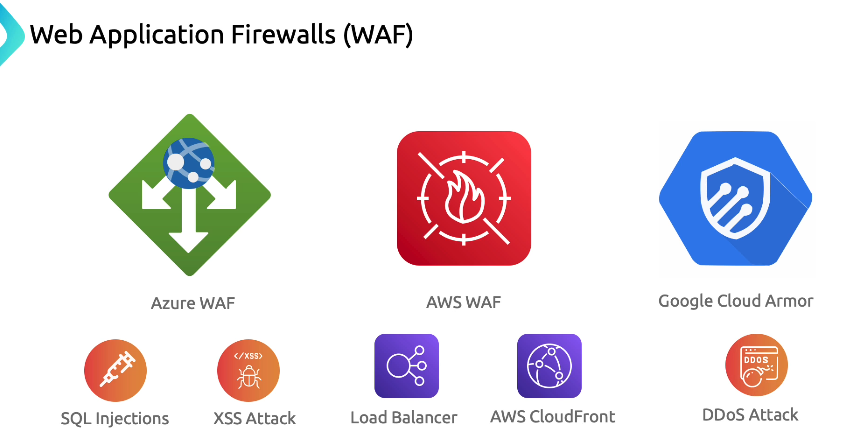
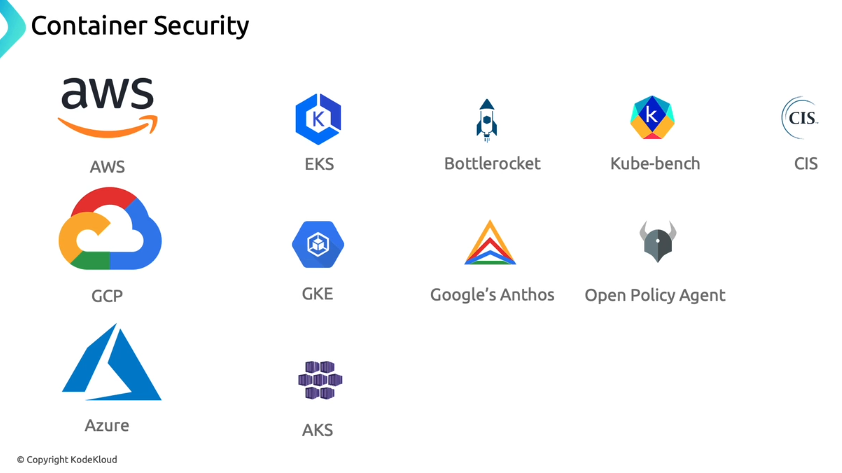
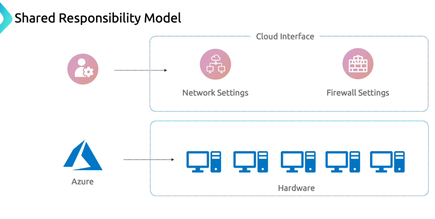
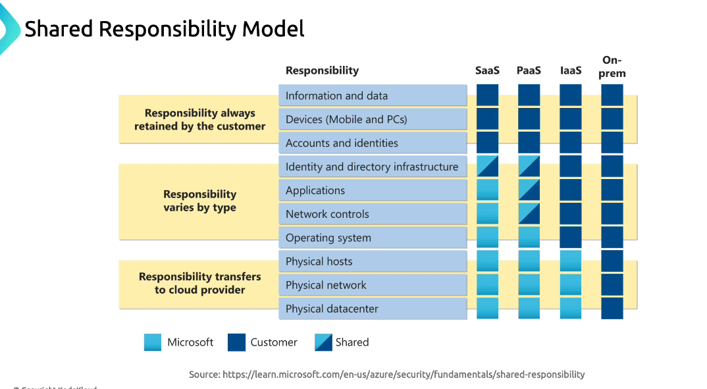
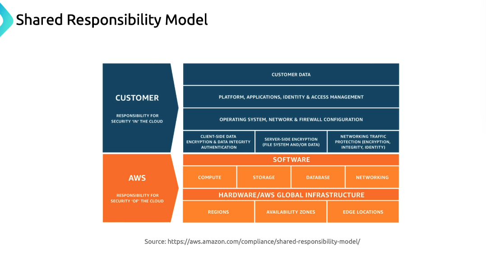

# 🌧️ **Cloud Provider Security**

## 📖 Introduction

### 🔴 Problem

In our Cats and Dogs election simulation, the attacker’s first move—after identifying host IPs—was a port scan. They discovered port 2375 (Docker) wide open, marking an entry point into the host and underlying Kubernetes infrastructure.

  

---

### 🟢 Solution

A simple preventative measure is a network firewall. By filtering traffic based on IP, port, and protocol, you can hide or block open ports on your servers.

  

---

> ⚠️ Warning
>
> Exposed Docker ports (2375) allow unauthenticated remote container management. Always restrict access or enable TLS authentication.

---

## ☁️ **Cloud Provider Security Architecture**

Cloud providers (AWS, Azure, GCP) supply multiple layers of infrastructure security—ranging from firewalls to advanced threat detection, WAFs, and container defenses. Below is an overview of these capabilities.

### 📌 **Threat Management and Response**

All three major cloud platforms offer managed `SIEM`/`SOAR`-style tools for continuous threat monitoring and automated response.

  

### 📌 **Web Application Firewalls (WAF)**

To defend against `OWASP` Top 10 attacks and DDoS, each provider offers a native WAF solution.

  

### 📌 **Container Security**

Container orchestration platforms combine built-in controls with ecosystem tools to enforce runtime and image compliance.

  

---

## 🤝 **Shared Responsibility Model**

Cloud security is a partnership: the provider secures the cloud infrastructure, and you secure your workloads in the cloud.

Every service tier (IaaS, PaaS, SaaS) shifts certain responsibilities. In AWS, for example, customers manage security in the cloud, while AWS handles security of the cloud.

  

  

  

> 📒 Note:
>
> Review the shared responsibility matrix for each cloud provider to ensure you cover all security controls—from networking rules to application hardening.
