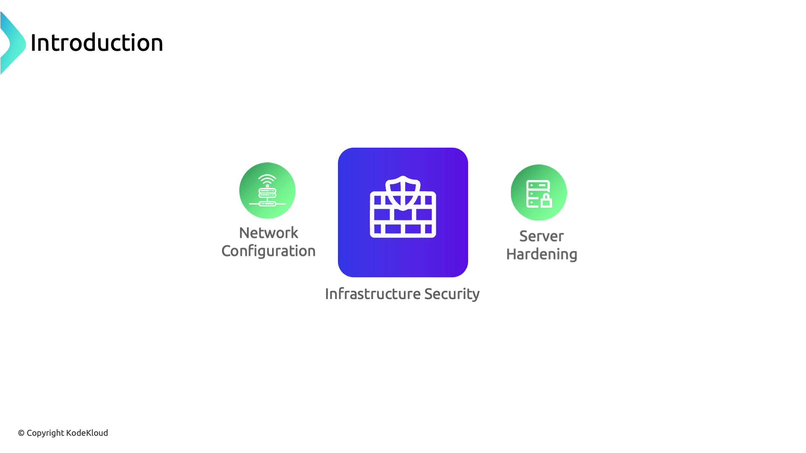

# Infrastructure Security

As we shift from cloud provider security to infrastructure security, we focus on **protecting the underlying compute, network, and storage resources** in a cloud-native environment.  
Infrastructure security covers **network configuration**, **server hardening**, and **access control** to help prevent unauthorized access, lateral movement, and data breaches.

<div align="center" style="background-color:#fff; border-radius: 10px; border: 2px solid">
  
</div>

---

## 📌 **Stage 1: Network Segmentation & API Exposure**

In our attack scenario, the adversary discovers that `vote.com` and `drizzle.com` resolve to the same IP address, revealing a lack of network segmentation that allows one compromised application to threaten the entire host.

<div align="center" style="background-color: #141a19ff;color: #a8a5a5ff; border-radius: 10px; border: 2px solid">

| Vulnerability                      | Risk                                   | Mitigation                                         |
| ---------------------------------- | -------------------------------------- | -------------------------------------------------- |
| Shared IP hosting multiple domains | Compromise of one app exposes all apps | Use VPCs/Subnets or separate servers               |
| Public Kubernetes API endpoint     | Unrestricted API discovery and access  | Remove public IP, enforce VPN or private endpoints |

</div>

### 🎯 Key Mitigations

- Isolate applications in distinct networks or VPC subnets.
- Remove or restrict the Kubernetes API server’s public IP.
- Implement firewall rules and network access control lists (ACLs).

---

## 📌 **Stage 2: Securing Docker Daemon Access**

After identifying the host, the attacker scans open ports and finds Docker’s default remote port (2375) exposed without TLS:

```bash
zsh port-scan.sh 104.21.63.124
...
2375 for docker...   Success
```

Without proper network controls, this allows remote container management and further lateral movement.

> 📒 **Note:**
>
> Apply network policies or cloud firewall rules at the host level to restrict Docker daemon access to trusted IPs or management subnets.

### 🎯 Key Mitigations

- Use host-based firewalls (e.g., iptables, ufw) to block port 2375.
- Enable TLS authentication on the Docker daemon (--tlsverify).
- Apply Kubernetes NetworkPolicies to restrict Pod-to-Pod and Pod-to-Host traffic.

---

## 📌 **Stage 3: Least Privilege & RBAC Enforcement**

Leveraging a vulnerable privileged container (RDKALV), the attacker gains root on the node. A publicly accessible Kubernetes Dashboard then provides full cluster visibility and control.

### 🎯 Best Practices

- Enforce the principle of least privilege: run containers with non-root users and minimal capabilities.
- Secure the Kubernetes Dashboard with RBAC and authentication mechanisms.
- Rotate service account tokens and limit scope using RBAC rules.

---

## 📌 **Stage 4: Secure Management of Secrets & etcd**

The attacker extracts database credentials from plain-text environment variables in a compromised Pod. Storing sensitive data securely is critical.

### 🎯 Key Mitigations

- Use Kubernetes Secrets to encrypt sensitive values at rest.
- Enable encryption providers for etcd data following etcd encryption documentation.
- Enforce TLS authentication for etcd client-server and peer communication.
- Apply tight RBAC rules to etcd access.

> 📒 **Note:**
>
> In managed Kubernetes services, direct etcd access is usually abstracted. Review your provider’s security controls and backup strategies to ensure data durability and confidentiality.

---

## 🏁 **Summary**

1. Segment critical workloads into separate networks or servers.
1. Block or secure Docker daemon ports with TLS and host-based firewalls.
1. Apply least-privilege principles and lock down the Kubernetes Dashboard with RBAC.
1. Store all secrets in Kubernetes Secrets and encrypt etcd data at rest.
1. Use TLS for etcd communication and enforce strict RBAC policies.
