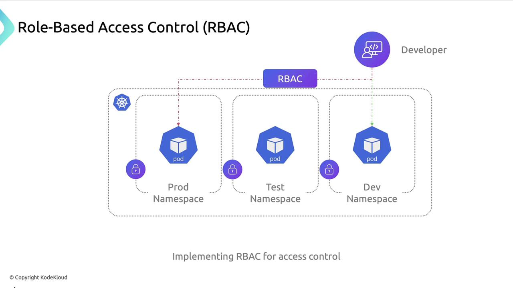
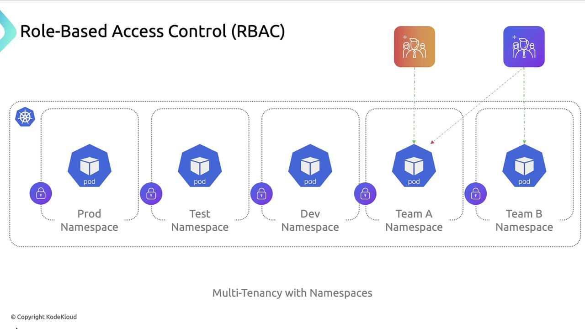
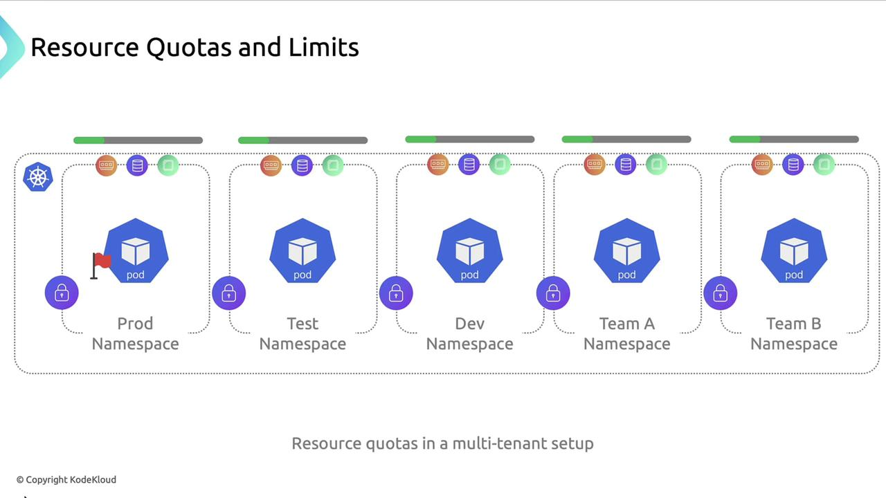

# 🔐 **Kubernetes Isolation Techniques**

Ensuring robust isolation within Kubernetes clusters is crucial for maintaining security and stability across production (prod), development (dev), and testing (test) environments. In multi-tenant clusters, proper isolation prevents one team’s workload from impacting another. This guide walks through five key isolation strategies.

## 📌 **1. Namespace Separation**

Namespaces partition cluster resources and faults, enabling logical separation and multitenancy. By isolating environments into distinct namespaces, you limit blast radius and simplify resource management.

Each team or project operates independently within its own namespace.

---

## 📌 **2. Network Policies**

**By default, Pods can communicate across namespaces without restriction**.  
Kubernetes **NetworkPolicy resources** let you define fine-grained **ingress** and **egress** rules.

**Example: Allow only Pods in the prod namespace to receive ingress traffic from peers within prod:**

```yaml
apiVersion: networking.k8s.io/v1
kind: NetworkPolicy
metadata:
  name: allow-internal-prod-namespace
  namespace: prod
spec:
  podSelector: {} # Select all Pods in prod
  policyTypes:
    - Ingress
  ingress:
    - from:
        - podSelector: {} # Only Pods in the same namespace
```

<div align="center" style="background-color: #141a19ff;color: #a8a5a5ff; border-radius: 10px; border: 2px solid">

| Field         | Description                        |
| ------------- | ---------------------------------- |
| `podSelector` | Targets all Pods in a namespace    |
| `policyTypes` | Specifies Ingress, Egress, or both |
| `ingress`     | Defines allowed incoming sources   |

</div>

---

## 📌 **3. Role-Based Access Control (RBAC)**

RBAC enforces the principle of least privilege, reducing accidental or malicious changes. Define Roles and RoleBindings to grant only the permissions required.

<div align="center" style="background-color:#fff; border-radius: 10px; border: 2px solid">
  
</div>

**Example use cases:**

- Developers: read-only access to prod
- Developers: full access to dev

**In multi-tenant clusters, RBAC isolates teams:**

<div align="center" style="background-color: #141a19ff;color: #a8a5a5ff; border-radius: 10px; border: 2px solid">

| Role         | Namespace | Permissions                  |
| ------------ | --------- | ---------------------------- |
| `dev-reader` | `prod`    | `get`, `list`                |
| `dev-admin`  | `dev`     | `create`, `delete`, `update` |

</div>

---

<div align="center" style="background-color:#fff; border-radius: 10px; border: 2px solid">
  
</div>

---

## 📌 **4. Resource Quotas and Limits**

**ResourceQuotas** **control overall resource consumption** `per namespace`.  
Pod-level resource **requests** and **limits** prevent individual workloads from exhausting CPU or memory.

<div align="center" style="background-color:#fff; border-radius: 10px; border: 2px solid">
  
</div>

**Example ResourceQuota:**

```yaml
apiVersion: v1
kind: ResourceQuota
metadata:
  name: team-a-quota
  namespace: team-a
spec:
  hard:
    requests.cpu: "4"
    requests.memory: "8Gi"
    limits.cpu: "8"
    limits.memory: "16Gi"
```

<div align="center" style="background-color: #141a19ff;color: #a8a5a5ff; border-radius: 10px; border: 2px solid">

| Quota Type      | Purpose                                 |
| --------------- | --------------------------------------- |
| `requests.cpu`  | Guaranteed CPU resources per namespace  |
| `limits.memory` | Maximum memory usage for that namespace |

</div>

---

## 📌 **5. Security Context**

**By default, containers may run as root**, which heightens risk if compromised. Use a **securityContext** to enforce **non-root execution** and **restrict privileges**.

```yaml
apiVersion: v1
kind: Pod
metadata:
  name: backend-pod
  namespace: dev
spec:
  securityContext:
    runAsUser: 1000
    runAsGroup: 3000
    fsGroup: 2000
  containers:
    - name: backend-container
      image: nginx:latest
      securityContext:
        allowPrivilegeEscalation: false
```

> 🚨 Notes:  
> Always verify that your container images support non-root users and drop unnecessary Linux capabilities.

---

## 🔐 Kubernetes Security Techniques Summary

<div align="center" style="background-color: #141a19ff;color: #a8a5a5ff; border-radius: 10px; border: 2px solid">

| Technique                 | Benefit                                         |
| ------------------------- | ----------------------------------------------- |
| Namespace Separation      | Logical isolation and resource partitioning     |
| Network Policies          | Fine-grained pod-to-pod communication control   |
| Role-Based Access Control | Least-privilege access management               |
| Resource Quotas & Limits  | Prevent resource monopolization                 |
| Security Contexts         | Enforce non-root execution and capability drops |

</div>
