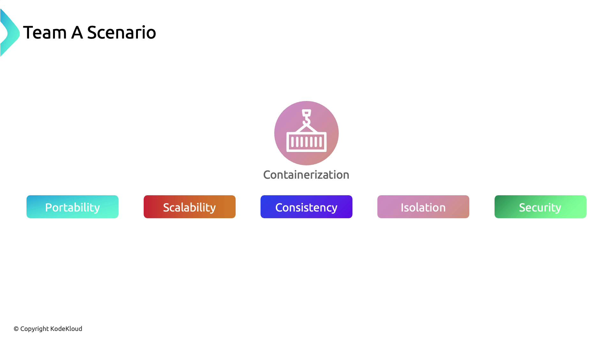
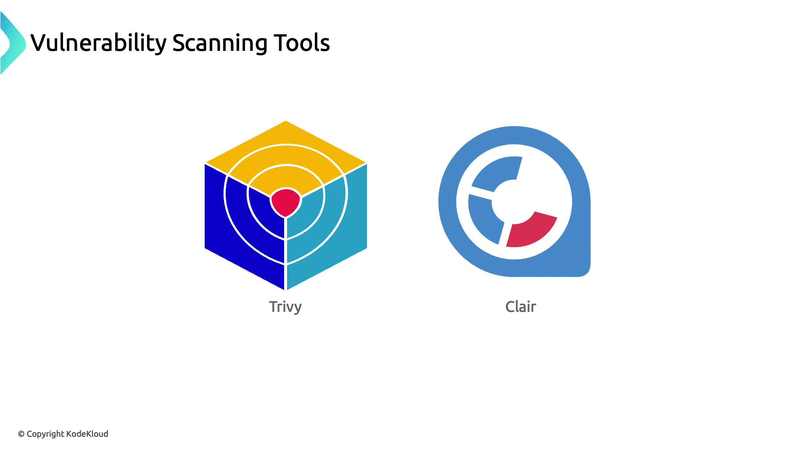
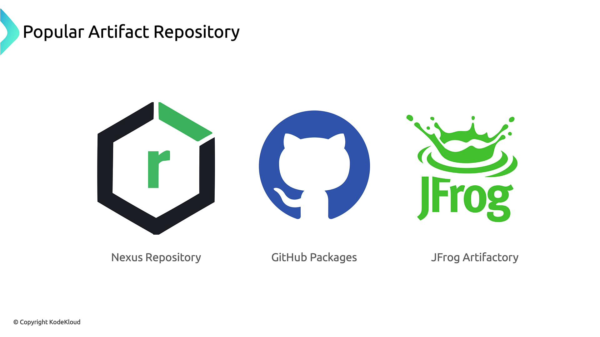

# 🛡️ **Artifact Repository & Image Security**

The topic speaks about **how to securely manage container images throughout the software development lifecycle**, using a real-world scenario from Team A’s CRM application.  
It’s structured around a journey from containerization benefits to security pitfalls, and then to best practices for image hygiene and artifact storage.

## ⁉️ **Why Team A Chose Containerization**

Team A containerized their CRM application to unlock:

- ✨ **Portability**: Run anywhere—cloud, on-prem, edge
- ✨ **Scalability**: Horizontal scaling with orchestration
- ✨ **Consistency**: Same image across dev, test, prod
- ✨ **Isolation**: Process and filesystem separation
- ✨ **Security**: Reduced host exposure, controlled runtime

> _Scenario visual_: CRM container lifecycle showing benefits like portability, isolation, and consistency.

<div align="center" style="background-color:#fff; border-radius: 10px; border: 2px solid">
  
</div>

---

## ⚠️ **The Pitfall: Untrusted Base Images**

Team A <u title="تسرع فى نشر">rushed</u> deployment using a `latest`-tagged image from Docker Hub without vetting its origin or patch status.

- ✅ Container launched successfully
- ❌ CRM <u title="تدهورت">degraded</u> over time—instability, performance issues
- 🔍 Root cause: Unpatched CVEs in the base image

> _Visual cue_: Docker logo under magnifying glass labeled “Known Vulnerabilities” with a bug icon.

### 🔥 Why `latest` Is Dangerous

- Maintainers can reassign `latest` arbitrarily
- No guarantee of security patches
- False sense of freshness

```bash
# Not safe by default
docker pull nginx:latest
```

---

## 🧪 **Mitigation: CI/CD Vulnerability Scanning**

Team A integrated automated image scanning into their pipeline:

### 🔍 Trivy: Fast, Lightweight Scanner

```bash
trivy image --severity HIGH,CRITICAL team-a/crm:stable
```

### 🧠 Clair: Static Vulnerability Analysis

```bash
clair-scanner --ip $(hostname -I | awk '{print $1}') team-a/crm:stable
```

<div align="center" style="background-color: #141a19ff;color: #a8a5a5ff; border-radius: 10px; border: 2px solid">

| Scanner | Description               | Command Example                        |
| ------- | ------------------------- | -------------------------------------- |
| Trivy   | Lightweight, fast scanner | `trivy image <image>`                  |
| Clair   | Static analysis engine    | `clair-scanner --ip <host-ip> <image>` |

</div>

---

> _Visual_: Logos of Trivy and Clair with command snippets.

---

<div align="center" style="background-color:#fff; border-radius: 10px; border: 2px solid">
  
</div>

---

## 🧼 **Remediation: Minimal, Official Base Images**

After remediating all discovered flaws, Team A switched to an officially maintained minimal image (Ubuntu or Alpine). This approach reduces the attack surface and ensures timely security updates.

**Minimal Official Base Images:**

- **Ubuntu (official)** or **Alpine (minimal)**
- Smaller attack surface
- Maintained by trusted vendors

> _Visual_: Ubuntu and Alpine logos under “Minimal Base Image”

---

## 🗳️ **Understanding Build Artifacts**

Any output from your build process—compiled **binaries**, **JAR/WAR files**, **logs**, **reports**, and especially **container images** — counts as a build artifact.

Artifacts include:

- Source code
- Compiled binaries
- JAR/WAR files
- Logs and reports
- **Container images**

> _Diagram_: Icons for each artifact type under “Build Artifact”

---

## 🗄️ **Secure Image Storage: Artifact Repositories**

Securely managing container images requires a centralized artifact repository, which supports your CI/CD workflow and ensures consistent distribution.

<div align="center" style="background-color: #141a19ff;color: #a8a5a5ff; border-radius: 10px; border: 2px solid">

| Repository        | Access Control | Scanning | Image Signing |
| ----------------- | -------------- | -------- | ------------- |
| Docker Hub        | Basic          | ❌       | ❌            |
| Nexus Repository  | Fine-grained   | Add-on   | Limited       |
| GitHub Packages   | Fine-grained   | ✅       | ✅            |
| JFrog Artifactory | Fine-grained   | ✅       | ✅            |

</div>

---

> 🔓 Docker Hub (Default, Limited): While Docker Hub is popular for hosting images, it has limited access controls and no built-in vulnerability scanning.

---

### 🔐 Advanced Repositories

<div align="center" style="background-color:#fff; border-radius: 10px; border: 2px solid">
  
</div>

For stricter compliance, consider:

- Nexus Repository (<https://www.sonatype.com/nexus-repository-oss>)
- GitHub Packages (<https://github.com/features/packages>)
- JFrog Artifactory (<https://jfrog.com/artifactory/>)

---

> 🐸 JFrog Artifactory continuously scans stored images, integrates with vulnerability tools, and can enforce digital signatures to guarantee image authenticity.
>
> - Continuous scanning of stored images
> - Integration with Trivy, Clair, and others
> - Enforces **digital signatures** for authenticity

---

### 🔏 Why Sign Images?

- Detect unauthorized modifications
- Strengthen supply chain integrity
- Ensure trusted provenance
