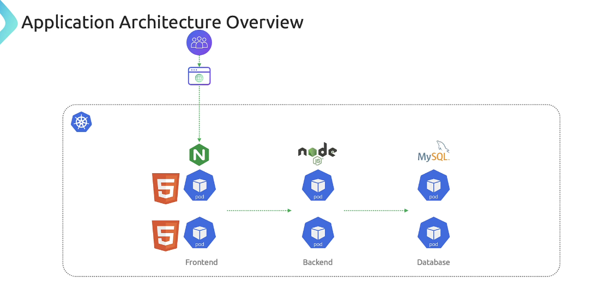
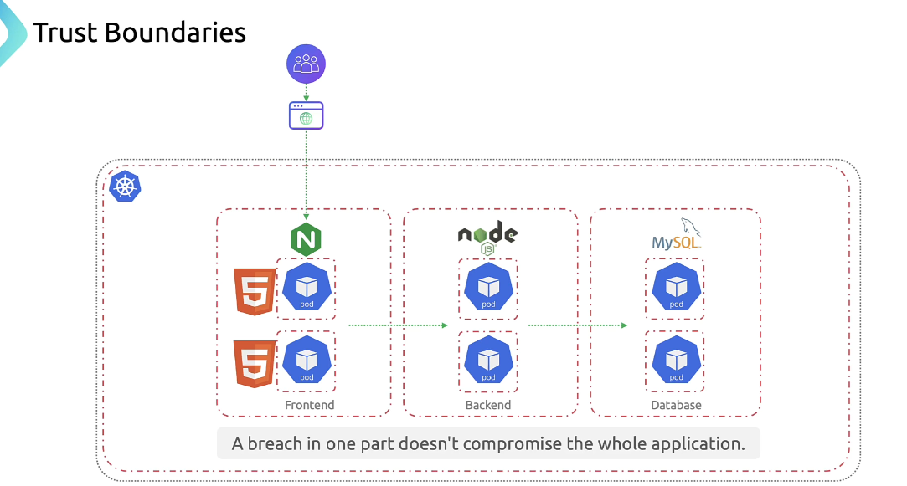

# 🧱 Kubernetes Trust Boundaries & Data Flow: Securing Multi-Tier Applications

This guide walks through how to **secure a multi-tier web application** on Kubernetes by:

- Defining **trust boundaries**
- Mapping **data flow**
- Applying **threat modeling**
- Enforcing **security controls**

We use a realistic setup: **frontend**, **backend**, and **database** — each in its own namespace — to demonstrate how to isolate workloads and reduce blast radius.

---

## 🧭 Application Architecture Overview

Our sample app is composed of three layers:

<div align="center" style="background-color: #141a19ff;color: #a8a5a5ff; border-radius: 10px; border: 2px solid">

| Layer    | Namespace  | Role & Technology                             |
| -------- | ---------- | --------------------------------------------- |
| Frontend | `frontend` | Nginx serving static assets, TLS termination  |
| Backend  | `backend`  | Node.js microservices handling business logic |
| Database | `database` | MySQL storing persistent user data            |

</div>

---

<div align="center" style="background-color:#fff; border-radius: 10px; border: 2px solid">
  
</div>

---

## 🧠 Threat Modeling: Before You Secure, Understand the Risks

Threat modeling helps you **anticipate and mitigate risks** before they reach production.

### 🔍 Process Breakdown

1. **Identify threats**: What could go wrong? (e.g., SQL injection, lateral movement)
2. **Assess impact**: How severe and likely is each threat?
3. **Design countermeasures**: What controls reduce risk?

> _Tip_: Threat modeling is **iterative**. Revisit it whenever architecture changes.

---

## 🔐 Defining Trust Boundaries: Segment to Contain Breaches

Trust boundaries are **logical or physical separations** that prevent attackers from moving freely across your system.

<div align="center" style="background-color:#fff; border-radius: 10px; border: 2px solid">
  
</div>

### 1️⃣ Cluster Boundary

- **Scope**: Entire Kubernetes cluster
- **Controls**: VPC isolation, separate clusters for dev/staging/prod
- **Why it matters**: A misconfigured dev cluster shouldn’t compromise production

### 2️⃣ Node Boundary

- **Scope**: Individual compute nodes
- **Controls**: Harden kubelet, restrict SSH, apply host firewalls
- **Why it matters**: Prevent node-level compromise from spreading

### 3️⃣ Namespace Boundary

- **Scope**: Logical grouping of workloads
- **Controls**: RBAC, NetworkPolicies
- **Why it matters**: Enforce least privilege and isolate teams/services

### 4️⃣ Pod Boundary

- **Scope**: Application instance
- **Controls**: PodSecurityPolicies (PSP/PSA), ingress/egress rules
- **Why it matters**: Prevent lateral movement between pods

> ⚠️ _Warning_: Kubernetes allows **all pod-to-pod traffic by default**. Without NetworkPolicies, attackers can pivot across services.

### 5️⃣ Container Boundary

- **Scope**: Individual container process
- **Controls**: AppArmor, seccomp, minimal base images
- **Why it matters**: Prevent breakout between containers in the same pod

---

## 📊 Trust Boundary Summary Table

<div align="center" style="background-color: #141a19ff;color: #a8a5a5ff; border-radius: 10px; border: 2px solid">

| Trust Boundary | Scope                | Example Controls                        |
| -------------- | -------------------- | --------------------------------------- |
| Cluster        | Entire cluster       | VPC segregation, dedicated clusters     |
| Node           | Single compute host  | Kubelet auth, SSH lockdown, OS patching |
| Namespace      | Logical partition    | RBAC, NetworkPolicies                   |
| Pod            | Application instance | PSP/PSA, ingress/egress rules           |
| Container      | Container process    | AppArmor, seccomp, minimal base images  |

</div>

---

## 🔄 Data Flow: Where to Place Security Controls

Understanding how data moves helps you **apply controls where they matter most**.

### 🔁 Flow Breakdown

1. **User → Frontend (Nginx)**

   - TLS termination
   - Certificate validation
   - Authentication

2. **Frontend → Backend APIs**

   - mTLS or HTTPS
   - API tokens or OAuth

3. **Backend → Database**

   - Encrypted SQL connections
   - Least-privilege DB accounts

4. **Inter-service (microservices)**
   - Cluster network
   - NetworkPolicies restrict traffic paths

> _Visual_: Diagram showing secure data flow across frontend, backend, and database with HTTPS, mTLS, and RBAC.

---

## 🎯 Common Threat Actors

<div align="center" style="background-color: #141a19ff;color: #a8a5a5ff; border-radius: 10px; border: 2px solid">

| Actor                  | Behavior                              |
| ---------------------- | ------------------------------------- |
| External Attackers     | Scan for exposed endpoints            |
| Compromised Containers | Exploit vulnerabilities or misconfigs |
| Malicious Users        | Abuse elevated privileges             |

</div>

---

## ✅ Final Insight: Defense-in-Depth for Kubernetes Workloads

```markdown
- Segment workloads with namespaces and NetworkPolicies
- Harden nodes and containers with runtime policies
- Secure data flow with TLS, mTLS, and RBAC
- Continuously revisit threat models as architecture evolves
```
