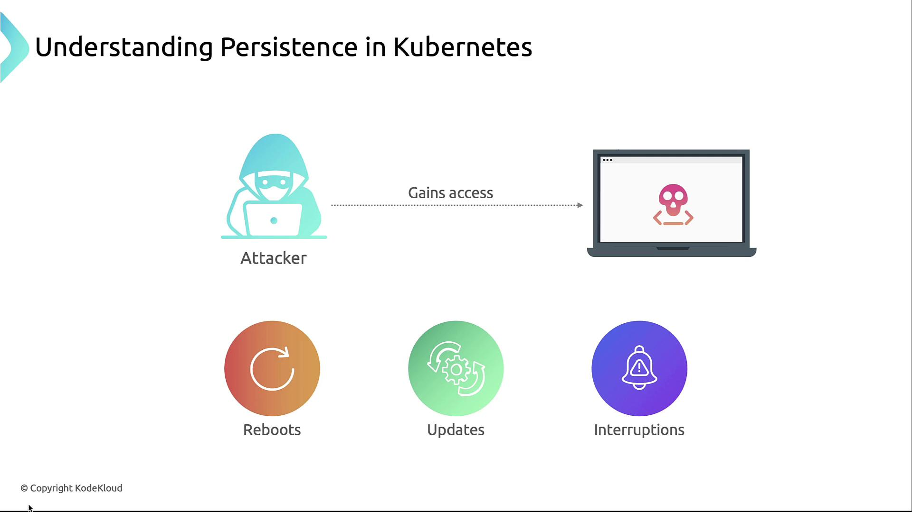
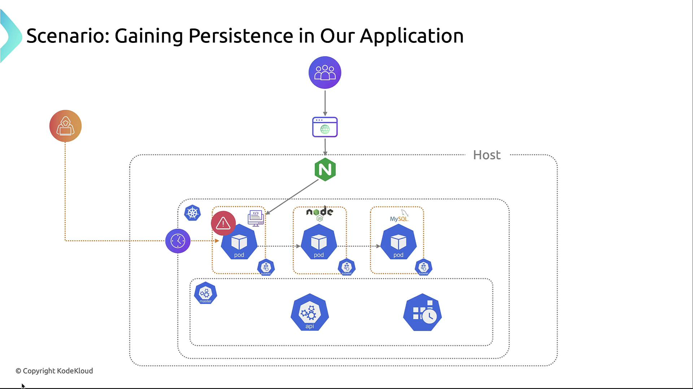
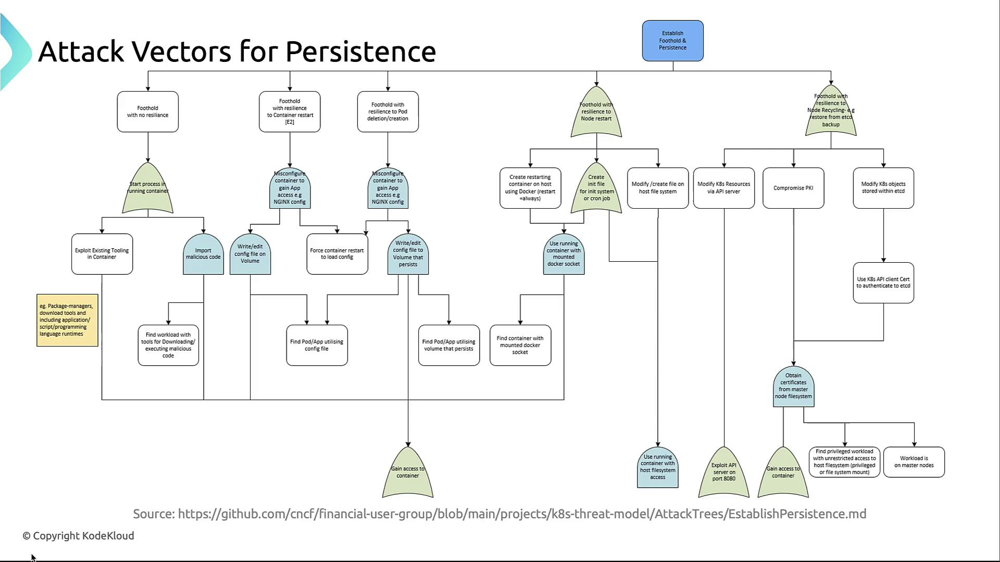

# 🛡️ **Kubernetes Persistence: How Attackers Maintain Access Over Time**

In this lesson, we explore how attackers establish **persistence** in Kubernetes clusters — meaning they can **stay inside your environment** even after you reboot nodes, restart pods, or apply updates. This is one of the most dangerous phases of an attack, because it allows the attacker to **survive your cleanup efforts** and continue exfiltrating data or hijacking resources.

---

## 🔍 **What Is Persistence in Kubernetes?**

Persistence in Kubernetes refers to an attacker’s ability to **remain in a compromised environment** despite:

- Pod restarts
- Node reboots
- Configuration changes
- Image updates
- Cluster upgrades

This is usually achieved by **planting backdoors**, **modifying persistent volumes**, or **abusing Kubernetes resources** like Secrets, service accounts, or privileged workloads.

<div align="center" style="background-color:#fff; border-radius: 10px; border: 2px solid">
  
</div>

---

## 🧪 **Example Scenario: Multi-Tier Web App**

Let’s say you have a typical 3-tier application:

- **Frontend**: NGINX serving static content
- **Backend**: Node.js microservices handling business logic
- **Database**: MySQL storing user data

All components run in Kubernetes pods. An attacker exploits a vulnerability in the Node.js container. Once inside, they don’t just steal data — they try to **stay**. That’s persistence.

<div align="center" style="background-color:#fff; border-radius: 10px; border: 2px solid">
  
</div>

---

## 🧭 **Attack Vectors for Persistence**

The CNCF Financial Services User Group defines **five levels of persistence** based on how resilient the attacker’s foothold is:

| Vector ID | Name                                          | Description                                                 |
| --------- | --------------------------------------------- | ----------------------------------------------------------- |
| 1         | Foothold with No Resilience                   | Access lost on pod restart                                  |
| 2         | Foothold with Resilience to Container Restart | Survives pod restarts via volumes or configs                |
| 3         | Foothold with Resilience to Node Restart      | Survives node reboots via host-level changes                |
| 4         | Foothold via Kubernetes API & PKI             | Uses stolen tokens or certificates to control the cluster   |
| 5         | Leveraging Privileged Workloads               | Uses privileged pods to access the host and break isolation |

Let’s break each one down.

---

<div align="center" style="background-color:#fff; border-radius: 10px; border: 2px solid">
  
</div>

---

### 🔹 1. Foothold with No Resilience

This is the **weakest form of persistence** — the attacker is inside a container, but their access disappears when the pod is deleted or restarted.

**Techniques:**

- **Run a malicious process** inside the container (e.g., reverse shell)
- **Use built-in tools** like `apt`, `pip`, or `node` to download and execute payloads
- **Container hopping**: Scan the cluster for other pods with similar runtimes and try to move laterally

> This is often the first step after a breach. If the attacker doesn’t escalate or persist, they’ll be wiped out by a simple pod restart.

---

### 🔹 2. Foothold with Resilience to Container Restart

Here, the attacker **modifies persistent data** so that even if the container restarts, their changes survive.

**Techniques:**

- **Modify config files** stored on a PersistentVolumeClaim (PVC). For example, change NGINX config to proxy traffic to a malicious server.
- **Trigger a pod restart** to reload the modified config:

```bash
kubectl rollout restart deployment/nginx
```

> This is more dangerous because the attacker’s changes are stored **outside the container**, on a volume that persists across restarts.

---

### 🔹 3. Foothold with Resilience to Node Restart

This is a **host-level compromise**. The attacker escapes the pod and modifies the node directly.

**Techniques:**

- **Run containers directly on the host** with `--restart=always` so they relaunch after reboots
- **Modify init scripts** like `/etc/rc.local` or create **cron jobs** in `/etc/cron.d/`
- **Drop binaries or scripts** into host directories like `/usr/local/bin` or `/etc/systemd/system/`

> ⚠️ This bypasses Kubernetes entirely. Even if you delete the pod or namespace, the attacker’s code runs on the host.

---

### 🔹 4. Foothold via Kubernetes API & PKI

This is a **control-plane level compromise**. The attacker steals credentials that let them talk to the Kubernetes API directly.

**Techniques:**

- **Steal service account tokens** from inside pods (usually found at `/var/run/secrets/kubernetes.io/serviceaccount`)
- **Extract or forge client certificates** to impersonate cluster admins
- **Use kubectl or API calls** to create new pods, secrets, or roles

> This gives the attacker **cluster-wide control** — they can create new backdoors, exfiltrate secrets, or modify workloads.

---

### 🔹 5. Leveraging Privileged Workloads

Some pods are configured with **elevated privileges** — attackers can abuse these to escape the container sandbox.

**Techniques:**

- Use pods with `securityContext.privileged: true`
- Mount host directories using `hostPath`, e.g.:

```yaml
volumeMounts:
  - mountPath: /host
    name: host-volume
volumes:
  - name: host-volume
    hostPath:
      path: /
```

> This allows the attacker to **read or write to the host filesystem**, modify kubelet state, or install rootkits.

---

## 🛡️ **Defenses Against Persistence**

Persistence is hard to detect and harder to remove. You need **multiple layers of defense**:

---

### 1. 🔐 Role-Based Access Control (RBAC)

- Grant **least privilege** to service accounts
- Avoid giving `cluster-admin` unless absolutely necessary
- Regularly **audit Role and ClusterRoleBindings**

> _Visual_: Diagram showing RBAC boundaries across frontend, backend, and database namespaces

---

### 2. 🔑 Secrets Management

- Store credentials in **Kubernetes Secrets**
- Mount secrets only into the pods that need them
- Rotate secrets regularly

> _Visual_: Diagram showing secrets scoped to specific pods and namespaces

---

### 3. 🧱 Pod Security Standards

- Enforce **Pod Security Admission (PSA)** or legacy **PodSecurityPolicies (PSP)**
- Disallow:
  - `privileged: true`
  - `hostPath` mounts
- Set `readOnlyRootFilesystem: true` where possible

> _Visual_: Icon of a locked container with PSA/PSP labels

---

### 4. 🔄 Regular Updates & Patching

- Use tools like **Trivy** or **Clair** to scan images
- Automate base image updates:

```bash
kubectl set image deployment/nginx nginx=nginx:1.21.6
```

- Patch nodes and containers regularly

> _Visual_: Timeline showing regular patch cycles and image updates

---

### 5. 📈 Monitoring & Auditing

- Centralize logs using **EFK** (Elasticsearch, Fluentd, Kibana) or **Loki/Grafana**
- Alert on:
  - New privileged pods
  - Unexpected restarts
  - RBAC changes
- Review audit logs:

```bash
kubectl logs -n kube-system
```

> _Visual_: Dashboard showing alerts for suspicious activity

---

## 🧠 **Final Thoughts**

Persistence is what turns a one-time breach into a **long-term compromise**. Attackers don’t just want access — they want to stay. Your job is to:

- Detect their footholds
- Remove their implants
- Harden your cluster to prevent re-entry
