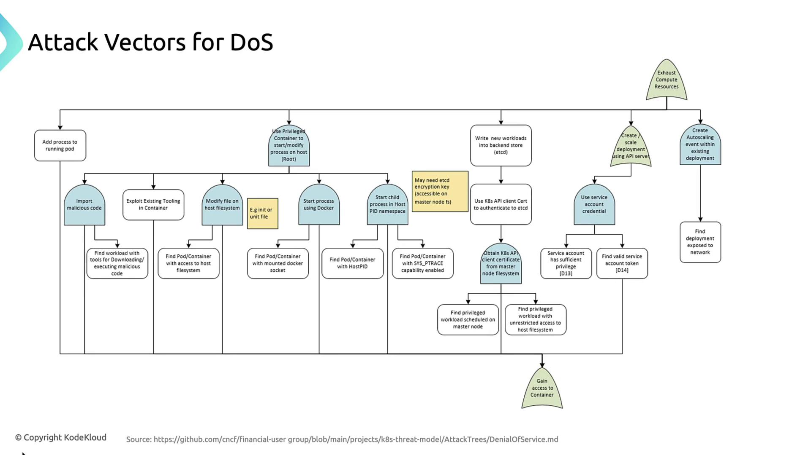

# 🚨 Denial-of-Service in Kubernetes: How Attackers Overload Your Cluster

This guide explains how attackers launch **DoS attacks** against Kubernetes clusters, what tactics they use, and how to defend against them. We’ll walk through real-world examples using a multi-tier web app and show how to keep your environment resilient.

---

## 🧠 What Is a DoS Attack?

A **Denial-of-Service (DoS)** attack tries to **exhaust system resources** so that legitimate workloads can’t run. In Kubernetes, this means:

- Overloading CPU or memory
- Spamming the API server
- Breaking pod-to-pod networking
- Disrupting etcd or the scheduler

---

## 🔍 CNCF-Defined DoS Attack Vectors

The Cloud Native Computing Foundation (CNCF) outlines four major ways attackers can cause DoS:

<div align="center" style="background-color: #141a19ff;color: #a8a5a5ff; border-radius: 10px; border: 2px solid">

| Attack Vector              | Description                                                        |
| -------------------------- | ------------------------------------------------------------------ |
| Add processes to a pod     | Spawn CPU/memory-heavy processes inside a compromised container    |
| Privileged container abuse | Use `--privileged` to access host, Docker socket, or PID namespace |
| Direct etcd writes         | Inject workload specs directly into etcd using stolen credentials  |
| API-server scaling abuse   | Create or scale deployments to flood the cluster with pods         |

</div>

---

<div align="center" style="background-color:#fff; border-radius: 10px; border: 2px solid">
  
</div>

---

## 🧪 Real-World Examples

### 1️⃣ Adding Processes to a Running Pod

If an attacker can `exec` into a pod, they can run a command like:

```bash
kubectl exec -it compromised-pod -- sh -c "yes > /dev/null &"
```

This spawns a process that **consumes CPU endlessly**, crashing the pod or starving other containers.

---

### 2️⃣ Privileged Container Exploits

A container running with `privileged: true` can:

- Mount the host filesystem (`/`)
- Run Docker commands via `/var/run/docker.sock`
- Enter the host PID namespace and kill processes
- Download and run malware using `curl`, `wget`, or package managers

> ⚠️ Privileged containers bypass Kubernetes isolation. Use them only when absolutely necessary and audit them regularly.

---

### 3️⃣ Direct etcd Key-Value Manipulation

If an attacker steals a **client certificate** or **service account token**, they can write directly to etcd:

- Create fake workloads
- Inflate replica counts
- Bypass RBAC and admission controllers

This forces the scheduler to **spin up thousands of pods**, overwhelming the cluster.

---

### 4️⃣ API Server Abuse for Scaling

With API access, an attacker can:

- Create new deployments or jobs
- Increase replica counts on existing workloads
- Trigger HorizontalPodAutoscalers by simulating load

This leads to **excessive pod creation**, draining resources.

---

## 🌐 Network-Based DoS Tactics

<div align="center" style="background-color: #141a19ff;color: #a8a5a5ff; border-radius: 10px; border: 2px solid">

| Tactic                | Impact                                                           |
| --------------------- | ---------------------------------------------------------------- |
| Resource Exhaustion   | Flood kubelets or proxies to crash nodes                         |
| Scheduling Disruption | Spam the API server or scheduler with bogus requests             |
| Network Disruption    | Poison DNS or tamper with CNI plugins to break pod communication |

</div>

---

### 🧪 Example: Compromised Service Account

```bash
for i in {1..1000}; do
  kubectl --token=$STOLEN_TOKEN run attack-pod-$i \
    --image=busybox --restart=Never
done
```

Without resource quotas, this **exhausts CPU and memory** across the cluster.

---

### 🧪 Example: API Server Flooding

```bash
while true; do
  curl -k https://api.k8s.example.com:6443/version &
done
```

This floods the API server with requests, **slowing down or crashing control-plane components**.

---

## 🛡️ Mitigation Strategies

### 1. 🧮 Resource Quotas and Limits

Limit how many resources each pod or namespace can use:

```yaml
apiVersion: v1
kind: ResourceQuota
metadata:
  name: namespace-quota
  namespace: default
spec:
  hard:
    pods: "10"
    requests.cpu: "2"
    requests.memory: "4Gi"
    limits.cpu: "4"
    limits.memory: "8Gi"
```

And per-pod limits:

```yaml
resources:
  requests:
    memory: "256Mi"
    cpu: "250m"
  limits:
    memory: "512Mi"
    cpu: "500m"
```

---

### 2. 🔐 Least-Privilege Service Accounts

Use RBAC to restrict what service accounts can do:

```yaml
apiVersion: v1
kind: ServiceAccount
metadata:
  name: backend-sa
  namespace: default
---
apiVersion: rbac.authorization.k8s.io/v1
kind: Role
metadata:
  name: backend-read-only
  namespace: default
rules:
  - apiGroups: [""]
    resources: ["pods", "services", "configmaps"]
    verbs: ["get", "list"]
```

---

### 3. 🌐 Network Policies & Firewalls

Restrict access to the API server and etcd:

```yaml
apiVersion: networking.k8s.io/v1
kind: NetworkPolicy
metadata:
  name: restrict-api-access
  namespace: kube-system
spec:
  podSelector:
    matchLabels:
      component: kube-apiserver
  policyTypes:
    - Ingress
  ingress:
    - from:
        - namespaceSelector:
            matchLabels:
              trusted: "true"
        - podSelector:
            matchLabels:
              access: api-server
      ports:
        - protocol: TCP
          port: 6443
```

---

### 4. 📈 Monitoring and Alerts

Use Prometheus and Grafana to detect spikes:

```yaml
apiVersion: monitoring.coreos.com/v1
kind: PrometheusRule
metadata:
  name: dos-alert-rules
  namespace: monitoring
spec:
  groups:
    - name: dos-alerts
      rules:
        - alert: HighCPUUsage
          expr: sum(rate(container_cpu_usage_seconds_total[5m])) by (namespace) > 0.8
          for: 5m
          labels:
            severity: warning
          annotations:
            summary: "High CPU usage detected"
            description: "Namespace {{ $labels.namespace }} CPU usage >80%. Possible DoS attack."
```

> Regularly review alerts and integrate them into your incident response workflow.
