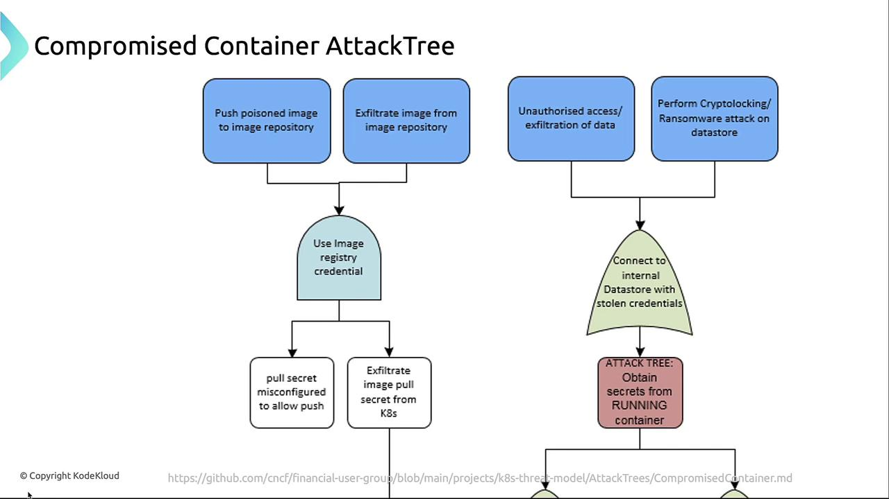

# 🧨 Compromised Applications in Containers: From App Flaw to Cluster Breach

Containers are designed to isolate workloads — but if an attacker compromises one application, they can often **pivot** to compromise the entire Kubernetes cluster. This guide walks through how that happens and how to stop it.

---

<div align="center" style="background-color:#fff; border-radius: 10px; border: 2px solid">
  
</div>

---

## 🧪 Attack Scenario: From App Bug to Cluster Control

Imagine a backend service (e.g., Node.js) with a vulnerability — maybe an outdated dependency or a misconfigured endpoint. An attacker exploits it and gains **shell access inside the container**.

From there, they:

1. Explore the container’s environment
2. Extract secrets or tokens
3. Abuse the Kubernetes API
4. Move laterally to other pods or namespaces
5. Escalate privileges and persist

> _Visual_: Diagram showing attacker entering a container, accessing secrets, and interacting with the API server.

---

## 🌲 Compromised Container Attack Tree

Here are the main attack vectors once the attacker is inside:

| Attack Vector        | Description                                                               |
| -------------------- | ------------------------------------------------------------------------- |
| Poisoned Images      | Inject malicious code into a container image and push it to your registry |
| Repository Breach    | Access your image registry to pull images and extract secrets             |
| Data Exfiltration    | Steal API tokens, DB credentials, env vars, or deploy ransomware          |
| Privilege Escalation | Use service account tokens to list secrets, modify configs, or escalate   |

> _Visual_: Flowchart showing attacker branching into image poisoning, data theft, and API abuse.

---

## 🔓 Credential and Secret Misuse

### 1️⃣ Misconfigured Image Pull Secrets

Sometimes, a secret meant only for **pulling images** is misconfigured to allow **push** access. This lets attackers upload backdoored images to your registry.

> ⚠️ Always follow the **principle of least privilege** — never give more access than needed.

---

### 2️⃣ Extracting Secrets from Kubernetes

Attackers can deploy a malicious pod that **mounts existing secrets**. Once the pod runs, it can read:

- Environment variables
- Mounted service account tokens
- Database credentials

---

### 3️⃣ Attaching to a Running Container

If RBAC allows it, an attacker can run:

```bash
kubectl exec -it <pod-name> -- /bin/sh
```

This gives them a shell inside the container, where they can:

- Read `/var/run/secrets/...`
- Dump environment variables
- Explore mounted volumes

---

## 🚀 Escalation via the Kubernetes API

With a valid token (from a service account or user), attackers can:

- **List secrets**:

```bash
kubectl get secrets --all-namespaces
```

- **Modify ConfigMaps**, Deployments, or Services
- **Create new pods** with malicious images
- **Escalate privileges** if RBAC is too permissive (e.g., wildcard verbs or resources)

> This turns a container compromise into **cluster-wide control**.

---

## 🛡️ Best Practices for Prevention

| Practice                   | Description                                                                 |
| -------------------------- | --------------------------------------------------------------------------- |
| Use Minimal Base Images    | Use lightweight, secure images like **distroless** to reduce attack surface |
| Enforce Image Signing      | Use tools like **Cosign** or **Notary** to verify image integrity           |
| Rotate Secrets Regularly   | Avoid long-lived credentials; automate secret rotation                      |
| Apply Least-Privilege RBAC | Grant only the permissions each service account needs                       |
| Implement Network Policies | Restrict pod-to-pod and pod-to-API server communication                     |

---

## 🔍 Final Note

Regularly **audit your cluster and registries** for unauthorized changes. Use tools like:

- **Kube-bench**: Checks your cluster against CIS benchmarks
- **Clair**: Scans container images for known vulnerabilities
