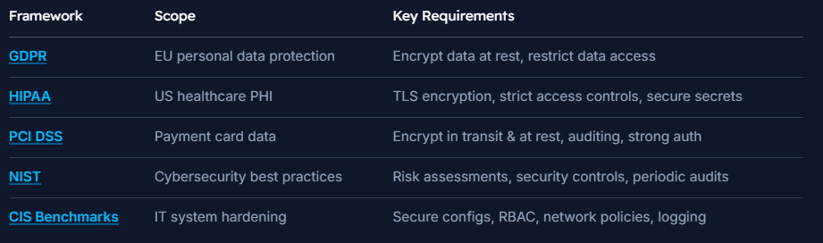
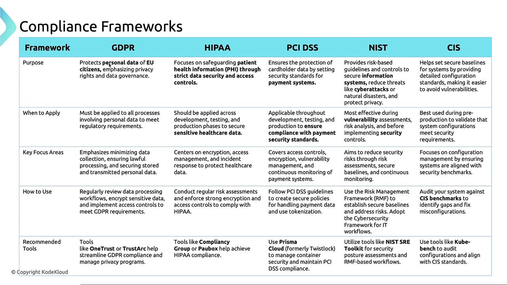

# 📜 **Compliance Frameworks**

Security compliance frameworks are essential for safeguarding sensitive data—personal information, health records, payment details—and ensuring system integrity and legal compliance. Ignoring these guidelines can lead to data breaches, hefty fines, and loss of customer trust. In this lesson, we’ll explore the major frameworks and how they apply to Kubernetes environments.

  

---

  

