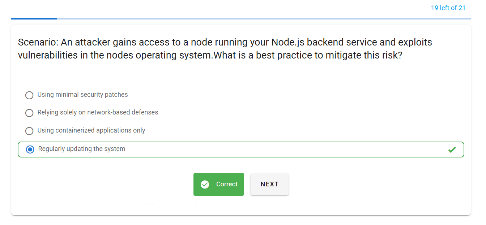
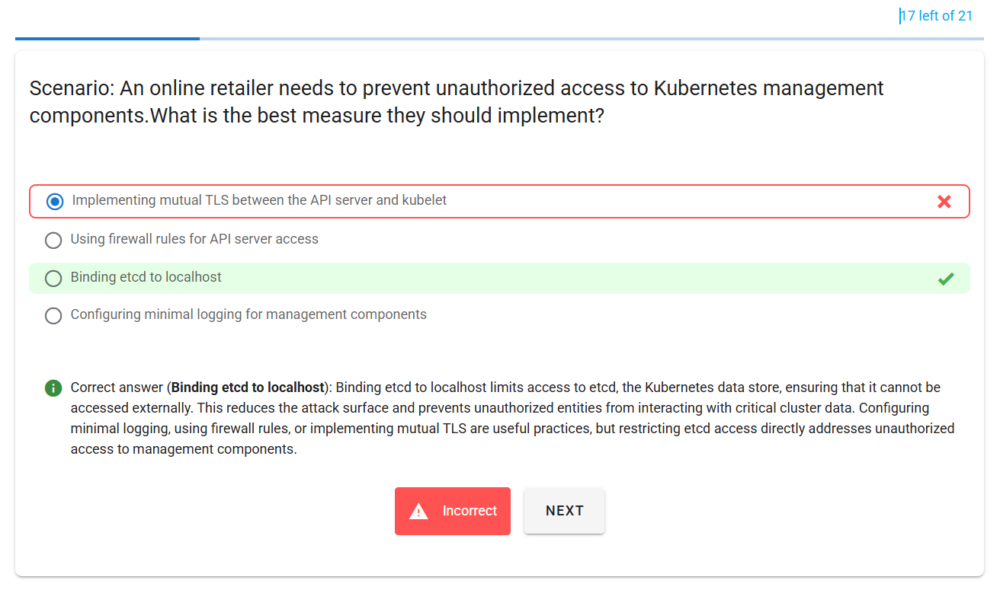
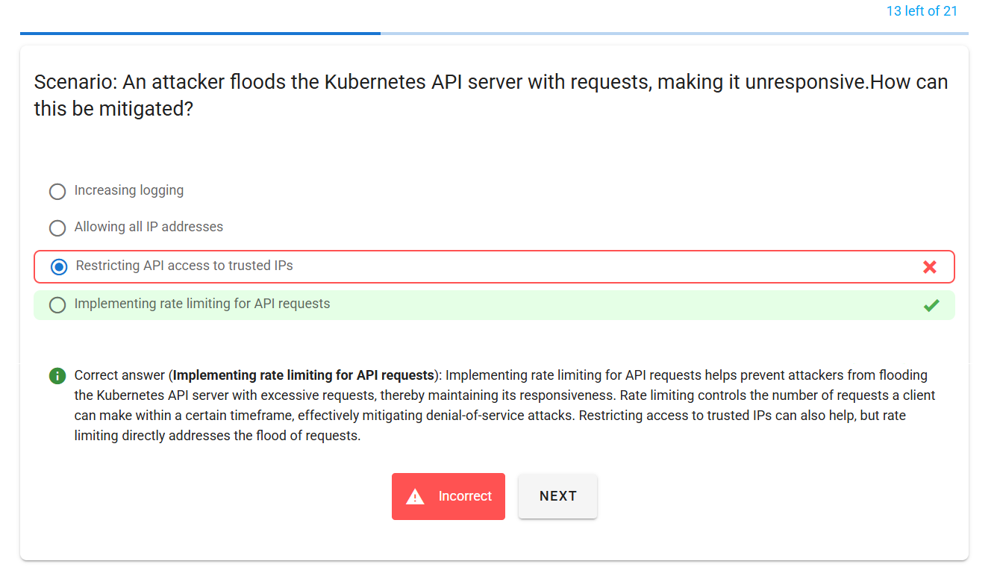
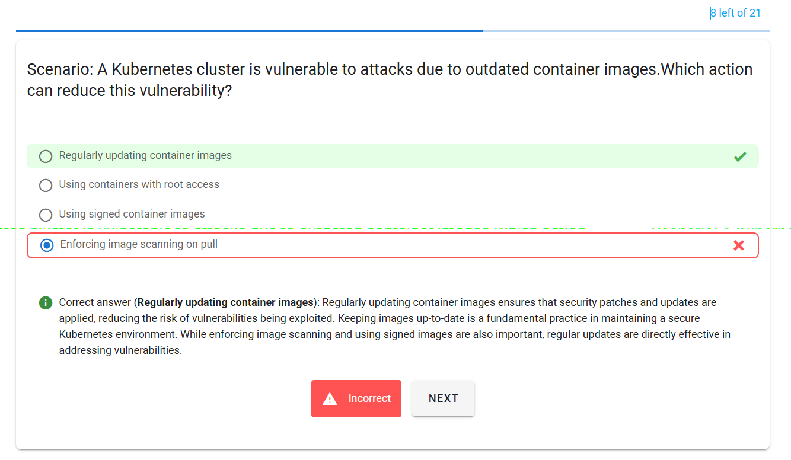
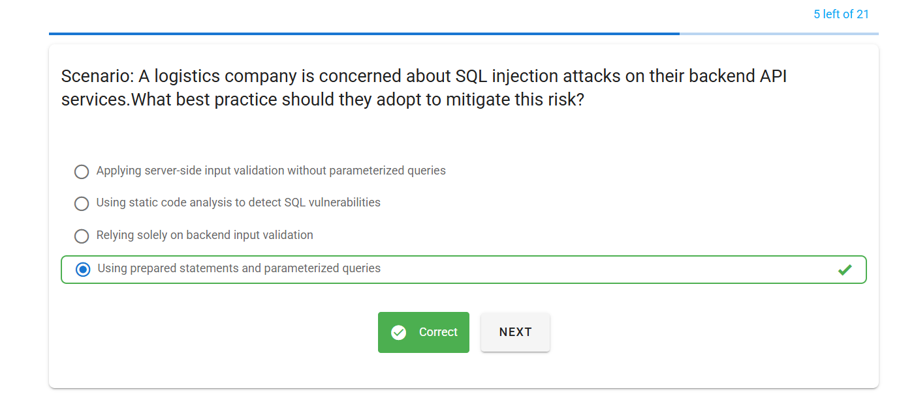
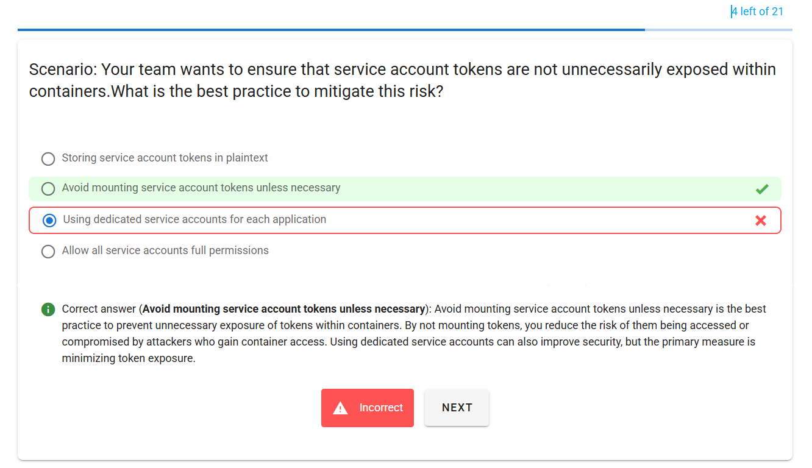
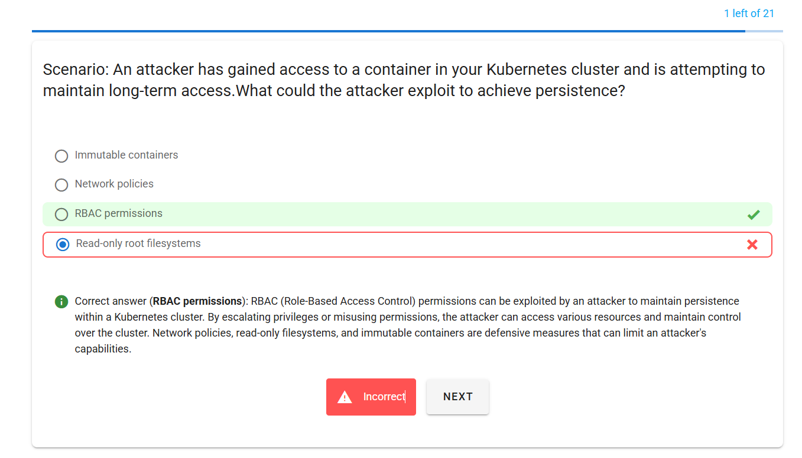
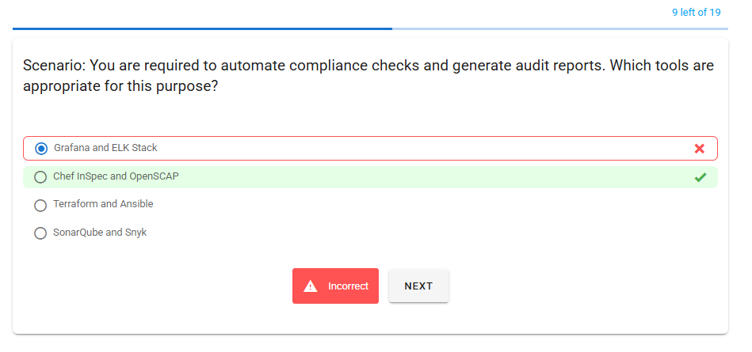
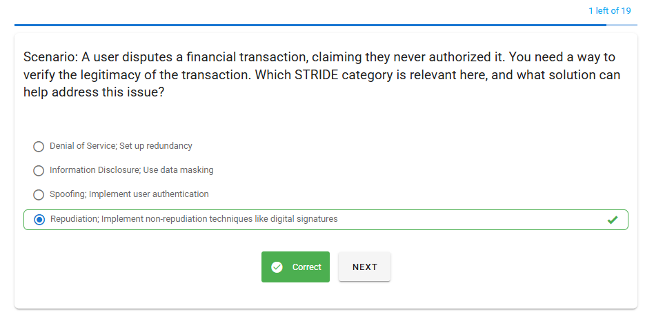

# Lab Questions

## ⁉️ Q1

  

## ⁉️ Q2

  

## ⁉️ Q3

  

## ⁉️ Q4

  

- <https://www.youtube.com/watch?v=p5gqe5bNXXU>
- <https://www.youtube.com/watch?v=ZMNUazoGwdk>
- <https://www.youtube.com/watch?v=HLb1Q086u6M>

## ⁉️ Q5

  

## ⁉️ Q7

  

---

## ⁉️ Q8

  

---

## ⁉️ Q9

  

---

## ⁉️ Q10

  

---

## ⁉️ Q11

  

---

## ⁉️ Q12

  

---

## ⁉️ Q13

  

---

## ⁉️ Q14

  

---

## ⁉️ Q15

  

