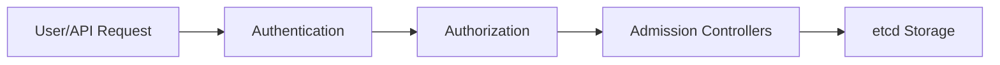

Perfect timing — this is **one of the trickiest KCNA governance/security questions** because it tests your understanding of Kubernetes architecture evolution. Let’s break it down cleanly 👇

---

## 🧠 Question Recap

> In Kubernetes, what is the **recommended successor to PodSecurityPolicies (PSP)** for enforcing fine-grained security policies?

✅ **Correct Answer:**
**Kubernetes Admission Controllers**

---

## 🚨 Why PSP Was Removed

**PodSecurityPolicies (PSPs)** were used to define what pods *could or couldn’t do* (e.g., run as root, use host networking).
However, PSPs were:

* Complex to configure
* Hard to manage cluster-wide
* Frequently misused
  So they were **deprecated in Kubernetes v1.21** and **removed in v1.25**.

---

## 🧩 What Replaced PSPs

The **Pod Security Admission (PSA)** mechanism replaced PSP, built on top of **Admission Controllers** — which are now the **recommended enforcement point**.

---

## ⚙️ What Are Kubernetes Admission Controllers?

### 🔹 Definition

> **Admission Controllers** are **plug-ins** that intercept requests to the **Kubernetes API server** **after authentication and authorization**, but **before the object is persisted to etcd**.
> They can **modify**, **validate**, or **reject** API requests.

Think of them as “gatekeepers” that decide what can enter your cluster.

---

### 🧭 Admission Controller Flow



* Authentication → confirms **who** is making the request
* Authorization → checks **what** they can do
* Admission Controllers → check **if it’s safe and compliant**

---

## 🔐 Two Types of Admission Controllers

| Type           | Description                                              | Example                            |
| -------------- | -------------------------------------------------------- | ---------------------------------- |
| **Mutating**   | Can **change or add** fields to the object before saving | Defaulting labels, adding sidecars |
| **Validating** | Can **accept or reject** requests based on rules         | Enforcing security constraints     |

---

## 🧠 Example: Pod Security Admission (PSA)

The PSA Admission Controller enforces **three Pod Security Standards (PSS)**:

| Level          | Description                              |
| -------------- | ---------------------------------------- |
| **Privileged** | No restrictions (for trusted namespaces) |
| **Baseline**   | Prevent known privilege escalations      |
| **Restricted** | Heavily locked down (most secure)        |

You apply them via namespace labels:

```bash
kubectl label namespace dev pod-security.kubernetes.io/enforce=restricted
```

---

## 🧩 Other Common Admission Controllers

| Admission Controller           | Purpose                                                      |
| ------------------------------ | ------------------------------------------------------------ |
| **NamespaceLifecycle**         | Prevent operations in deleted namespaces                     |
| **ResourceQuota**              | Enforce resource limits per namespace                        |
| **LimitRanger**                | Set default CPU/memory requests                              |
| **MutatingAdmissionWebhook**   | For custom automation (e.g., Istio sidecar injection)        |
| **ValidatingAdmissionWebhook** | For policy enforcement tools (e.g., OPA/Gatekeeper, Kyverno) |

---

## 🧱 Summary Table

| Concept                   | Description                                              |
| ------------------------- | -------------------------------------------------------- |
| **PSP**                   | Deprecated Kubernetes built-in pod-level policy          |
| **PSA**                   | Replacement mechanism using admission controllers        |
| **Admission Controllers** | API interceptors that modify/validate cluster operations |
| **Tools built on this**   | OPA Gatekeeper, Kyverno, Pod Security Admission          |

---

✅ **Final Takeaway**

> Kubernetes **Admission Controllers** (specifically **Pod Security Admission**) are the official **successors to PSPs**, used to enforce fine-grained and policy-based security at the API level.

---

Would you like a **30-second visual summary diagram** showing PSP → PSA evolution and where tools like **Kyverno** and **OPA Gatekeeper** fit in? (It’s a top 10 KCNA exam favorite.)
