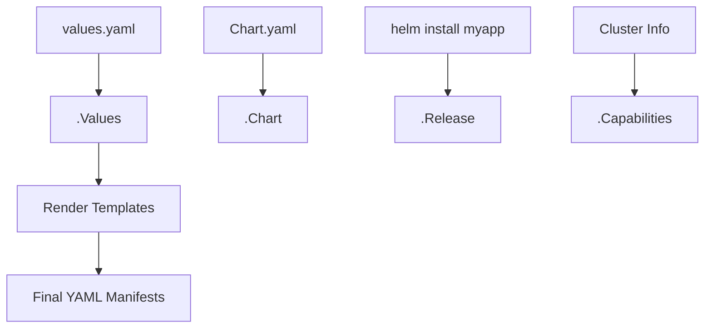

# 🔡 **Helm Built-In Variables**

## 📖 **What Are Built-In Variables?**

When Helm renders your chart, it passes several **predefined objects** into the Go templating engine.

These objects let you:

- Access chart metadata (`.Chart`)
- Get release details (`.Release`)
- Read user values (`.Values`)
- Loop through files or subcharts
- Dynamically build names, labels, or configurations

> Think of these like “pre-loaded global variables” available in every template.

---

## 🧩 **Core Built-In Objects**

<div align="center" style="background-color: #141a19ff;color: #a8a5a5ff; border-radius: 10px; border: 2px solid">

| Object          | Description                             | Example Usage                         |
| --------------- | --------------------------------------- | ------------------------------------- |
| `.Chart`        | Information from `Chart.yaml`           | `.Chart.Name`, `.Chart.Version`       |
| `.Values`       | Values from `values.yaml` and overrides | `.Values.image.repository`            |
| `.Release`      | Info about the Helm release             | `.Release.Name`, `.Release.Namespace` |
| `.Capabilities` | Info about the Kubernetes cluster       | `.Capabilities.KubeVersion`           |
| `.Files`        | Access non-template files               | `.Files.Get("config.json")`           |
| `.Template`     | Info about current template file        | `.Template.Name`                      |
| `.Subcharts`    | Access data from dependent charts       | `.Subcharts.redis.Values.image.tag`   |

</div>

---

## 🧱 1. `.Chart` — Chart Metadata

> Holds all information from your `Chart.yaml`.

**Example `Chart.yaml`:**

```yaml
apiVersion: v2
name: mywebapp
description: A Helm chart for deploying a web app
type: application
version: 0.2.0
appVersion: "1.5.1"
```

**Use inside template:**

```yaml
metadata:
  name: { { .Chart.Name } }
  labels:
    chart: "{{ .Chart.Name }}-{{ .Chart.Version }}"
    appVersion: "{{ .Chart.AppVersion }}"
```

**Output:**

```yaml
metadata:
  name: mywebapp
  labels:
    chart: "mywebapp-0.2.0"
    appVersion: "1.5.1"
```

🧠 **Common `.Chart` fields:**

| Field                | Meaning          |
| -------------------- | ---------------- |
| `.Chart.Name`        | Chart name       |
| `.Chart.Version`     | Chart version    |
| `.Chart.AppVersion`  | App version      |
| `.Chart.Description` | Description text |

---

## 💡 2. `.Values` — User-Defined Configuration

> The most commonly used object.
> It represents values defined in:
>
> - `values.yaml`
> - `--set` CLI flag
> - Extra `-f` override files

**Example `values.yaml`:**

```yaml
image:
  repository: nginx
  tag: 1.25
replicaCount: 3
```

**Template example (`deployment.yaml`):**

```yaml
spec:
  replicas: { { .Values.replicaCount } }
  template:
    spec:
      containers:
        - name: app
          image: "{{ .Values.image.repository }}:{{ .Values.image.tag }}"
```

🧠 **Priority order (highest → lowest):**

1. CLI `--set`
2. Extra values files `-f custom.yaml`
3. Default `values.yaml`

---

## 🚀 3. `.Release` — Information About This Release

> Describes where and how the chart was installed.

🧩 **Common fields:**

<div align="center" style="background-color: #141a19ff;color: #a8a5a5ff; border-radius: 10px; border: 2px solid">

| Field                | Example      | Description             |
| -------------------- | ------------ | ----------------------- |
| `.Release.Name`      | `mywebapp`   | Release name            |
| `.Release.Namespace` | `production` | Namespace deployed into |
| `.Release.Service`   | `Helm`       | Always `Helm`           |
| `.Release.Revision`  | `3`          | Revision number         |
| `.Release.IsInstall` | `true/false` | Whether it's an install |
| `.Release.IsUpgrade` | `true/false` | Whether it's an upgrade |
| `.Release.Time`      | Timestamp    | Deployment time         |

</div>

🧩 **Example:**

```yaml
metadata:
  name: {{ .Release.Name }}-deployment
  namespace: {{ .Release.Namespace }}
```

🧠 **Pro Tip:**  
Use `.Release.Name` to ensure resource names are unique per release.

---

## ⚙️ 4. `.Capabilities` — Kubernetes Cluster Information

> Lets your templates adjust automatically depending on cluster version and APIs.

**Example usage:**

```yaml
{{- if .Capabilities.APIVersions.Has "apps/v1" }}
apiVersion: apps/v1
{{- else }}
apiVersion: extensions/v1beta1
{{- end }}
```

🧩 **Common fields:**

<div align="center" style="background-color: #141a19ff;color: #a8a5a5ff; border-radius: 10px; border: 2px solid">

| Field                               | Description                    |
| ----------------------------------- | ------------------------------ |
| `.Capabilities.KubeVersion.Version` | e.g. `v1.30.1`                 |
| `.Capabilities.APIVersions`         | List of supported API versions |
| `.Capabilities.HelmVersion.Version` | Helm version used              |

</div>

> 💡 **Use case:** backward compatibility for older clusters.

---

## 📂 5. `.Files` — Access Raw Files

> Lets you embed or read non-template files in your chart.

**Example file:**  
`files/config.json`

```json
{ "env": "production" }
```

**Usage in template:**

```yaml
data:
  config.json: |-
    {{ .Files.Get "files/config.json" | indent 4 }}
```

🧠 **Common methods:**

<div align="center" style="background-color: #141a19ff;color: #a8a5a5ff; border-radius: 10px; border: 2px solid">

| Method                  | Description                                            |
| ----------------------- | ------------------------------------------------------ |
| `.Files.Get "path"`     | Returns file content                                   |
| `.Files.Glob "pattern"` | Returns matching files                                 |
| `.Files.AsSecrets`      | Base64 encode file contents                            |
| `.Files.AsConfig`       | Converts multiple files into ConfigMap key-value pairs |

</div>

---

## 🧭 6. `.Template` — Info About Current Template File

> Use this for debugging or metadata.

```yaml
metadata:
  annotations:
    source: "{{ .Template.Name }}"
```

🧾 Example output:

```ini
source: mywebapp/templates/service.yaml
```

---

## 🧩 7. `.Subcharts` — Access Dependent Charts

When you use dependencies via `Chart.yaml`, Helm injects subcharts under `.Subcharts`.

**Example:**
If your chart depends on Redis:

```yaml
dependencies:
  - name: redis
    repository: https://charts.bitnami.com/bitnami
    version: 17.8.0
```

Then in template:

```yaml
{{ .Subcharts.redis.Chart.Version }}
{{ .Subcharts.redis.Values.image.repository }}
```

🧠 **Used for**:
Reading subchart values or metadata for debugging or templating logic.

---

## 🧮 8. `.Values.global` — Global Shared Values

> When you have multiple subcharts, define common values under `.Values.global` so all charts can access them.

**Example (root values.yaml):**

```yaml
global:
  imagePullSecrets: my-secret
```

**Usage (in any subchart):**

```yaml
spec:
  imagePullSecrets:
    - name: { { .Values.global.imagePullSecrets } }
```

---

## 🪄 9. `.Release.IsInstall` / `.Release.IsUpgrade`

> Super useful in conditional logic.

```yaml
{{- if .Release.IsInstall }}
# Do something only on fresh install
{{- end }}

{{- if .Release.IsUpgrade }}
# Do something only during upgrade
{{- end }}
```

Used for:

- Conditional jobs (e.g., run migration job only during upgrade)
- Hooks customization

---

## 🧠 Diagram — Helm Template Rendering Flow

<div align="center" style="background-color: #2b3436ff; border-radius: 10px; border: 2px solid">



</div>

---

## ⚡ Quick Reference: Common Built-In Variables

<div align="center" style="background-color: #141a19ff;color: #a8a5a5ff; border-radius: 10px; border: 2px solid">

| Variable                            | Example                   | Description              |
| ----------------------------------- | ------------------------- | ------------------------ |
| `.Chart.Name`                       | `"mywebapp"`              | Chart name               |
| `.Chart.AppVersion`                 | `"1.5.1"`                 | Application version      |
| `.Values.image.tag`                 | `"v2.1"`                  | Value from `values.yaml` |
| `.Release.Name`                     | `"mywebapp-prod"`         | Release name             |
| `.Release.Namespace`                | `"prod"`                  | Target namespace         |
| `.Capabilities.KubeVersion.Version` | `"v1.30.1"`               | Cluster version          |
| `.Files.Get "file.txt"`             | `"raw file content"`      | Reads a file             |
| `.Template.Name`                    | `"templates/deploy.yaml"` | Current template name    |
| `.Values.global.*`                  | —                         | Shared global values     |
| `.Release.IsUpgrade`                | `true`                    | Indicates upgrade action |

</div>

---

## 💡 Pro Tips for Real Projects

- ✅ Always prefix variables with context to avoid collisions (e.g., `.Values.image.repository` not just `.image.repository`).
- ✅ Use `_helpers.tpl` to store reusable template logic and name formatting.
- ✅ Combine `.Capabilities` for version-specific manifests (multi-cluster compatibility).
- ✅ Don’t hardcode namespaces — always use `.Release.Namespace`.
- ✅ Use `.Files` for embedding config files or certificates.
