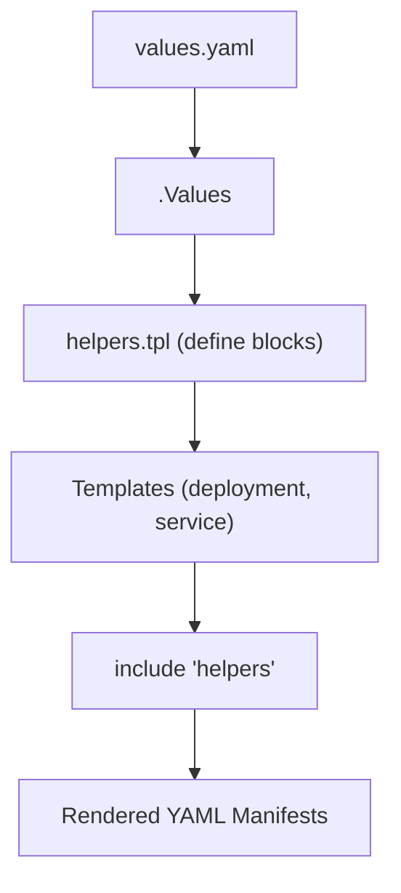

# 🧩 Helm `_helpers.tpl` + Built-in Template Functions

_“Where variables meet logic to create reusable chart magic.”!_

---

## 📖 **What Is `_helpers.tpl`?**

> `_helpers.tpl` is a **special template file** (usually inside `/templates/`)
> that stores **named template blocks** — reusable snippets you can include anywhere else.

It works like **a library of functions/macros** for your Helm chart.

---

### 📁 Typical Chart Structure

```ini
mywebapp/
├── Chart.yaml
├── values.yaml
└── templates/
    ├── deployment.yaml
    ├── service.yaml
    ├── _helpers.tpl   # 👈 our reusable template library
```

---

## ⁉️ **Why `_helpers.tpl` Is Needed**

Without helpers, you’d repeat labels, names, annotations across files.
Example — you’d copy-paste the same app name 10 times.

Instead, `_helpers.tpl` lets you **define once**, then **include everywhere**.
If you change logic — just update one place ✅

---

## ⚙️ **How `_helpers.tpl` Works**

Helm uses Go templates.  
Inside `_helpers.tpl`, you use the syntax:

```yaml
{{- define "chartname.helpername" -}}
# template content here
{{- end }}
```

💡 “define” creates a **named template**.  
You can call it using `include` or `template` function.

---

### 📝 Example: Define and Use a Helper

**\_helpers.tpl**

```yaml
{{- define "mywebapp.fullname" -}}
{{ printf "%s-%s" .Release.Name .Chart.Name | trunc 63 | trimSuffix "-" }}
{{- end }}
```

**deployment.yaml:**

```yaml
metadata:
  name: { { include "mywebapp.fullname" . } }
```

🧾 Output:

```yaml
metadata:
  name: mywebapp-mywebapp
```

> ✅ Reusable  
> ✅ Context-aware  
> ✅ Automatically trims and truncates to Kubernetes naming limits

---

## 🧰 **The Most Important Template Functions**

Helm includes **hundreds** of Go template functions, but you only need a few core ones for 95% of charts.

Let’s go over the essential ones 👇

---

### 📌 `include`

> Executes another named template and **returns its rendered text**.

Syntax:

```yaml
{ { include "template.name" . } }
```

💡 Pass the **current context** (`.`) so that helper templates can access `.Values`, `.Release`, etc.

Example:

```yaml
{ { include "mywebapp.labels" . | indent 4 } }
```

---

### 📌 `template`

> Similar to `include`, but **outputs directly** to the document stream.

⚠️ Rarely used in Helm 3 — `include` is preferred since it returns text that you can pipe or modify.

Example:

```yaml
{ { template "mywebapp.labels" . } }
```

---

### 📌 `required`

> Ensures a value exists — otherwise Helm throws an error.
> Perfect for required configuration keys.

Example:

```yaml
image:
  repository: { { required "image.repository is required" .Values.image.repository } }
```

If missing:

```ini
Error: render error in "mywebapp/templates/deploy.yaml": image.repository is required
```

🧠 Use it to prevent silent misconfigurations.

---

### 📌 `default`

> Sets a fallback value if a variable is not defined.

Example:

```yaml
replicas: { { .Values.replicaCount | default 1 } }
```

If `.Values.replicaCount` missing → defaults to 1.

---

### 📌 `toYaml`

> Converts a dictionary or object into YAML-formatted text.
> Often used when embedding complex `.Values` structures.

Example:

```yaml
env: { { - toYaml .Values.env | nindent 2 } }
```

🧾 If `values.yaml` has:

```yaml
env:
  - name: ENV
    value: prod
  - name: DEBUG
    value: false
```

Then rendered:

```yaml
env:
  - name: ENV
    value: prod
  - name: DEBUG
    value: false
```

---

### 📌 `nindent` / `indent`

> Adds indentation spaces — used with YAML alignment.

| Function    | Meaning                                                      |
| ----------- | ------------------------------------------------------------ |
| `indent X`  | Adds X spaces without newline awareness                      |
| `nindent X` | Adds X spaces and ensures proper newlines (newline + indent) |

Example:

```yaml
labels:
{{ include "mywebapp.labels" . | nindent 2 }}
```

---

### 📌 `lookup`

> Query existing Kubernetes resources during render (only works when connected to a cluster).

Example:

```yaml
{{- $cm := lookup "v1" "ConfigMap" "default" "my-config" -}}
{{- if $cm }}
existing config found!
{{- end }}
```

🧠 Great for idempotent upgrades or referencing existing resources.

---

### 📌 `tpl`

> Renders text as a template **again** (template recursion).  
> Useful when you store templated strings inside `values.yaml`.

**values.yaml:**

```yaml
welcomeMessage: "Hello, {{ .Release.Name }}!"
```

**template:**

```yaml
message: { { tpl .Values.welcomeMessage . } }
```

🧾 Output:

```yaml
message: Hello, mywebapp
```

---

### 📌 `printf`

> Formats strings (like `String.Format()` in C#).

```yaml
{ { printf "%s-%s" .Chart.Name .Release.Namespace } }
```

---

### 📌 `quote` / `squote`

> Wraps text in quotes or single quotes.

```yaml
image: { { .Values.image.repository | quote } }
```

---

## 📝 **Real Example: Reusable Labels Helper**

**\_helpers.tpl**

```yaml
{{- define "mywebapp.labels" -}}
app.kubernetes.io/name: {{ .Chart.Name }}
app.kubernetes.io/instance: {{ .Release.Name }}
app.kubernetes.io/version: {{ .Chart.AppVersion }}
app.kubernetes.io/managed-by: {{ .Release.Service }}
{{- end }}
```

**deployment.yaml:**

```yaml
metadata:
  labels: { { - include "mywebapp.labels" . | nindent 4 } }
```

🧾 Output:

```yaml
metadata:
  labels:
    app.kubernetes.io/name: mywebapp
    app.kubernetes.io/instance: mywebapp
    app.kubernetes.io/version: "1.5.1"
    app.kubernetes.io/managed-by: Helm
```

---

## 🧠 **Using Conditionals and Loops**

Helm templates can contain logic.

### ✅ **If / Else**

```yaml
{{- if .Values.autoscaling.enabled }}
minReplicas: {{ .Values.autoscaling.min }}
maxReplicas: {{ .Values.autoscaling.max }}
{{- else }}
replicas: {{ .Values.replicaCount }}
{{- end }}
```

---

### 🔁 **Range (Loop)**

```yaml
env:
  {{- range .Values.env }}
  - name: {{ .name }}
    value: {{ .value }}
  {{- end }}
```

---

## 🖼️ **Template Rendering Flow**

<div align="center" style="background-color: #2b3436ff; border-radius: 10px; border: 2px solid">



</div>

---

## 🧰 **Putting It All Together — Full Real Example**

**\_helpers.tpl**

```yaml
{{- define "mywebapp.fullname" -}}
{{ printf "%s-%s" .Release.Name .Chart.Name | trunc 63 | trimSuffix "-" }}
{{- end }}

{{- define "mywebapp.labels" -}}
app.kubernetes.io/name: {{ .Chart.Name }}
app.kubernetes.io/instance: {{ .Release.Name }}
{{- end }}
```

**deployment.yaml:**

```yaml
apiVersion: apps/v1
kind: Deployment
metadata:
  name: { { include "mywebapp.fullname" . } }
  labels: { { - include "mywebapp.labels" . | nindent 4 } }
spec:
  replicas: { { .Values.replicaCount | default 1 } }
  template:
    spec:
      containers:
        - name: { { .Chart.Name } }
          image: "{{ .Values.image.repository }}:{{ .Values.image.tag }}"
```

**values.yaml:**

```yaml
replicaCount: 3
image:
  repository: nginx
  tag: 1.25
```

🧾 **Rendered Output (simplified):**

```yaml
metadata:
  name: mywebapp-mywebapp
  labels:
    app.kubernetes.io/name: mywebapp
    app.kubernetes.io/instance: mywebapp
spec:
  replicas: 3
  template:
    spec:
      containers:
        - name: mywebapp
          image: nginx:1.25
```

---

## 💡 **Pro Tips for Real Helm Projects**

✅ Always prefix helper names with your chart name (`mychart.fullname`) to avoid conflicts.  
✅ Use `_helpers.tpl` for any repeated text (names, labels, selectors).  
✅ Use `nindent` instead of `indent` — it keeps YAML formatting correct.  
✅ `required` and `default` are your best friends for making charts safer.  
✅ Add logic conditions to handle optional resources like Ingress or HPA.  
✅ Combine `tpl` with `values.yaml` for dynamic strings in advanced charts.

---

## 🧭 **Summary Table**

<div align="center" style="background-color: #141a19ff;color: #a8a5a5ff; border-radius: 10px; border: 2px solid">

| Function           | Purpose                                 | Example                                          |
| ------------------ | --------------------------------------- | ------------------------------------------------ |
| `define`           | Declare a named template                | `{{ define "chart.fullname" }}`                  |
| `include`          | Call a named template and return output | `{{ include "chart.fullname" . }}`               |
| `required`         | Throw error if value missing            | `{{ required "msg" .Values.key }}`               |
| `default`          | Use fallback if value missing           | `{{ .Values.x \| default "foo" }}`               |
| `toYaml`           | Convert map/list → YAML                 | `{{ toYaml .Values.env }}`                       |
| `nindent`          | Indent + newline properly               | `{{ toYaml .Values \| nindent 2 }}`              |
| `tpl`              | Render templated strings                | `{{ tpl .Values.str . }}`                        |
| `printf`           | Format strings                          | `{{ printf "%s-%s" .Release.Name .Chart.Name }}` |
| `quote` / `squote` | Add quotes                              | `{{ .Values.url \| quote }}`                     |

</div>
