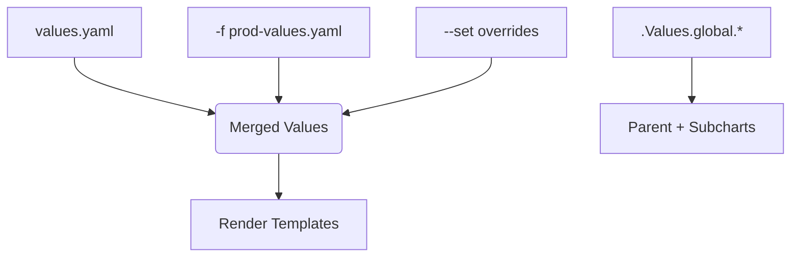
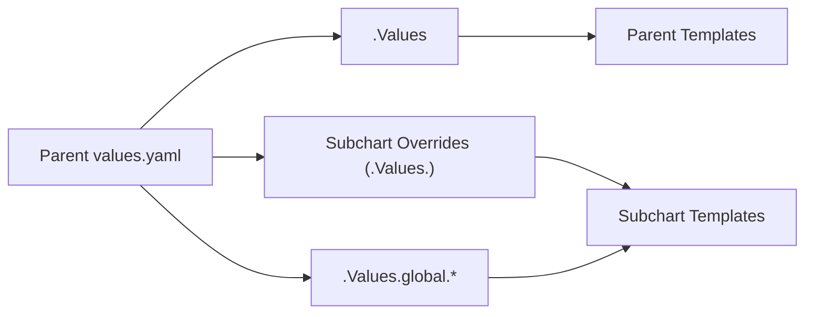

# 🧠 **Helm Value Merging & Scoping Explained**

_“Who wins when everyone has a value?”._

---

## 🖼️ **The Big Picture**

Helm supports multiple ways to provide values to a chart:

- **`values.yaml`** — default chart values
- **Custom values file (`-f`)** — environment-specific overrides
- **Inline overrides (`--set`)** — quick CLI overrides
- **Global values (`.Values.global`)** — shared across subcharts
- **Subchart `values.yaml`** — each dependency’s local values

When you run:

```bash
helm install mywebapp ./mywebapp \
  -f prod-values.yaml \
  --set replicaCount=10
```

Helm merges all these layers **in order of precedence** 🧩

---

## ⚖️ **The Helm Value Precedence Order**

> 🧮 Highest priority wins.

<div align="center" style="background-color: #141a19ff;color: #a8a5a5ff; border-radius: 10px; border: 2px solid">

| Priority | Source                           | Example                     |
| -------- | -------------------------------- | --------------------------- |
| 🥇 1     | `--set` CLI flag                 | `--set image.tag=v3`        |
| 🥈 2     | Extra values file(s) `-f`        | `-f prod-values.yaml`       |
| 🥉 3     | Chart’s `values.yaml`            | default values in the chart |
| 🧩 4     | Subchart `values.yaml`           | only for dependencies       |
| 🪣 5      | Global values (`.Values.global`) | accessible by all charts    |

</div>

> So Helm merges in this order:  
> **Chart default → extra files → CLI `--set` → global values apply everywhere**

---

## ⚙️ **Visual Diagram — How Values Merge**

<div align="center" style="background-color: #141a19ff;color: #a8a5a5ff; border-radius: 10px; border: 2px solid">



</div>

---

## 🧩 **Merging Behavior Example**

Let’s say you have:

### 📄 `values.yaml`

```yaml
replicaCount: 2
image:
  repository: nginx
  tag: latest
```

### 📄 `prod-values.yaml`

```yaml
replicaCount: 5
image:
  tag: stable
```

### 🧠 CLI

```bash
--set image.tag=v2
```

🔮 **Final merged values:**

```yaml
replicaCount: 5
image:
  repository: nginx
  tag: v2
```

✅ `--set` wins
✅ File overrides default
✅ Unchanged fields are inherited

---

## 🧩 **Merging with Nested Maps**

Helm performs a **deep merge**, not a shallow one — meaning nested keys are merged recursively.

**Example:**

`values.yaml`

```yaml
env:
  DB_HOST: localhost
  DB_USER: admin
```

`-f prod-values.yaml`

```yaml
env:
  DB_USER: produser
```

✅ **Result:**

```yaml
env:
  DB_HOST: localhost
  DB_USER: produser
```

🧠 It didn’t delete `DB_HOST`, only replaced the overridden field.

---

## 🌍 **Global Values — `.Values.global`**

Global values are special shared keys that propagate across **parent and subcharts**.

### Example Structure:

**Parent Chart (`myapp`)**

```ini
myapp/
├── values.yaml
├── charts/
│   └── redis/
│       └── values.yaml
```

### Parent `values.yaml`

```yaml
global:
  appEnv: production
redis:
  image:
    tag: latest
```

### Subchart `templates/config.yaml`

```yaml
env: { { .Values.global.appEnv } }
```

💡 Even though `appEnv` is defined in the **parent**, the **subchart** can still access it:

```yaml
env: production
```

✅ **Global values automatically merge into subcharts’ `.Values.global` scope.**

---

## 🧩 **Subchart Values and Overrides**

Each subchart (dependency) has its own `values.yaml`, but the parent can override it.

Example:

### 📌 Parent Chart

```yaml
dependencies:
  - name: redis
    repository: https://charts.bitnami.com/bitnami
    version: 18.4.0
```

### 📌 Parent `values.yaml`

```yaml
redis:
  architecture: replication
  replica:
    replicaCount: 3
```

➡️ Helm merges this under the subchart’s `.Values`, so inside the Redis subchart:

```yaml
{{ .Values.architecture }}        # replication
{{ .Values.replica.replicaCount }} # 3
```

🧠 **Parent overrides subchart defaults automatically.**

---

## 🧠 **Accessing Parent vs Subchart Values**

<div align="center" style="background-color: #141a19ff;color: #a8a5a5ff; border-radius: 10px; border: 2px solid">

| Context                   | Access Scope           | Example                                 |
| ------------------------- | ---------------------- | --------------------------------------- |
| Parent chart template     | `.Values`              | `.Values.image.repository`              |
| Subchart template         | `.Values`              | `.Values.replicaCount` (subchart’s own) |
| Subchart accessing global | `.Values.global.*`     | `.Values.global.appEnv`                 |
| Parent accessing subchart | `.Values.<subchart>.*` | `.Values.redis.replica.replicaCount`    |

</div>

---

## 🧩 **Combining Global + Local Overrides**

**values.yaml:**

```yaml
global:
  region: eu-west-1
app:
  region: us-east-1
```

**template:**

```yaml
region: { { .Values.app.region | default .Values.global.region } }
```

✅ **If app-specific region exists → use it.**
✅ **Else → fallback to global region.**

🧾 Result:

```ini
region: us-east-1
```

---

## ⚙️ **Using Multiple Values Files**

You can provide **multiple `-f` flags** — they are merged in order (later overrides earlier).

Example:

```bash
helm install mywebapp ./mywebapp \
  -f values.yaml \
  -f staging.yaml \
  -f secret-overrides.yaml
```

Helm merges:

```ini
values.yaml → staging.yaml → secret-overrides.yaml
```

Later files win 🎯

---

## 🧩 Using `--set-file` and `--set-string`

<div align="center" style="background-color: #141a19ff;color: #a8a5a5ff; border-radius: 10px; border: 2px solid">

| Flag           | Description                          | Example                        |
| -------------- | ------------------------------------ | ------------------------------ |
| `--set`        | Inline key-value (auto type-detects) | `--set replicaCount=3`         |
| `--set-string` | Forces string type                   | `--set-string password=0123`   |
| `--set-file`   | Reads value from file                | `--set-file config=./app.conf` |

</div>

> 💡 Use `--set-string` when numeric strings like `001` are required (Helm otherwise converts to int).

---

## 🧪 **Debugging Value Merges**

### 🧰 Show merged values for a release

```bash
helm get values <release> --all
```

### 🧪 Render without applying

```bash
helm template ./mychart -f prod-values.yaml --set image.tag=v2
```

### 🧠 Show what final `.Values` looks like

Add this debug snippet:

```yaml
{ { - printf "%+v" .Values | nindent 0 } }
```

---

## 💡 **Real Example: Full Merge**

**Default `values.yaml`**

```yaml
replicaCount: 2
image:
  repository: nginx
  tag: latest
```

**File: `qa-values.yaml`**

```yaml
replicaCount: 3
```

**CLI:**

```bash
--set image.tag=stable
```

✅ Final `.Values` during render:

```yaml
replicaCount: 3
image:
  repository: nginx
  tag: stable
```

---

## 🖼️ **Parent/Subchart Value Flow**

<div align="center" style="background-color: #2b3436ff; border-radius: 10px; border: 2px solid">



</div>

---

## 💡 **Best Practices**

- ✅ Use `global` for shared settings like environment, imagePullSecrets, or domain.
- ✅ Use per-env override files (e.g., `values-dev.yaml`, `values-prod.yaml`).
- ✅ Avoid overusing `--set`; prefer `-f` for maintainability.
- ✅ Keep parent/subchart variable names consistent.
- ✅ Use `default` or `required` in templates to handle missing keys.
- ✅ Always run `helm template` before `install` to preview merged results.

---

## 🧾 **Quick Summary Table**

<div align="center" style="background-color: #141a19ff;color: #a8a5a5ff; border-radius: 10px; border: 2px solid">

| Concept                      | Description                    | Example                     |
| ---------------------------- | ------------------------------ | --------------------------- |
| **`values.yaml`**            | Default chart config           | base settings               |
| **`-f file.yaml`**           | File override                  | `helm install -f prod.yaml` |
| **`--set`**                  | Inline override                | `--set image.tag=v2`        |
| **Global values**            | Shared between charts          | `.Values.global.*`          |
| **Deep merge**               | Nested maps merge recursively  | Keeps unchanged keys        |
| **Order**                    | `values.yaml` < `-f` < `--set` | Highest wins                |
| **Parent override subchart** | `.Values.redis.*`              | parent > subchart           |
| **Multiple -f files**        | Later wins                     | `-f base -f prod`           |

</div>

---

## 🧩 **Example Directory**

```ini
myapp/
├── values.yaml
├── values-prod.yaml
├── templates/
│   ├── deployment.yaml
│   ├── service.yaml
│   └── _helpers.tpl
└── charts/
    └── redis/
        ├── values.yaml
        └── templates/
```
