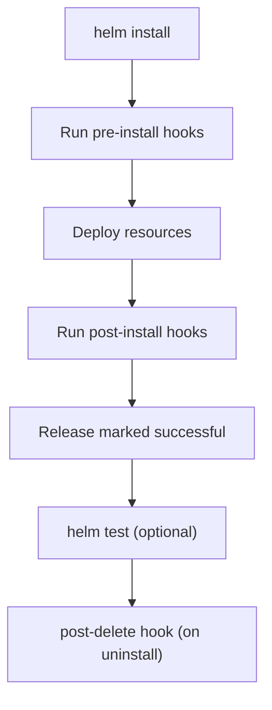

# 🧭 Helm Hooks & Lifecycle

_“Run custom logic before, during, or after Helm releases.”._

---

## 📖 **What Are Helm Hooks?**

> Hooks are **special Kubernetes manifests** (Jobs, Pods, etc.) that run at **specific points** in a Helm release lifecycle — such as before install, after upgrade, before delete, etc.

They allow you to:

- Run **database migrations** before app deployment 🧮
- Execute **integration tests** after installation ✅
- Perform **cleanup** before deleting a release 🧹
- Automate **custom tasks** in the Helm release pipeline ⚙️

---

## ⚙️ **How Hooks Work**

You define a normal Kubernetes object (like a Job)
→ Add a special annotation in its metadata
→ Helm runs it automatically at the right time.

**Example:**

```yaml
metadata:
  annotations:
    "helm.sh/hook": pre-install
```

✅ That’s all it takes — now Helm knows when to execute it.

---

## 🧠 **Common Hook Events**

| Hook Type      | Trigger Point                    | Typical Use        |
| -------------- | -------------------------------- | ------------------ |
| `pre-install`  | Before resources are installed   | Run DB migrations  |
| `post-install` | After resources are installed    | Run smoke tests    |
| `pre-upgrade`  | Before upgrade starts            | Backup data        |
| `post-upgrade` | After upgrade completes          | Verify rollout     |
| `pre-delete`   | Before resources are deleted     | Cleanup data       |
| `post-delete`  | After resources are deleted      | Notify or audit    |
| `test`         | When `helm test` is run manually | Run tests manually |

🧩 These are triggered during lifecycle commands like:

- `helm install`
- `helm upgrade`
- `helm uninstall`
- `helm test`

---

## 🧩 **Minimal Hook Example**

Let’s say you want a **database migration job** before the app deploys.

**templates/db-migrate-job.yaml:**

```yaml
apiVersion: batch/v1
kind: Job
metadata:
  name: "{{ .Release.Name }}-migrate"
  annotations:
    "helm.sh/hook": pre-install
spec:
  template:
    spec:
      containers:
        - name: migrate
          image: mywebapp:migrate
          command: ["python", "manage.py", "migrate"]
      restartPolicy: OnFailure
```

💡 This job will run **before** Helm installs your other resources.
If it fails → Helm install fails too.

---

## ⚙️ **Multiple Hooks on One Resource**

You can trigger a job on **multiple events**:

```yaml
metadata:
  annotations:
    "helm.sh/hook": pre-install,pre-upgrade
```

➡️ Job runs before both install and upgrade.

---

## ⚖️ **Hook Weight — Control Execution Order**

If you have multiple hooks for the same event, Helm executes them by **weight** (lowest first).

```yaml
metadata:
  annotations:
    "helm.sh/hook-weight": "1"
```

Example:

```yaml
# Job A
"helm.sh/hook": pre-install
"helm.sh/hook-weight": "-5"

# Job B
"helm.sh/hook": pre-install
"helm.sh/hook-weight": "10"
```

🧮 Execution order → **A (-5)** → **B (10)**

---

## 👮🏻 **Hook Deletion Policies**

By default, Helm **keeps old hook resources** — which can clutter your cluster.

Use `helm.sh/hook-delete-policy` to clean them up automatically.

| Policy                 | When It Deletes                          |
| ---------------------- | ---------------------------------------- |
| `before-hook-creation` | Deletes old hook before creating new one |
| `hook-succeeded`       | Deletes after successful execution       |
| `hook-failed`          | Deletes after failed execution           |

Example:

```yaml
metadata:
  annotations:
    "helm.sh/hook": post-install
    "helm.sh/hook-delete-policy": hook-succeeded
```

---

## 🔴 **Hook Failure Behavior**

If a **pre-hook fails**, Helm stops the release.  
If a **post-hook fails**, Helm still marks the release as successful but logs an error.

| Hook Type                   | Failure Effect  |
| --------------------------- | --------------- |
| Pre-install / Pre-upgrade   | Blocks release  |
| Post-install / Post-upgrade | Logs error only |

---

## 🧪 **Running Tests with Hooks**

You can define Helm tests using the `test` hook.
They are executed with the `helm test` command.

**templates/test-connection.yaml:**

```yaml
apiVersion: v1
kind: Pod
metadata:
  name: "{{ .Release.Name }}-test-connection"
  annotations:
    "helm.sh/hook": test
spec:
  containers:
    - name: curl
      image: busybox
      command: ["sh", "-c", "curl -f http://mywebapp:80"]
  restartPolicy: Never
```

Run:

```bash
helm test mywebapp
```

🧾 Output:

```ini
RUNNING: mywebapp-test-connection
SUCCESS: 1 passed, 0 failed
```

✅ Great for post-deployment smoke tests or endpoint health checks.

---

## 📝 **Example: Full Lifecycle Hooks**

```yaml
# templates/hooks.yaml
---
apiVersion: batch/v1
kind: Job
metadata:
  name: preinstall-migrate
  annotations:
    "helm.sh/hook": pre-install
    "helm.sh/hook-weight": "-1"
    "helm.sh/hook-delete-policy": hook-succeeded
spec:
  template:
    spec:
      containers:
        - name: migrate
          image: mywebapp:migrate
          command: ["python", "manage.py", "migrate"]
      restartPolicy: OnFailure
---
apiVersion: batch/v1
kind: Job
metadata:
  name: postinstall-test
  annotations:
    "helm.sh/hook": post-install
    "helm.sh/hook-weight": "5"
    "helm.sh/hook-delete-policy": hook-succeeded
spec:
  template:
    spec:
      containers:
        - name: test
          image: busybox
          command: ["wget", "mywebapp:80"]
      restartPolicy: Never
```

🧭 **Execution Order:**

1. `pre-install` → Migration runs
2. Deploy main app
3. `post-install` → Test connection
4. Clean up jobs

---

## 📊 **Diagram — Helm Hook Lifecycle Flow**

<div align="center" style="background-color: #2b3436ff; border-radius: 10px; border: 2px solid">



</div>

---

## 🧪 **Debugging Hooks**

You can check hooks and their status:

```bash
helm get hooks <release>
```

🧾 Example output:

```ini
HOOKS:
---
# Source: mychart/templates/hooks.yaml
NAME: preinstall-migrate
LAST RUN: 2025-10-22 12:00:00
HOOK: pre-install
```

---

## 🧰 **Real-World Use Cases**

<div align="center" style="background-color: #141a19ff;color: #a8a5a5ff; border-radius: 10px; border: 2px solid">

| Scenario                | Hook                      | Example                              |
| ----------------------- | ------------------------- | ------------------------------------ |
| Database migration      | pre-install / pre-upgrade | Run `python manage.py migrate`       |
| Cache warmup            | post-install              | Load data after deploy               |
| Monitoring registration | post-install              | Notify Prometheus or alerting system |
| Data backup             | pre-upgrade               | Backup DB before schema change       |
| Cleanup old PVs         | pre-delete                | Remove persistent data safely        |
| Smoke testing           | test                      | Validate endpoints after deployment  |

</div>

---

## 🧮 **Common Mistakes to Avoid**

- ❌ Forgetting `restartPolicy: Never` for jobs → infinite retries
- ❌ Not cleaning up hooks → clutter in cluster
- ❌ Using same job name → must be unique per release
- ❌ Not setting weight → random order execution
- ❌ Running long hooks in `pre-install` → can timeout Helm operation

---

## 🧩 **Best Practices**

- ✅ Always specify `hook-delete-policy` to prevent resource buildup.
- ✅ Use unique job names per release (e.g., append `.Release.Revision`).
- ✅ Separate long-running migrations from short ones using weights.
- ✅ Add labels like `helm.sh/hook: test` clearly for debugging.
- ✅ Use post-install hooks for verification, not for blocking.
- ✅ For smoke tests → prefer `helm test` so you can re-run easily.

---

## 🧾 **Quick Summary Table**

| Annotation                   | Purpose                | Example                                         |
| ---------------------------- | ---------------------- | ----------------------------------------------- |
| `helm.sh/hook`               | Define lifecycle event | `"helm.sh/hook": pre-install`                   |
| `helm.sh/hook-weight`        | Order of execution     | `"helm.sh/hook-weight": "5"`                    |
| `helm.sh/hook-delete-policy` | Cleanup rule           | `"helm.sh/hook-delete-policy": hook-succeeded"` |
| `test`                       | Marks for `helm test`  | `"helm.sh/hook": test"`                         |

---

## 🎉 **Bonus Tip — Combining Hooks with CI/CD**

In a Jenkins / Azure DevOps pipeline:

```bash
helm upgrade --install mywebapp ./chart --wait
helm test mywebapp --logs
```

- ✅ Hooks handle migrations automatically
- ✅ `helm test` runs verification before next stage
- ✅ No manual scripts needed!
