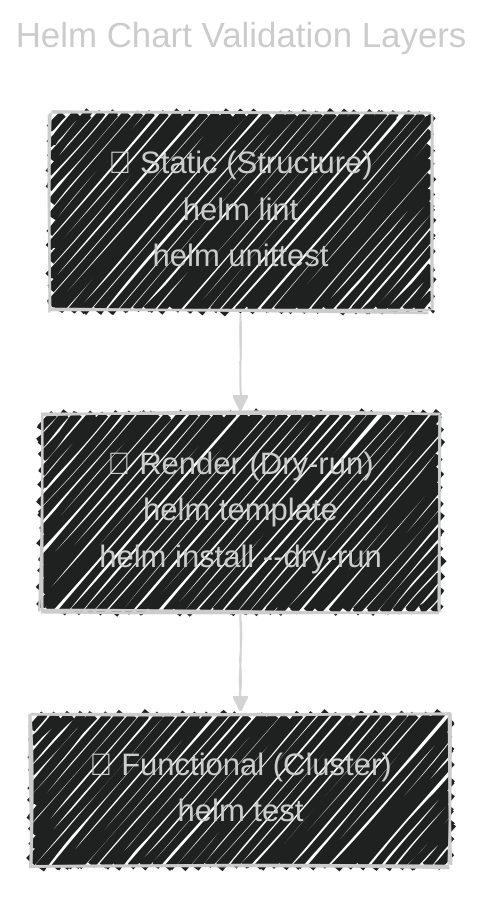
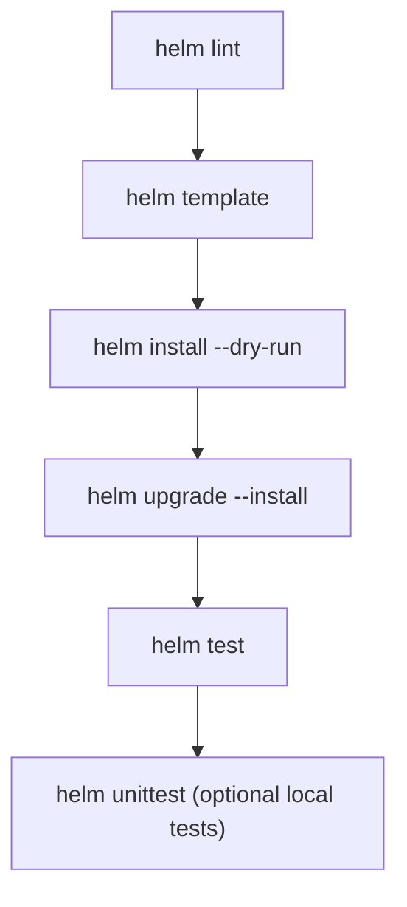

# 🧠 **Helm Chart Testing & Linting**

_“Because broken YAMLs don’t belong in production”._

---

## 📖 **Why Testing Helm Charts Matters**

Helm charts are code — and like all code, they can break 😅

Testing ensures that:

- Your templates render correctly 🧩
- Values merge as expected ⚖️
- Hooks and manifests are valid before touching Kubernetes 💥
- CI/CD pipelines catch errors before cluster deployment 🚦

Helm provides **three testing layers**:

1. **Linting** (static validation)
2. **Template rendering** (syntax + value merge)
3. **Runtime testing** (functional verification on cluster)

---

## 🧰 **`helm lint` — Static Chart Validation**

> **Purpose:** Catch mistakes before rendering or deploying.

Run it at the root of your chart:

```bash
helm lint ./mywebapp
```

🧾 Example output:

```ini
==> Linting ./mywebapp
[INFO] Chart.yaml: icon is recommended
[ERROR] values.yaml: missing required field "image.repository"
Error: 1 chart(s) linted, 1 chart(s) failed
```

✅ **What It Checks:**

- YAML syntax correctness
- Required files (`Chart.yaml`, `values.yaml`, `templates/`)
- Invalid indentation
- Deprecated API versions
- Missing dependencies in `Chart.yaml`

---

### 💡 Pro Tip:

Use in CI/CD:

```bash
helm lint ./charts/* --strict
```

`--strict` makes warnings fail your pipeline (like `eslint --max-warnings=0`).

---

## 🧩 **`helm template` — Dry Rendering Validation**

> **Purpose:** Render your chart locally into Kubernetes YAML **without applying it**.

Think of it as:
💬 _“Show me what Helm will actually send to Kubernetes.”_

---

### 🔧 Command

```bash
helm template mywebapp ./mywebapp -f values-prod.yaml
```

🧾 Output (truncated):

```yaml
# Source: mywebapp/templates/deployment.yaml
apiVersion: apps/v1
kind: Deployment
metadata:
  name: mywebapp
spec:
  replicas: 3
  template:
    spec:
      containers:
        - name: nginx
          image: nginx:1.25
```

---

### 💡 Use Cases:

- ✅ Preview final YAML before real deployment
- ✅ Validate variable merging
- ✅ Debug templating logic (`.Values`, `.Chart`, `.Release`)
- ✅ Integrate into CI/CD validation stages

---

## 🧪 `helm install --dry-run --debug` — Full Simulation

> Simulates the **entire install** process, including hooks and manifests, but **does not touch the cluster**.

---

### 🔧 Command

```bash
helm install mywebapp ./mywebapp --dry-run --debug
```

🧾 Example Output:

```ini
install.go:187: [debug] Created tunnel using local port: '53743'
Release "mywebapp" does not exist. Installing it now.
MANIFEST:
---
# Source: mywebapp/templates/service.yaml
apiVersion: v1
kind: Service
metadata:
  name: mywebapp
...
```

✅ You’ll see:

- All rendered YAMLs
- Values merged from `values.yaml`, `-f`, and `--set`
- Hook manifests if defined

💡 Great for verifying large CI/CD release steps (especially before prod deployment).

---

## 📄 **`helm get manifest` — Post-Install Validation**

> Fetches **the actual deployed manifests** for an existing release.

```bash
helm get manifest mywebapp
```

✅ Use this to compare rendered YAML vs deployed YAML.

---

## 🧪 **`helm test` — Runtime Functional Tests**

> Runs **real tests** in the cluster _after installation_ — defined using `helm.sh/hook: test`.

---

### 📄 Example: `templates/test-connection.yaml`

```yaml
apiVersion: v1
kind: Pod
metadata:
  name: "{{ .Release.Name }}-test"
  annotations:
    "helm.sh/hook": test
spec:
  containers:
    - name: curl
      image: busybox
      command: ["sh", "-c", "curl -f http://mywebapp:80"]
  restartPolicy: Never
```

---

### 🔧 Command

```bash
helm test mywebapp --logs
```

🧾 Output:

```ini
RUNNING: mywebapp-test
PASSED: connection successful!
SUCCESS: 1 passed, 0 failed
```

✅ **Use Cases:**

- Validate app endpoint availability
- Check DB connectivity
- Smoke test post-deployment

💡 Combine this with `helm upgrade --install --wait` in pipelines for a full deploy-test flow.

---

## 🧪 **Advanced Testing — `helm-unittest` Plugin**

> Helm’s **lint** and **template** check structure,
> but `helm-unittest` allows **unit tests for templates** like real code 🧠

---

### 🧩 Install Plugin

```bash
helm plugin install https://github.com/quintush/helm-unittest
```

---

### 📄 Example Test File

`tests/deployment_test.yaml`

```yaml
suite: Test deployment template
templates:
  - deployment.yaml
tests:
  - it: should set the correct image
    values:
      image:
        repository: nginx
        tag: 1.25
    asserts:
      - equal:
          path: spec.template.spec.containers[0].image
          value: nginx:1.25

  - it: should default replicas to 1
    asserts:
      - equal:
          path: spec.replicas
          value: 1
```

---

### 🔧 Run Tests

```bash
helm unittest ./mywebapp
```

🧾 Output:

```ini
### Chart [./mywebapp] ###
 PASS  Test deployment template
 - should set the correct image ✔
 - should default replicas to 1 ✔
Executed 2 tests in 0.012 seconds
```

✅ **Benefits:**

- Catch templating bugs before deployment
- Test behavior under different `.Values` inputs
- Integrate into CI pipelines

---

## 🧩 **Visual — Helm Testing Pyramid**

<div align="center" style="background-color: #2b3436ff; border-radius: 10px; border: 2px solid">



</div>

> 🧠 The higher you go, the more realistic — but also the more resource-consuming.

---

## 📑 **Common Testing Patterns**

| Goal                    | Command                  | Description                   |
| ----------------------- | ------------------------ | ----------------------------- |
| Validate YAML structure | `helm lint`              | Detects syntax errors         |
| Verify templates render | `helm template`          | Expands all manifests locally |
| Simulate install        | `helm install --dry-run` | Emulates full release         |
| Check final manifests   | `helm get manifest`      | View deployed YAML            |
| Run cluster tests       | `helm test`              | Run `helm.sh/hook: test` pods |
| Unit test logic         | `helm unittest`          | Template-level tests          |

---

## 🧪 **Debugging Tips**

🧩 Print full `.Values` inside a template:

```yaml
{ { - printf "%+v" .Values | nindent 0 } }
```

🧠 Useful for verifying merged values during dry-runs.

---

🧩 Show all rendered manifests for debugging:

```bash
helm template ./mywebapp --debug
```

🧩 Show history and revisions:

```bash
helm history mywebapp
```

---

## 🧰 **Real CI/CD Integration Example**

### 🔧 Azure DevOps / GitHub Actions Step:

```yaml
- name: Lint Helm chart
  run: helm lint ./charts/mywebapp --strict

- name: Render Helm template (validation)
  run: helm template mywebapp ./charts/mywebapp -f values-prod.yaml

- name: Dry-run install (simulation)
  run: helm install mywebapp ./charts/mywebapp --dry-run --debug

- name: Deploy
  run: helm upgrade --install mywebapp ./charts/mywebapp --wait

- name: Run Helm tests
  run: helm test mywebapp --logs
```

✅ Ensures your Helm chart is fully validated before and after deployment.

---

## 💡 **Best Practices**

- ✅ Always run `helm lint` in CI before merging any PR.
- ✅ Use `helm template` or `--dry-run` in staging to preview manifests.
- ✅ Keep Helm tests (`helm.sh/hook: test`) lightweight and deterministic.
- ✅ Clean up test pods with `helm.sh/hook-delete-policy: hook-succeeded`.
- ✅ Add unit tests with `helm-unittest` for complex charts.
- ✅ Combine with `kubeval` or `kubeconform` to validate rendered manifests against Kubernetes schemas.

---

## 🧾 **Quick Summary Table**

| Command                  | Purpose                 | Use Case           |
| ------------------------ | ----------------------- | ------------------ |
| `helm lint`              | Validate structure      | Pre-commit checks  |
| `helm template`          | Render YAML locally     | Visual preview     |
| `helm install --dry-run` | Full install simulation | Safe test runs     |
| `helm test`              | Run runtime hooks       | Post-deploy tests  |
| `helm get manifest`      | Inspect live manifests  | Debug after deploy |
| `helm unittest`          | Unit test templates     | CI/CD automation   |

---

## 🧭 **Diagram — Helm Validation Flow**

<div align="center" style="background-color: #2b3436ff; border-radius: 10px; border: 2px solid">



</div>
