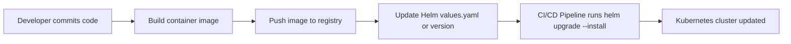
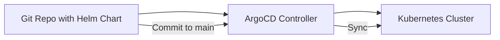
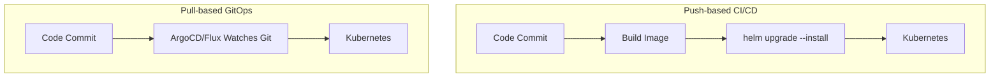
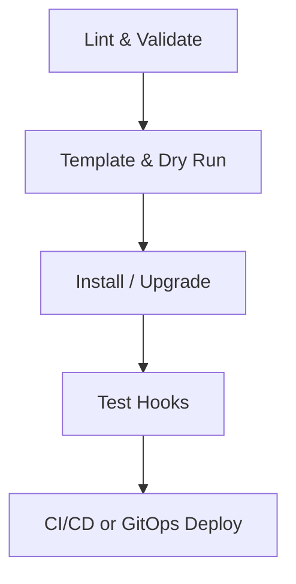

# 🚀 **Helm CI/CD Integration & GitOps Patterns**

_“How Helm powers real-world Kubernetes delivery pipelines”._

This is where all the pieces — templates, hooks, values, and testing — come together inside modern CI/CD systems (GitHub Actions, Azure DevOps, Jenkins, ArgoCD, FluxCD).
We’ll go over how Helm fits in **both Push-based CI/CD** and **Pull-based GitOps** setups, with visuals, YAML examples, and best practices.

---

## ⚙️ **CI/CD vs. GitOps — The Big Picture**

<div align="center" style="background-color: #141a19ff;color: #a8a5a5ff; border-radius: 10px; border: 2px solid">

| Delivery Style          | Who Applies Helm Charts                             | Trigger Type       | Tools                            |
| ----------------------- | --------------------------------------------------- | ------------------ | -------------------------------- |
| **CI/CD (Push-based)**  | CI pipeline (Jenkins, GitHub Actions, Azure DevOps) | Code or image push | `helm upgrade --install`         |
| **GitOps (Pull-based)** | GitOps controller (ArgoCD, FluxCD)                  | Git commit to repo | Controller reconciles Helm chart |

</div>

---

## 🧩 **CI/CD (Push-based) Pipeline Flow**

**Diagram:**

<div align="center" style="background-color: #2b3436ff; border-radius: 10px; border: 2px solid">



</div>

---

> ✅ CI/CD directly pushes changes to the cluster.

---

Example: **GitHub Actions Pipeline**

```yaml
name: Deploy with Helm
on:
  push:
    branches: [main]

jobs:
  deploy:
    runs-on: ubuntu-latest
    steps:
      - name: Checkout code
        uses: actions/checkout@v4

      - name: Set up Helm
        uses: azure/setup-helm@v4
        with:
          version: v3.15.1

      - name: Authenticate to AKS
        run: az aks get-credentials --resource-group myRG --name myCluster

      - name: Lint Helm Chart
        run: helm lint ./charts/myapp --strict

      - name: Deploy with Helm
        run: |
          helm upgrade --install myapp ./charts/myapp \
            -f charts/myapp/values-prod.yaml \
            --set image.tag=${{ github.sha }} \
            --wait --timeout 5m

      - name: Run Helm Tests
        run: helm test myapp --logs
```

**✅ Flow:**

1. Builds code → container image
2. Updates `image.tag` dynamically from commit SHA
3. Lints & dry-runs chart
4. Deploys via `helm upgrade --install`
5. Runs tests post-deploy

---

## 📃 **Azure DevOps Pipeline Example**

```yaml
trigger:
  - main

pool:
  vmImage: ubuntu-latest

steps:
  - checkout: self

  - task: HelmInstaller@1
    inputs:
      helmVersionToInstall: "latest"

  - task: AzureCLI@2
    inputs:
      azureSubscription: "MyServiceConnection"
      scriptType: bash
      scriptLocation: inlineScript
      inlineScript: |
        az aks get-credentials --resource-group myRG --name myCluster
        helm lint ./charts/myapp
        helm upgrade --install myapp ./charts/myapp \
          -f charts/myapp/values-prod.yaml \
          --set image.tag=$(Build.BuildId) \
          --wait --timeout 10m
```

> 💡 **Tip:** `--wait` makes Helm block until all resources are ready — perfect for reliable deployment stages.

---

## 📝 **Jenkins Pipeline Example**

```groovy
pipeline {
  agent any
  stages {
    stage('Lint Helm Chart') {
      steps {
        sh 'helm lint ./charts/myapp'
      }
    }
    stage('Deploy to AKS') {
      steps {
        sh '''
        az aks get-credentials -g myRG -n myCluster
        helm upgrade --install myapp ./charts/myapp \
          -f charts/myapp/values-prod.yaml \
          --set image.tag=${BUILD_NUMBER} \
          --atomic --wait
        '''
      }
    }
  }
}
```

> ✅ `--atomic` ensures rollback if something fails during deployment.

---

## 🌍 **GitOps (Pull-Based) with ArgoCD**

Instead of CI pipelines applying Helm, **ArgoCD watches Git repos** and applies changes automatically.

**Diagram:**

<div align="center" style="background-color: #2b3436ff; border-radius: 10px; border: 2px solid">



</div>

---

**Example: ArgoCD Application YAML:**

```yaml
apiVersion: argoproj.io/v1alpha1
kind: Application
metadata:
  name: myapp
spec:
  project: default
  source:
    repoURL: "https://github.com/myorg/infrastructure"
    targetRevision: main
    path: charts/myapp
    helm:
      valueFiles:
        - values-prod.yaml
      parameters:
        - name: image.tag
          value: "v1.0.3"
  destination:
    server: https://kubernetes.default.svc
    namespace: myapp
  syncPolicy:
    automated:
      prune: true
      selfHeal: true
```

> ✅ When someone commits a new image tag → ArgoCD automatically syncs it to the cluster.

---

## 🧩 **GitOps with FluxCD**

FluxCD is another GitOps engine that also natively understands Helm.

**Example HelmRelease (Flux):**

```yaml
apiVersion: helm.toolkit.fluxcd.io/v2beta1
kind: HelmRelease
metadata:
  name: myapp
  namespace: myapp
spec:
  interval: 5m
  chart:
    spec:
      chart: ./charts/myapp
      sourceRef:
        kind: GitRepository
        name: myapp-repo
  values:
    image:
      repository: myregistry.io/myapp
      tag: v1.0.3
```

> ✅ Flux checks Git every 5 minutes and applies the chart if changes are found.

---

## 🧩 **Multi-Environment Strategy with Helm**

**Structure Example:**

```ini
charts/
  myapp/
    values.yaml
    values-dev.yaml
    values-staging.yaml
    values-prod.yaml
```

Each environment uses its own pipeline:

```bash
helm upgrade --install myapp ./charts/myapp -f values-staging.yaml
```

> 💡 Combine with per-env branches or directories for full isolation.

---

## ⚖️ **Security & Best Practices**

- ✅ Use **Service Connections** or Kubernetes Secrets, not plain credentials.
- ✅ Avoid `--set` for sensitive values — use `--set-file` or `secrets.yaml`.
- ✅ Use `helm lint` + `helm template` in every PR.
- ✅ Pin chart versions (`version:` in Chart.yaml) to ensure reproducibility.
- ✅ Combine `--wait --atomic --timeout` for safe rollouts.
- ✅ In GitOps, always enable `selfHeal` & `prune` to prevent drift.

---

## 📊 **Visual — Helm in CI/CD vs GitOps**

<div align="center" style="background-color: #2b3436ff; border-radius: 10px; border: 2px solid">



</div>

> ✅ In CI/CD, Helm pushes changes.  
> ✅ In GitOps, controllers pull changes.

---

## 🧠 **Integrating Testing in Pipelines**

💡 Example combined testing + deployment (GitHub Actions):

```yaml
- name: Validate Helm Chart
  run: helm lint ./charts/myapp

- name: Dry Run Helm
  run: helm install --dry-run --debug myapp ./charts/myapp -f values-prod.yaml

- name: Deploy to AKS
  run: helm upgrade --install myapp ./charts/myapp -f values-prod.yaml --wait --atomic

- name: Run Post-Deploy Tests
  run: helm test myapp --logs
```

✅ Ensures every stage (lint → dry-run → deploy → test) is automated.

---

## 🧩 **Advanced CI/CD Pattern — Blue/Green with Helm**

You can combine Helm with deployment strategies via values or annotations.

Example:

```yaml
helm upgrade --install myapp ./charts/myapp \
--set deploymentStrategy=bluegreen \
--set image.tag=v2.0.0
```

Your chart defines:

```yaml
strategy:
  type: { { .Values.deploymentStrategy } }
```

> 💡 This lets CI/CD pipelines control rollout type dynamically.

---

## 🧾 **Summary Table**

<div align="center" style="background-color: #141a19ff;color: #a8a5a5ff; border-radius: 10px; border: 2px solid">

| Stage                   | Command                  | Purpose                     |
| ----------------------- | ------------------------ | --------------------------- |
| **Linting**             | `helm lint`              | Syntax and structure checks |
| **Template Validation** | `helm template`          | Local render verification   |
| **Dry-run Simulation**  | `helm install --dry-run` | Safe preview                |
| **Deployment**          | `helm upgrade --install` | Apply to cluster            |
| **Runtime Testing**     | `helm test`              | Functional validation       |
| **GitOps Sync**         | ArgoCD / Flux            | Auto-sync from Git          |
| **Rollback Safety**     | `--atomic`               | Auto rollback on failure    |

</div>

---

## 🧩 **Helm Lifecycle Recap**

<div align="center" style="background-color: #2b3436ff; border-radius: 10px; border: 2px solid">



</div>

> ✅ Every stage has matching Helm command or annotation.  
> ✅ The full DevOps loop: Build → Validate → Deploy → Test → Sync.

---

## 🏁 **Final Best Practices Checklist**

- ✅ Keep your Helm charts versioned and linted.
- ✅ Use `--wait` + `--atomic` to prevent partial rollouts.
- ✅ Use environment-specific values files.
- ✅ Automate `helm test` after deployments.
- ✅ Prefer GitOps for production environments.
- ✅ Integrate Helm into CI pipelines for staging.
- ✅ Always preview (`helm template`) before deploys.
- ✅ Clean up old revisions with `helm uninstall`.
