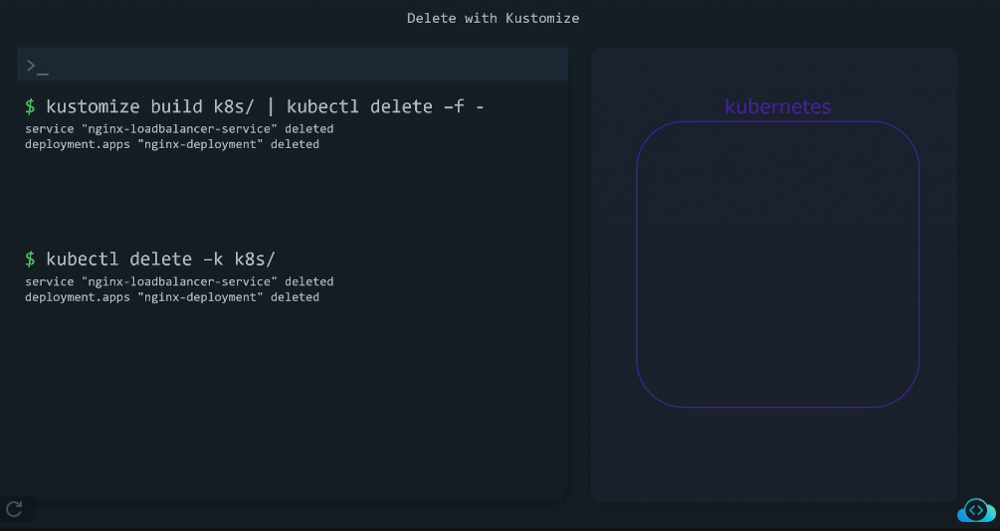

# 🧩 **Kustomize — Declarative Kubernetes Configuration at Scale**

> _“Stop copy-pasting YAML. Start customizing it properly.”_

---

## 📖 **What is Kustomize?**

**Kustomize** is a **configuration management tool** for Kubernetes YAMLs.
It’s built into `kubectl` (since v1.14) and helps you:

- ✅ Reuse **base manifests**
- ✅ Create multiple **environment overlays** (dev/staging/prod)
- ✅ Manage configuration **without forking YAML files**
- ✅ Apply **patches**, **labels**, **namespace overrides**, and **image versions** dynamically

---

<div align="center" style="background-color:#13191E; border-radius: 10px; border: 2px solid">
  
</div>

---

<div align="center" style="background-color:#13191E; border-radius: 10px; border: 2px solid">
  
</div>

---

## ⚙️ **How it Works**

Instead of having three sets of duplicated YAMLs for dev/stage/prod,  
Kustomize uses a **base** (shared config) and **overlays** (environment-specific overrides).

```ini
Base manifests → customized with → overlays → final YAMLs
```

Then you just run:

```bash
kubectl apply -k overlays/dev
```

and it generates environment-specific manifests **on the fly**.

---

<div align="center" style="background-color:#13191E; border-radius: 10px; border: 2px solid">
  
</div>

---

## 📁 **Directory Structure Example**

```ini
kustomize-demo/
├── base/
│   ├── deployment.yaml
│   ├── service.yaml
│   └── kustomization.yaml
└── overlays/
    ├── dev/
    │   └── extra-deployment-dev.yaml
    │   └── kustomization.yaml
    ├── staging/
    │   └── extra-deployment-staging.yaml
    │   └── kustomization.yaml
    └── prod/
    │   └── extra-deployment-prod.yaml
        └── kustomization.yaml
```

---

<div align="center" style="background-color:#13191E; border-radius: 10px; border: 2px solid">
  
</div>

---

## 🏛️ **Base Manifests**

### 🗂️ `base/deployment.yaml`

```yaml
apiVersion: apps/v1
kind: Deployment
metadata:
  name: myapi
spec:
  replicas: 2
  selector:
    matchLabels:
      app: myapi
  template:
    metadata:
      labels:
        app: myapi
    spec:
      containers:
        - name: myapi
          image: myacr.azurecr.io/myapi:latest
          ports:
            - containerPort: 80
```

### 🗂️ `base/service.yaml`

```yaml
apiVersion: v1
kind: Service
metadata:
  name: myapi
spec:
  type: ClusterIP
  ports:
    - port: 80
  selector:
    app: myapi
```

### 🧩 `base/kustomization.yaml`

```yaml
resources:
  - deployment.yaml
  - service.yaml
commonLabels:
  app.kubernetes.io/managed-by: kustomize
```

---

## ➕ **Overlays (`environment-specific`)**

Each environment can add **patches**, **labels**, **namespaces**, or **config changes**.

<div align="center" style="background-color:#13191E; border-radius: 10px; border: 2px solid">
  
</div>

---

### 🗂️ `overlays/dev/kustomization.yaml`

```yaml
bases:
  - ../../base

namePrefix: dev-
namespace: dev

patches:
  - target:
      kind: Deployment
      name: myapi
    patch: |-
      - op: replace
        path: /spec/replicas
        value: 1
  - target:
      kind: Deployment
      name: myapi
    patch: |-
      - op: replace
        path: /spec/template/spec/containers/0/image
        value: myacr.azurecr.io/myapi:dev
```

💡 Dev overlay:

- Prefixes names with `dev-`
- Uses 1 replica
- Uses `:dev` image tag

---

### 🗂️ `overlays/staging/kustomization.yaml`

```yaml
bases:
  - ../../base

namePrefix: staging-
namespace: staging

patchesStrategicMerge:
  - patch-deployment.yaml
```

and `patch-deployment.yaml`:

```yaml
apiVersion: apps/v1
kind: Deployment
metadata:
  name: myapi
spec:
  replicas: 2
  template:
    spec:
      containers:
        - name: myapi
          image: myacr.azurecr.io/myapi:staging
```

💡 Staging overlay:

- Uses `patchesStrategicMerge` (YAML merge patch style)
- Overrides only desired fields

---

### 🗂️ `overlays/prod/kustomization.yaml`

```yaml
bases:
  - ../../base

namePrefix: prod-
namespace: prod

images:
  - name: myacr.azurecr.io/myapi
    newTag: v1.2.0

replicas:
  - name: myapi
    count: 3

commonLabels:
  environment: production
```

💡 Prod overlay:

- Uses stable tag `v1.2.0`
- Scales replicas to 3
- Adds `environment: production` label

---

## 🧰 **Building and Applying**

You can **build** the final YAML output:

```bash
kubectl kustomize overlays/dev
```

Or directly **apply** it:

```bash
kubectl apply -k overlays/dev
```

---

## 💫 **Kustomize Features**

### 1️⃣ **commonLabels**

Automatically add labels to all resources.

```yaml
commonLabels:
  project: myapi
```

### 2️⃣ **namePrefix** / **nameSuffix**

Helps differentiate environments.

```yaml
namePrefix: dev-
```

→ Deployment `myapi` becomes `dev-myapi`.

### 3️⃣ **namespace**

Assigns all resources to a namespace.

```yaml
namespace: dev
```

### 4️⃣ **images**

Override container image tags or repos.

```yaml
images:
  - name: myacr.azurecr.io/myapi
    newTag: 3a1c9f7
```

### 5️⃣ **replicas**

Set replicas count dynamically.

```yaml
replicas:
  - name: myapi
    count: 2
```

### 6️⃣ **patchesStrategicMerge**

Merge YAML fields without overwriting the entire object.

```yaml
patchesStrategicMerge:
  - patch-deployment.yaml
```

### 7️⃣ **patchesJSON6902**

Use JSON patch syntax for fine control.

```yaml
patches:
  - target:
      kind: Deployment
      name: myapi
    patch: |-
      - op: replace
        path: /spec/replicas
        value: 5
```

### 8️⃣ **configMapGenerator / secretGenerator**

Generate ConfigMaps and Secrets automatically from files or literals.

```yaml
configMapGenerator:
  - name: myapi-config
    literals:
      - LOG_LEVEL=debug
      - API_URL=https://api.dev.local

secretGenerator:
  - name: myapi-secret
    literals:
      - DB_PASS=SuperSecret123
```

### 9️⃣ **resources**

Include other YAML files or even remote URLs.

```yaml
resources:
  - ../../base
  - https://raw.githubusercontent.com/kubernetes/ingress-nginx/main/deploy.yaml
```

---

## 🤺 **Kustomize vs Helm**

| Feature        | **Kustomize**            | **Helm**               |
| -------------- | ------------------------ | ---------------------- |
| Language       | Pure YAML                | Go templates           |
| Parameters     | via patches & generators | via values.yaml        |
| Complexity     | Simpler                  | More powerful          |
| Dependencies   | Manual (bases/overlays)  | Managed (dependencies) |
| Use case       | Environment overlays     | Full app packaging     |
| Rendering      | Built into `kubectl`     | Requires Helm CLI      |
| Learning curve | 🔰 Easy                  | ⚙️ Steeper             |

🧠 **Rule of thumb:**

- Use **Kustomize** for simple app configs and environment overlays.
- Use **Helm** for reusable charts or complex templating.

---

## ♾️ **Example in CI/CD (Azure DevOps)**

```yaml
stages:
  - stage: Deploy
    jobs:
      - job: KustomizeDeploy
        pool:
          vmImage: ubuntu-latest
        steps:
          - checkout: self
          - task: AzureCLI@2
            inputs:
              azureSubscription: "MyAzureConnection"
              scriptType: bash
              scriptLocation: inlineScript
              inlineScript: |
                az aks get-credentials -g MyRG -n MyAKS --overwrite-existing
                echo "Deploying to Dev environment"
                kubectl apply -k overlays/dev
```

> ✅ Simple, reproducible, and declarative: no templates or loops required.

---

## 📒 **Pro Tips**

<div align="center" style="background-color: #141a19ff;color: #a8a5a5ff; border-radius: 10px; border: 2px solid">

| Task                        | Trick                                                    |
| --------------------------- | -------------------------------------------------------- |
| Add new common label        | Add `commonLabels` in base                               |
| Patch only image tag        | Use `images` field                                       |
| Override namespace          | Use overlay `namespace:`                                 |
| Reuse one base for all envs | Keep base stateless; everything env-specific in overlays |
| Preview final YAML          | `kubectl kustomize overlays/prod`                        |
| Debug patch issues          | `kubectl kustomize overlays/dev --reorder none`          |

</div>

---

## 💡 Real-world pattern (Helm + Kustomize Hybrid)

You can even combine both:

- Use **Helm** to render templated manifests:

  ```bash
  helm template myapi ./chart > rendered.yaml
  ```

- Then manage environments with **Kustomize**:

  ```ini
  base/rendered.yaml → overlays/dev, staging, prod
  ```

---

## 🔚 Summary

<div align="center" style="background-color: #141a19ff;color: #a8a5a5ff; border-radius: 10px; border: 2px solid">

| Concept        | Description                               |
| -------------- | ----------------------------------------- |
| **Base**       | Common manifests shared across envs       |
| **Overlay**    | Environment-specific overrides            |
| **Patch**      | Modifies existing resources declaratively |
| **Generators** | Auto-create ConfigMaps and Secrets        |
| **Apply**      | `kubectl apply -k overlays/dev`           |
| **Goal**       | DRY, environment-aware YAML management    |

</div>

---

Would you like me to follow up with a **Helm + Kustomize hybrid CI/CD example** (where Helm generates manifests → Kustomize overlays apply env-specific patches → deployed via Azure DevOps)?
That’s a common pattern in large enterprises (and incredibly powerful).
