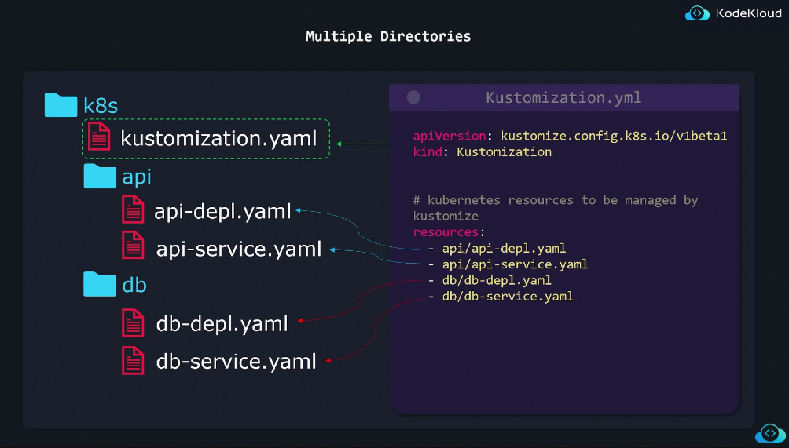
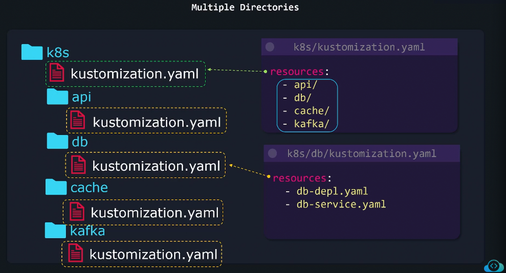

# 📜 **Kustomization.yaml — The Heart of Kustomize**

## 🔴 Real Problem

`kubectl apply -f .` works fine for **small apps**, because it applies all YAMLs in the folder (and subfolders).
But as your project grows, you’ll face these issues:

- 🌀 You want to **reuse** the same YAMLs for multiple environments (dev/staging/prod).
- 🧩 You need to **add or change metadata** (like labels or namespace) globally.
- 🧱 You want to **combine** only selected YAMLs, not _every_ file in the directory.
- 🚫 You may have helper files or test manifests you **don’t want to apply**.

That’s where **Kustomize** and its **`kustomization.yaml`** file come in.

---

## ✅ Solution: `kustomization.yaml`

Instead of blindly applying all files,
you tell Kustomize exactly **which YAMLs to include**, **how to modify them**, and **which ones to ignore**.

---

<div align="center" style="background-color:#13191E; border-radius: 10px; border: 2px solid">
  
</div>

---

<div align="center" style="background-color:#13191E; border-radius: 10px; border: 2px solid">
  
</div>

---

## 📝 Example

### Folder Structure

```ini
k8s/
├── deployment.yaml
├── service.yaml
├── secret-dev.yaml
├── test-config.yaml      # should not be deployed
├── .kustomizeignore
└── kustomization.yaml
```

---

### `kustomization.yaml`

```yaml
resources:
  - deployment.yaml
  - service.yaml
  - secret-dev.yaml

namespace: dev
commonLabels:
  app: myapi

images:
  - name: myacr.azurecr.io/myapi
    newTag: v1.2.3
```

✅ This file:

- Combines the 3 listed YAMLs
- Adds a common label (`app: myapi`)
- Sets namespace = `dev`
- Updates the image tag
- Builds a single clean manifest

---

### `.kustomizeignore`

```bash
test-config.yaml
*.backup
```

✅ This tells Kustomize:

> “Ignore these files even if they exist in this folder.”

So files like `test-config.yaml` or any `.backup` file are never processed.

---

## ⚙️ Apply it

```bash
kubectl apply -k k8s/
```

Kustomize:

1. Reads only the listed resources
2. Ignores files in `.kustomizeignore`
3. Applies transformations
4. Deploys the final manifest

---

## 📘 Why It’s Better Than `kubectl apply -f .`

<div align="center" style="background-color: #141a19ff;color: #a8a5a5ff; border-radius: 10px; border: 2px solid">

| Feature                  | `apply -f .` | `apply -k .` (Kustomize)    |
| ------------------------ | ------------ | --------------------------- |
| Applies all YAMLs        | ✅ Yes       | ✅ Yes (only selected)      |
| Global labels, namespace | ❌ No        | ✅ Yes                      |
| Image tag override       | ❌ No        | ✅ Yes                      |
| Ignore unwanted files    | ❌ No        | ✅ Yes (`.kustomizeignore`) |
| Reuse for multiple envs  | ❌ No        | ✅ Yes                      |
| Works with overlays      | ❌ No        | ✅ Yes                      |

</div>

---

## 💬 Summary

<div align="center" style="background-color: #141a19ff;color: #a8a5a5ff; border-radius: 10px; border: 2px solid">

| Concept                               | Description                                                             |
| ------------------------------------- | ----------------------------------------------------------------------- |
| **kustomization.yaml**                | Central file defining which manifests to include and how to modify them |
| **resources:**                        | List of YAML files or directories                                       |
| **commonLabels / namespace / images** | Add consistent metadata or overrides                                    |
| **.kustomizeignore**                  | Exclude specific files (like `.gitignore`)                              |
| **Command**                           | `kubectl apply -k <dir>` builds and applies all rules                   |
| **Main Benefit**                      | Clean, reusable, controlled deployments                                 |

</div>

---

✅ **In short:**

> `kubectl apply -f .` = "Throw everything inside."
>
> `kubectl apply -k .` = "Apply what I’ve defined, how I’ve defined it — clean and consistent."
