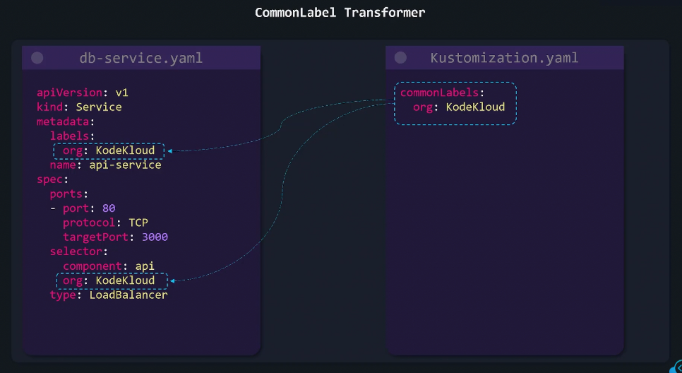
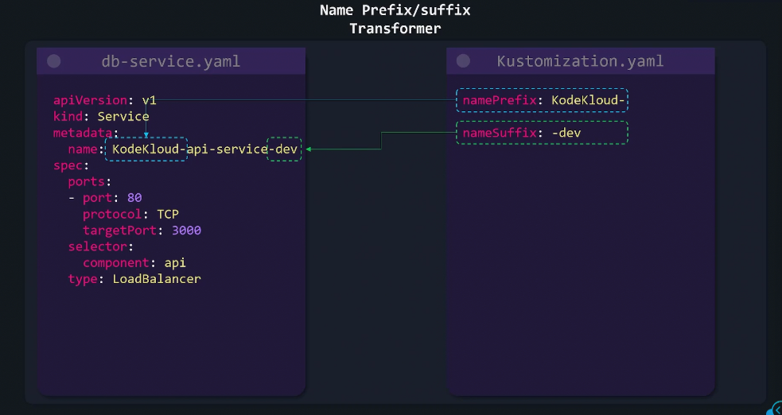
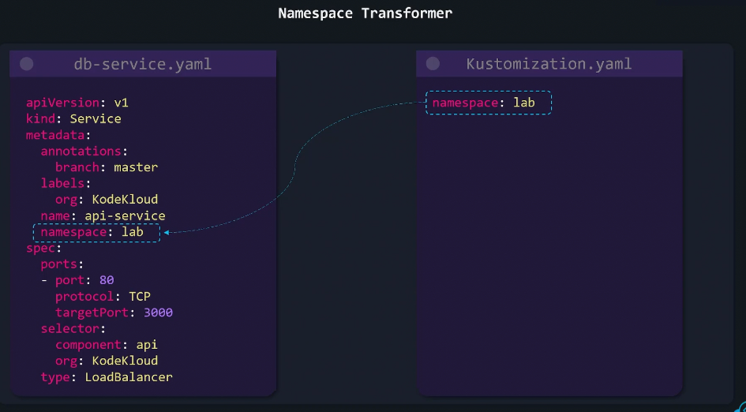
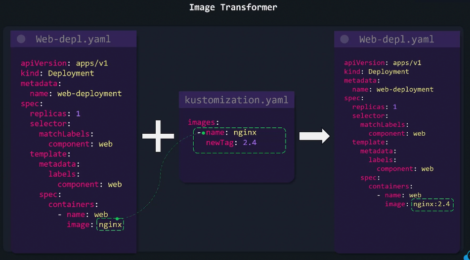

# ⚙️ **Transformers in Kustomize**

## 🔴 **Problem**

You have multiple YAML files — Deployment, Service, ConfigMap, etc.
And you need to apply the **same labels, annotations, image updates, or namespaces** across all of them.

Doing it manually means editing 10+ files — error-prone, hard to maintain. 😩

---

## ✅ **Solution**: **Transformers**

Kustomize has built-in **Transformers** that automatically apply global metadata changes
to every resource defined in your `kustomization.yaml`.

They transform YAMLs _before_ deployment — cleanly and declaratively.

---

## 🧰 **Common Transformers**

### 🏷️ 1. **CommonLabels**

Adds one or more labels to all resources.

```yaml
commonLabels:
  app: myapi
  environment: dev
```

---

<div align="center" style="background-color:#13191E; border-radius: 10px; border: 2px solid">
  
</div>

---

> ✅ Every manifest (Deployment, Service, etc.) gets these labels.

---

### 📝 2. **CommonAnnotations**

Adds shared annotations across all resources.

```yaml
commonAnnotations:
  maintainer: devops@mycompany.com
  owner: backend-team
```

---

<div align="center" style="background-color:#13191E; border-radius: 10px; border: 2px solid">
  
</div>

---

✅ Great for audit, search, or custom tooling.

---

### 🧩 3. **namePrefix / nameSuffix**

Adds a prefix or suffix to all resource names —
useful for separating environments or deployments.

```yaml
namePrefix: dev-
nameSuffix: -v1
```

---

<div align="center" style="background-color:#13191E; border-radius: 10px; border: 2px solid">
  
</div>

---

> ✅ `Deployment` named `api` becomes `dev-api-v1`.

---

### 🏠 4. **namespace**

Sets a namespace for all resources that support it.

```yaml
namespace: dev
```

✅ Automatically adds:

```yaml
metadata:
  namespace: dev
```

---

<div align="center" style="background-color:#13191E; border-radius: 10px; border: 2px solid">
  
</div>

---

> You no longer need to edit every YAML manually.

---

### 🐳 5. **images**

Overrides image repository, tag, or digest for all matching resources.

```yaml
images:
  - name: myacr.azurecr.io/myapi
    newName: myacr.azurecr.io/myapi
    newTag: v1.2.3
```

✅ Updates:

```yaml
containers:
  - image: myacr.azurecr.io/myapi:v1.2.3
```

---

<div align="center" style="background-color:#13191E; border-radius: 10px; border: 2px solid">
  
</div>

---

> Useful for CI/CD pipelines — just patch the image version dynamically.

---

## 🔧 Example: Putting It All Together

```yaml
resources:
  - deployment.yaml
  - service.yaml

commonLabels:
  app: myapi
  tier: backend

commonAnnotations:
  owner: dev-team
  contact: dev@mycompany.com

namePrefix: dev-
namespace: dev

images:
  - name: myacr.azurecr.io/myapi
    newTag: v2.0.0
```

✅ When you run:

```bash
kubectl apply -k .
```

All manifests get:

- Updated image tag
- Prefixed names
- Namespace “dev”
- Shared labels and annotations

---

## 💬 Summary

<div align="center" style="background-color: #141a19ff;color: #a8a5a5ff; border-radius: 10px; border: 2px solid">

| Transformer                 | Purpose                               |
| --------------------------- | ------------------------------------- |
| **commonLabels**            | Add global labels                     |
| **commonAnnotations**       | Add global annotations                |
| **namePrefix / nameSuffix** | Rename resources globally             |
| **namespace**               | Set same namespace for all            |
| **images**                  | Override image tags or repos globally |

</div>

---

🧠 **In short:**

> Transformers make your manifests consistent without editing each YAML manually.
