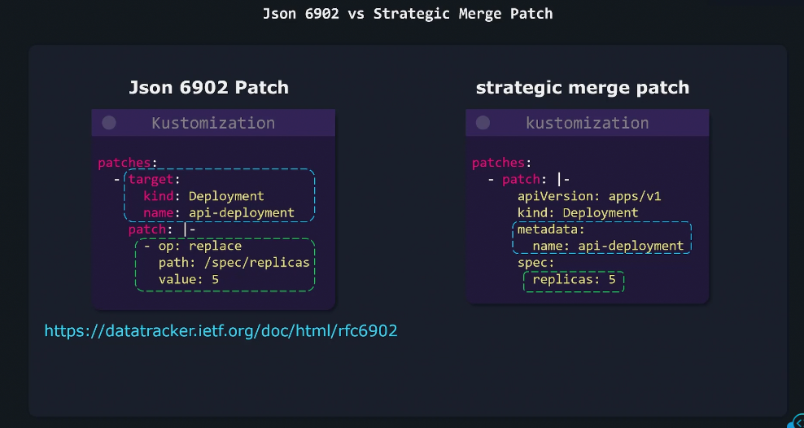
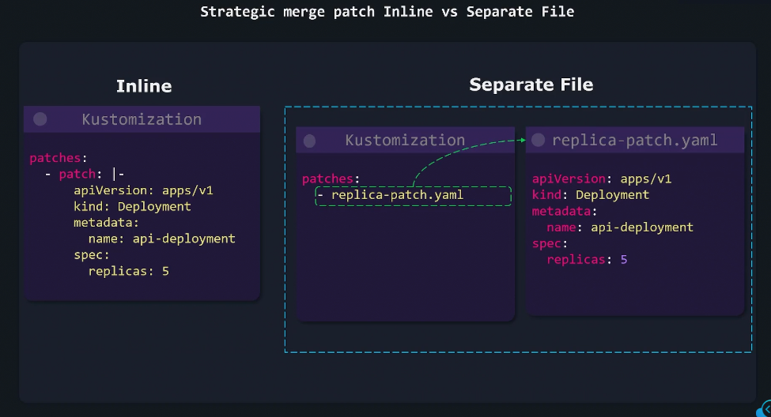
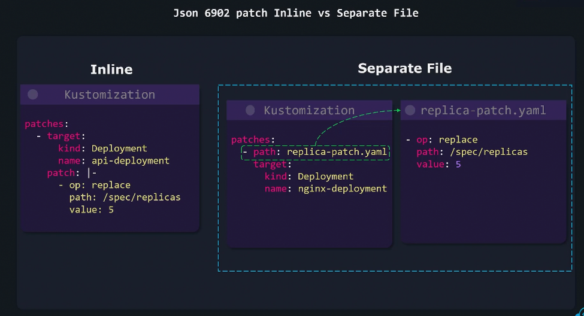

# ✍🏻 **Patches in Kustomize**

## 🔴 **Problem**

You often have a **base YAML** that works for all environments —
but each environment (dev, staging, prod) needs _small tweaks_.

Example:

- Dev = 1 replica
- Prod = 3 replicas
- QA = different environment variables

Without Kustomize, you’d copy-paste the same file 3 times → 😩 messy and hard to maintain.

---

## ✅ **Solution** — **Patches**

Kustomize lets you **apply targeted modifications** (patches)
to existing YAMLs without duplicating them.

There are **two main patch types** 👇

---

<div align="center" style="background-color:#13191E; border-radius: 10px; border: 2px solid">
  
</div>

---

## 📌 1. `patchesStrategicMerge` (YAML-based, simple & readable)

You create a small YAML file with _only the changes you need_,
and Kustomize merges it into the base resource.

---

<div align="center" style="background-color:#13191E; border-radius: 10px; border: 2px solid">
  
</div>

---

**🧩 Example:**

**Folder:**

```ini
k8s/
├── deployment.yaml
├── service.yaml
├── kustomization.yaml
└── patch-replicas.yaml
```

**`deployment.yaml`**

```yaml
apiVersion: apps/v1
kind: Deployment
metadata:
  name: myapi
spec:
  replicas: 1
  template:
    spec:
      containers:
        - name: myapi
          image: myacr.azurecr.io/myapi:v1
```

**`patch-replicas.yaml`**

```yaml
apiVersion: apps/v1
kind: Deployment
metadata:
  name: myapi
spec:
  replicas: 3
```

**`kustomization.yaml`**

```yaml
resources:
  - deployment.yaml
  - service.yaml

patchesStrategicMerge:
  - patch-replicas.yaml
```

**✅ Result:**

- Deployment now has `replicas: 3`
- Original YAML unchanged
- Patch merged cleanly

---

## 📌 2. `patchesJson6902` (JSON-based, precise control)

Used when you want **fine-grained control**, e.g.
patching deeply nested fields or specific array elements.

---

<div align="center" style="background-color:#13191E; border-radius: 10px; border: 2px solid">
  
</div>

---

**📝 Example:**

**`kustomization.yaml`**

```yaml
resources:
  - deployment.yaml

patchesJson6902:
  - target:
      group: apps
      version: v1
      kind: Deployment
      name: myapi
    path: patch-env.json
```

**`patch-env.json`**

```json
[
  {
    "op": "add",
    "path": "/spec/template/spec/containers/0/env",
    "value": [{ "name": "ENVIRONMENT", "value": "production" }]
  }
]
```

> ✅ Adds an environment variable without touching the main file.

---

## 🤺 **When to Use Which**

<div align="center" style="background-color: #141a19ff;color: #a8a5a5ff; border-radius: 10px; border: 2px solid">

| Patch Type              | Format | Best For             | Example                 |
| ----------------------- | ------ | -------------------- | ----------------------- |
| `patchesStrategicMerge` | YAML   | Simple overrides     | replicas, labels, image |
| `patchesJson6902`       | JSON   | Complex nested edits | env vars, probes, lists |

</div>

---

## 💬 **Summary**

<div align="center" style="background-color: #141a19ff;color: #a8a5a5ff; border-radius: 10px; border: 2px solid">

| Concept                   | Purpose                                               |
| ------------------------- | ----------------------------------------------------- |
| **patchesStrategicMerge** | Merge small YAML changes into base resources          |
| **patchesJson6902**       | Use JSON ops for fine-grained control                 |
| **Benefit**               | Override config per environment _without duplication_ |
| **Command**               | `kubectl apply -k <dir>` auto-applies patches         |

</div>

---

✅ **In short:**

> Patches = small YAMLs that override only what’s needed —
> keeping your base files clean and DRY.
