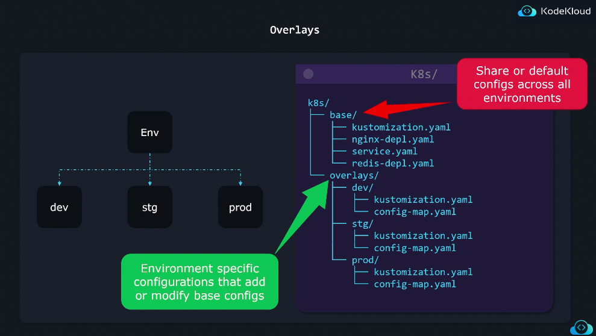
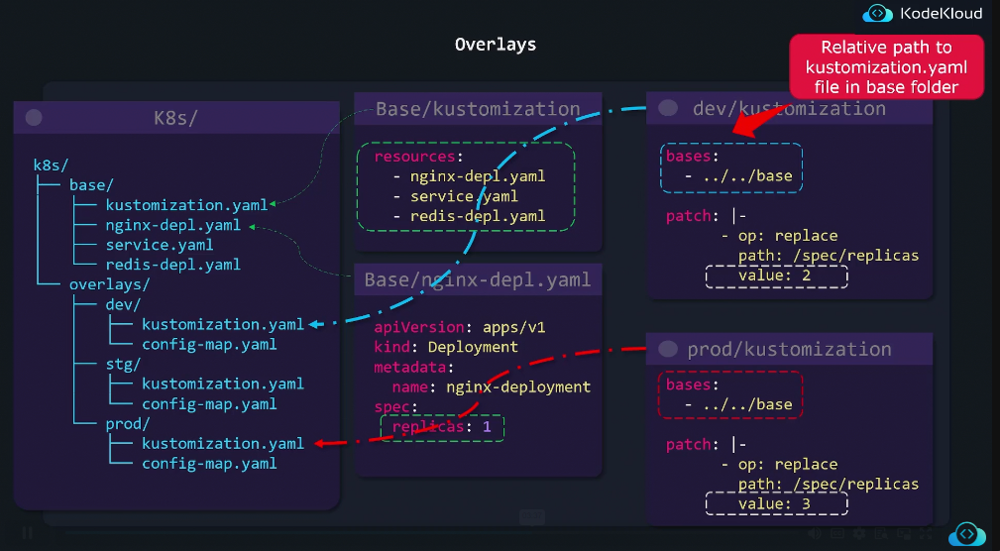
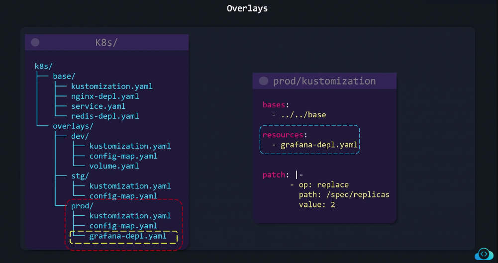

# 🎭 **Overlays in Kustomize**

## 🔴 **Problem**

You have one app, but **different environments** —  
each needs small tweaks (like image tag, replicas, or namespace).

You could create separate folders (`dev/`, `prod/`) and duplicate YAMLs…  
but that’s messy, hard to maintain, and causes drift 😩

---

## ✅ Solution — **Overlays**

Kustomize uses a **base + overlay** model:

- The **base** contains common configuration (shared across all envs)
- Each **overlay** adds its own small differences (via patches or transformers)

You build the environment you want with:

```bash
kubectl apply -k overlays/dev/
```

---

<div align="center" style="background-color:#13191E; border-radius: 10px; border: 2px solid">
  
</div>

---

<div align="center" style="background-color:#13191E; border-radius: 10px; border: 2px solid">
  
</div>

---

## 📝 **Example Folder Structure**

```ini
k8s/
├── base/
│   ├── deployment.yaml
│   ├── service.yaml
│   └── kustomization.yaml
└── overlays/
    ├── dev/
    │   ├── kustomization.yaml
    │   └── patch-replicas.yaml
    └── prod/
        ├── kustomization.yaml
        └── patch-replicas.yaml
```

---

### 📃 `base/kustomization.yaml`

```yaml
resources:
  - deployment.yaml
  - service.yaml

commonLabels:
  app: myapi
```

---

### 📃 `overlays/dev/patch-replicas.yaml`

```yaml
apiVersion: apps/v1
kind: Deployment
metadata:
  name: myapi
spec:
  replicas: 1
```

---

### 📃 `overlays/prod/patch-replicas.yaml`

```yaml
apiVersion: apps/v1
kind: Deployment
metadata:
  name: myapi
spec:
  replicas: 3
```

---

### 📃 `overlays/dev/kustomization.yaml`

```yaml
resources:
  - ../../base

patchesStrategicMerge:
  - patch-replicas.yaml

namespace: dev
namePrefix: dev-
```

---

### 📃 `overlays/prod/kustomization.yaml`

```yaml
resources:
  - ../../base

patchesStrategicMerge:
  - patch-replicas.yaml

namespace: prod
namePrefix: prod-
```

---

## 🚀 **How to Deploy**

```bash
kubectl apply -k overlays/dev/   # Deploy dev
kubectl apply -k overlays/prod/  # Deploy prod
```

> ✅ Both use the same base,  
> but each has its own replicas, namespace, and name prefix.

---

## 🎁 **Feature Based**

<div align="center" style="background-color:#13191E; border-radius: 10px; border: 2px solid">
  
</div>

---

## 💬 **Summary**

<div align="center" style="background-color: #141a19ff;color: #a8a5a5ff; border-radius: 10px; border: 2px solid">

| Concept     | Purpose                                          |
| ----------- | ------------------------------------------------ |
| **Base**    | Common resources shared across all envs          |
| **Overlay** | Environment-specific modifications               |
| **Command** | `kubectl apply -k overlays/<env>`                |
| **Benefit** | Reusable, clean, and environment-aware structure |

</div>

---

✅ **In short:**

> 🏗️ Base = shared blueprint  
> 🎭 Overlay = environment personality
