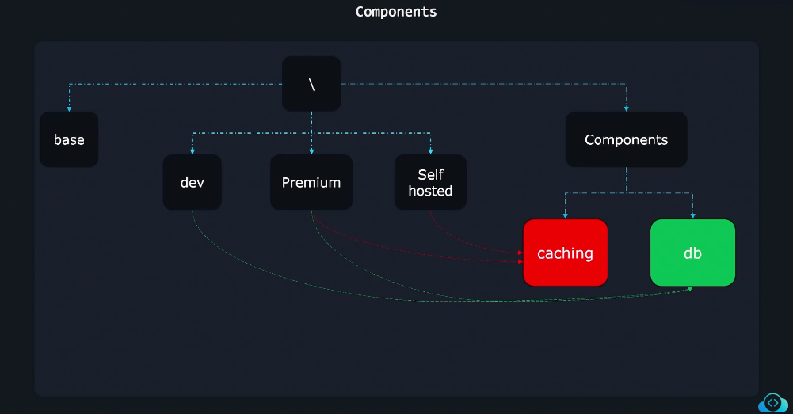
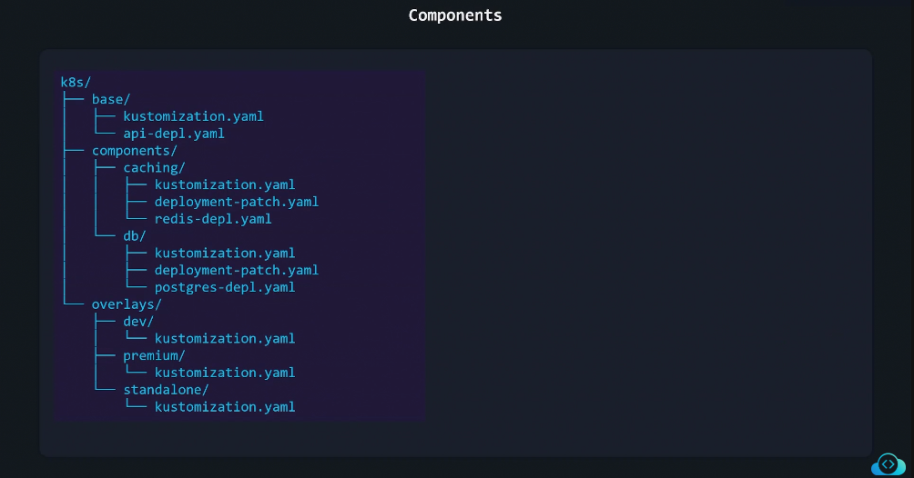
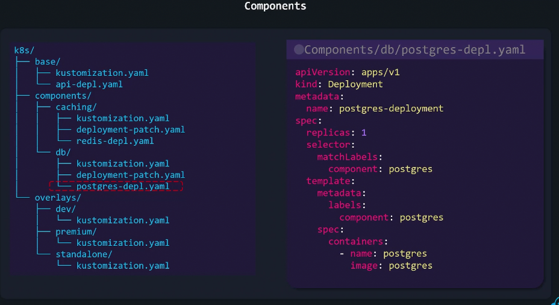
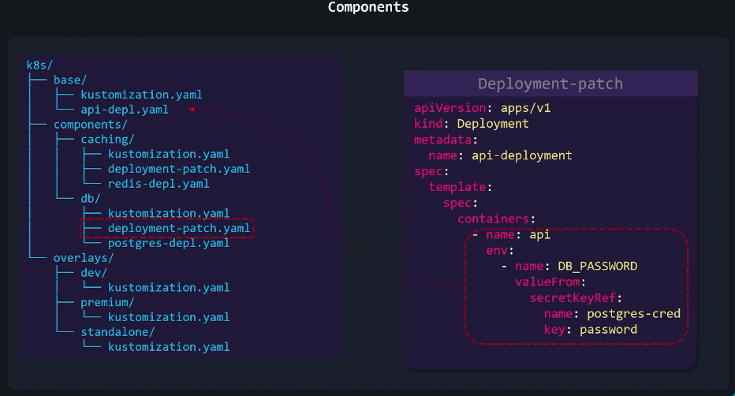
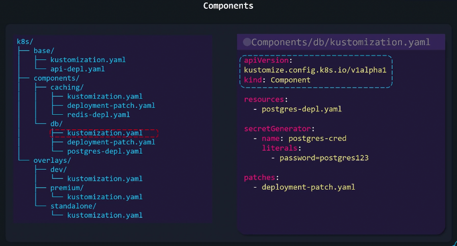
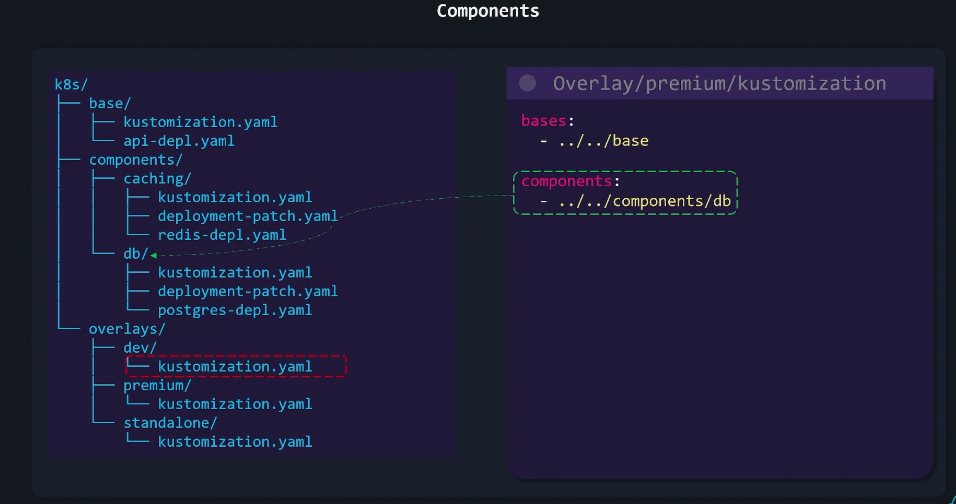

# 🧩 **Components in Kustomize**

## 🔴 **Problem**

Sometimes, you don’t just have _environments_ —  
you have **optional features** you might enable or disable per environment.

Examples:

- Monitoring with Prometheus
- Autoscaling with HPA
- Debug sidecar container
- Logging agent

You don’t want to duplicate those YAMLs everywhere —  
just plug them in when needed.

---

<div align="center" style="background-color:#13191E; border-radius: 10px; border: 2px solid">
  
</div>

---

## ✅ **Solution** — **Components**

**Components** are _like mini reusable modules_ containing:

- resources
- patches
- transformers

They can be included inside multiple overlays easily.  
Think of them like **"feature toggles"** for your Kubernetes setup.

---

<div align="center" style="background-color:#13191E; border-radius: 10px; border: 2px solid">
  
</div>

---

## ✍🏻 **Full Example**

### 1️⃣ Step 1

<div align="center" style="background-color:#13191E; border-radius: 10px; border: 2px solid">
  
</div>

### 2️⃣ Step 2

<div align="center" style="background-color:#13191E; border-radius: 10px; border: 2px solid">
  
</div>

### 3️⃣ Step 3

<div align="center" style="background-color:#13191E; border-radius: 10px; border: 2px solid">
  
</div>

### 4️⃣ Step 4

<div align="center" style="background-color:#13191E; border-radius: 10px; border: 2px solid">
  
</div>

### 5️⃣ Step 5

<div align="center" style="background-color:#13191E; border-radius: 10px; border: 2px solid">
  
</div>

---

## 📝 **Example Folder Structure**

```ini
k8s/
├── base/
│   ├── deployment.yaml
│   └── kustomization.yaml
├── components/
│   ├── hpa/
│   │   ├── hpa.yaml
│   │   └── kustomization.yaml
│   └── monitoring/
│       ├── service-monitor.yaml
│       └── kustomization.yaml
└── overlays/
    ├── dev/
    │   └── kustomization.yaml
    └── prod/
        └── kustomization.yaml
```

---

## 📝 **Example — Component Definition**

### `components/hpa/kustomization.yaml`

```yaml
resources:
  - hpa.yaml
```

### `components/hpa/hpa.yaml`

```yaml
apiVersion: autoscaling/v2
kind: HorizontalPodAutoscaler
metadata:
  name: myapi-hpa
spec:
  scaleTargetRef:
    apiVersion: apps/v1
    kind: Deployment
    name: myapi
  minReplicas: 2
  maxReplicas: 5
  metrics:
    - type: Resource
      resource:
        name: cpu
        target:
          type: Utilization
          averageUtilization: 70
```

---

## 📝 **Example — Using Components in an Overlay**

### `overlays/prod/kustomization.yaml`

```yaml
resources:
  - ../../base

components:
  - ../../components/hpa
  - ../../components/monitoring

namespace: prod
namePrefix: prod-
```

✅ This overlay will:

- Reuse the base resources
- Include HPA and monitoring components
- Apply any common labels or namespace

---

## ⚙️ **Apply Command**

```bash
kubectl apply -k overlays/prod/
```

Kustomize builds:

- Base manifests
- HPA and monitoring components
- Then merges all configurations together

---

## 💬 **Summary**

| Concept        | Purpose                                                                  |
| -------------- | ------------------------------------------------------------------------ |
| **Components** | Optional reusable feature modules                                        |
| **Usage**      | Include under `components:` in `kustomization.yaml`                      |
| **Contents**   | Can include `resources`, `patches`, or `transformers`                    |
| **Benefit**    | Reuse features (like monitoring or autoscaling) across multiple overlays |

---

🧠 **In short:**

> **Base** = common resources
> **Overlay** = per environment
> **Component** = reusable optional feature
