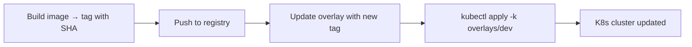
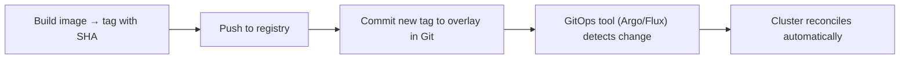

# 🚀 **Integrating Kustomize in CI/CD — Push-based vs Pull-based (GitOps)**

## 🧩 **What’s the goal?**

When you use **Kustomize** in CI/CD, your main goal is to **inject the right image tag** (like a commit SHA) into the overlay and deploy to the correct environment — _without duplicating YAMLs_.

There are two major integration styles 👇

<div align="center" style="background-color: #141a19ff;color: #a8a5a5ff; border-radius: 10px; border: 2px solid">

| Type                    | Description                                                                                | Example tools                |
| ----------------------- | ------------------------------------------------------------------------------------------ | ---------------------------- |
| **Push-based**          | CI/CD pipeline builds, edits Kustomize overlay, and _pushes directly_ to the cluster       | GitHub Actions, Azure DevOps |
| **Pull-based (GitOps)** | CI/CD pipeline commits overlay changes to Git; the _cluster pulls & applies_ automatically | Argo CD, Flux CD             |

</div>

---

## **1️⃣ Push-based CI/CD — Pipeline pushes to cluster**

### 🔴 **The Problem**

You’ve already built your Docker image and pushed it to the registry.
Now you want to deploy it — but your `deployment.yaml` still points to `image: myapi:latest`.

That’s bad 😬 — `latest` breaks traceability and rollbacks.

---

### ✅ **The Solution** — Push-based Kustomize Deployment

Your CI/CD pipeline will:

1. Build the image and tag it (e.g., `:sha256` or commit SHA).
2. Update the overlay using `kustomize edit set image`.
3. Apply it with `kubectl apply -k overlays/<env>`.

---

### 📂 **Folder Structure**

```ini
k8s/
├── base/
│   ├── deployment.yaml
│   └── kustomization.yaml
└── overlays/
    ├── dev/kustomization.yaml
    └── prod/kustomization.yaml
```

---

### 📝 Base example — `base/deployment.yaml`

```yaml
apiVersion: apps/v1
kind: Deployment
metadata:
  name: myapi
spec:
  replicas: 2
  template:
    spec:
      containers:
        - name: myapi
          image: myacr.azurecr.io/myapi # no tag here!
```

---

### 📝 Dev overlay — `overlays/dev/kustomization.yaml`

```yaml
resources:
  - ../../base
images:
  - name: myacr.azurecr.io/myapi
    newTag: PLACEHOLDER
namespace: dev
```

---

### 📝 CI/CD pipeline example (GitHub Actions or Azure DevOps)

```bash
# already logged into Kubernetes & registry
cd k8s/overlays/dev
kustomize edit set image myacr.azurecr.io/myapi=myacr.azurecr.io/myapi:${GITHUB_SHA}
kubectl apply -k .
```

✅ Result:

- Overlay gets the SHA tag
- Kustomize rebuilds final manifest
- Cluster gets the exact version you built

---

### 💬 Best Practices for Push-based Pipelines

<div align="center" style="background-color: #141a19ff;color: #a8a5a5ff; border-radius: 10px; border: 2px solid">

| Practice                       | Why                                                   |
| ------------------------------ | ----------------------------------------------------- |
| Use **SHA tags**, not `latest` | ensures traceability & rollback                       |
| Use `kustomize edit set image` | avoids YAML parsing errors                            |
| Keep overlays small            | only env differences (namespace, replicas, image tag) |
| Add approvals for prod         | via GitHub/Azure Environments                         |
| Use digest for production      | for true immutability                                 |

</div>

---

### 🧠 Typical Flow

<div align="center" style="background-color: #141a19ff;color: #a8a5a5ff; border-radius: 10px; border: 2px solid">



</div>

---

## **2️⃣ Pull-based (GitOps) — Cluster pulls from Git**

---

### 🔴 **The Problem**

You have multiple clusters or teams, and you want:

- Automated drift correction 🧲
- Clear audit trail 🧾
- No pipelines touching your cluster directly

---

### ✅ **The Solution** — GitOps with Kustomize

Your pipeline:

1. Builds & pushes image.
2. Updates the overlay (e.g., sets image tag).
3. Commits and pushes the change to Git.

A GitOps operator like **Argo CD** or **Flux**:

- Watches the repo.
- Detects the change.
- Applies it automatically.

---

### 📝 Example: Argo CD

#### `Application.yaml`

```yaml
apiVersion: argoproj.io/v1alpha1
kind: Application
metadata:
  name: myapi-dev
spec:
  project: default
  source:
    repoURL: https://github.com/org/repo
    targetRevision: main
    path: k8s/overlays/dev
  destination:
    server: https://kubernetes.default.svc
    namespace: dev
  syncPolicy:
    automated:
      prune: true
      selfHeal: true
```

#### CI step (after pushing image)

```bash
cd k8s/overlays/dev
kustomize edit set image myacr.azurecr.io/myapi=myacr.azurecr.io/myapi:${GITHUB_SHA}
git commit -am "Promote dev to ${GITHUB_SHA}"
git push
```

✅ Argo CD detects the commit → syncs cluster → done!

---

### 📝 Example: Flux CD

```yaml
apiVersion: kustomize.toolkit.fluxcd.io/v1
kind: Kustomization
metadata:
  name: myapi-dev
  namespace: flux-system
spec:
  interval: 1m
  path: ./k8s/overlays/dev
  prune: true
  sourceRef:
    kind: GitRepository
    name: platform-config
```

Same CI step as above → Flux sees new commit → reconciles.

---

### 💬 Best Practices for GitOps + Kustomize

<div align="center" style="background-color: #141a19ff;color: #a8a5a5ff; border-radius: 10px; border: 2px solid">

| Practice                       | Why                              |
| ------------------------------ | -------------------------------- |
| Commit image SHA to overlay    | makes Git the source of truth    |
| Never let CI apply to cluster  | keeps reconciliation safe        |
| Use Argo CD or Flux automation | ensures self-healing deployments |
| Store only declarative YAML    | no scripts, no imperatives       |
| Use PR reviews for promotion   | built-in approval gates          |

</div>

---

### 🧠 Typical Flow

<div align="center" style="background-color: #141a19ff;color: #a8a5a5ff; border-radius: 10px; border: 2px solid">



</div>

---

## ⚖️ **Push-based vs Pull-based Comparison**

<div align="center" style="background-color: #141a19ff;color: #a8a5a5ff; border-radius: 10px; border: 2px solid">

| Feature               | Push-based CI/CD           | Pull-based GitOps                |
| --------------------- | -------------------------- | -------------------------------- |
| Who applies manifests | CI/CD pipeline             | GitOps controller (Argo/Flux)    |
| Deployment trigger    | Code push / pipeline run   | Git commit                       |
| Drift correction      | Manual                     | Automatic (self-heal)            |
| Audit trail           | Pipeline logs              | Git history                      |
| Multi-cluster support | Harder                     | Easy (per cluster Kustomization) |
| Setup complexity      | Low                        | Medium (needs controller)        |
| Security              | Pipeline needs kube access | Cluster-only (safer)             |

</div>

---

## ✅ **Summary**

<div align="center" style="background-color: #141a19ff;color: #a8a5a5ff; border-radius: 10px; border: 2px solid">

| Concept                 | Description                                                            |
| ----------------------- | ---------------------------------------------------------------------- |
| **Push-based**          | Pipeline edits Kustomize overlay & applies directly                    |
| **Pull-based (GitOps)** | Pipeline commits overlay update → Argo/Flux syncs                      |
| **Both use**            | `kustomize edit set image` to inject new image tag                     |
| **Best for**            | Push → small teams / few clusters </br> Pull → large or regulated orgs |
| **Shared rule**         | Base YAML = static, Overlays = environment logic                       |

</div>

---

✨ **In short:**

> **Push-based** = “CI/CD drives deployment.”  
> **Pull-based** = “Cluster self-heals from Git.”
