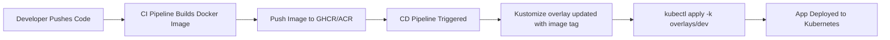

# 🧩 **CI/CD with Kustomize — Step-by-Step Guide**

## 📖 **What You’ll Build**

You have:

- A simple **ASP.NET Core API**
- Dockerized and pushed to a container registry (ACR or GHCR)
- Kubernetes manifests managed via **Kustomize** (`base/`, `overlays/dev`, `overlays/prod`)
- Two pipelines:

  - **CI (Build & Push)** → builds Docker image and pushes it
  - **CD (Deploy)** → applies Kustomize manifests to AKS or any K8s cluster

---

## 📁 **Example Project Structure**

```ini
.
├── src/
│   └── MyApi/
│       ├── Dockerfile
│       └── Program.cs
├── k8s/
│   ├── base/
│   │   ├── deployment.yaml
│   │   ├── service.yaml
│   │   └── kustomization.yaml
│   └── overlays/
│       ├── dev/kustomization.yaml
│       └── prod/kustomization.yaml
└── .github/workflows/
    └── ci-cd.yaml (for GitHub Actions)
```

---

## 🧰 **GitHub Actions Example — with GHCR**

### 🪣 1. CI Pipeline (Build and Push Docker Image)

```yaml
name: CI - Build and Push Docker Image

on:
  push:
    branches:
      - main

jobs:
  build-and-push:
    runs-on: ubuntu-latest
    steps:
      - name: Checkout Code
        uses: actions/checkout@v4

      - name: Log in to GHCR
        run: echo "${{ secrets.GITHUB_TOKEN }}" | docker login ghcr.io -u ${{ github.actor }} --password-stdin

      - name: Build Docker Image
        run: |
          IMAGE_TAG=${{ github.sha }}
          docker build -t ghcr.io/${{ github.repository }}/myapi:$IMAGE_TAG -f src/MyApi/Dockerfile .

      - name: Push Docker Image
        run: |
          IMAGE_TAG=${{ github.sha }}
          docker push ghcr.io/${{ github.repository }}/myapi:$IMAGE_TAG

      - name: Save Image Tag for Deployment
        run: echo "IMAGE_TAG=${{ github.sha }}" >> $GITHUB_ENV
```

✅ **What happens here**

- Each push builds a new Docker image tagged with the commit SHA
- Image is pushed to `ghcr.io/<user>/<repo>/myapi:<commit>`
- The tag (commit SHA) is stored for CD to use later

---

### 🚀 2.CD Pipeline (Deploy to Kubernetes)

**🧠 How Kustomize Fits In:**

Each environment has its own overlay that controls:

- Image tag (`images:` field)
- Replica counts
- Namespace
- Labels

Example `k8s/overlays/dev/kustomization.yaml`:

```yaml
bases:
  - ../../base

namespace: dev
images:
  - name: ghcr.io/youruser/myapi
    newTag: latest
```

During CD, we dynamically update the image tag from CI.

---

**Examples:**

```yaml
name: CD - Deploy with Kustomize

on:
  workflow_run:
    workflows: ["CI - Build and Push Docker Image"]
    types:
      - completed

jobs:
  deploy:
    runs-on: ubuntu-latest
    environment: dev
    steps:
      - name: Checkout Code
        uses: actions/checkout@v4

      - name: Setup Kubectl
        uses: azure/setup-kubectl@v4

      - name: Set Image Tag
        run: |
          sed -i "s/newTag: .*/newTag: ${{ github.sha }}/" k8s/overlays/dev/kustomization.yaml

      - name: Apply Kustomize
        run: |
          kubectl apply -k k8s/overlays/dev
```

✅ **Flow:**

1. CD triggers after CI finishes
2. It updates the `newTag:` field in the overlay dynamically
3. Applies manifests via `kubectl apply -k`

---

## 🧰 **Azure DevOps Version**

### 🪣 1. CI Pipeline (Build & Push to ACR)

```yaml
trigger:
  - main

pool:
  vmImage: ubuntu-latest

variables:
  imageName: "myapi"

steps:
  - task: Docker@2
    displayName: Build and Push Image
    inputs:
      command: buildAndPush
      repository: $(imageName)
      containerRegistry: "MyACRServiceConnection"
      dockerfile: "src/MyApi/Dockerfile"
      tags: |
        $(Build.BuildId)
```

✅ Pushes image to `myacr.azurecr.io/myapi:<BuildId>`

---

### 🚀 2. CD Pipeline (Deploy with Kustomize)

```yaml
trigger: none

pool:
  vmImage: ubuntu-latest

variables:
  acrName: "myacr.azurecr.io"
  imageName: "myapi"
  namespace: "dev"

steps:
  - checkout: self

  - task: AzureCLI@2
    displayName: Deploy using Kustomize
    inputs:
      azureSubscription: "MyAzureConnection"
      scriptType: bash
      scriptLocation: inlineScript
      inlineScript: |
        az aks get-credentials -g MyRG -n MyAKS --overwrite-existing

        echo "Updating image tag..."
        sed -i "s/newTag:.*/newTag: $(Build.BuildId)/" k8s/overlays/dev/kustomization.yaml

        echo "Deploying..."
        kubectl apply -k k8s/overlays/dev
```

✅ Uses `sed` to inject the new tag and applies via Kustomize.

---

## ✅ **Best Practices for CI/CD with Kustomize**

<div align="center" style="background-color: #141a19ff;color: #a8a5a5ff; border-radius: 10px; border: 2px solid">

| Practice                            | Why                                                   |
| ----------------------------------- | ----------------------------------------------------- |
| **Use Git SHA or Build ID as tag**  | Guarantees unique image per build                     |
| **Avoid `latest`**                  | Causes cache & rollback confusion                     |
| **Store image tag in env variable** | Easy to reuse across stages                           |
| **Keep overlays versioned in Git**  | Full history of environment config                    |
| **Validate manifests before apply** | Use `kubectl kustomize overlays/dev --dry-run=client` |
| **Automate image updates**          | Use `sed` or `kustomize edit set image`               |

</div>

---

## 🧩 **Example Command for Manual Image Update**

Instead of using `sed`, you can use Kustomize’s built-in command:

```bash
kustomize edit set image ghcr.io/user/myapi=ghcr.io/user/myapi:abcd123
```

This updates `newTag:` automatically and safely.

---

## 🔮 Full CI/CD Flow Diagram

<div align="center" style="background-color: #141a19ff;color: #a8a5a5ff; border-radius: 10px; border: 2px solid">



</div>

---

## 🧩 Summary

<div align="center" style="background-color: #141a19ff;color: #a8a5a5ff; border-radius: 10px; border: 2px solid">

| Stage    | Tool                                 | Purpose                          |
| -------- | ------------------------------------ | -------------------------------- |
| CI       | GitHub Actions / Azure DevOps        | Build & push image               |
| CD       | GitHub Actions / Azure DevOps        | Deploy with Kustomize            |
| Registry | GHCR / ACR                           | Store versioned container images |
| Overlay  | Kustomize                            | Manage env-specific configs      |
| Result   | Automated, environment-aware deploys | 🚀                               |

</div>
