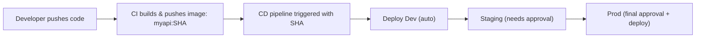

# 🧩 CI/CD with Kustomize (Simplified)

## 🧱 Folder setup

```ini
k8s/
├── base/
│   ├── deployment.yaml
│   ├── service.yaml
│   └── kustomization.yaml
└── overlays/
    ├── dev/kustomization.yaml
    ├── staging/kustomization.yaml
    └── prod/kustomization.yaml
```

### base/deployment.yaml

```yaml
apiVersion: apps/v1
kind: Deployment
metadata:
  name: myapi
spec:
  replicas: 2
  selector:
    matchLabels:
      app: myapi
  template:
    metadata:
      labels:
        app: myapi
    spec:
      containers:
        - name: myapi
          image: myacr.azurecr.io/myapi # No tag here
          ports:
            - containerPort: 80
```

Each **overlay** just sets a tag:

```yaml
images:
  - name: myacr.azurecr.io/myapi
    newTag: placeholder
```

---

## ⚙️ CI Pipeline (Build and Push)

### Azure DevOps version (builds once)

```yaml
trigger:
  - main

pool:
  vmImage: ubuntu-latest

variables:
  acrName: myacr
  imageName: myapi

steps:
  - task: Docker@2
    displayName: Build & Push
    inputs:
      containerRegistry: "MyACRServiceConnection"
      repository: $(imageName)
      command: buildAndPush
      Dockerfile: "src/MyApi/Dockerfile"
      tags: |
        $(Build.SourceVersion)
```

✅ This builds the image and pushes it as
`myacr.azurecr.io/myapi:<commit_sha>`

---

## 🚀 CD Pipeline (Deploy to AKS)

We’ll have 3 stages → Dev → Staging → Prod.

Each stage updates the Kustomize overlay with the new image tag.

---

### Example full pipeline

```yaml
trigger: none

parameters:
  - name: sha
    displayName: "Image SHA to deploy"
    type: string

variables:
  acr: myacr.azurecr.io
  image: myapi
  rg: MyRG
  aks: MyAKS
  kustomizeRoot: k8s/overlays

pool:
  vmImage: ubuntu-latest

stages:
  # -------------------- DEV --------------------
  - stage: Dev
    displayName: Deploy to Dev
    jobs:
      - job: dev
        environment: dev
        steps:
          - checkout: self
          - task: AzureCLI@2
            inputs:
              azureSubscription: MyAzureConnection
              scriptType: bash
              inlineScript: |
                az aks get-credentials -g $(rg) -n $(aks) --overwrite-existing
                cd $(kustomizeRoot)/dev
                kustomize edit set image $(acr)/$(image)=$(acr)/$(image):${{ parameters.sha }}
                kubectl apply -k .
  # -------------------- STAGING --------------------
  - stage: Staging
    displayName: Deploy to Staging
    dependsOn: Dev
    jobs:
      - job: stg
        environment: staging # <-- add approval in ADO
        steps:
          - checkout: self
          - task: AzureCLI@2
            inputs:
              azureSubscription: MyAzureConnection
              scriptType: bash
              inlineScript: |
                az aks get-credentials -g $(rg) -n $(aks) --overwrite-existing
                cd $(kustomizeRoot)/staging
                kustomize edit set image $(acr)/$(image)=$(acr)/$(image):${{ parameters.sha }}
                kubectl apply -k .
  # -------------------- PROD --------------------
  - stage: Prod
    displayName: Deploy to Prod
    dependsOn: Staging
    jobs:
      - job: prod
        environment: prod # <-- add approval in ADO
        steps:
          - checkout: self
          - task: AzureCLI@2
            inputs:
              azureSubscription: MyAzureConnection
              scriptType: bash
              inlineScript: |
                az aks get-credentials -g $(rg) -n $(aks) --overwrite-existing
                cd $(kustomizeRoot)/prod
                kustomize edit set image $(acr)/$(image)=$(acr)/$(image):${{ parameters.sha }}
                kubectl apply -k .
```

✅ **What happens**

1. CI builds once → pushes to ACR.
2. CD pipeline is manually run (or triggered) with the image SHA.
3. Each stage deploys to its environment sequentially.
4. Approvals protect staging/prod.

---

## 🧠 Best Practices (Easy to remember)

| Rule                           | Why                         |
| ------------------------------ | --------------------------- |
| Use commit SHA as tag          | unique and traceable builds |
| Never use `latest`             | not deterministic           |
| Keep overlays per environment  | cleaner, reusable base      |
| Use `kustomize edit set image` | safe and idempotent         |
| Use approvals in staging/prod  | prevent bad promotions      |
| Optional: pin digest for prod  | fully immutable deployment  |

---

## 🔍 Flow Summary



---

✅ **Result**

- Simple YAML.
- No repeated manifests.
- Same image promoted across all environments.
- Fully traceable and GitOps-friendly.
