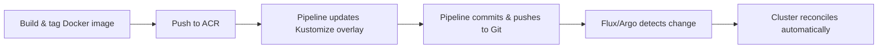

# 🧩 **Azure DevOps + Kustomize + GitOps (Flux/ArgoCD)**

## 🎯 **Goal**

- CI builds & pushes Docker image to **Azure Container Registry (ACR)**
- CI **updates Kustomize overlay** (injects the new image tag)
- CI commits & pushes that change to Git
- **Flux** or **Argo CD** auto-syncs the cluster to match Git state

No direct `kubectl apply` from pipeline — the **cluster pulls from Git**.

---

## 📂 **Repo structure**

```ini
.
├── src/MyApi/
│   └── Dockerfile
├── k8s/
│   ├── base/
│   │   ├── deployment.yaml
│   │   ├── service.yaml
│   │   └── kustomization.yaml
│   └── overlays/
│       ├── dev/kustomization.yaml
│       ├── staging/kustomization.yaml
│       └── prod/kustomization.yaml
└── azure-pipelines/
    └── ci-gitops.yml
```

---

## ⚙️ **Kustomize setup**

### 🧩 `base/deployment.yaml`

```yaml
apiVersion: apps/v1
kind: Deployment
metadata:
  name: myapi
spec:
  replicas: 2
  selector:
    matchLabels:
      app: myapi
  template:
    metadata:
      labels:
        app: myapi
    spec:
      containers:
        - name: myapi
          image: myacr.azurecr.io/myapi # no tag here
          ports:
            - containerPort: 80
```

---

### 🧩 `overlays/dev/kustomization.yaml`

```yaml
resources:
  - ../../base

namespace: dev
namePrefix: dev-
images:
  - name: myacr.azurecr.io/myapi
    newTag: placeholder
```

✅ The pipeline will replace `placeholder` with your **commit SHA**.

---

## 🧰 **Flux or Argo setup (cluster side)**

### 🧩 For **Flux**

```yaml
apiVersion: kustomize.toolkit.fluxcd.io/v1
kind: Kustomization
metadata:
  name: myapi-dev
  namespace: flux-system
spec:
  interval: 1m
  path: ./k8s/overlays/dev
  prune: true
  sourceRef:
    kind: GitRepository
    name: platform-config
```

### 🧩 For **Argo CD**

```yaml
apiVersion: argoproj.io/v1alpha1
kind: Application
metadata:
  name: myapi-dev
spec:
  project: default
  source:
    repoURL: https://github.com/myorg/myrepo
    targetRevision: main
    path: k8s/overlays/dev
  destination:
    server: https://kubernetes.default.svc
    namespace: dev
  syncPolicy:
    automated:
      prune: true
      selfHeal: true
```

Both continuously watch your Git repo and reconcile automatically.

---

## 🏗️ **Azure DevOps CI (GitOps style)**

### File: `azure-pipelines/ci-gitops.yml`

```yaml
trigger:
  - main

pool:
  vmImage: ubuntu-latest

variables:
  acrName: myacr
  registry: $(acrName).azurecr.io
  imageName: myapi
  overlaysPath: k8s/overlays/dev

steps:
  - checkout: self
    persistCredentials: true # allows pushing back to Git

  # Build and push image
  - task: AzureCLI@2
    displayName: Build & Push to ACR
    inputs:
      azureSubscription: "MyAzureConnection"
      scriptType: bash
      scriptLocation: inlineScript
      inlineScript: |
        az acr login -n $(acrName)
        IMAGE="$(registry)/$(imageName)"
        SHA=$(Build.SourceVersion)
        docker build -f src/MyApi/Dockerfile -t "$IMAGE:$SHA" .
        docker push "$IMAGE:$SHA"
        echo "##vso[task.setvariable variable=SHA;isOutput=true]$SHA"

  # Update overlay and commit the change
  - script: |
      cd $(overlaysPath)
      kustomize edit set image $(registry)/$(imageName)=$(registry)/$(imageName):$(Build.SourceVersion)
      git config user.name "azure-pipelines"
      git config user.email "pipeline@mycompany.com"
      git add .
      git commit -m "Promote dev -> $(Build.SourceVersion)"
      git push origin HEAD:main
    displayName: "Update overlay & push to Git"
```

✅ What happens:

1. Pipeline builds and pushes image
2. Kustomize overlay updated with new SHA
3. Commit pushed to Git
4. **Flux or Argo CD auto-syncs the cluster**

No need for `kubectl` or credentials in the pipeline.

---

## 🧠 **Visual Flow**



---

## 💡 **Why This Is Best Practice**

| Feature             | Benefit                                     |
| ------------------- | ------------------------------------------- |
| 🔒 Cluster security | Pipeline never needs cluster credentials    |
| 🧾 Audit trail      | Git keeps a full deployment history         |
| 🔁 Self-healing     | Flux/Argo reconciles drift automatically    |
| 🧠 Clear promotions | Promote between environments via PRs        |
| 🧰 Modular design   | Uses same overlays (Kustomize) across tools |

---

## ✅ **Summary**

| Concept               | Description                                    |
| --------------------- | ---------------------------------------------- |
| **Pipeline job**      | Builds image, pushes to ACR                    |
| **Kustomize**         | Defines manifests per environment              |
| **Overlay edit**      | Pipeline injects the image tag                 |
| **GitOps controller** | Syncs cluster to Git automatically             |
| **Result**            | Secure, auditable, and declarative delivery 🚀 |

---

✨ **In short:**

> CI builds the image 🏗️ →  
> commits the new tag to Git 🧾 →  
> Flux/Argo updates the cluster 🔁
