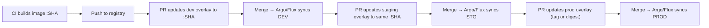

# 👯 **Multi-environment GitOps with Kustomize**

_flow (dev → staging → prod) in a clean, readable, “copy-paste” style. short, practical, and approval-friendly!_

---

## 🧭 **Goal**

- **Build once** → image tagged with **commit SHA**
- Promote that **same SHA** across **dev → staging → prod**
- Promotions happen via **Git PRs/approvals** (no kubectl in CI)
- **Argo CD / Flux** continuously sync from Git

---

## 📁 Repo layout (single repo, 1 app)

```ini
.
├─ src/MyApi/
├─ k8s/
│  ├─ base/                   # common manifests (no image tag)
│  └─ overlays/
│     ├─ dev/kustomization.yaml
│     ├─ staging/kustomization.yaml
│     └─ prod/kustomization.yaml
└─ .github/ or azure-pipelines/ (your CI YAML)
```

**base/deployment.yaml (no tag):**

```yaml
containers:
  - name: myapi
    image: REGISTRY/myapi # no :tag here
```

**overlay (dev) sets the tag — staging/prod similar:**

```yaml
# k8s/overlays/dev/kustomization.yaml
resources: [../../base]
namespace: dev
images:
  - name: REGISTRY/myapi
    newTag: placeholder # CI will set to the SHA
```

---

## 🏗️ CI (build once)

Your CI builds and pushes `REGISTRY/myapi:<SHA>` and then **opens a PR** to update `k8s/overlays/dev` to that SHA.

**CI step (generic):**

```bash
IMAGE=REGISTRY/myapi
SHA=$COMMIT_SHA
docker build -t $IMAGE:$SHA .
docker push $IMAGE:$SHA

# update dev overlay & push on a feature branch
git checkout -b promote/dev-$SHA
cd k8s/overlays/dev
kustomize edit set image $IMAGE=$IMAGE:$SHA
git commit -am "dev: promote $SHA"
git push -u origin promote/dev-$SHA

# open a PR to main (Dev → auto-merge allowed)
```

> After the PR merges, **Argo/Flux** sees the commit and syncs **dev**.

---

## 🔄 Promotion via PRs (dev → staging → prod)

### 1) Dev → Staging

Create a PR that **copies the same SHA** into `staging` overlay.

```bash
BR=promote/staging-$SHA
git checkout -b $BR
cd k8s/overlays/staging
kustomize edit set image $IMAGE=$IMAGE:$SHA
git commit -am "staging: promote $SHA from dev"
git push -u origin $BR
# Open PR → reviewers approve → merge
```

Argo/Flux syncs **staging** automatically after merge.

## 2) Staging → Prod

Same idea, **with stricter approvals** (and optionally **pin digest**):

```bash
# Option A: use the same SHA tag
git checkout -b promote/prod-$SHA
cd k8s/overlays/prod
kustomize edit set image $IMAGE=$IMAGE:$SHA
git commit -am "prod: promote $SHA from staging"
git push -u origin promote/prod-$SHA

# Option B (preferred): set immutable digest instead of tag
# yq -i '
# (.images[] | select(.name=="'$IMAGE'")).digest = "sha256:ABC..."
# | (.images[] | select(.name=="'$IMAGE'")).newTag = "" ' kustomization.yaml
```

---

## 🧰 Argo CD / Flux config (points at each overlay)

**Argo CD (per env):**

```yaml
apiVersion: argoproj.io/v1alpha1
kind: Application
metadata: { name: myapi-dev }
spec:
  source:
    repoURL: https://github.com/org/repo
    targetRevision: main
    path: k8s/overlays/dev
  destination:
    server: https://kubernetes.default.svc
    namespace: dev
  syncPolicy: { automated: { prune: true, selfHeal: true } }
```

(Repeat for `staging` and `prod` changing `path`/`namespace`.)

**Flux (per env):**

```yaml
apiVersion: kustomize.toolkit.fluxcd.io/v1
kind: Kustomization
metadata: { name: myapi-dev, namespace: flux-system }
spec:
  interval: 1m
  path: ./k8s/overlays/dev
  prune: true
  sourceRef: { kind: GitRepository, name: platform-config }
```

---

## ✅ Approvals model

- **Dev**: PRs auto-merge or minimal review
- **Staging**: PR requires reviewers (QA/Team lead)
- **Prod**: strict reviewers + branch protection + required checks
- Optionally use **release PRs** that only change `k8s/overlays/prod/kustomization.yaml`

---

## 🔒 Best practices (quick)

- **Build once** → promote the **same SHA** across envs
- Prefer **digest** in prod for immutability
- Keep base **tagless**; set tag/digest **only in overlays**
- Use `kustomize edit set image` (avoid brittle `sed`)
- One PR per environment promotion → clean audit trail
- Enable **auto-sync + self-heal** in Argo/Flux

---

## 🧪 Minimal “check before merge”

Have CI validate overlays in PRs:

```bash
kubectl kustomize k8s/overlays/staging >/dev/null   # render check
kubeconform -summary -kubernetes-version 1.30 k8s/overlays/staging
```

---

## 🧭 Quick visual


