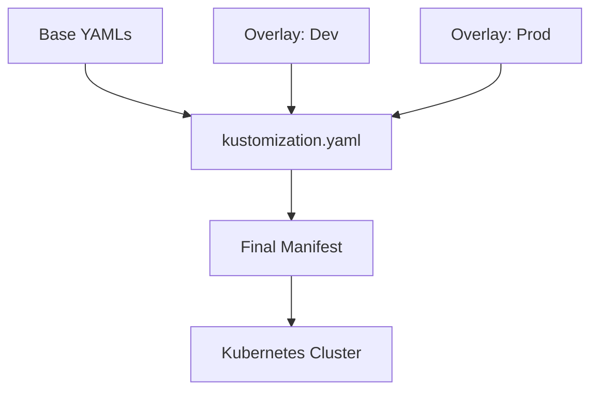

# 🧩 Kustomize

> _📖 Template-Free Configuration Management for Kubernetes._

**Kustomize** is a Kubernetes-native tool that lets you customize YAML manifests **without modifying the originals**. It’s built for **environment-specific configuration**, **reusability**, and **declarative clarity** — making it a strategic choice for GitOps workflows, multi-env deployments, and clean separation of concerns.

---

## 🧠 Architectural Overview

Kustomize operates on a **base-and-overlay model**, with no templating engine involved:

| Component                 | Role                                                               |
| ------------------------- | ------------------------------------------------------------------ |
| 📁 **Base**               | Common YAML manifests shared across environments.                  |
| 🧩 **Overlay**            | Environment-specific patches layered on top of the base.           |
| 📄 **kustomization.yaml** | Declarative file that defines resources, patches, generators, etc. |
| 🧪 **Generators**         | Create ConfigMaps and Secrets from files or literals.              |
| 🔧 **Transformers**       | Modify labels, annotations, namespaces, etc.                       |

Kustomize is **built into `kubectl`** via `kubectl apply -k`, meaning no extra binaries are needed for basic usage.

---

## 📦 Key Features

- 🧬 **Template-Free Customization**: No Helm-style templating — just pure YAML patching.
- 🔁 **Overlay System**: Clean separation of base configs and environment-specific changes.
- 🧰 **ConfigMap & Secret Generators**: Create these dynamically from files or literals.
- 🧱 **Label & Namespace Transformers**: Apply consistent metadata across resources.
- 🧪 **Patch Strategies**: Strategic merge patches and JSON6902 for fine-grained control.
- 📦 **Built into kubectl**: Native support via `kubectl apply -k`.
- 🔐 **Secrets Handling**: Supports SOPS encryption via external tools.
- 📁 **Multi-env Support**: Easily manage dev, staging, prod variations.
- 🔄 **GitOps Ready**: Works seamlessly with Argo CD and Flux.

---

## 🚀 When to Use Kustomize

Kustomize is ideal for:

- 🧠 **Multi-environment deployments** with shared base configs.
- 🧰 **GitOps workflows** where declarative clarity is key.
- 🔁 **Avoiding config drift** across clusters and teams.
- 🧪 **Fine-grained patching** without introducing templating complexity.
- 🔐 **Security-conscious setups** using encrypted secrets (via SOPS).

It’s especially useful when you want to **layer configurations** without duplicating YAML files or introducing templating engines.

---

## ⚔️ Kustomize vs Helm vs Plain YAML

| Feature              | 🧩 **Kustomize**                   | ⛵ **Helm**                     | 📄 **Plain YAML**     |
| -------------------- | ---------------------------------- | ------------------------------- | --------------------- |
| Templating           | ❌ None (patch-based)              | ✅ Yes (Go templates)           | ❌ None               |
| Environment Overlays | ✅ Native via overlays             | ✅ Via values.yaml              | ❌ Manual duplication |
| Secrets Support      | 🔶 External (SOPS, sealed-secrets) | ✅ Native via Helm secrets      | ❌ Manual             |
| Built-in to kubectl  | ✅ Yes (`apply -k`)                | ❌ No                           | ✅ Yes (`apply -f`)   |
| Learning Curve       | ✅ Low                             | 🔶 Moderate (templating syntax) | ✅ Very low           |
| GitOps Compatibility | ✅ Excellent (Argo CD, Flux)       | ✅ Excellent                    | 🔶 Limited            |
| Reusability          | ✅ High (base/overlay model)       | ✅ High (charts)                | ❌ Low                |
| Debuggability        | ✅ Transparent YAML                | 🔶 Rendered templates           | ✅ Direct             |

**TL;DR**:

- Use **Kustomize** for **clean overlays and patching**.
- Use **Helm** for **parameterized templating and packaging**.
- Use **plain YAML** for **simple, static deployments**.

---

## 🗺️ Visual Model (Mermaid-style)

This shows how Kustomize combines base + overlays to generate the final manifest applied to the cluster.

---

## 🧩 Strategic Fit for You, Hady

- 🧠 **Architectural clarity**: Kustomize enforces separation of concerns — base logic vs env-specific patches.
- 📁 **Portfolio-ready**: Showcase multi-env overlays with GitOps integration and encrypted secrets.
- 🧪 **Tool benchmarking**: Compare Kustomize vs Helm vs Jsonnet for declarative CD in your CI/CD matrix.
- 🔐 **Security signaling**: Use SOPS + overlays to demonstrate secure, auditable config flows.
- 📊 **Interview leverage**: Model overlays for dev/staging/prod, patching strategies, and GitOps sync flows.
