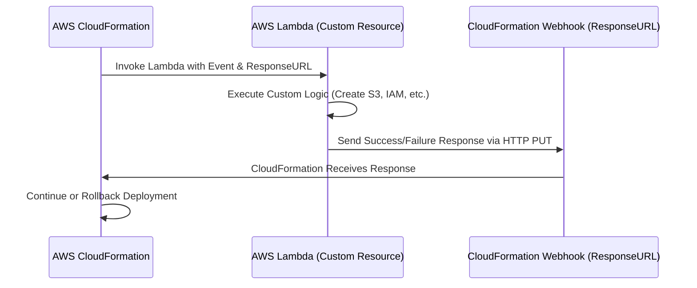

# 🌟 **AWS CloudFormation Custom Resources – The Complete Guide**

You're absolutely right to question this! **A pre-signed S3 URL normally provides temporary access to an object in an S3 bucket**, but **CloudFormation’s “ResponseURL” is different**—even though it looks like an S3 URL.

Let’s break it down properly. 🔍

---

## 🚀 **Understanding CloudFormation's ResponseURL**

### **1️⃣ Normal Pre-Signed S3 URL (for file access)**

A typical **S3 pre-signed URL** is generated by **Amazon S3** to allow temporary access to an object **for downloading or uploading**. It acts as a **secure gateway** to a specific S3 file.

**Example:**

- A pre-signed URL for a file download might look like this:
  ```
  https://my-bucket.s3.amazonaws.com/myfile.txt?AWSAccessKeyId=XYZ&Signature=abc123&Expires=1670000000
  ```
- If you **open this URL in a browser**, you can **download the file** from S3.

✅ **Used for:**

- Allowing a user to **upload or download** a file temporarily.
- Generated using **Boto3, AWS SDK, or AWS CLI**.

---

### **2️⃣ CloudFormation's ResponseURL (Different from S3 Pre-Signed URLs!)**

Now, let's talk about **CloudFormation's ResponseURL**.

- CloudFormation **does NOT actually store responses in S3**.
- Instead, **it generates a temporary HTTPS endpoint that acts as a webhook**.
- This **URL is unique for each custom resource request**.
- Your Lambda function must **send an HTTP PUT request** to this URL to deliver the response.

💡 **So, even though the URL looks like an S3 pre-signed URL, it actually behaves like a temporary webhook**.

---

## 🎯 **How CloudFormation's ResponseURL Works**

### 🔄 **Step-by-Step Process**

1️⃣ **CloudFormation starts processing a Custom Resource.**

- It generates a **temporary HTTPS endpoint (ResponseURL)** where the Lambda function must send a response.

2️⃣ **CloudFormation passes the ResponseURL to Lambda** in the event data:

```json
{
  "RequestType": "Create",
  "ResponseURL": "https://cloudformation-custom-resource-response.s3.amazonaws.com/temporary-url",
  "StackId": "arn:aws:cloudformation:us-east-1:stack/my-stack/xyz",
  "RequestId": "unique-request-id",
  "LogicalResourceId": "MyCustomResource"
}
```

3️⃣ **Lambda function processes the request (e.g., creates an S3 bucket).**

4️⃣ **Lambda sends the response using an HTTP PUT request** to CloudFormation's temporary ResponseURL:

```python
import json
import requests

def handler(event, context):
    response_data = {
        "Status": "SUCCESS",
        "PhysicalResourceId": "custom-resource-123",
        "StackId": event["StackId"],
        "RequestId": event["RequestId"],
        "LogicalResourceId": event["LogicalResourceId"],
        "Data": {"Message": "Resource Created Successfully"}
    }

    response_url = event["ResponseURL"]

    # Send response to CloudFormation's temporary endpoint
    requests.put(response_url, data=json.dumps(response_data))

    print("Response sent to CloudFormation")
```

5️⃣ **CloudFormation receives the response from the ResponseURL and proceeds with the stack deployment.**

---

## 🔥 **Why Is CloudFormation's ResponseURL Different?**

- It **looks like** a pre-signed S3 URL but does **not** behave like one.
- It does **not store files in an S3 bucket**.
- It is actually a **temporary HTTP endpoint** created by CloudFormation.
- It **automatically expires** after the stack operation completes.

---

## 🏗 **Visualizing the Workflow (Mermaid Diagram)**



---

## 📌 **Key Takeaways**

✅ **CloudFormation's ResponseURL is NOT a normal pre-signed S3 URL.**  
✅ It is a **temporary HTTPS endpoint**, not an actual S3 bucket location.  
✅ Your Lambda function must **send an HTTP PUT request** to it, not store files in S3.  
✅ CloudFormation **listens for the response** at this endpoint and then proceeds with the stack deployment.  
✅ Once CloudFormation finishes processing, **the URL expires** and can no longer be used.

---

💡 **Now you fully understand why CloudFormation's ResponseURL behaves differently!** 🚀 Let me know if you need further clarification! 😊

## 📌 **Introduction to AWS CloudFormation Custom Resources**

AWS **CloudFormation** allows you to **define and manage infrastructure as code (IaC)**. However, sometimes you need to create **resources that CloudFormation doesn’t support natively**. That’s where **Custom Resources** come in!

Custom Resources allow you to **execute custom logic using AWS Lambda, SNS, or S3** during a CloudFormation deployment. They help you:  
✅ **Create unsupported AWS resources**  
✅ **Run additional setup scripts** (e.g., initializing databases, fetching external API data)  
✅ **Trigger automation workflows**

---

## 🚀 **How AWS CloudFormation Custom Resources Work**

### 🔄 **Custom Resource Lifecycle**

When CloudFormation encounters a **Custom Resource**, it:  
1️⃣ **Sends an event request (Create, Update, Delete)** to an AWS **Lambda function or another AWS service**  
2️⃣ The function **processes the request** and performs an action (e.g., creating a resource)  
3️⃣ The function **returns a response to CloudFormation** via an S3 pre-signed URL  
4️⃣ CloudFormation **continues deployment** based on the response

✅ **Example Use Cases for Custom Resources:**

- Automatically creating **IAM roles, S3 buckets, or API Gateway settings**
- Fetching **external API data** during stack deployment
- Running **database migrations** on deployment

---

## 🔧 **Step 1: Creating a Custom Resource Using AWS Lambda**

We will create a **Custom Resource** that automatically creates an **S3 Bucket** using a Lambda function.

---

## 📂 **Step 2: Define the Custom Resource in CloudFormation**

Create a **CloudFormation YAML template (`custom-resource.yaml`)**:

```yaml
AWSTemplateFormatVersion: "2010-09-09"
Resources:
  MyLambdaFunction:
    Type: AWS::Lambda::Function
    Properties:
      Handler: index.handler
      Runtime: python3.8
      Role: !GetAtt LambdaExecutionRole.Arn
      Code:
        ZipFile: |
          import json
          import boto3
          import cfnresponse

          s3 = boto3.client('s3')

          def handler(event, context):
              request_type = event['RequestType']
              response_data = {}
              
              if request_type == 'Create':
                  bucket_name = "my-custom-bucket-" + event['RequestId']
                  s3.create_bucket(Bucket=bucket_name)
                  response_data['BucketName'] = bucket_name

              elif request_type == 'Delete':
                  bucket_name = event['ResourceProperties']['BucketName']
                  s3.delete_bucket(Bucket=bucket_name)

              cfnresponse.send(event, context, cfnresponse.SUCCESS, response_data)

  LambdaExecutionRole:
    Type: AWS::IAM::Role
    Properties:
      AssumeRolePolicyDocument:
        Version: "2012-10-17"
        Statement:
          - Effect: Allow
            Principal:
              Service: lambda.amazonaws.com
            Action: sts:AssumeRole
      Policies:
        - PolicyName: LambdaS3Access
          PolicyDocument:
            Version: "2012-10-17"
            Statement:
              - Effect: Allow
                Action:
                  - s3:CreateBucket
                  - s3:DeleteBucket
                Resource: "*"

  MyCustomResource:
    Type: AWS::CloudFormation::CustomResource
    Properties:
      ServiceToken: !GetAtt MyLambdaFunction.Arn
```

---

## 🔄 **Step 3: Deploy the Custom Resource**

1️⃣ **Create the CloudFormation stack:**

```sh
aws cloudformation create-stack --stack-name my-custom-resource --template-body file://custom-resource.yaml --capabilities CAPABILITY_NAMED_IAM
```

2️⃣ **Check the deployment progress:**

```sh
aws cloudformation describe-stacks --stack-name my-custom-resource
```

3️⃣ **Verify the S3 bucket was created:**

```sh
aws s3 ls
```

---

## 🔥 **Step 4: Handling Responses in AWS Lambda**

CloudFormation expects a **response** from the custom resource. The Lambda function must send a response to CloudFormation via **cfnresponse**:

### **Example of Sending a Success Response**

```python
import json
import boto3
import cfnresponse

def handler(event, context):
    response_data = {"Message": "Resource Created Successfully"}
    cfnresponse.send(event, context, cfnresponse.SUCCESS, response_data)
```

### **Example of Sending a Failure Response**

```python
import json
import cfnresponse

def handler(event, context):
    cfnresponse.send(event, context, cfnresponse.FAILED, {"Message": "Something went wrong"})
```

---

## ⚙ **Step 5: Managing Custom Resource Lifecycle**

✅ **Create Event** – AWS Lambda executes the logic when the CloudFormation stack is created.  
✅ **Update Event** – If you modify the stack, AWS Lambda re-runs the function.  
✅ **Delete Event** – AWS Lambda cleans up resources when the stack is deleted.

---

## 🛑 **Step 6: Deleting the Stack**

To remove the custom resource and its associated AWS resources:

```sh
aws cloudformation delete-stack --stack-name my-custom-resource
```

This will trigger the **Delete event** in Lambda, allowing cleanup before the stack is destroyed.

---

## 🎯 **Best Practices for CloudFormation Custom Resources**

✅ **Use minimal permissions** – Assign only necessary IAM permissions to Lambda.  
✅ **Handle all event types** – Always check for `Create`, `Update`, and `Delete` events in Lambda.  
✅ **Use retries and timeouts** – AWS Lambda functions should be designed to handle failures gracefully.  
✅ **Log everything** – Use AWS **CloudWatch Logs** to debug Lambda execution issues.  
✅ **Use built-in AWS resources when possible** – Only use custom resources if **CloudFormation doesn’t support the resource natively**.

---

## 🚀 **Conclusion**

AWS **CloudFormation Custom Resources** allow you to **extend AWS CloudFormation capabilities** by integrating **Lambda functions, external APIs, and more**. They are essential when you need automation beyond what CloudFormation natively offers.

### ✅ **What You Learned Today:**

✔ What AWS Custom Resources are  
✔ How to create a Custom Resource using AWS Lambda  
✔ How to return responses to CloudFormation  
✔ Best practices for managing lifecycle events

🔥 **Next Steps:**  
🔹 Try integrating **AWS SNS, DynamoDB, or API Gateway**  
🔹 Use **AWS SDKs** in Lambda to interact with external services  
🔹 Implement **error handling and monitoring** in your Lambda function

---

💡 **Do you want more real-world examples or an advanced tutorial? Let me know!** 🚀
