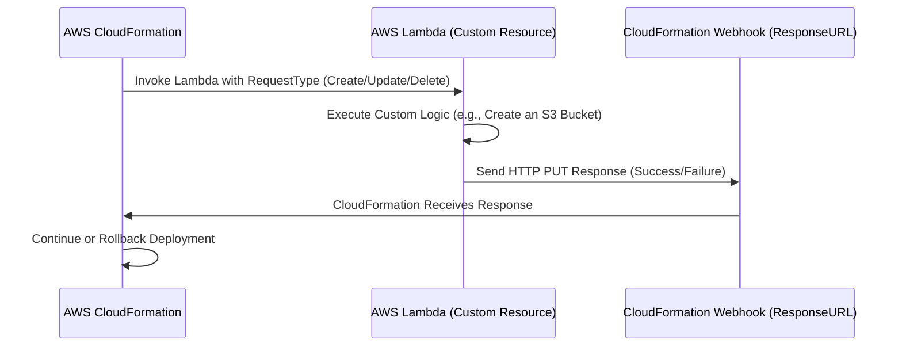
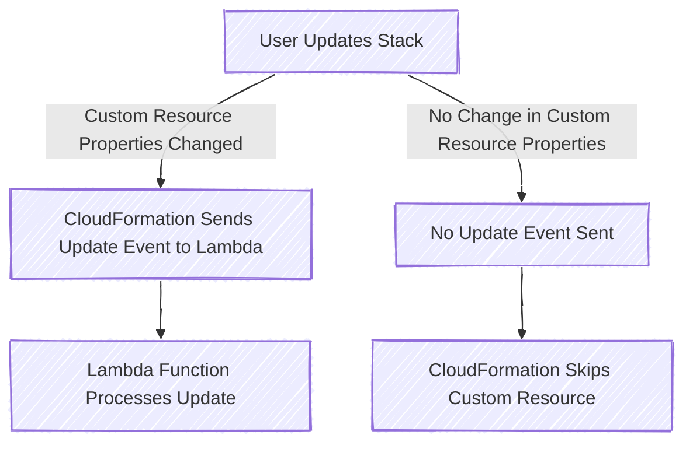

# 🚀 **AWS CloudFormation Custom Resources – The Ultimate Guide**

AWS **CloudFormation Custom Resources** allow you to **extend CloudFormation’s capabilities** beyond its built-in resource types. Using AWS Lambda, SNS, or S3, Custom Resources can **dynamically create, update, or delete** resources that CloudFormation does not support natively.

CloudFormation **automates infrastructure as code (IaC)**, but sometimes, **you need more** than what it offers by default. That’s where **Custom Resources** come in!

---

## 🤔 **1. What is a Custom Resource in CloudFormation?**

A **Custom Resource** is a special CloudFormation resource (`Custom::MyResource`) that triggers an **AWS Lambda function, SNS topic, or S3 event** to perform an action **outside of CloudFormation’s native capabilities**.

### 💡 **Why Use Custom Resources?**

✅ **Creating resources not natively supported by CloudFormation** (e.g., AWS Organizations, third-party APIs).  
✅ **Fetching external data** (e.g., retrieving API keys from AWS Secrets Manager).  
✅ **Automating complex workflows** (e.g., setting up cross-region replication).  
✅ **Provisioning infrastructure dynamically** (e.g., creating S3 buckets dynamically).

👉 **Example:**  
CloudFormation **does not support AWS Organizations**, but using a **Custom Resource**, you can trigger a Lambda function that interacts with AWS Organizations to create accounts dynamically.

---

## 🧩 **2. How CloudFormation Custom Resources Work & Their Components**

### **🛠 Key Components of a Custom Resource**

**1️⃣ CloudFormation Stack** – Defines the **Custom Resource** in a CloudFormation template.  
**2️⃣ AWS Lambda Function** – Handles **create, update, and delete** operations.  
**3️⃣ ResponseURL** – A **temporary webhook URL** that CloudFormation generates and expects a response from.  
**4️⃣ PhysicalResourceId** – A unique identifier for the resource, which helps **CloudFormation track whether a resource needs to be updated or replaced**.

### **🔍 Custom Resource Workflow**



---

## 🏗️ **3. Creating a Custom Resource Lifecycle**

When a **Custom Resource is created**, CloudFormation invokes Lambda with `RequestType: "Create"`.

**Example Scenario:**

- CloudFormation **triggers Lambda** to **create an S3 bucket**.
- Lambda **creates the bucket** and **returns a success response**.

### 📜 **Example Create Handling in Lambda**

```python
import json
import boto3
import requests

s3 = boto3.client("s3")

def handler(event, context):
    if event["RequestType"] == "Create":
        bucket_name = "my-custom-bucket-" + event["RequestId"]
        s3.create_bucket(Bucket=bucket_name)
        response_data = {"BucketName": bucket_name}
        physical_resource_id = bucket_name  # ✅ CloudFormation tracks this ID

        send_response(event, context, "SUCCESS", response_data, physical_resource_id)

def send_response(event, context, status, response_data, physical_resource_id):
    response_body = {
        "Status": status,
        "PhysicalResourceId": physical_resource_id,
        "StackId": event["StackId"],
        "RequestId": event["RequestId"],
        "LogicalResourceId": event["LogicalResourceId"],
        "Data": response_data,
    }
    requests.put(event["ResponseURL"], data=json.dumps(response_body))
```

✅ **CloudFormation will now proceed with the stack creation**.

---

## 🔄 **4. Updating a Custom Resource Lifecycle**

<div style="display:flex; justify-content:center">



## </div>

- CloudFormation **compares** the new stack configuration against the previous stack state.
- If **no properties of the Custom Resource change**, **CloudFormation does NOT invoke the Lambda function**.
- If **ANY property of the Custom Resource changes**, CloudFormation **sends an `Update` event** to Lambda.

---

### 📜 **Example Update Handling in Lambda**

```python
if event["RequestType"] == "Update":
    old_bucket_name = event["OldResourceProperties"]["BucketName"]
    new_bucket_name = event["ResourceProperties"]["BucketName"]

    if old_bucket_name == new_bucket_name:
        # ✅ No change needed, return the same PhysicalResourceId
        physical_resource_id = old_bucket_name
    else:
        # 🔄 Replacement needed: Create new bucket & delete old one
        s3.create_bucket(Bucket=new_bucket_name)
        s3.delete_bucket(Bucket=old_bucket_name)
        response_data["BucketName"] = new_bucket_name
        physical_resource_id = new_bucket_name  # ✅ CloudFormation sees this as a replacement
```

✅ **If the function returns the same `PhysicalResourceId`, CloudFormation updates the resource in place**.  
✅ **If the function returns a new `PhysicalResourceId`, CloudFormation assumes a replacement and deletes the old resource**.

---

## 🗑 **5. Deleting a Custom Resource Lifecycle**

When a **CloudFormation stack is deleted**, it invokes Lambda with `RequestType: "Delete"`.

### 📜 **Example Delete Handling in Lambda**

```python
if event["RequestType"] == "Delete":
    bucket_name = event["ResourceProperties"]["BucketName"]
    s3.delete_bucket(Bucket=bucket_name)
    physical_resource_id = event["PhysicalResourceId"]
```

✅ **CloudFormation waits for Lambda to confirm deletion before removing the resource from the stack**.

---

## 🎯 **6. Best Practices for Custom Resources**

✅ **CloudFormation only sends an Update event if a property of the Custom Resource has changed.**  
✅ **Return the same `PhysicalResourceId` for in-place updates to prevent unnecessary replacements.**  
✅ **Use minimal IAM permissions for Lambda to reduce security risks.**  
✅ **Log CloudFormation events in CloudWatch for debugging.**  
✅ **Use `requests.put()` correctly to send responses to CloudFormation.**

---

## 🔥 **7. Real-World Use Cases for Custom Resources**

✅ **Creating AWS Organizations accounts dynamically**.  
✅ **Automating IAM policy creation with custom configurations**.  
✅ **Provisioning third-party services (e.g., Twilio, SendGrid)**.  
✅ **Fetching API keys from AWS Secrets Manager**.  
✅ **Automatically configuring cross-region replication**.

---

## 🎯 **8. Conclusion**

AWS **CloudFormation Custom Resources** provide **unlimited flexibility** by allowing you to extend CloudFormation's capabilities beyond its built-in resource types.

You now know:  
✅ **How Custom Resources work & their lifecycle**  
✅ **How to create, update, and delete a Custom Resource**  
✅ **How CloudFormation determines whether to replace or update a Custom Resource**  
✅ **Best practices for handling Custom Resources efficiently**

🚀 **Now you're ready to build powerful, automated CloudFormation stacks!** 🎯🔥
