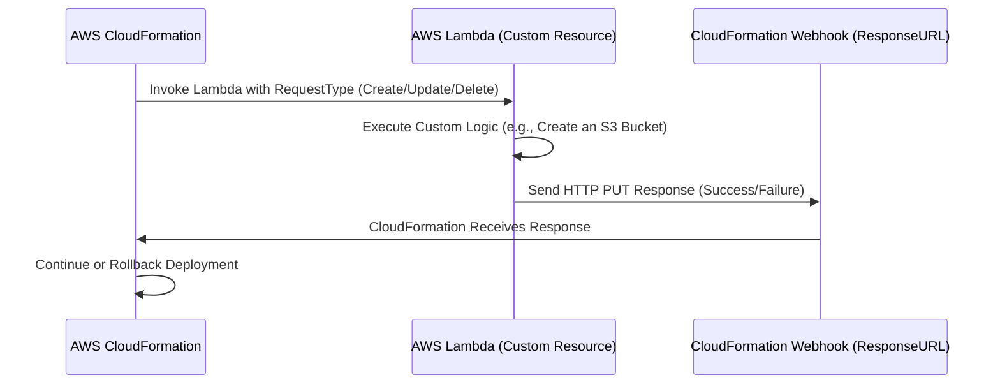

# 🚀 **AWS CloudFormation Custom Resources – The Ultimate Guide**

## 📌 **Introduction**

AWS **CloudFormation Custom Resources** allow you to **extend AWS CloudFormation's capabilities** by using AWS Lambda, SNS, or S3 to create, update, or delete resources that **CloudFormation does not support natively**.

CloudFormation **automates infrastructure as code (IaC)**, but sometimes, **you need more** than what it offers out of the box. That’s where **Custom Resources** come in!

✅ **What You’ll Learn:**  
✔ What Custom Resources are and why they are needed  
✔ How AWS CloudFormation Custom Resources work (detailed lifecycle)  
✔ How to create a Custom Resource using AWS Lambda  
✔ Real-world examples and best practices

---

## 🔥 **1. What is a Custom Resource in CloudFormation?**

A **Custom Resource** is a special resource type (`Custom::MyResource`) in CloudFormation that **triggers an AWS Lambda function, SNS topic, or S3 bucket event**.

💡 **Use Cases for Custom Resources:**

- Creating resources **not natively supported** by CloudFormation
- Running **custom setup scripts** (e.g., database migrations)
- Fetching data from **external APIs**
- Configuring **third-party services**
- Automating **IAM roles, permissions, and service integrations**

👉 **Example:** CloudFormation **does not support AWS Organizations** natively, but with a Custom Resource, you can **use AWS Lambda to manage AWS Organizations** during stack deployment.

---

## 🔄 **2. How AWS CloudFormation Custom Resources Work (Lifecycle)**

CloudFormation handles Custom Resources differently than standard AWS resources. Here’s how it works **step-by-step**:

### 🔍 **Custom Resource Lifecycle**



💡 **Key Points:**  
✅ CloudFormation generates a **temporary HTTPS ResponseURL** (webhook).  
✅ It invokes the **Lambda function** with an event that includes this URL.  
✅ Lambda **performs the requested operation** (Create, Update, or Delete).  
✅ Lambda **sends the response (success/failure) to the ResponseURL**.  
✅ CloudFormation **proceeds with stack deployment** if the response is successful.

---

## 🏗 **3. Creating a Custom Resource with AWS Lambda**

### 🎯 **Example: Creating an S3 Bucket via Custom Resource**

Let’s create a **CloudFormation template** that:  
1️⃣ Deploys a **Lambda function** to handle the Custom Resource  
2️⃣ Creates an **S3 Bucket** using that Lambda function

---

### 📜 **Step 1: Define the CloudFormation Template**

Create a file called `custom-resource.yaml`:

```yaml
AWSTemplateFormatVersion: "2010-09-09"
Resources:
  MyLambdaFunction:
    Type: AWS::Lambda::Function
    Properties:
      Handler: index.handler
      Runtime: python3.8
      Role: !GetAtt LambdaExecutionRole.Arn
      Code:
        ZipFile: |
          import json
          import boto3
          import requests

          s3 = boto3.client('s3')

          def handler(event, context):
              print("Received event: ", json.dumps(event))

              request_type = event['RequestType']
              response_data = {}

              try:
                  if request_type == 'Create':
                      bucket_name = "my-custom-bucket-" + event['RequestId']
                      s3.create_bucket(Bucket=bucket_name)
                      response_data['BucketName'] = bucket_name
                      
                  elif request_type == 'Delete':
                      bucket_name = event['ResourceProperties']['BucketName']
                      s3.delete_bucket(Bucket=bucket_name)

                  response_body = {
                      "Status": "SUCCESS",
                      "PhysicalResourceId": "custom-resource-123",
                      "StackId": event["StackId"],
                      "RequestId": event["RequestId"],
                      "LogicalResourceId": event["LogicalResourceId"],
                      "Data": response_data
                  }

              except Exception as e:
                  response_body = {
                      "Status": "FAILED",
                      "Reason": str(e),
                      "PhysicalResourceId": "custom-resource-123",
                      "StackId": event["StackId"],
                      "RequestId": event["RequestId"],
                      "LogicalResourceId": event["LogicalResourceId"]
                  }

              # Send response to CloudFormation
              requests.put(event["ResponseURL"], data=json.dumps(response_body))

  LambdaExecutionRole:
    Type: AWS::IAM::Role
    Properties:
      AssumeRolePolicyDocument:
        Version: "2012-10-17"
        Statement:
          - Effect: Allow
            Principal:
              Service: lambda.amazonaws.com
            Action: sts:AssumeRole
      Policies:
        - PolicyName: LambdaS3Access
          PolicyDocument:
            Version: "2012-10-17"
            Statement:
              - Effect: Allow
                Action:
                  - s3:CreateBucket
                  - s3:DeleteBucket
                Resource: "*"

  MyCustomResource:
    Type: AWS::CloudFormation::CustomResource
    Properties:
      ServiceToken: !GetAtt MyLambdaFunction.Arn
```

---

### 🚀 **Step 2: Deploy the CloudFormation Stack**

Run the following command to deploy the stack:

```sh
aws cloudformation create-stack --stack-name my-custom-resource --template-body file://custom-resource.yaml --capabilities CAPABILITY_NAMED_IAM
```

### 🔍 **Step 3: Verify the S3 Bucket was Created**

```sh
aws s3 ls
```

### 🛑 **Step 4: Delete the Stack**

To clean up the resources:

```sh
aws cloudformation delete-stack --stack-name my-custom-resource
```

---

## 📌 **4. Handling All Lifecycle Events**

Your Lambda function should handle **three** types of events:  
✅ **Create** – When a new resource is requested.  
✅ **Update** – When the resource needs to be updated.  
✅ **Delete** – When the resource needs to be removed.

**Example Handling All Events:**

```python
def handler(event, context):
    request_type = event['RequestType']
    response_data = {}

    if request_type == 'Create':
        # Create resource logic
    elif request_type == 'Update':
        # Update resource logic
    elif request_type == 'Delete':
        # Delete resource logic

    # Send response to CloudFormation
```

---

## 🎯 **5. Best Practices for Custom Resources**

✅ **Always handle all event types (Create, Update, Delete)**.  
✅ **Use minimal IAM permissions** for the Lambda function.  
✅ **Set timeouts and retries** for better resilience.  
✅ **Log events in CloudWatch** for debugging.  
✅ **Use cfnresponse or requests.put() correctly** to send responses.

---

## 🔥 **6. Real-World Use Cases**

✅ **Auto-provisioning third-party services** (e.g., Twilio, SendGrid API keys).  
✅ **Dynamically generating configurations** (e.g., fetching secrets from AWS Secrets Manager).  
✅ **Managing cross-account AWS resources**.  
✅ **Setting up IAM roles & permissions dynamically**.

---

## 🎯 **Conclusion**

AWS CloudFormation **Custom Resources** give you **full control over stack automation**. You now know:
✅ What Custom Resources are  
✅ How they work under the hood  
✅ How to create a Custom Resource with AWS Lambda  
✅ Best practices and real-world applications

🚀 **Ready to build advanced CloudFormation stacks? Let me know if you want more real-world examples!** 🎯🔥
