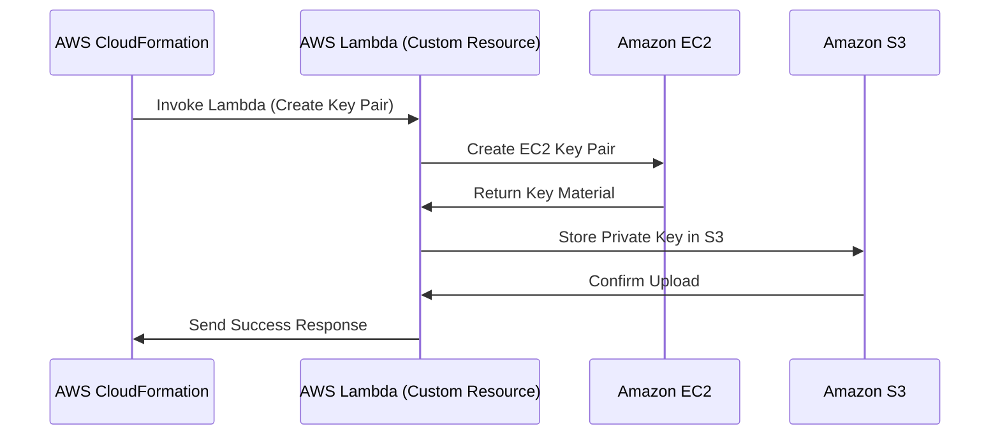

# 🚀 **AWS CloudFormation Custom Resource Example – Creating and Managing EC2 Key Pairs**

## 📌 **Introduction**

This guide explains a **real-world AWS CloudFormation Custom Resource** example, where we use a **Lambda function** to create, update, and delete **EC2 Key Pairs** dynamically. The private key is then stored securely in an **S3 bucket** for later retrieval.

This setup is useful for **automating secure key pair management** for EC2 instances without manually handling private keys.

---

<div style="text-align: center"></div>

---

## 🔥 **1. What This CloudFormation Template Does**

This CloudFormation stack does the following:

✅ **Creates an S3 bucket** (`KeyBucket`) to store private keys.  
✅ **Deploys an AWS Lambda function** (`KeyPairLambdaFunction`) to handle EC2 key pair operations.  
✅ **Creates an IAM Role** (`KeyPairLambdaRole`) that gives Lambda permission to:

- Create/Delete/Describe **EC2 Key Pairs**
- Upload/Delete files in the **S3 bucket**

✅ **Creates a CloudFormation Custom Resource** (`CustomKeyPair`) that:

- Calls the **Lambda function** to create a **new EC2 Key Pair**
- Stores the private key in the **S3 bucket**

✅ **Deploys an EC2 Instance** (`ServerInstance`) that:

- Uses the **newly created key pair** for SSH access
- Attaches it to a **Security Group**

---

## 🔄 **2. How the CloudFormation Custom Resource Works**

### 📌 **High-Level Workflow**



---

## 🏗 **CloudFormation Template Breakdown**

This CloudFormation template defines all AWS resources required for the custom resource setup.

```yaml
AWSTemplateFormatVersion: 2010-09-09
Description: >-
  Sample template for the custom resources examples of
  AWS CloudFormation Step by Step series.

Parameters:
  ImageId:
    Type: AWS::EC2::Image::Id
    Description: AMI of the server instance

Resources:
  KeyBucket:
    Type: AWS::S3::Bucket

  KeyPairLambdaRole:
    Type: AWS::IAM::Role
    Properties:
      AssumeRolePolicyDocument:
        Version: 2012-10-17
        Statement:
          - Effect: Allow
            Principal:
              Service:
                - lambda.amazonaws.com
            Action:
              - sts:AssumeRole
      ManagedPolicyArns:
        - "arn:aws:iam::aws:policy/service-role/AWSLambdaBasicExecutionRole"
      Policies:
        - PolicyName: KeyPairAccess
          PolicyDocument:
            Version: 2012-10-17
            Statement:
              - Effect: Allow
                Action:
                  - "ec2:CreateKeyPair"
                  - "ec2:DeleteKeyPair"
                  - "ec2:DescribeKeyPairs"
                Resource: "*"
        - PolicyName: KeyBucketAccess
          PolicyDocument:
            Version: 2012-10-17
            Statement:
              - Effect: Allow
                Action:
                  - "s3:PutObject"
                  - "s3:DeleteObject"
                Resource:
                  - !GetAtt KeyBucket.Arn
                  - !Sub "${KeyBucket.Arn}/*"

  LambdaDependenciesLayer:
    Type: AWS::Lambda::LayerVersion
    Properties:
      CompatibleRuntimes:
        - python3.8
      Content: dependencies

  KeyPairLambdaFunction:
    Type: AWS::Lambda::Function
    Properties:
      Runtime: python3.8
      Code: lambda_src
      Handler: key-pair-resource-function.lambda_handler
      Role: !GetAtt KeyPairLambdaRole.Arn
      Timeout: 30
      MemorySize: 128
      Layers:
        - !Ref LambdaDependenciesLayer

  CustomKeyPair:
    Type: AWS::CloudFormation::CustomResource
    Properties:
      ServiceToken: !GetAtt KeyPairLambdaFunction.Arn
      KeyBucket: !Ref KeyBucket
      KeyPairName: !Sub "${AWS::StackName}-key-pair-v2"

  ServerInstance:
    Type: AWS::EC2::Instance
    Properties:
      InstanceType: t2.micro
      ImageId: !Ref ImageId
      SecurityGroups:
        - !Ref ServerSecurityGroup
      KeyName: !GetAtt CustomKeyPair.KeyName

  ServerSecurityGroup:
    Type: AWS::EC2::SecurityGroup
    Properties:
      GroupDescription: Security group for the server
      SecurityGroupIngress:
        - CidrIp: "0.0.0.0/0"
          FromPort: 22
          ToPort: 22
          IpProtocol: tcp

Outputs:
  ServerDNSName:
    Value: !GetAtt ServerInstance.PublicDnsName
    Description: The public DNS name of the server

  KeyBucketName:
    Value: !Ref KeyBucket
    Description: The name of the S3 bucket where the key is stored

  KeyFile:
    Value: !GetAtt CustomKeyPair.KeyFile
```

### 📜 **1️⃣ Creating the S3 Bucket**

This S3 bucket will **store the private key** securely.

```yaml
Resources:
  KeyBucket:
    Type: AWS::S3::Bucket
```

---

### 📜 **2️⃣ Creating an IAM Role for Lambda**

The Lambda function needs permissions to:

- **Create/Delete EC2 key pairs**
- **Upload/Delete objects in S3**

```yaml
KeyPairLambdaRole:
  Type: AWS::IAM::Role
  Properties:
    AssumeRolePolicyDocument:
      Version: 2012-10-17
      Statement:
        - Effect: Allow
          Principal:
            Service: lambda.amazonaws.com
          Action:
            - sts:AssumeRole
    ManagedPolicyArns:
      - "arn:aws:iam::aws:policy/service-role/AWSLambdaBasicExecutionRole"
    Policies:
      - PolicyName: KeyPairAccess
        PolicyDocument:
          Version: 2012-10-17
          Statement:
            - Effect: Allow
              Action:
                - "ec2:CreateKeyPair"
                - "ec2:DeleteKeyPair"
                - "ec2:DescribeKeyPairs"
              Resource: "*"
      - PolicyName: KeyBucketAccess
        PolicyDocument:
          Version: 2012-10-17
          Statement:
            - Effect: Allow
              Action:
                - "s3:PutObject"
                - "s3:DeleteObject"
              Resource:
                - !GetAtt KeyBucket.Arn
                - !Sub "${KeyBucket.Arn}/*"
```

---

### 📜 **3️⃣ Deploying the AWS Lambda Function**

The Lambda function is responsible for handling the custom resource events (Create, Update, Delete).

```yaml
KeyPairLambdaFunction:
  Type: AWS::Lambda::Function
  Properties:
    Runtime: python3.8
    Code: lambda_src
    Handler: key-pair-resource-function.lambda_handler
    Role: !GetAtt KeyPairLambdaRole.Arn
    Timeout: 30
    MemorySize: 128
```

---

### 📜 **4️⃣ Creating the CloudFormation Custom Resource**

This section defines the **Custom Resource** that CloudFormation invokes.

```yaml
CustomKeyPair:
  Type: AWS::CloudFormation::CustomResource
  Properties:
    ServiceToken: !GetAtt KeyPairLambdaFunction.Arn
    KeyBucket: !Ref KeyBucket
    KeyPairName: !Sub "${AWS::StackName}-key-pair-v2"
```

💡 **CloudFormation will call the Lambda function when this resource is created, updated, or deleted.**

---

### 📜 **5️⃣ Deploying an EC2 Instance Using the Key Pair**

The EC2 instance is created **with the key pair generated by the Lambda function**.

```yaml
ServerInstance:
  Type: AWS::EC2::Instance
  Properties:
    InstanceType: t2.micro
    ImageId: !Ref ImageId
    SecurityGroups:
      - !Ref ServerSecurityGroup
    KeyName: !GetAtt CustomKeyPair.KeyName
```

---

## 🛠 **Implementing the AWS Lambda Function**

This Python script handles the **custom logic** for **creating, updating, and deleting EC2 key pairs**.

```py
import boto3
import json
import logging
import requests

# Logger settings for CloudWatch Logs
logger = logging.getLogger()
logger.setLevel(logging.INFO)

# Initialize boto3 (Python SDK) clients for the services required.
ec2_client = boto3.client('ec2')
s3_client = boto3.client('s3')

def lambda_handler(event, context):
    '''
        AWS Lambda function handler.
        This is the method called when this AWS Lambda function is triggered.

        In addition to the standard data for the custom resource operation
        provided by CloudFormation to the event,
        it expects these in the resource properties:

        - KeyPairName:  The name of the EC2 key-pair that will be used in
                        custom resource creation, update, and deletion.
        - KeyBucket:    The name of the S3 bucket where the key file will be uploaded.
    '''

    cfn_response_data = {} # The data for the return values of the custom resource that will be sent with the response to CloudFormation.
    physical_resource_id = "" # PhysicalResourceId that will be sent in the response to CloudFormation.

    try:
        logger.info("Received event: " + json.dumps(event, indent=2))

        key_pair_name = event["ResourceProperties"]["KeyPairName"]
        key_bucket = event["ResourceProperties"]["KeyBucket"]

        if event["RequestType"] == "Create":
            # CloudFormation triggered the function for custom resource creation.

            cfn_response_data = create_key_pair( key_pair_name, key_bucket )

            physical_resource_id = cfn_response_data["KeyPairId"]


        elif event["RequestType"] == "Update":
            # CloudFormation triggered the function for custom resource update.
            # Whether a replacement is necessary will be decided
            # by comparing the old and new key pair names.

            old_key_pair_name = event["OldResourceProperties"]["KeyPairName"]

            if key_pair_name != old_key_pair_name:
                # The old and new key pair names do not match.
                # Hence, a new key pair will be created as the replacement.

                logger.info( "Key pair name changed! Creating a new key pair for replacement." )

                cfn_response_data = create_key_pair( key_pair_name, key_bucket )

                # CloudFormation will understand whether a replacement was performed
                # from the change of the PhysicalResourceId.
                physical_resource_id = cfn_response_data["KeyPairId"]

            else:
                # KeyPairNames are the same. So, a replacement is not required.

                # We need to provide the same PhysicalResourceId to CloudFormation
                # to notify that no replacement is made.
                logger.info( "The key name did not change. Physical resource ID will be the same as before.")

                physical_resource_id = event["PhysicalResourceId"]

                # We have to provide the same return values in the CloudFormation response.
                # Otherwise, CloudFormation will regard them as missing or removed from the resource.
                cfn_response_data["KeyName"] = key_pair_name
                cfn_response_data["KeyPairId"] = physical_resource_id
                cfn_response_data["KeyFile"] = get_key_file_name( key_pair_name )


        elif event["RequestType"] == "Delete":
            # CloudFormation triggered the function for the deletion of the custom resource.

            delete_key_pair( key_pair_name, key_bucket )

            # Although the physical resource was deleted,
            # we still need to send the PhysicalResourceID provided to the event
            # in the response to CloudFormation.
            physical_resource_id = event["PhysicalResourceId"]


        else:
            raise ValueError( "Unsupported request type: {}".format( event["RequestType"] ) )

        # Everything went well. So, send a response with SUCCESS status to CloudFormation
        # to notify that the custom resource operation was successful.
        send_response_to_cfn( "SUCCESS", event, cfn_response_data, physical_resource_id)

    except Exception as e:
        # An exception occured, failure response should be sent to CloudFormation.

        logger.error( "ERROR: {}".format(e) )

        # Send a FAILED status response to CloudFormation
        # to notify that the custom resource operation failed.
        send_response_to_cfn( "FAILED", event, cfn_response_data, physical_resource_id )


def send_response_to_cfn( status, event, response_data, physical_resource_id ):
    '''
        Sends the result of the custom resource operation as a response to the ResponseURL
        provided by CloudFormation to the event.
    '''

    # Construct the request body for the custom resource operation response.
    request_body = {
        "Status": status, # The resulting state of the operation, SUCCESS or FAILED.
        "PhysicalResourceId" : physical_resource_id, # The physical resource ID of the custom resource.
        "StackId" : event["StackId"], # The ID of the stack provided by CloudFormation.
        "RequestId" : event["RequestId"], # The unique ID of the request provided by CloudFormation.
        "LogicalResourceId" : event["LogicalResourceId"], # The logical resource ID provided by CloudFormation.
        "Data" : response_data # The return values of the custom resource.
    }

    # Send the operation response to CloudFormation as an HTTP request
    # using the response URL provided to the event.
    logger.info( "Sending the {} response to the CloudFormation Response URL, {}.".format( status, event["ResponseURL"] ) )
    logger.info( "Request body: " + json.dumps(request_body, indent=2) )

    response = requests.put(
        event["ResponseURL"],
        data=json.dumps( request_body )
    )

    logger.info( "CloudFormation response status: {}".format( response.status_code ) )


def get_key_file_name( key_pair_name ):
    '''
        Constructs the name of the key file from the key pair name.
    '''

    # Add .pem extension the key pair name and return.
    return "{}.pem".format( key_pair_name )


def create_key_pair( key_pair_name, key_bucket ):
    '''
        The create action for the custom Key Pair resource.
        It creates an EC2 key pair with the key pair name
        and uploads the key returned to the key bucket on S3.
    '''

    # Create the EC2 key pair with the key pair name provided.
    logger.info( "Creating the EC2 key pair." )

    ec2_response = ec2_client.create_key_pair(
        KeyName=key_pair_name
    )

    logger.info( "Key pair ID: {}".format( ec2_response["KeyPairId"] ) )


    # Upload the key file to the key bucket
    # using the S3 server-side encryption.
    key_file_name = get_key_file_name( key_pair_name )

    logger.info( "Uploading the {} file to {} bucket on S3.".format( key_file_name, key_bucket ) )

    s3_response = s3_client.put_object(
        Bucket=key_bucket,
        Key=key_file_name,
        Body=ec2_response["KeyMaterial"], # Key content
        ServerSideEncryption="AES256"
    )

    logger.info( "S3 response: " + json.dumps( s3_response, indent=2 ) )

    # As the return value, construct the output data for the response
    # that will be sent to CloudFormation.
    return {
        "KeyPairId": ec2_response["KeyPairId"],
        "KeyName": ec2_response["KeyName"],
        "KeyFile": key_file_name
    }

def delete_key_pair( key_pair_name, key_bucket ):
    '''
        The delete action for the custom resource.
        It removes the uploaded key file from the key bucket,
        and the EC2 key pair afterward.
    '''

    # Get the S3 object name for the key file
    # and delete it from the key bucket.
    key_file_name = get_key_file_name( key_pair_name )

    logger.info( "Deleting {} file from {} bucket.".format( key_file_name, key_bucket ) )

    s3_response = s3_client.delete_object(
        Bucket=key_bucket,
        Key=key_file_name
    )

    logger.info( "S3 response: " + json.dumps( s3_response, indent=2 ) )


    # Remove the EC2 key pair
    logger.info("Deleting the EC2 key pair.")

    ec2_response = ec2_client.delete_key_pair(
        KeyName=key_pair_name
    )

    logger.info( "EC2 response: " + json.dumps( ec2_response, indent=2 ) )
```

### 📜 **1️⃣ Handling Create, Update, and Delete Events**

```python
import boto3
import json
import logging
import requests

logger = logging.getLogger()
logger.setLevel(logging.INFO)

ec2_client = boto3.client('ec2')
s3_client = boto3.client('s3')

def lambda_handler(event, context):
    cfn_response_data = {}
    physical_resource_id = ""

    try:
        key_pair_name = event["ResourceProperties"]["KeyPairName"]
        key_bucket = event["ResourceProperties"]["KeyBucket"]

        if event["RequestType"] == "Create":
            cfn_response_data = create_key_pair( key_pair_name, key_bucket )
            physical_resource_id = cfn_response_data["KeyPairId"]

        elif event["RequestType"] == "Delete":
            delete_key_pair( key_pair_name, key_bucket )
            physical_resource_id = event["PhysicalResourceId"]

        send_response_to_cfn("SUCCESS", event, cfn_response_data, physical_resource_id)

    except Exception as e:
        logger.error(f"ERROR: {e}")
        send_response_to_cfn("FAILED", event, cfn_response_data, physical_resource_id)
```

---

### 📜 **2️⃣ Creating an EC2 Key Pair**

```python
def create_key_pair(key_pair_name, key_bucket):
    ec2_response = ec2_client.create_key_pair(KeyName=key_pair_name)

    key_file_name = f"{key_pair_name}.pem"

    s3_client.put_object(
        Bucket=key_bucket,
        Key=key_file_name,
        Body=ec2_response["KeyMaterial"],
        ServerSideEncryption="AES256"
    )

    return {
        "KeyPairId": ec2_response["KeyPairId"],
        "KeyName": ec2_response["KeyName"],
        "KeyFile": key_file_name
    }
```

---

### 📜 **3️⃣ Deleting an EC2 Key Pair**

```python
def delete_key_pair(key_pair_name, key_bucket):
    key_file_name = f"{key_pair_name}.pem"

    s3_client.delete_object(
        Bucket=key_bucket,
        Key=key_file_name
    )

    ec2_client.delete_key_pair(KeyName=key_pair_name)
```

---

### 📜 **4️⃣ Sending a Response to CloudFormation**

```python
def send_response_to_cfn(status, event, response_data, physical_resource_id):
    request_body = {
        "Status": status,
        "PhysicalResourceId": physical_resource_id,
        "StackId": event["StackId"],
        "RequestId": event["RequestId"],
        "LogicalResourceId": event["LogicalResourceId"],
        "Data": response_data
    }

    requests.put(event["ResponseURL"], data=json.dumps(request_body))
```

---

## 🚀 **Why Use AWS Lambda Layers?**

📜 **Define the Lambda Layer in CloudFormation:**

```yaml
LambdaDependenciesLayer:
  Type: AWS::Lambda::LayerVersion
  Properties:
    CompatibleRuntimes:
      - python3.8
    Content: dependencies # This will be packaged and uploaded by CloudFormation
```

---

📜 **Attach the Layer to a Lambda Function:**

```yaml
KeyPairLambdaFunction:
  Type: AWS::Lambda::Function
  Properties:
    Runtime: python3.8
    Code: lambda_src
    Handler: lambda_function.lambda_handler
    Role: !GetAtt KeyPairLambdaRole.Arn
    Timeout: 30
    MemorySize: 128
    Layers:
      - !Ref LambdaDependenciesLayer
```

---

✅ **1. Reduces Lambda Deployment Size**

- Instead of packaging all dependencies **inside each Lambda function**, you **store them separately** in a **Layer**.
- This makes the **Lambda package smaller**, reducing deployment times.

✅ **2. Improves Deployment Speed**

- Every time you update the Lambda function, **only the function code is redeployed**.
- The Layer (which contains dependencies) **remains unchanged**, making deployments **faster**.

✅ **3. Encourages Reusability**

- **Multiple Lambda functions** can use the **same Layer**.
- If different functions **need the same dependencies**, you don’t have to install them separately for each function.

✅ **4. Keeps Code Manageable**

- Organizing dependencies **outside the main function code** makes development **cleaner**.
- Helps **separate business logic from third-party libraries** (e.g., `requests`, `boto3`, `numpy`).

✅ **5. Reduces AWS Lambda Cold Start Time**

- A **smaller function package** means faster **cold starts**.
- AWS **caches Layers**, making execution **more efficient**.

> 🚀 **Conclusion: When to Use Lambda Layers?**
> Use Lambda Layers when:  
> ✅ Your Lambda function **has large dependencies** (e.g., `numpy`, `pandas`).  
> ✅ You **reuse the same dependencies** across multiple functions.  
> ✅ You want to **speed up deployments** and **reduce package size**.

## 🎯 **Deploying the Stack**

The `deploy.sh` script automates the process of **packaging and deploying** the CloudFormation stack. Instead of manually running multiple AWS CLI commands, this script streamlines the process.

---

**What Does `deploy.sh` Do?**

This script:
✅ **Packages the CloudFormation template** (uploads Lambda code to S3)  
✅ **Deploys the CloudFormation stack** using the packaged template  
✅ **Passes necessary parameters** (like `ImageId`) to the stack  
✅ **Specifies AWS Region and IAM capabilities**

Here is the full script:

✅ **What This Does:**

1. For example CloudFormation finds the `dependencies/` folder.
2. It **packages** it into a ZIP file.
3. The ZIP file is **uploaded to S3**.
4. The CloudFormation template is updated **to use the S3 URL**.

🔹 **Before Packaging:**

```yaml
LambdaDependenciesLayer:
  Type: AWS::Lambda::LayerVersion
  Properties:
    Content: dependencies
```

🔹 **After Packaging (Updated Template):**

```yaml
LambdaDependenciesLayer:
  Type: AWS::Lambda::LayerVersion
  Properties:
    Content: s3://my-cf-templates-bucket/dependencies.zip
```

---

```bash
#!/bin/bash

set -e # Exit immediately if a command returns an error

# Variables
STACK_NAME='SampleStack'
TEMPLATE_FILE='sample-template.yaml'
OUTPUT_TEMPLATE='packaged-sample-template.yaml'
TEMPLATE_BUCKET='my-cf-templates-bucket' # Change this to your own S3 bucket for storing packaged templates
IMAGE_ID='ami-0bb3fad3c0286ebd5' # Amazon Linux 2 image in the same AWS region as the stack
REGION='eu-west-1'

# Package the template and upload nested templates and Lambda code to S3
aws cloudformation package \
    --template $TEMPLATE_FILE \
    --s3-bucket $TEMPLATE_BUCKET \
    --output-template-file $OUTPUT_TEMPLATE \
    --region $REGION

# Deploy the CloudFormation stack with the packaged template
aws cloudformation deploy \
    --template-file $OUTPUT_TEMPLATE \
    --stack-name $STACK_NAME \
    --parameter-overrides ImageId=$IMAGE_ID \
    --capabilities CAPABILITY_IAM \
    --region $REGION
```

Let's go through the script line by line.

### **🔹 Step 1: Define Bash Script Settings**

```bash
#!/bin/bash
set -e  # Exit immediately if any command fails
```

- `#!/bin/bash` – Indicates that this script should be executed using Bash.
- `set -e` – Ensures the script **exits immediately** if any command fails (prevents partial deployments).

---

### **🔹 Step 2: Define Variables**

```bash
STACK_NAME='SampleStack'
TEMPLATE_FILE='sample-template.yaml'
OUTPUT_TEMPLATE='packaged-sample-template.yaml'
TEMPLATE_BUCKET='my-cf-templates-bucket' # Change this to your own S3 bucket
IMAGE_ID='ami-0bb3fad3c0286ebd5' # Amazon Linux 2 AMI
REGION='eu-west-1'
```

- `STACK_NAME` – Name of the CloudFormation stack to be created.
- `TEMPLATE_FILE` – The **CloudFormation template** file to be deployed.
- `OUTPUT_TEMPLATE` – A **processed template file** that contains references to uploaded resources.
- `TEMPLATE_BUCKET` – **S3 bucket** where Lambda code and nested templates are stored.
- `IMAGE_ID` – The **AMI ID** of the EC2 instance.
- `REGION` – The **AWS region** where the stack will be deployed.

---

### **🔹 Step 3: Package the CloudFormation Template**

```bash
aws cloudformation package \
    --template $TEMPLATE_FILE \
    --s3-bucket $TEMPLATE_BUCKET \
    --output-template-file $OUTPUT_TEMPLATE \
    --region $REGION
```

#### 🔍 **What This Does**

- **Finds local files** (like Lambda function code) in the template.
- **Uploads them to the S3 bucket (`$TEMPLATE_BUCKET`)**.
- **Generates a new template** (`$OUTPUT_TEMPLATE`) that contains **S3 references** instead of local paths.

📌 **Why is this needed?**

- CloudFormation **cannot directly upload local files** like Lambda functions.
- The `package` command **uploads** them to S3 and updates the template.

---

### **🔹 Step 4: Deploy the CloudFormation Stack**

```bash
aws cloudformation deploy \
    --template-file $OUTPUT_TEMPLATE \
    --stack-name $STACK_NAME \
    --parameter-overrides ImageId=$IMAGE_ID \
    --capabilities CAPABILITY_IAM \
    --region $REGION
```

#### 🔍 **What This Does**

- Deploys the **processed template (`$OUTPUT_TEMPLATE`)** that has S3 references.
- Creates (or updates) the CloudFormation **stack** named `$STACK_NAME`.
- Passes the **EC2 ImageId** as a parameter (`ImageId=$IMAGE_ID`).
- Grants **IAM role creation permissions** (`CAPABILITY_IAM`).

📌 **Why do we need `CAPABILITY_IAM`?**

- The stack **creates IAM roles** for the Lambda function.
- AWS requires you to explicitly allow this using `CAPABILITY_IAM`.

---

### 🎯 **4. Running the Script**

To execute the script, run:

```sh
bash deploy.sh
```

💡 **Make sure:**

- You **replace `my-cf-templates-bucket`** with your own **S3 bucket name**.

---

## 📖 **6. Summary**

✅ **Created an EC2 Key Pair dynamically**  
✅ **Stored the private key in an S3 bucket**  
✅ **Deployed an EC2 instance using the generated key pair**  
✅ **Used a Custom Resource to handle automation**

💡 Now you have **fully automated EC2 key pair management using CloudFormation Custom Resources!** 🚀
