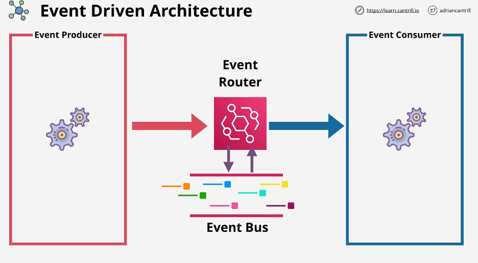
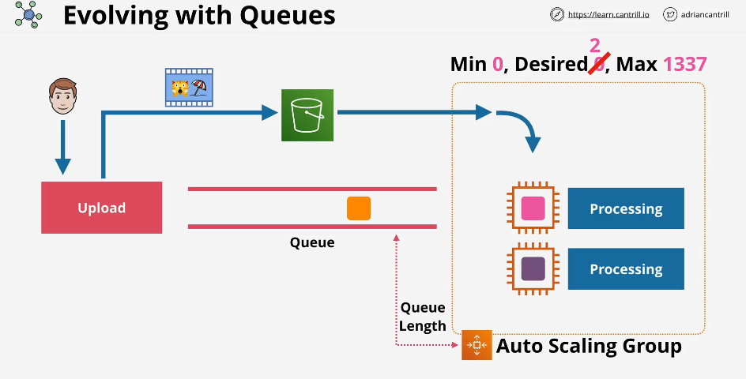

# 🔥 **The Ultimate Guide to Event-Driven Architecture (EDA)**

Event-Driven Architecture (**EDA**) is a **modern software design pattern** that enables applications to **respond to events in real-time**, ensuring **scalability, flexibility, and resilience**. This architecture is widely used in **IoT, microservices, financial systems, AI/ML pipelines, and real-time analytics**.

---

## 📌 **Table of Contents**

**1️⃣ What is Event-Driven Architecture?**  
**2️⃣ How Event-Driven Architecture Works**  
**3️⃣ Core Components of EDA**  
**4️⃣ Key Benefits of EDA**  
**5️⃣ EDA vs. Request-Driven Architecture (Traditional APIs)**  
**6️⃣ Event-Driven Architecture Patterns & Design Approaches**  
**7️⃣ Common Tools & Frameworks for EDA**  
**8️⃣ Real-World Use Cases of EDA**  
**9️⃣ Challenges & Best Practices**  
**🔟 When to Use Event-Driven Architecture (and When Not to Use It)**

---

## 🚀 **1️⃣ What is Event-Driven Architecture?**

### **📌 Definition**

**Event-Driven Architecture (EDA)** is a **software design pattern** where components interact by producing and consuming **events asynchronously**, instead of making direct API calls.

💡 **In EDA, an "event" is a state change that is broadcasted to notify other components.**

📌 **Examples of Events:**  
✅ **User signs up** (Triggers a welcome email)  
✅ **Payment is processed** (Triggers order fulfillment)  
✅ **Temperature sensor detects high heat** (Triggers an alert)  
✅ **Stock price changes** (Triggers real-time analytics)

### **📌 How EDA Differs from Traditional Architecture**

- **Traditional APIs (REST)**: Services communicate **synchronously** by making **direct requests and waiting for responses**.
- **EDA**: Components communicate **asynchronously** by **publishing events**, allowing multiple consumers to process them **without direct dependencies**.

✅ **EDA improves scalability, flexibility, and fault tolerance.**

---

---

## 🔄 **2️⃣ How Event-Driven Architecture Works**

### **📌 High-Level Workflow**

**1️⃣ An event occurs** (e.g., "UserCreated").  
**2️⃣ An event producer publishes the event** to an event router.  
**3️⃣ An event router distributes the event** to one or multiple consumers.  
**4️⃣ Event consumers react asynchronously** (e.g., update a database, send notifications).

### **📌 Example: E-Commerce Order Processing**

📌 **A user places an order on an e-commerce platform**

**1️⃣ "OrderPlaced" event is published**  
**2️⃣ Multiple consumers react asynchronously:**

- Inventory Service updates stock
- Payment Service processes the transaction
- Notification Service sends an order confirmation email
- Analytics Service logs the order

✅ **Each component runs independently, reducing dependencies.**

---

## 🏗 **3️⃣ Core Components of Event-Driven Architecture**

| **EDA Component**          | **Description**                                               | **Example Use Cases**                                  |
| -------------------------- | ------------------------------------------------------------- | ------------------------------------------------------ |
| **Event Producer**         | The source of events                                          | API calls, IoT sensors, user interactions              |
| **Event Broker (Router)**  | Routes events to consumers                                    | Message brokers, event buses, pub/sub systems          |
| **Event Consumer**         | Listens for events and processes them                         | Microservices, serverless functions, analytics engines |
| **Event Store (Optional)** | Stores event history for debugging, reprocessing, or auditing | Event sourcing, analytics, compliance logs             |

📌 **Decoupling producers and consumers ensures scalability & fault tolerance.**

---

## 🎯 **4️⃣ Key Benefits of Event-Driven Architecture**

✅ **Scalability** – Services scale independently based on event load  
✅ **Loose Coupling** – Components do not directly depend on each other  
✅ **Asynchronous Processing** – Improves performance and responsiveness  
✅ **Fault Tolerance** – Failures in one service do not affect others  
✅ **Real-Time Analytics** – Instant insights from continuous event streams  
✅ **Efficient Resource Utilization** – Services consume resources only when needed

📌 **EDA is widely used in real-time applications such as IoT, financial trading, social media feeds, and AI systems.**

---

## ⚡ **5️⃣ EDA vs. Request-Driven Architecture (Traditional APIs)**

| **Feature**         | **Event-Driven Architecture (EDA)**                   | **Request-Driven Architecture (REST APIs)**    |
| ------------------- | ----------------------------------------------------- | ---------------------------------------------- |
| **Communication**   | Asynchronous (event-based)                            | Synchronous (API calls)                        |
| **Coupling**        | Loose (services operate independently)                | Tight (services rely on direct calls)          |
| **Latency**         | Low latency, real-time processing                     | Higher latency due to request-response model   |
| **Scaling**         | Scales efficiently with event volume                  | Scaling depends on API call load               |
| **Fault Tolerance** | High – Failures in one component do not impact others | Lower – One failure can break the whole system |
| **Use Case**        | IoT, real-time analytics, event-driven microservices  | Traditional web services, CRUD applications    |

✅ **Use EDA for high-volume, event-driven systems.**  
✅ **Use REST APIs for structured request-response interactions.**

---

## 🔄 **6️⃣ Event-Driven Architecture Patterns & Design Approaches**

### **🔹 1. Pub/Sub (Publish-Subscribe) Pattern**

- **Multiple consumers subscribe to an event stream**
- **Best for:** Notifications, real-time updates, broadcasting

📌 **Example:**

- **Stock price changes → multiple traders receive updates**

---

### **🔹 2. Event Sourcing Pattern**

- **Events are stored in a log for auditability & reprocessing**
- **Best for:** Banking transactions, event history tracking

📌 **Example:**

- **Instead of storing "Account Balance: \$100", store all past transactions**

---

### **🔹 3. CQRS (Command Query Responsibility Segregation)**

- **Separate read & write operations for efficiency**
- **Best for:** High-performance, scalable systems

📌 **Example:**

- **Write data in a transactional system, but query from a read-optimized database**

---

## 🔧 **7️⃣ Common Tools & Frameworks for EDA**

| **Category**               | **Popular Tools**                            |
| -------------------------- | -------------------------------------------- |
| **Event Brokers**          | Apache Kafka, RabbitMQ, NATS                 |
| **Message Queues**         | ActiveMQ, Amazon SQS, ZeroMQ                 |
| **Event Streaming**        | Apache Flink, Apache Pulsar, Kinesis         |
| **Event-Driven Databases** | EventStoreDB, PostgreSQL Logical Replication |
| **Workflow Orchestration** | Temporal.io, Camunda, Apache Airflow         |

📌 **Selecting the right tool depends on event volume, latency, and persistence needs.**

---

## 🏢 **8️⃣ Real-World Use Cases of EDA**

| **Industry**              | **Use Case**                                             |
| ------------------------- | -------------------------------------------------------- |
| **E-Commerce**            | Real-time order processing, personalized recommendations |
| **Banking & Finance**     | Fraud detection, stock trading, audit logs               |
| **IoT & Smart Devices**   | Sensor data streaming, predictive maintenance            |
| **Healthcare**            | Patient monitoring, alerts for critical conditions       |
| **AI & Machine Learning** | Event-driven model training, chatbot interactions        |

📌 **EDA powers mission-critical, real-time applications across industries.**

---

## 🚨 **9️⃣ Challenges & Best Practices in EDA**

| **Challenge**            | **Solution**                                        |
| ------------------------ | --------------------------------------------------- |
| **Event Duplication**    | Implement **idempotent event processing**           |
| **Message Ordering**     | Use **Kafka or FIFO queues**                        |
| **Event Loss**           | Implement **retry mechanisms & dead-letter queues** |
| **Debugging Complexity** | Use **event logs & tracing tools**                  |
| **Security Risks**       | Implement **role-based access & encryption**        |

✅ **Good design principles ensure reliable EDA implementation.**

---

## 🎯 **🔟 When to Use Event-Driven Architecture (and When Not To)?**

### **✅ When to Use EDA**

✔ **Real-time data processing** (IoT, AI, stock trading)  
✔ **High-volume event handling** (Financial transactions, social media feeds)  
✔ **Decoupled microservices** (Scalable backend services)

### **❌ When NOT to Use EDA**

❌ If **low-latency synchronous processing is needed**  
❌ If **strict transactional consistency is required**  
❌ If **application complexity isn't justified**

---

## 🚀 **Final Thoughts: Why EDA is the Future**

🔹 **EDA is essential for modern, scalable, and resilient architectures.**  
🔹 **Industries worldwide rely on event-driven design for real-time applications.**  
🔹 **Understanding EDA patterns helps build high-performance distributed systems.**
