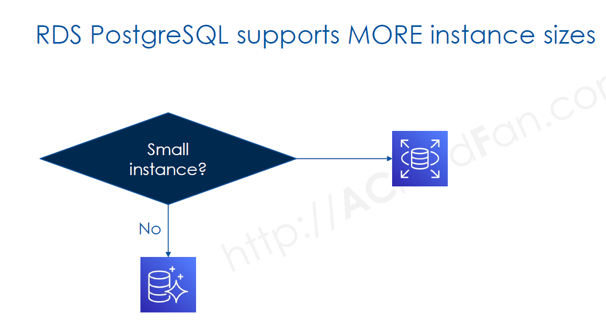
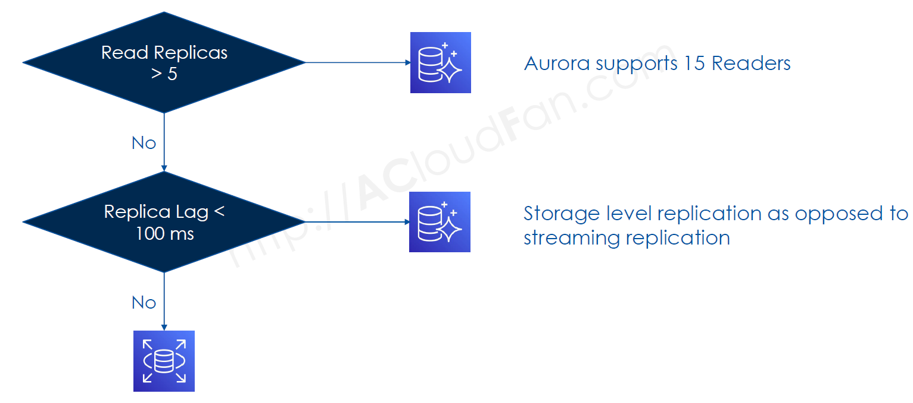
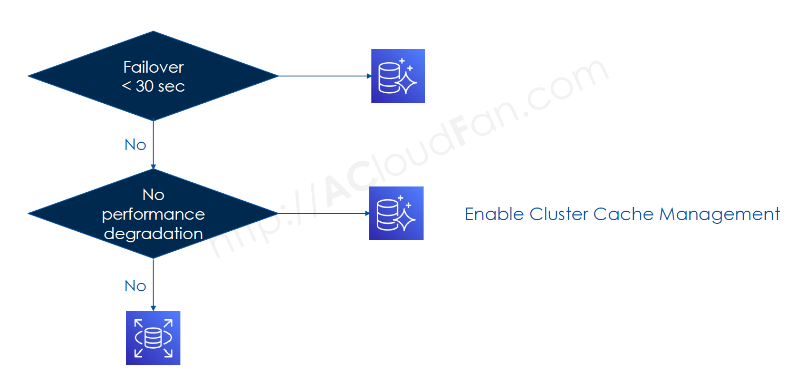
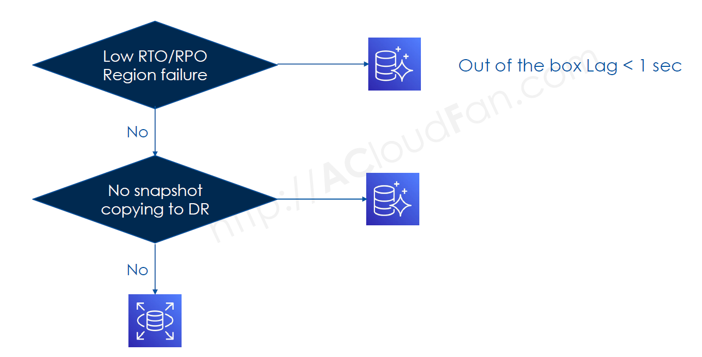
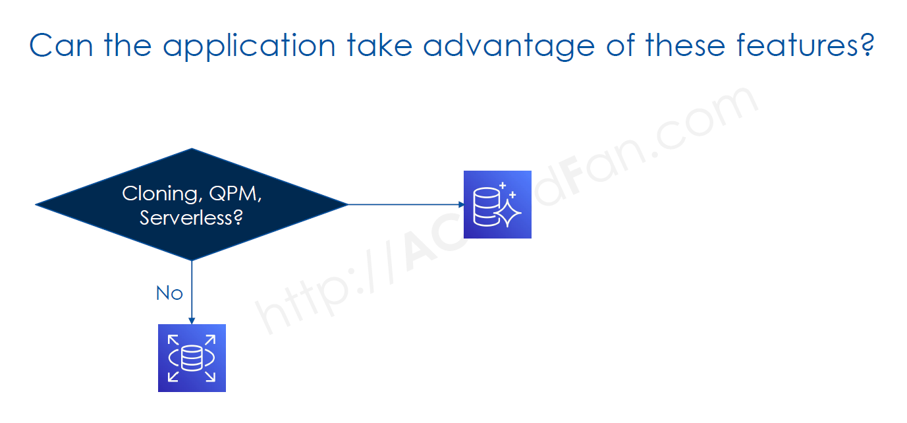
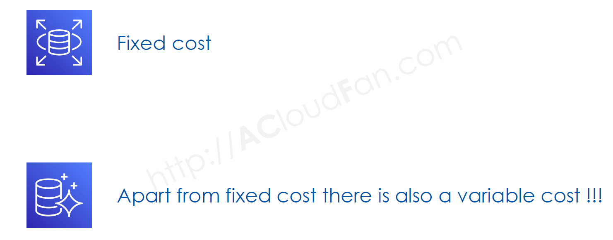

# 🤔 **Decision: Amazon RDS or Aurora PostgreSQL?**

Choosing between **Amazon RDS for PostgreSQL** and **Amazon Aurora PostgreSQL** depends on factors like **performance, cost, scalability, and high availability**. This guide helps you decide which option best fits your workload.

---

## **🏗 RDS PostgreSQL vs. Aurora PostgreSQL – Feature Comparison**

| **Feature**                      | **Amazon RDS PostgreSQL**                                      | **Amazon Aurora PostgreSQL**                                                         |
| -------------------------------- | -------------------------------------------------------------- | ------------------------------------------------------------------------------------ |
| **Management**                   | Fully managed by AWS                                           | Fully managed by AWS                                                                 |
| **Storage Scaling**              | **Manual scaling** up to **64 TiB**                            | **Auto-scales** in 10 GiB increments up to **128 TiB**                               |
| **Storage Architecture**         | Each DB instance has **dedicated storage**                     | **Shared distributed storage** across multiple AZs                                   |
| **Read Replicas (Same Region)**  | **Up to 5**                                                    | **Up to 15 per region**                                                              |
| **Read Replicas (Cross-Region)** | ✅ Yes (Asynchronous replication)                              | ✅ Yes (Global Database with dedicated replication infrastructure)                   |
| **Replication Type**             | **Streaming Replication (Physical/Logical)**                   | **Shared Storage Replication (Aurora Replication)**                                  |
| **Replication Lag**              | **Seconds to minutes (depending on network load and DB size)** | **Typically < 100 ms**                                                               |
| **Failover Mechanism**           | Uses Multi-AZ failover (Standby DB)                            | Aurora Replicas (Fast failover within the same cluster)                              |
| **Failover Time**                | **60–120s** (DNS update required)                              | **Typically ~30s**                                                                   |
| **Failover & Read Consistency**  | Standby **requires promotion**                                 | **Aurora Replicas are instantly available**                                          |
| **Cross-Region DR**              | **Read replicas only**                                         | **Aurora Global Database (Dedicated infrastructure for near real-time replication)** |
| **Backup Type**                  | **Daily snapshots**                                            | **Continuous incremental backups**                                                   |
| **Point-in-Time Restore (PITR)** | ✅ Yes                                                         | ✅ Yes                                                                               |
| **Performance**                  | Standard PostgreSQL                                            | **Up to 3x faster than RDS PostgreSQL**                                              |
| **Query Optimization**           | **Manual tuning required**                                     | **Query Plan Management (QPM) for automatic tuning**                                 |
| **Caching Mechanism**            | Cache is **lost** on failover                                  | Cache is **retained** on failover                                                    |
| **Availability SLA**             | **99.95% uptime (Multi-AZ)**                                   | **99.99% uptime (Aurora Multi-AZ)**                                                  |
| **Multi-Writer Cluster**         | ❌ Not supported                                               | ✅ Supported (Aurora Multi-Master)                                                   |
| **Aurora Parallel Query**        | ❌ Not available                                               | ✅ **Parallel Query Optimization** (Runs queries on storage layer)                   |
| **Cost Model**                   | **Pay per instance + storage separately**                      | **Pay per instance + shared storage usage**                                          |

 

**💡 Key Takeaways:**

✅ **Aurora PostgreSQL** provides **higher scalability, lower replication lag, and better failover handling** than RDS PostgreSQL.  
✅ **Aurora PostgreSQL’s shared storage layer** provides **instant read replicas** and allows up to **15 replicas per region**, whereas **RDS allows only 5 per region**.  
✅ **Aurora PostgreSQL’s Global Database** supports **cross-region replication** with minimal latency, whereas **RDS PostgreSQL relies on read replicas with higher replication lag**.  
✅ **Aurora PostgreSQL caches query plans and retains cache on failover**, improving performance compared to RDS PostgreSQL.  
✅ **Aurora PostgreSQL scales storage automatically up to 128 TiB**, whereas RDS PostgreSQL requires **manual resizing up to 64 TiB**.

---

## 🚀 **When to Choose Amazon RDS for PostgreSQL?**

✅ **Choose RDS if you need:**  
✔ **Standard PostgreSQL** with full **community compatibility**.  
✔ **Lower-cost** managed PostgreSQL with moderate performance needs.  
✔ **Up to 5 read replicas** for read scaling.  
✔ **Multi-AZ failover** without extreme HA requirements.  
✔ **Lower complexity** and simpler migration from on-premise PostgreSQL.

📌 **Best for:**  
✔ Web applications, SaaS platforms, e-commerce stores.  
✔ OLTP workloads requiring moderate scalability.  
✔ Database admins who need full control over configurations.

---

## ⚡ **When to Choose Aurora PostgreSQL?**

✅ **Choose Aurora if you need:**  
✔ **3x faster performance** than RDS PostgreSQL.  
✔ **Auto-scaling storage (up to 128TiB)** without downtime.  
✔ **Up to 15 read replicas** with low-latency replication.  
✔ **Cross-region replication** (Aurora Global Database).  
✔ **Faster failover (~30 seconds)** compared to RDS (~60-120s).  
✔ **Advanced features like Serverless, Query Plan Management, Cluster Cache Management.**

📌 **Best for:**  
✔ High-performance applications with **heavy read traffic**.  
✔ **Enterprise & fintech applications** requiring near-zero downtime.  
✔ **Multi-region applications** with **disaster recovery needs**.  
✔ **Event-driven & unpredictable workloads** using **Aurora Serverless**.

---

## 💰 **Cost Comparison: RDS vs. Aurora PostgreSQL**

| **Cost Factor**      | **RDS PostgreSQL**            | **Aurora PostgreSQL**                         |
| -------------------- | ----------------------------- | --------------------------------------------- |
| **Instance Pricing** | Lower per-instance cost       | Slightly higher cost                          |
| **Storage**          | EBS-backed                    | Auto-scaling                                  |
| **Replication**      | Additional costs for replicas | **Replicas share storage** (cheaper)          |
| **Cross-Region**     | Expensive read replicas       | **Aurora Global Database (faster & cheaper)** |
| **Failover Cost**    | Requires a standby instance   | **Built-in fast failover**                    |

📌 **Key Takeaway**:

- **Aurora's pricing is higher per instance**, but **costs less for read scaling**.
- **For multi-region apps, Aurora saves money** on replication & failover.

---

## **Key Questions**

    <h1>Workload characteristics : Size & IOPS</h1>
    

    <h1>Workload characteristics : Instance Size</h1>
    

    <h1>Scaling</h1>
    

    <h1>Features: Failover & Cluster Cache Management</h1>
    

    <h1>Features : Global Database</h1>
    

    <h1>Features: Cloning, QPM, Serverless</h1>
    

    <h1>Cost</h1>
    

---

## 🎯 **Final Decision: RDS or Aurora PostgreSQL?**

| **Scenario**                                             | **Recommended**          |
| -------------------------------------------------------- | ------------------------ |
| **Standard PostgreSQL workloads**                        | ✅ **Amazon RDS**        |
| **Low-cost managed database**                            | ✅ **Amazon RDS**        |
| **Large-scale, high-read applications**                  | ✅ **Amazon Aurora**     |
| **Global applications needing multi-region replication** | ✅ **Amazon Aurora**     |
| **Auto-scaling workloads**                               | ✅ **Aurora Serverless** |
| **Mission-critical applications with fast failover**     | ✅ **Amazon Aurora**     |

💡 **Final Thought**:

- **If you want cost-effective, managed PostgreSQL → Choose RDS**
- **If you need performance, scalability, & failover → Choose Aurora**
