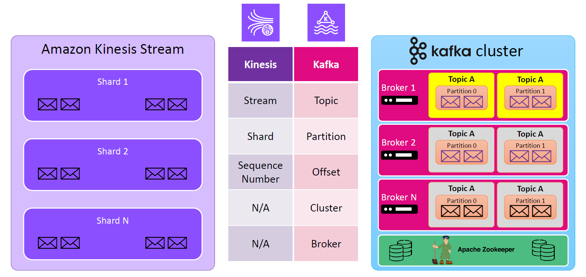
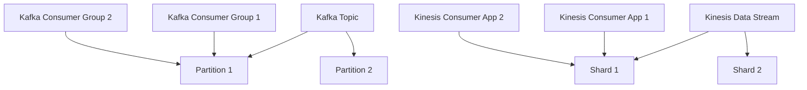

# 🚀 Kinesis vs. Kafka: Terminology, Architecture & Features Breakdown

Streaming data is like a never-ending river of real-time events — and to tame it, we use tools like **Apache Kafka** and **Amazon Kinesis**. But how do they stack up against each other?

Let’s dive in! 🏊‍♂️

---

## 🧠 Conceptual Summary

| Category   | Apache Kafka                                               | Amazon Kinesis                                                      |
| ---------- | ---------------------------------------------------------- | ------------------------------------------------------------------- |
| Type       | Open-source distributed event streaming platform           | Fully managed AWS streaming data service                            |
| Language   | Java (runs on JVM)                                         | Native AWS service, SDKs in multiple languages                      |
| Deployment | Self-managed or via AWS MSK                                | Fully managed                                                       |
| Use Cases  | Event streaming, messaging, log aggregation, microservices | Real-time analytics, ingestion into AWS services, IoT, ML pipelines |

---

## 🔀 Core Terminology Mapped

<div style="text-align: center;">
  
</div>

---

| Concept          | Kafka Term                 | Kinesis Term                                         | Explanation                                                                              |
| ---------------- | -------------------------- | ---------------------------------------------------- | ---------------------------------------------------------------------------------------- |
| Logical stream   | **Topic**                  | **Data Stream**                                      | A named channel to send/receive messages                                                 |
| Sub-division     | **Partition**              | **Shard**                                            | A scalable unit within a stream for parallelism                                          |
| Message          | **Record**                 | **Record**                                           | The smallest unit of data (could be a JSON, binary, etc.)                                |
| Consumer Group   | **Consumer Group**         | Not a native concept in KDS (you manage it via apps) | Kafka tracks offsets per group; in Kinesis, you manage checkpointing manually or via KCL |
| Message ordering | **Per partition**          | **Per shard**                                        | Both guarantee ordering within a partition/shard                                         |
| Message storage  | **Durable (configurable)** | **Configurable (1-365 days)**                        | Retention settings differ                                                                |

---

## 🏗️ Architecture Comparison

### 🛠 Apache Kafka

- **Cluster** → Group of brokers
- **Broker** → A Kafka server that stores partitions of topics
- **ZooKeeper** → (Legacy) coordination layer for leader election and metadata
- **Producer** → Sends records to a topic
- **Consumer** → Pulls data from a topic partition
- **Offset Management** → Consumer-managed or stored in Kafka

🧠 **You scale Kafka by adding more brokers and partitions. You are in control, but also responsible for everything.**

---

### 🛠 Amazon Kinesis

- **Kinesis Data Streams (KDS)** → Stream that holds shards
- **Shard** → Like a Kafka partition; writes and reads are limited per shard
- **Producer** → Sends records (e.g., via KPL, Kinesis Agent, AWS SDK)
- **Consumer** → Reads data via polling (GetRecords or SubscribeToShard for enhanced fan-out)
- **Enhanced Fan-Out** → Each consumer gets dedicated throughput (2 MB/sec/shard)
- **Checkpointing** → Handled manually via DynamoDB when using KCL (Kinesis Client Library)

🧠 **You scale Kinesis by increasing shards or using On-Demand mode. AWS manages availability and fault tolerance for you.**

---

## 🧩 Features Comparison

<div style="text-align: center;">
  
</div>

---

| Feature              | Apache Kafka                                                | Amazon Kinesis                                   |
| -------------------- | ----------------------------------------------------------- | ------------------------------------------------ |
| Delivery Model       | **Pull-based**                                              | **Pull or Push (Enhanced Fan-Out)**              |
| Retention            | Configurable (default 7 days), infinite with tiered storage | 1 to 365 days                                    |
| Throughput Scaling   | Add more partitions                                         | Add more shards / On-demand                      |
| Ordering             | Guaranteed per partition                                    | Guaranteed per shard                             |
| Security             | SASL, TLS, ACLs                                             | IAM, KMS, VPC, Encryption at rest and in transit |
| Storage              | Self-managed, persistent log                                | Managed, stored in Kinesis shards                |
| Processing Framework | Kafka Streams, Flink, Spark                                 | AWS Lambda, Kinesis Analytics, Flink             |
| Offset Management    | Kafka stores offsets (optional commit)                      | You manage it (via KCL or application)           |
| Serverless Option    | No (MSK Serverless exists though)                           | Yes (Kinesis is inherently serverless)           |

---

## 🧪 Example Use Case: Order System

Let’s say you have an app that processes order events like:

```plaintext
OrderPlaced -> OrderShipped -> OrderDelivered
```

In both systems:

- You want the same **order ID** records to be routed to the same shard/partition to preserve order.
- You want both the **Order System** and **Notification System** to read the same messages.

### In Kafka

- Use a **partition key = order ID**.
- Each **consumer group** maintains **independent offsets**.
- Both systems can read all events independently — they won’t interfere with each other.

### In Kinesis

- Use a **partition key = order ID**, ensuring same shard.
- Consumers must handle **their own checkpointing** (via DynamoDB).
- If using **enhanced fan-out**, each consumer gets their own throughput.

---

## 📈 Throughput Comparison

| Scaling            | Kafka                      | Kinesis                                 |
| ------------------ | -------------------------- | --------------------------------------- |
| Horizontal Scaling | Add partitions and brokers | Add shards or use On-Demand             |
| Fan-Out            | Multiple consumer groups   | Enhanced Fan-Out (dedicated throughput) |

---

## 🔐 Security Comparison

| Feature           | Kafka                              | Kinesis                          |
| ----------------- | ---------------------------------- | -------------------------------- |
| Network Isolation | VPC with MSK / self-hosted options | Native VPC integration           |
| Encryption        | SSL/TLS, at-rest (with disk setup) | AWS KMS (at-rest and in-transit) |
| Auth              | SASL, ACLs                         | IAM policies, KMS keys           |

---

## 📊 Cost Consideration

| Cost Factor | Kafka                                        | Kinesis                                      |
| ----------- | -------------------------------------------- | -------------------------------------------- |
| Infra       | Self-managed (or MSK)                        | Fully managed                                |
| Pricing     | Broker usage, storage, throughput (with MSK) | Per shard or On-Demand, EFO adds cost        |
| Management  | Needs DevOps/Infra team                      | Zero admin (serverless), AWS manages scaling |

---

## 🧭 Summary

| Feature                 | Kafka                          | Kinesis                             |
| ----------------------- | ------------------------------ | ----------------------------------- |
| Self-hosted flexibility | ✅                             | ❌                                  |
| Fully managed by cloud  | MSK (AWS)                      | ✅                                  |
| Serverless              | MSK Serverless                 | ✅                                  |
| Per-consumer throughput | Consumer group offset          | Enhanced Fan-Out                    |
| Ideal for               | Complex, high-volume pipelines | Real-time processing with AWS stack |

---

## 📌 Final Thoughts

> If you want **full control**, and are okay with managing infra → go with **Apache Kafka** or **Amazon MSK**.
>
> If you want **serverless, low-ops streaming tightly integrated with AWS** → go with **Amazon Kinesis**.

---

## 📥 Diagram: Terminology Mapping


