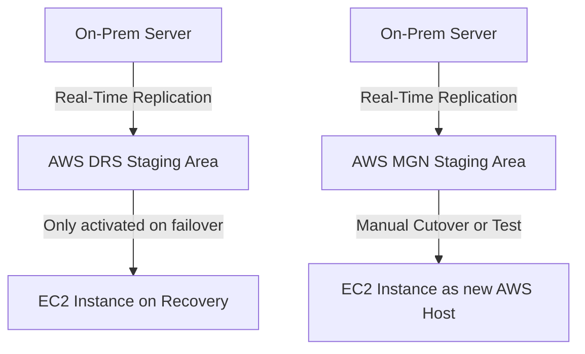

# 🤹‍♂️ **AWS DRS vs. AWS MGN — What’s the Difference?**

> ❓“Should I use DRS or MGN?”  
> You're not alone — even pros get confused. Let’s break it down once and for all.

---

## 🧭 **Quick Summary**

| 🤔 Question                 | ✅ Use AWS DRS                        | ✅ Use AWS MGN                          |
| --------------------------- | ------------------------------------- | --------------------------------------- |
| **Purpose**                 | Disaster Recovery                     | Application Migration (Lift & Shift)    |
| **Most Common Use Case**    | Resume workloads **after a disaster** | Move workloads **from anywhere to AWS** |
| **Always-on recovery?**     | ✅ Yes — ready for failover           | ❌ No — one-time migration              |
| **GovCloud/China support?** | ❌ Not supported                      | ✅ Supported                            |
| **AWS Outposts support?**   | ❌ Not supported                      | ✅ Supported                            |
| **Built on**                | AWS-native service                    | Based on CloudEndure tech               |

---

## 🧠 **What Is Each One For?**

### ♻️ **Elastic Disaster Recovery (AWS DRS)**

> Your **always-on insurance plan** for the cloud

- 🔄 Continuously replicates your data to AWS.
- 📦 Stores it in **a staging area** (cheap S3 + minimal compute).
- 🛑 No EC2 or EBS created **until disaster strikes**.
- 🧯 You “failover” (recover) when a system goes down.
- 🧪 You can test recovery without downtime.

✅ **Best For**:

- Disaster recovery planning.
- Fast and automated recovery during outages.

---

### 🚚 **Application Migration Service (AWS MGN)**

> Your **one-time moving truck** for migrating to AWS

- 🚀 Performs **lift-and-shift** migration from any infrastructure.
- 🔁 Replicates full server (OS + apps + data) in real-time to AWS.
- ✅ Allows test launches in AWS before the cutover.
- ✂️ Final “cutover” happens with **minimal downtime**.
- 🛠️ Also works in **GovCloud**, **China**, and **AWS Outposts**.

✅ **Best For**:

- Moving apps to AWS from on-prem or other clouds.
- Legacy workloads you don’t want to rebuild.
- Specialized environments.

---

## 📸 **Visual Cheat Sheet**

---

## 🧪 **Simple Real-World Analogy**

| Situation   | Think of it as...                                   |
| ----------- | --------------------------------------------------- |
| **AWS DRS** | Fire extinguisher: Not used daily, but always ready |
| **AWS MGN** | Moving truck: Used once to move you to the cloud    |

---

## 🧠 When to Use Which?

### ✅ Use **AWS DRS** if

- You want **automatic, continuous** replication for **DR purposes**.
- You want to recover systems **after failure or disaster**.
- You need **point-in-time recovery**.
- You’re not targeting **GovCloud**, **China**, or **Outposts**.

### ✅ Use **AWS MGN** if

- You want to **migrate workloads** to AWS **permanently**.
- You're in **GovCloud**, **China**, or using **AWS Outposts**.
- You want **one-time lift-and-shift** without changing code.
- You need to move **unsupported OS** (DRS supports fewer OS types).

---

## 🧪 Example Use Cases

| Scenario                                             | Best Option | Why?                                             |
| ---------------------------------------------------- | ----------- | ------------------------------------------------ |
| 🚨 Recovering from a ransomware attack               | **AWS DRS** | Fast recovery, point-in-time restore             |
| 🚛 Migrating legacy web app from on-prem to AWS EC2  | **AWS MGN** | One-time move, no app changes                    |
| 🌎 Moving to GovCloud or China region                | **AWS MGN** | DRS not supported in these regions               |
| 🔄 Building DR plan for mission-critical app         | **AWS DRS** | Keeps data synced and ready for instant failover |
| 🧱 Migrating to AWS Outposts (on-premises AWS setup) | **AWS MGN** | DRS doesn’t support Outposts                     |

---

## 🧠 Final Verdict

| Goal                                  | Use This       |
| ------------------------------------- | -------------- |
| “I want to move my stuff to AWS”      | ✅ **AWS MGN** |
| “I want to be ready if disaster hits” | ✅ **AWS DRS** |

Both services are **powerful**, but they solve **different problems**. Think of **DRS as your backup parachute**, and **MGN as your moving service**.
