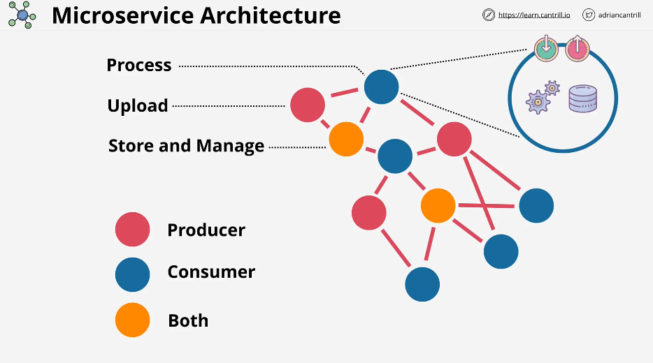

# 🔥 **The Ultimate Guide to Microservices Architecture**

Microservices architecture has revolutionized the way modern applications are built and scaled. Unlike traditional monolithic systems, microservices enable **scalability, flexibility, and resilience** by breaking applications into **small, independent services**.

---

## 📌 **Table of Contents**

1️⃣ **What is Microservices Architecture?**  
2️⃣ **How Microservices Work**  
3️⃣ **Key Characteristics of Microservices**  
4️⃣ **Microservices vs. Monolithic Architecture**  
5️⃣ **Benefits of Microservices**  
6️⃣ **Challenges of Microservices**  
7️⃣ **Microservices Communication Patterns**  
8️⃣ **Design Patterns in Microservices**  
9️⃣ **Tools & Frameworks for Microservices**  
🔟 **Best Practices for Implementing Microservices**

---

## 🚀 **1️⃣ What is Microservices Architecture?**

### **📌 Definition**

**Microservices architecture** is an architectural style where an application is **built as a collection of small, independent services**. Each microservice:

- **Handles a specific business capability**
- **Has its own database**
- **Communicates with other services via APIs or messaging**

📌 **Example:**  
A **banking system** may have separate microservices for:
✅ **User Management**  
✅ **Payments**  
✅ **Fraud Detection**  
✅ **Notification Service**

Each microservice operates **independently**, allowing **rapid development, deployment, and scaling**.

---

<div style="text-align: center;"></div>

---

## 🔄 **2️⃣ How Microservices Work**

1️⃣ **A user makes a request** (e.g., places an order on an e-commerce site).  
2️⃣ **API Gateway routes the request** to the appropriate microservice.  
3️⃣ **Microservices interact via APIs or messaging queues** to complete the request.  
4️⃣ **Each microservice performs its function and returns data**.  
5️⃣ **The response is aggregated and sent back to the user**.

✅ **Each microservice is autonomous and can be deployed & scaled independently!**

---

## 🎯 **3️⃣ Key Characteristics of Microservices**

✅ **Decoupled Services:** Services operate independently  
✅ **Scalability:** Each service can be scaled separately  
✅ **Resilience:** A failure in one service does not break the entire system  
✅ **Technology Agnostic:** Each microservice can use a different programming language or database  
✅ **Independent Deployment:** Teams can develop and deploy services separately

📌 **Microservices provide flexibility & agility for modern software development.**

---

## ⚡ **4️⃣ Microservices vs. Monolithic Architecture**

| Feature            | **Microservices**                                   | **Monolithic**                                  |
| ------------------ | --------------------------------------------------- | ----------------------------------------------- |
| **Scalability**    | ✅ Scales per service                               | ❌ Scales as a whole                            |
| **Flexibility**    | ✅ Independent technologies per service             | ❌ Single technology stack                      |
| **Deployment**     | ✅ Independent releases                             | ❌ Requires full application redeployment       |
| **Failure Impact** | ✅ Failure in one service does not break the system | ❌ One failure can crash the entire application |
| **Complexity**     | ❌ More difficult to manage                         | ✅ Easier to develop initially                  |

✅ **Microservices are ideal for large-scale, complex applications.**  
❌ **Monolithic architecture works best for simple, small applications.**

---

## 🏗 **5️⃣ Benefits of Microservices**

✅ **Faster Development:** Teams work on different services simultaneously  
✅ **Independent Scaling:** Each microservice scales as needed  
✅ **Resilient Architecture:** Fault isolation prevents system-wide failures  
✅ **Easier Maintenance:** Small, modular services simplify updates  
✅ **Faster Time-to-Market:** Continuous deployment speeds up releases

📌 **Microservices enable agile, scalable, and maintainable applications.**

---

## 🚨 **6️⃣ Challenges of Microservices**

| **Challenge**                            | **Solution**                                                      |
| ---------------------------------------- | ----------------------------------------------------------------- |
| **Increased Complexity**                 | Use **service orchestration tools (Kubernetes, Service Mesh)**    |
| **Data Consistency Issues**              | Use **event-driven architecture (Saga pattern, CQRS)**            |
| **More Difficult Debugging**             | Use **centralized logging & tracing (ELK Stack, Jaeger, Zipkin)** |
| **Security & Authentication**            | Implement **OAuth, JWT, API Gateways**                            |
| **Inter-Service Communication Overhead** | Use **asynchronous messaging (Kafka, RabbitMQ, gRPC)**            |

📌 **Microservices require strong DevOps & monitoring strategies.**

---

## 🔄 **7️⃣ Microservices Communication Patterns**

Microservices communicate using **either synchronous or asynchronous methods**.

### **🔹 1. REST API (Synchronous)**

- Services communicate via **HTTP APIs**.
- **Best for:** Simple requests, CRUD operations.  
  📌 **Example:**

```sh
GET /orders/123
```

---

### **🔹 2. gRPC (Synchronous)**

- High-performance **binary communication protocol**.
- **Best for:** Low-latency, high-speed interactions between services.

📌 **Example:**

- **Microservices in different programming languages communicate efficiently.**

---

### **🔹 3. Message Queues (Asynchronous)**

- Uses **RabbitMQ, Kafka, or SQS** for **event-based processing**.
- **Best for:** Background jobs, notifications, event-driven workflows.

📌 **Example:**

- **Order Service places an order → Payment Service processes the payment asynchronously.**

---

## 🎨 **8️⃣ Design Patterns in Microservices**

| **Pattern**                                         | **Use Case**                                                      |
| --------------------------------------------------- | ----------------------------------------------------------------- |
| **API Gateway**                                     | Central entry point for managing API calls                        |
| **Database per Service**                            | Each service owns its own database                                |
| **Saga Pattern**                                    | Ensures distributed transactions across services                  |
| **CQRS (Command Query Responsibility Segregation)** | Separates read and write models for performance                   |
| **Event Sourcing**                                  | Stores a log of changes for history tracking                      |
| **Circuit Breaker**                                 | Prevents cascading failures by stopping calls to failing services |

📌 **Choosing the right design pattern is critical for microservices success.**

---

## 🔧 **9️⃣ Tools & Frameworks for Microservices**

### **🔹 Programming Languages**

✅ **Node.js** – Lightweight, event-driven microservices  
✅ **Java & Spring Boot** – Enterprise-level microservices  
✅ **Python** – AI-driven and data-heavy microservices

---

### **🔹 API Management**

✅ **Kong API Gateway**  
✅ **Apigee**  
✅ **AWS API Gateway**

---

### **🔹 Messaging & Event Streaming**

✅ **Apache Kafka**  
✅ **RabbitMQ**  
✅ **NATS**

---

### **🔹 Service Discovery & Orchestration**

✅ **Kubernetes (K8s)**  
✅ **Consul**  
✅ **Eureka**

📌 **Choosing the right tools helps optimize microservices performance.**

---

## ✅ **🔟 Best Practices for Implementing Microservices**

### **1️⃣ Keep Services Small & Focused**

📌 **Each microservice should do ONE thing well.**

### **2️⃣ Use API Gateways for Centralized Routing**

📌 **API Gateway handles authentication, rate limiting, and security.**

### **3️⃣ Use Asynchronous Communication for Scalability**

📌 **Message queues (Kafka, RabbitMQ) improve performance & resilience.**

### **4️⃣ Implement Distributed Tracing**

📌 **Use logging & monitoring tools (Prometheus, Jaeger) to track requests.**

### **5️⃣ Automate Deployments with CI/CD**

📌 **Use Jenkins, GitHub Actions, or GitLab CI/CD for fast & reliable deployments.**

---

## 🎯 **Final Thoughts: Why Microservices Matter**

🔹 **Microservices enable scalable, flexible, and maintainable applications.**  
🔹 **They reduce dependencies, increase agility, and improve fault tolerance.**  
🔹 **Despite challenges, microservices are the foundation of modern cloud applications.**

🚀 **Now you understand Microservices!**  
💡 **Next, we’ll explore how to implement Microservices in AWS.** 🎯
