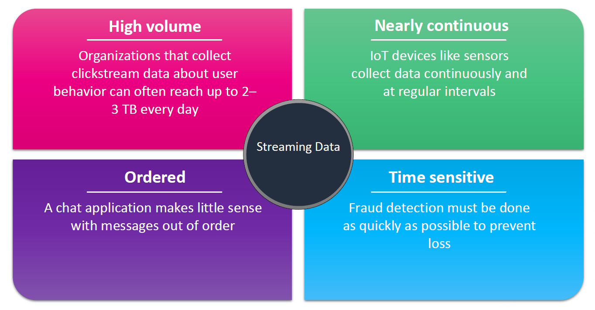
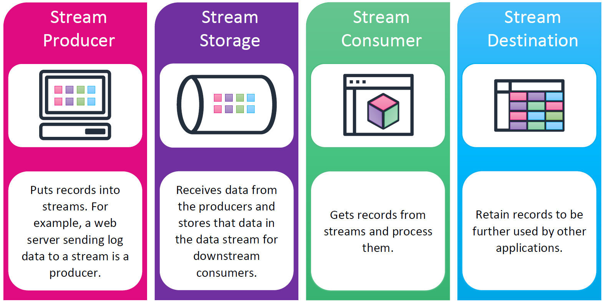
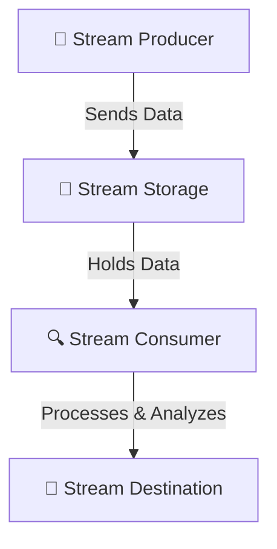
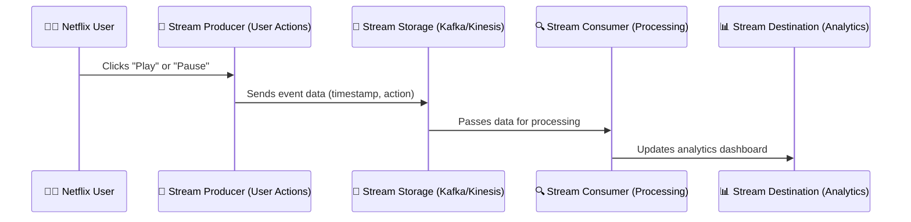

# 🚀 **Streaming Data: The Power of Real-Time Data Processing**

Welcome to the **fast lane** of data processing! Imagine **Netflix buffering in real time**, **live stock market updates**, or **Uber tracking your driver’s location**—that’s **streaming data** at work.

---

## 🔍 **What is Streaming Data? (Official Definition)**

📌 **Definition (AWS):**  
**Streaming data** is continuously generated data that arrives in **high volume and small sizes**, usually from **multiple sources**, and must be **processed quickly** to provide real-time insights.

It is typically produced **incrementally** and requires **low-latency processing** to analyze and act on it **immediately**.

### 🎯 **Real-World Examples of Streaming Data**

- ✔ **Social Media Feeds** – X (Twitter) posts, Instagram stories 📲
- ✔ **E-commerce Transactions** – Real-time cart updates & checkout activity 🛒
- ✔ **IoT Sensor Data** – Smart home devices & GPS tracking 🚗
- ✔ **Stock Market Prices** – Real-time trading updates 💹
- ✔ **Fraud Detection** – Monitoring banking transactions for unusual behavior 🏦

💡 **Key takeaway:** Streaming data is **live**, **fast**, and must be processed as it happens—no waiting!

---

## ⚖ **Batch Processing vs. Streaming Processing: What’s the Difference?**

### **📂 Batch Processing (The "Save & Process Later" Method)**

Batch processing involves **collecting data over time**, then processing it **in bulk**.

✔ **Best for:**

- ✅ Payroll systems (calculate salaries monthly 🧾)
- ✅ Sales reports (generate a report at the end of the day 📊)
- ✅ Log processing (analyze server logs once per hour 🔍)

### **🚀 Streaming Processing (The "Process As It Happens" Method)**

Streaming data processing happens **instantly** as data is produced.

✔ **Best for:**

- ✅ **Fraud detection** (detect unusual transactions in real-time ⚠️)
- ✅ **Live chat applications** (WhatsApp messages must be instant 💬)
- ✅ **Stock trading** (decisions made in milliseconds! ⏳)

| Feature              | Batch Processing 📂       | Streaming Processing 🚀        |
| -------------------- | ------------------------- | ------------------------------ |
| **Processing Speed** | Hours to days ⏳          | Milliseconds to seconds ⚡     |
| **Data Scope**       | Full dataset              | Recent or rolling data         |
| **Complexity**       | Complex analytics         | Lightweight real-time actions  |
| **Use Case**         | Payroll, reports, backups | Fraud detection, stock trading |

💡 **Key takeaway:** Batch is like Netflix (download first, then watch), while Streaming is like YouTube Live (watch in real-time).

---

## 🎯 **Key Characteristics of Streaming Data**

  

---

🔹 **1️⃣ High Volume** – Streaming data is **massive** (e.g., e-commerce sites generate **terabytes** of user clickstream data **daily!** 📊).

🔹 **2️⃣ Ordered Processing** – Events **must be in order** (Imagine receiving a WhatsApp reply **before the question**! 😵).

🔹 **3️⃣ Continuous Flow** – Unlike batch data, streaming data **never stops** (think of live GPS tracking 🚗).

🔹 **4️⃣ Time-Sensitive** – Some decisions **MUST** be made **immediately** (Fraud detection systems **must react instantly!** 💸).

💡 **Key takeaway:** Streaming data is **big, fast, and must be processed in sequence**.

---

## 🏗 **Streaming Data Components: Who Does What?**

  

---

---

To handle streaming data, we need a **well-coordinated system**. Think of it as a **relay race** 🏃 where each component has a role:

### **📡 1. Stream Producer (The Data Generator)**

- 📌 **Who?** – The source of streaming data
- 📌 **Examples:**
  - ✅ Web servers logging user activity
  - ✅ IoT devices tracking temperature

---

### **💾 2. Stream Storage (The Waiting Room)**

- 📌 **Who?** – Holds incoming data before it’s processed
- 📌 **Examples:**
  - ✅ **Amazon Kinesis Data Streams**
  - ✅ **Apache Kafka**

---

### **🔍 3. Stream Consumer (The Processing Unit)**

- 📌 **Who?** – Reads & processes streaming data
- 📌 **Examples:**
  - ✅ AWS Lambda (real-time processing)
  - ✅ Apache Flink (event stream analytics)

---

### **🎯 4. Stream Destination (The Final Storage or Action Point)**

- 📌 **Who?** – Stores or acts on processed data
- 📌 **Examples:**
  - ✅ Amazon S3 (Data Lake)
  - ✅ Amazon Redshift (Analytics)
  - ✅ Elasticsearch (Log Monitoring)

💡 **Key takeaway:** Each part of the system **moves data forward** to ensure real-time insights.

---

## 🔄 **How Streaming Data Works: A Real-World Flow** 🌍

Let’s say **Netflix** wants to track **real-time user engagement** (pause, rewind, skip, etc.). Here's how they do it:

**Outcome?** ✅ Netflix knows which shows are **most paused**, **rewound**, or **skipped** in **real-time**!

---

## 🎯 **Final Takeaways**

- 🔹 **Streaming data is continuously generated and processed in real-time**.
- 🔹 **Batch processing is best for large-scale, periodic processing**, but **streaming is crucial for instant decision-making**.
- 🔹 **A complete streaming system includes producers, storage, consumers, and destinations**.
- 🔹 **Use streaming for real-time fraud detection, IoT monitoring, stock trading, and more**.
