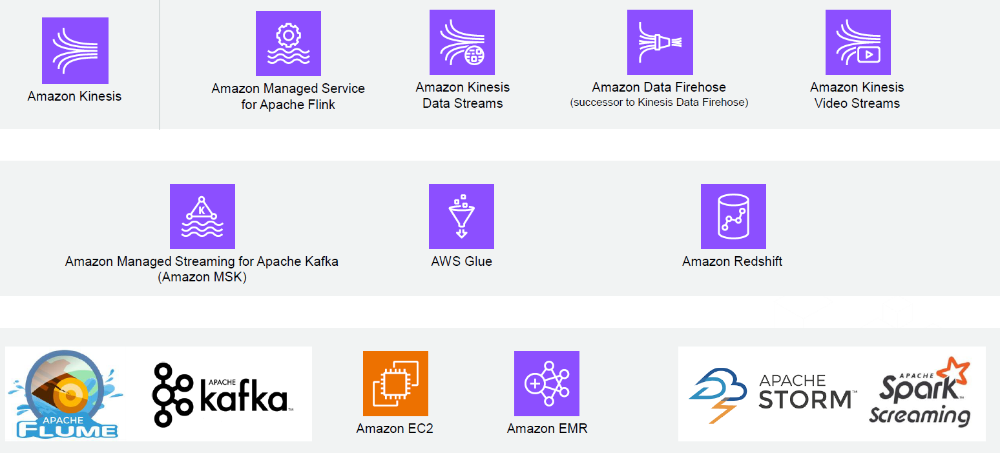
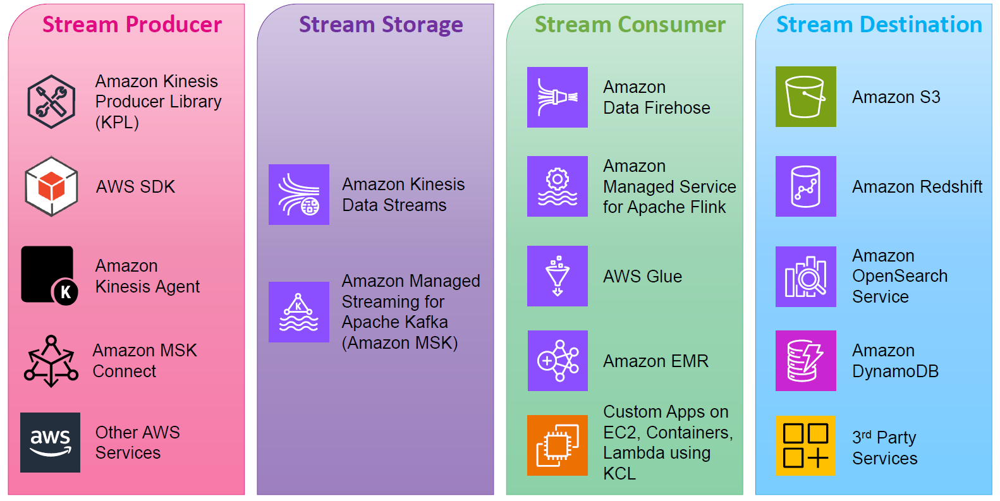
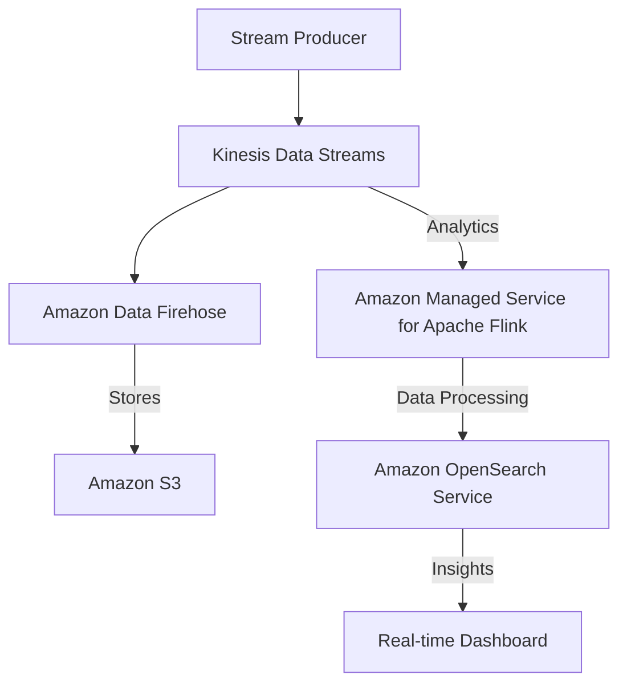

# 🌊 **Streaming Services on AWS**

  

---

## 🏗 **Key Components of AWS Streaming Architecture**

AWS organizes streaming data into **four key components**:

1️⃣ **Stream Producer** 🎤 – **Who generates the data?**

- IoT devices, web apps, mobile apps, logs, databases, etc.

2️⃣ **Stream Storage** 📦 – **Where is the data stored before processing?**

- AWS **Kinesis Data Streams**, **Amazon MSK (Kafka)**.

3️⃣ **Stream Consumer** 🎯 – **Who processes the data?**

- **AWS Glue**, **Amazon Flink**, **Amazon Data Firehose**, **Amazon EMR**.

4️⃣ **Stream Destination** 🏁 – **Where does the processed data go?**

- **Amazon S3**, **Amazon Redshift**, **Amazon DynamoDB**, **Amazon OpenSearch**.

---

## 🚀 **AWS Streaming Services Overview**

AWS provides a **powerful suite of streaming services** tailored for different use cases.

### **1️⃣ Amazon Kinesis Family (AWS Native Streaming Platform)**

**Kinesis is AWS’s primary managed streaming service.** It consists of multiple components for **real-time data streaming and analytics**.

| 🔧 **Kinesis Service**                                                        | 📌 **Use Case**                                                      |
| ----------------------------------------------------------------------------- | -------------------------------------------------------------------- |
| **Amazon Kinesis Data Streams**                                               | Capture and process real-time data streams at scale.                 |
| **Amazon Data Firehose** (formerly Kinesis Data Firehose)                     | Automatically deliver streaming data to S3, Redshift, or OpenSearch. |
| **Amazon Managed Service for Apache Flink** (formerly Kinesis Data Analytics) | Perform real-time data transformations and analytics.                |
| **Amazon Kinesis Video Streams**                                              | Ingest and process video streams.                                    |

📌 **When to use?**

- If you **want a fully managed AWS-native streaming service**.
- If your use case involves **real-time ingestion, analytics, or routing data to storage**.

---

### **2️⃣ Amazon MSK (Managed Streaming for Apache Kafka)**

**What is it?**  
Amazon MSK (Managed Streaming for Apache Kafka) is a **fully managed Kafka service** that allows you to **ingest, store, and process** streaming data.

📌 **Why use it?**

- If your organization already uses **Kafka**, MSK **removes the operational burden** of managing Kafka clusters.
- Ideal for **event-driven architectures** and **real-time data pipelines**.

🔹 **Example Use Case**:  
A banking system uses **MSK** to detect and respond to **fraudulent transactions** **in real time**.

---

### **3️⃣ AWS Glue for Streaming ETL**

**What is it?**  
AWS Glue is a **serverless ETL (Extract, Transform, Load) service** that can **process and transform streaming data** before storing it.

📌 **Why use it?**

- If you **need to clean, transform, and prepare streaming data** before storing it in **S3, Redshift, or DynamoDB**.
- If you **want to integrate streaming data into an AWS data lake**.

🔹 **Example Use Case**:  
A retail company processes **real-time clickstream data** to analyze **customer behavior patterns**.

---

### **4️⃣ Amazon EMR (Big Data Streaming)**

**What is it?**  
Amazon EMR (Elastic MapReduce) is a **big data platform** that supports real-time streaming with:

- **Apache Spark Streaming**
- **Apache Flink**
- **Apache Storm**

📌 **When to use?**

- If you are working with **large-scale, complex data**.
- If you **need to integrate Spark/Flink with existing data pipelines**.

🔹 **Example Use Case**:  
A financial company uses **EMR Spark Streaming** to **analyze stock market data in real time**.

---

### **5️⃣ Amazon OpenSearch Service (Real-time Search & Analytics)**

**What is it?**  
A **fully managed Elasticsearch service** that enables **real-time search and log analytics**.

📌 **Why use it?**

- If you need **real-time log monitoring**.
- If you want to **visualize streaming data** in dashboards.

🔹 **Example Use Case**:  
A **cybersecurity team** uses OpenSearch to **analyze security logs** for real-time **threat detection**.

---

## 🔥 **How These Services Work Together?**

  

---

To build a **real-time streaming architecture**, you can **combine AWS services**:

### **Example Pipeline:**

1. 🌎 **Stream Producer**: IoT devices, web apps, logs send real-time data.
2. 🚀 **Stream Storage**: Data enters **Kinesis Data Streams**.
3. 🔥 **Stream Processing**: **Amazon Managed Service for Apache Flink** cleans and analyzes data.
4. 📊 **Stream Destination**: Data is stored in **Amazon S3** or visualized in **OpenSearch**.

---

## 🎯 **Choosing the Right AWS Streaming Service**

| **Use Case**                                              | **Recommended AWS Service**             |
| --------------------------------------------------------- | --------------------------------------- |
| **Real-time data ingestion**                              | Kinesis Data Streams, Amazon MSK        |
| **ETL processing for streaming data**                     | AWS Glue                                |
| **Analytics & transformations on streaming data**         | Amazon Managed Service for Apache Flink |
| **Delivering data to storage (S3, Redshift, OpenSearch)** | Amazon Data Firehose                    |
| **Big data processing**                                   | Amazon EMR (Spark, Flink, Storm)        |
| **Real-time search & log analysis**                       | Amazon OpenSearch Service               |
