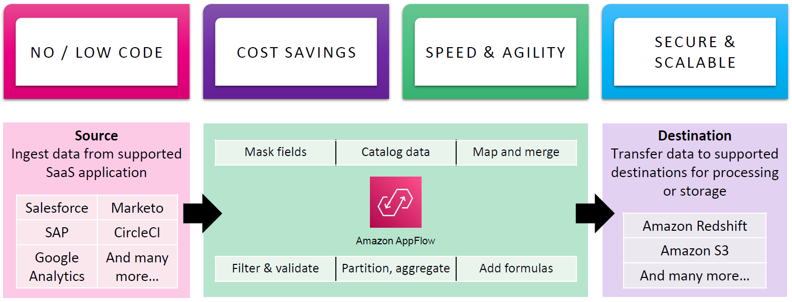
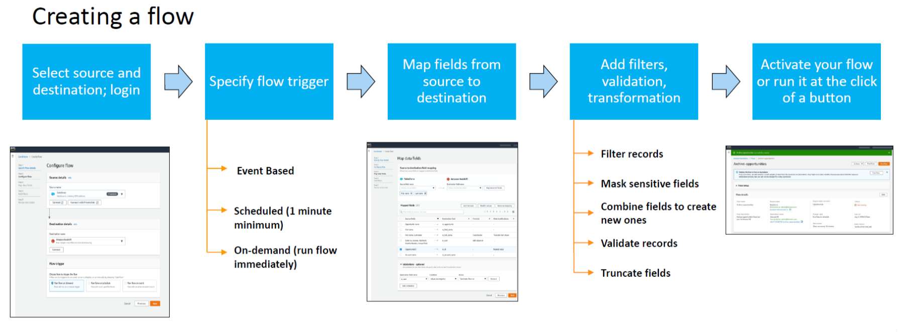
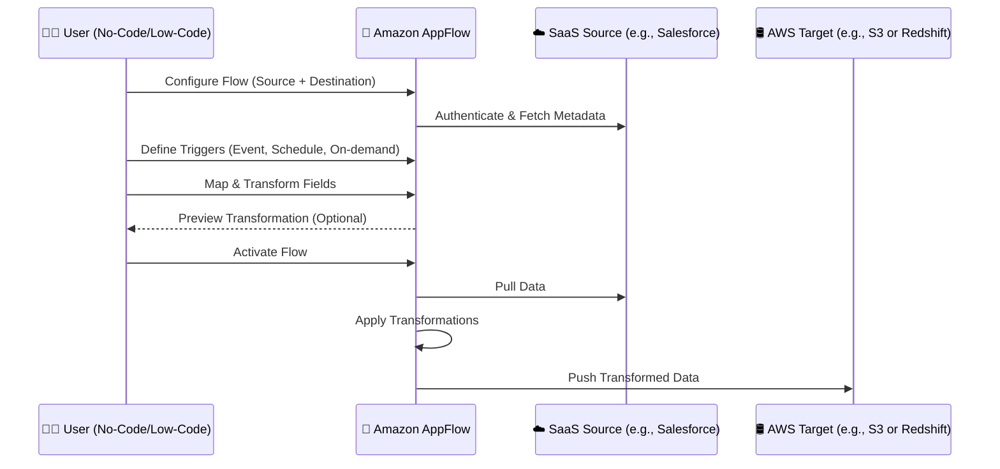

# 🚢 Amazon AppFlow: Simplifying SaaS-to-AWS Data Integration

Amazon **AppFlow** is a **fully managed integration service** that makes it easy to **securely transfer data between SaaS applications and AWS services**—with no code or low-code efforts. Whether you're syncing marketing data from Salesforce or pulling analytics into Redshift, AppFlow is your bridge between **data silos and actionable insights**.

---

    

---

## 🧠 Why Amazon AppFlow?

| Feature              | Description                                                       |
| -------------------- | ----------------------------------------------------------------- |
| 🚫 No / Low Code     | Build data flows without writing scripts or managing servers.     |
| 💸 Cost Savings      | Pay only for what you use, no infrastructure management.          |
| ⚡ Speed & Agility   | Set up flows in minutes with scheduling and event-based triggers. |
| 🔐 Secure & Scalable | Data encrypted in transit and at rest with automatic scaling.     |

---

## 🔗 Supported Integrations

### **📥 Sources** – Ingest data from

- Salesforce
- SAP
- Google Analytics
- Marketo
- CircleCI
- Zendesk, Slack, ServiceNow
- And many more...

### **📤 Destinations** – Send data to

- Amazon S3 (for storage)
- Amazon Redshift (for analytics)
- Other AWS services

---

## ⚙️ What Can You Do with AppFlow?

Inside each data **flow**, you can:

- **🛡️ Mask sensitive fields**
- **📚 Catalog data** into AWS Glue
- **🔀 Map and merge fields**
- **🧮 Add formulas**
- **🔍 Filter and validate records**
- **📦 Partition and aggregate**

---

## 🛠️ How It Works: Creating a Flow

    

---

---

## 🚀 Triggering a Flow

AppFlow supports multiple **trigger types**:

- 🕰️ **Scheduled** (e.g., every 5 mins)
- 🧲 **Event-Based** (e.g., new Salesforce opportunity)
- 🔘 **On-Demand** (trigger it manually or via API)

---

## 🛡️ Security & Governance

AppFlow is **built with security in mind**:

- IAM-based permission control
- Data encrypted with **KMS**
- Option to mask **PII (Personally Identifiable Information)** fields
- Compliant with major standards (HIPAA, GDPR, etc.)

---

## 🌟 Real-World Use Cases

| Use Case               | Description                                                   |
| ---------------------- | ------------------------------------------------------------- |
| 🎯 Marketing Analytics | Sync Salesforce leads into Redshift for campaign ROI analysis |
| 💬 Support Metrics     | Export Zendesk tickets to S3 for NLP sentiment analysis       |
| 🔍 Observability       | Pull CircleCI test data to analyze deployment trends          |
| 🧾 Business Reporting  | Combine ServiceNow and SAP data in Redshift for dashboards    |

---

## 📊 When to Use Amazon AppFlow?

✅ Use AppFlow if:

- You need to **automate** data transfer from **SaaS to AWS**
- You prefer **visual, low-code** UI
- You require **event-based and scheduled** syncs
- You want **built-in transformations** without ETL coding

❌ Don't use AppFlow if:

- You need **complex, multi-stage ETL** (→ Use Glue or MWAA)
- Your integration is **real-time streaming** (→ Use Kinesis)

---

## 📘 Learn More

- 🔗 [Official Amazon AppFlow Docs](https://docs.aws.amazon.com/appflow/)
- 🎥 [AWS AppFlow Video Demos](https://aws.amazon.com/appflow/getting-started/)
- 🛠️ [Pricing](https://aws.amazon.com/appflow/pricing/)
