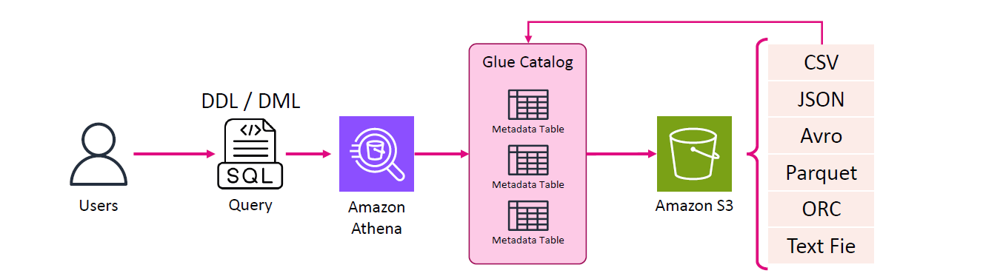
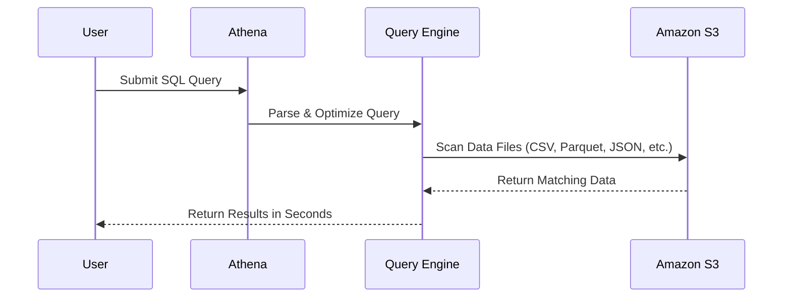
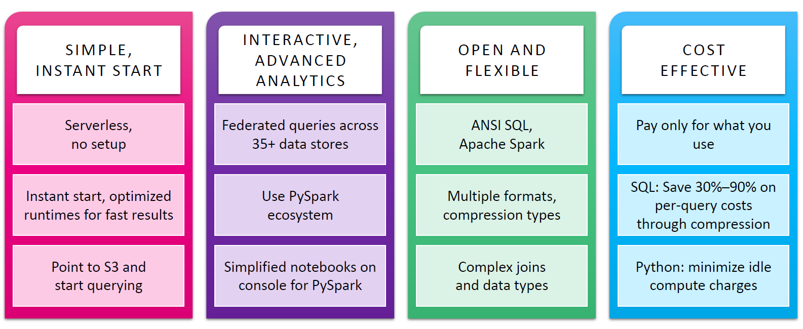
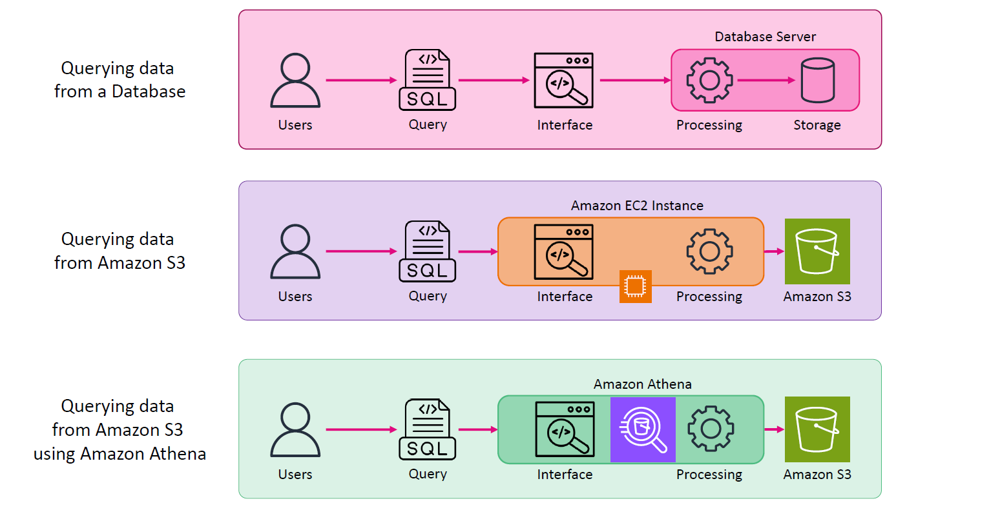

# 🔍 AWS Athena: Your Serverless SQL Tool for S3 Analytics – Made Simple 🎯

**Amazon Athena** is a **serverless query service** that lets you run **SQL queries directly on data in Amazon S3**. No servers. No infrastructure. Just SQL and instant insights.

As data keeps exploding across systems and formats, **SQL still remains a timeless language** for slicing, dicing, and understanding that data. But what if your data lives in **Amazon S3**, not a traditional database?

That’s exactly where **Amazon Athena** shines.

---

## 🤔 **The Problem: Querying S3 Without Athena**

Let’s say you’ve got logs, exports, and raw datasets stored in Amazon S3—CSV, JSON, Parquet, maybe even Avro.

You want to analyze them using **SQL**, but:

- S3 has no **compute power**.
- You’d need to spin up an **EC2 instance**, install **SQL tools**, manage connections, and write scripts just to run one query.
- And worse—you're paying for that EC2 whether you're using it or not.

👉 That’s a lot of overhead just to ask your data a simple question.

---

## 💡 **The Solution: Amazon Athena**

**Amazon Athena** gives you the power to write SQL queries **directly against S3 data**—no servers, no setup.

It's a **serverless query engine** powered by **ANSI SQL** that works out of the box.

---

Imagine you have gigabytes of data stored in **Amazon S3**—logs, reports, exports, etc. Now imagine being able to **query all of that with plain SQL**, without moving it, loading it, or provisioning a server.

That’s **Athena**. It’s like giving your raw S3 data a superpower: **SQL on demand**.

---

## ⚙️ How Does Athena Work Behind the Scenes?

    

---

- Athena integrates with the AWS Glue Data Catalog, which offers a persistent metadata store for your data in Amazon S3.
- For each dataset that you'd like to query, Athena must have an underlying table it will use for obtaining and returning query results. Therefore, before querying data, a table must be registered in Athena.
- You can create a table manually or automatically (using an Glue crawler)

---

💡 Unlike databases, **S3 doesn’t have compute power**. Athena acts as the “brain” that reads and processes your data stored in S3.

---

## 🛠️ Key Features of Athena

| 🔑 Feature                                     | 💬 Description                                                  |
| ---------------------------------------------- | --------------------------------------------------------------- |
| **Serverless**                                 | No EC2, no clusters—just run queries.                           |
| **Supports Many Formats**                      | Works with CSV, JSON, Parquet, ORC, Avro.                       |
| **Schema-on-Read**                             | Define table structure after storing data.                      |
| **Integrated with Glue Catalog**               | Reuse your Glue tables to query data.                           |
| **Visualize with QuickSight**                  | Connect to QuickSight for dashboards.                           |
| **Secure & Compliant**                         | Query encrypted data, integrate IAM.                            |
| **Pay Per Query**                              | Charged only for data scanned. Compress your data to save more! |
| **Supports PySpark (Athena for Apache Spark)** | Use notebooks & run PySpark code directly.                      |

---

    

---

## 🔄 Common Use Cases for Athena

1. 🔎 **Ad-Hoc Analysis** – Run fast queries for quick answers.
2. 📊 **BI Dashboards** – Use Athena with Amazon QuickSight for visual analytics.
3. 🔍 **Log Exploration** – Analyze VPC Flow Logs, CloudTrail, ELB logs stored in S3.
4. 🧪 **Data Lake Querying** – Explore your data lake without moving data.
5. 🔄 **ETL Simplification** – Perform transformations using SQL and insert results into new S3 locations.

---

## ⚖️ Athena vs. Redshift Spectrum

| ⚔️ Comparison Point | Athena                | Redshift Spectrum                   |
| ------------------- | --------------------- | ----------------------------------- |
| **Serverless?**     | ✅ Fully serverless   | 🚫 Needs Redshift cluster           |
| **Best for?**       | Simple ad-hoc queries | Complex analytics & joins           |
| **Cost Model**      | Pay per TB scanned    | Pay for Redshift cluster + spectrum |
| **Ease of Use**     | No setup              | Requires cluster configuration      |
| **SQL Support**     | ANSI SQL              | ANSI SQL (plus Redshift syntax)     |

---

## 💡 When to Use Athena

✅ Use Athena if:

- You want to **analyze logs quickly** without spinning up clusters
- You have **structured/semi-structured data in S3**
- You need a **cost-effective**, **low-maintenance** query engine
- You need to **run occasional SQL queries** (pay-per-use = budget-friendly)

---

## 💬 Real-World Analogy: Without Athena vs. With Athena

| Scenario          | Without Athena                                              | With Athena                      |
| ----------------- | ----------------------------------------------------------- | -------------------------------- |
| Querying S3 Data  | Launch EC2 → Install SQL tool → Write code → Maintain infra | Open Athena → Write SQL → Done ✔ |
| Cost              | Pay for EC2 uptime, storage, maintenance                    | Pay only for data scanned        |
| Skill Requirement | DevOps + SQL                                                | Just SQL                         |

---

    

---

## 🔓 Bonus: Athena Isn’t Just for SQL

Did you know you can use **Apache Spark** with Athena too?

- Run **PySpark notebooks** for advanced processing.
- Use **over 35 data source connectors** (like RDS, Redshift, DynamoDB, and more).

Athena gives you **interactive notebooks, scalable execution**, and **no setup** needed.

---

## 🧾 **Cost Optimization Tips**

- Use **columnar formats** like Parquet or ORC → reduce scanned data.
- Compress your files → save **30–90%** on query costs.
- Partition your data → query just what you need.

---

## ✅ Conclusion

Amazon Athena is a **must-have tool** if you’re working with **S3-based data lakes**. It’s **simple, powerful, and cost-efficient**, giving you instant insights using nothing more than **SQL**.

Whether you're a data analyst, engineer, or just a curious explorer—**Athena makes S3 queryable like a database**, without the weight of infrastructure.
